# Lecture 11 — Kubernetes Services, DNS & Workload Identity


## Table of Contents

| # | Task | Status |
|---|------|--------|
| 1 | [Kubernetes Port Architecture & Clarification Drill](#task-1--kubernetes-port-architecture--clarification-drill) | Completed |
| 2 | [Type 1 Service — ClusterIP](#task-2--type-1-service--clusterip-default-internal-networking) | Completed |
| 3 | [Type 2 Service — NodePort](#task-3--type-2-service--nodeport-host-level-external-ingress) | Completed |
| 4 | [Type 3 Service — LoadBalancer](#task-4--type-3-service--loadbalancer-cloud-native-ingress-simulation) | Completed (tunnel analysed, not run — see note) |
| 5 | [Type 4 Service — ExternalName](#task-5--type-4-service--externalname-coredns-cname-alias-redirection) | Completed |
| 6 | [Type 5 Service — Headless Service](#task-6--type-5-service--headless-service-clusterip-none--stateful-workloads) | Completed |
| 7 | [Services Without Selectors (Manual Endpoints)](#task-7--services-without-selectors-manual-endpoints-mapping) | Completed |
| 8 | [FQDN & CoreDNS Deep Dive](#task-8--fqdn--coredns-deep-dive-architecture-analysis) | Completed |
| 9 | [Pod Identity Drill — Deployment vs StatefulSet](#task-9--pod-identity--lifecycle-invariance-drill) | Completed |
| 10 | [Master Architectural Matrix](#task-10--master-architectural-matrix--deployment-vs-statefulset-vs-daemonset) | Completed |
| 11 | [Production Cost Optimization & Decision Tree](#task-11--production-cost-optimization--service-selection-decision-tree) | Completed |
| 12 | [Minikube Docker-Driver Port Binding & Tunnel Gotcha](#task-12--minikube-docker-driver-port-binding--tunnel-gotcha-analysis) | Completed (tunnel analysed, not run — see note) |
| — | [Key Learnings](#key-learnings) | |
| — | [Repository Layout](#repository-layout) | |
| — | [Cleanup](#cleanup) | |

### Lab setup (run once)

```bash
kubectl create namespace s11-lab
```

```
namespace/s11-lab created
```

Every subsequent command carries `-n s11-lab`, and every manifest sets `namespace: s11-lab`.
This cluster was shared with two other lab exercises at the same time, so the namespace boundary
(and picking free NodePorts) was a hard requirement, not a nicety.

A long-lived BusyBox diagnostic pod is used as the in-cluster client throughout
([`manifests/00-client/client-pod.yaml`](./manifests/00-client/client-pod.yaml)):

```yaml
apiVersion: v1
kind: Pod
metadata:
  name: curl-client
  namespace: s11-lab
  labels:
    app: diagnostic-client
spec:
  containers:
    - name: busybox
      image: busybox:1.36
      command: ["sh", "-c", "while true; do sleep 30; done"]
      resources:
        requests: { cpu: "10m", memory: "16Mi" }
        limits:   { cpu: "50m", memory: "32Mi" }
```

---

## Task 1 — Kubernetes Port Architecture & Clarification Drill

**Objective:** demystify the four Kubernetes port fields — `containerPort`, `targetPort`, `port`,
`nodePort` — and map the exact routing path a packet takes from an external client to the process
inside the container.

### 1.1 The authoritative definitions, straight from the API server

```bash
kubectl explain pod.spec.containers.ports.containerPort
kubectl explain service.spec.ports.nodePort | head -12
```

**Output**

```
KIND:       Pod
VERSION:    v1

FIELD: containerPort <integer>

DESCRIPTION:
    Number of port to expose on the pod's IP address. This must be a valid port
    number, 0 < x < 65536.

KIND:       Service
VERSION:    v1

FIELD: nodePort <integer>

DESCRIPTION:
    The port on each node on which this service is exposed when type is NodePort
    or LoadBalancer.  Usually assigned by the system. If a value is specified,
    in-range, and not in use it will be used, otherwise the operation will fail.
    If not specified, a port will be allocated if this Service requires one.  If
    this field is specified when creating a Service which does not need it
```

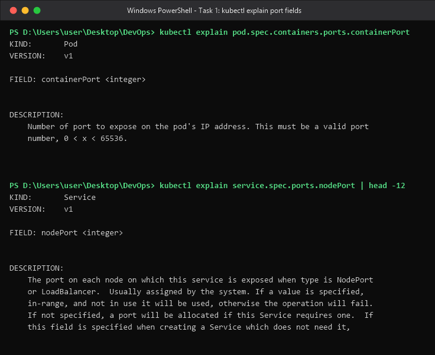

### 1.2 All four ports on one real, live object

The NodePort lab from Task 3 carries all four values at once, so it is the cleanest specimen:

```bash
kubectl get svc web-service-nodeport -n s11-lab -o yaml | sed -n '/^spec:/,/^status:/p'
kubectl get deploy web-app-nodeport -n s11-lab \
  -o jsonpath='{.spec.template.spec.containers[0].ports[0].containerPort}{"  <- containerPort\n"}'
```

**Output**

```
spec:
  clusterIP: 10.100.109.118
  clusterIPs:
  - 10.100.109.118
  externalTrafficPolicy: Cluster
  internalTrafficPolicy: Cluster
  ipFamilies:
  - IPv4
  ipFamilyPolicy: SingleStack
  ports:
  - nodePort: 31080
    port: 80
    protocol: TCP
    targetPort: 80
  selector:
    app: web-nodeport
  sessionAffinity: None
  type: NodePort
status:

80  <- containerPort
```

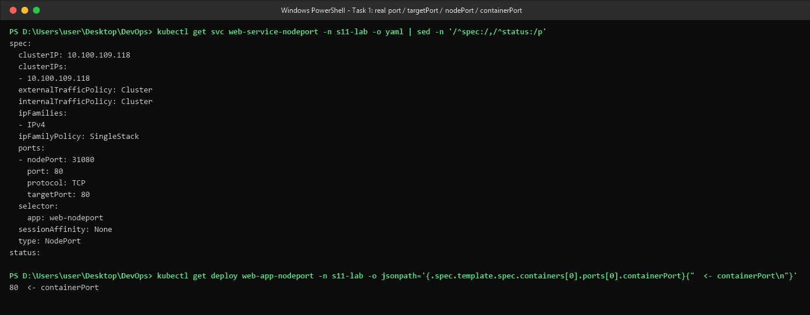

### 1.3 The routing path

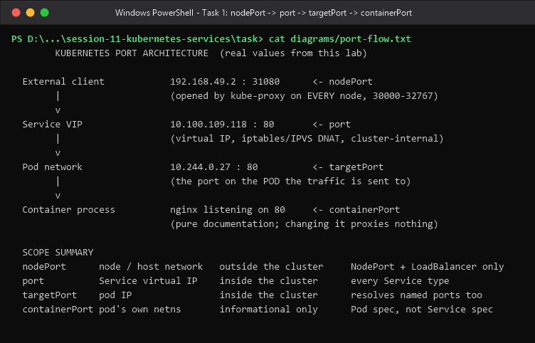

```
        KUBERNETES PORT ARCHITECTURE  (real values from this lab)

  External client            192.168.49.2 : 31080      <- nodePort
        |                    (opened by kube-proxy on EVERY node, 30000-32767)
        v
  Service VIP                10.100.109.118 : 80       <- port
        |                    (virtual IP, iptables/IPVS DNAT, cluster-internal)
        v
  Pod network                10.244.0.27 : 80          <- targetPort
        |                    (the port on the POD the traffic is sent to)
        v
  Container process          nginx listening on 80     <- containerPort
                             (pure documentation; changing it proxies nothing)
```

### Reference table

| Field | Lives in | Scope / who can reach it | Allowed range | Required? |
|---|---|---|---|---|
| `containerPort` | `Pod.spec.containers[].ports[]` | The pod's own network namespace. **Purely informational metadata** — nothing in the data path reads it. | 1–65535 | No |
| `targetPort` | `Service.spec.ports[]` | The pod IP that kube-proxy DNATs to. Can be a number or the *name* of a `containerPort`. | 1–65535 | No (defaults to `port`) |
| `port` | `Service.spec.ports[]` | The Service's virtual IP. Reachable from **inside** the cluster only. | 1–65535 | **Yes** |
| `nodePort` | `Service.spec.ports[]` | Bound on **every** node's host network. Reachable from outside. | **30000–32767** | No (auto-allocated) |

### What happened / why

The single most misunderstood field is `containerPort`. Deleting it from the Pod spec changes
nothing at all about reachability — `kubectl explain` calls it "Number of port to expose on the pod's
IP address", but in practice all container ports are already reachable on the pod IP because a pod
has its own netns with no firewall. It exists for documentation, for tooling, and so that
`targetPort` can reference it by *name* (this lab names it `http`, which is why
`targetPort: http` would also have worked).

The three fields that genuinely matter are on the Service. `port` is the front door on the virtual
IP; kube-proxy programs an iptables DNAT rule so that `10.100.109.118:80` rewrites to one of the
backing pod IPs on `targetPort`. `nodePort` adds a *second* entry rule on the host network stack of
every node. Note in the YAML above that a NodePort Service **still has a `clusterIP`** — the types
are cumulative, not alternative, which is the point Task 4 makes explicit.

One real-world detail this lab forced: `nodePort: 30080` was rejected with
`provided port is already allocated` because another exercise on the same cluster had claimed it.
The NodePort range is a **cluster-wide** singleton resource — that is exactly the operational
friction that makes NodePort a poor multi-tenant primitive (Task 11).

---

## Task 2 — Type 1 Service — ClusterIP (Default Internal Networking)

**Objective:** deploy a 3-replica backend, front it with a `ClusterIP` Service on port 8080 →
container port 80, verify automatic Endpoint/EndpointSlice binding, and reach it from a client pod
by short name, FQDN and raw VIP.

### Manifests

[`manifests/01-clusterip/app-deployment.yaml`](./manifests/01-clusterip/app-deployment.yaml)

```yaml
apiVersion: apps/v1
kind: Deployment
metadata:
  name: web-app-clusterip
  namespace: s11-lab
  labels:
    app: web-clusterip
spec:
  replicas: 3
  selector:
    matchLabels:
      app: web-clusterip
  template:
    metadata:
      labels:
        app: web-clusterip
    spec:
      containers:
        - name: nginx
          image: nginx:alpine
          ports:
            - name: http
              containerPort: 80          # <-- containerPort
          resources:
            requests: { cpu: "10m", memory: "16Mi" }
            limits:   { cpu: "100m", memory: "64Mi" }
```

[`manifests/01-clusterip/service.yaml`](./manifests/01-clusterip/service.yaml)

```yaml
apiVersion: v1
kind: Service
metadata:
  name: web-service-clusterip
  namespace: s11-lab
spec:
  type: ClusterIP                        # default type; allocates a virtual IP
  selector:
    app: web-clusterip                   # label selector -> auto-populates Endpoints
  ports:
    - name: http
      protocol: TCP
      port: 8080                         # <-- port: the Service VIP port
      targetPort: 80                     # <-- targetPort: the container port
```

### Commands

```bash
kubectl apply -f manifests/00-client/client-pod.yaml
kubectl apply -f manifests/01-clusterip/
kubectl rollout status deployment/web-app-clusterip -n s11-lab --timeout=180s

kubectl get pods -l app=web-clusterip -n s11-lab -o wide
kubectl get svc web-service-clusterip -n s11-lab
kubectl get endpoints web-service-clusterip -n s11-lab
kubectl get endpointslices -n s11-lab -l kubernetes.io/service-name=web-service-clusterip
```

**Output**

```
deployment.apps/web-app-clusterip created
service/web-service-clusterip created
deployment "web-app-clusterip" successfully rolled out

NAME                                 READY   STATUS    RESTARTS   AGE    IP            NODE       NOMINATED NODE   READINESS GATES
web-app-clusterip-7c9ccf659f-7nssb   1/1     Running   0          2m6s   10.244.0.25   minikube   <none>           <none>
web-app-clusterip-7c9ccf659f-hlmmn   1/1     Running   0          2m6s   10.244.0.23   minikube   <none>           <none>
web-app-clusterip-7c9ccf659f-m8xw9   1/1     Running   0          2m6s   10.244.0.24   minikube   <none>           <none>

NAME                    TYPE        CLUSTER-IP       EXTERNAL-IP   PORT(S)    AGE
web-service-clusterip   ClusterIP   10.111.225.236   <none>        8080/TCP   2m6s

Warning: v1 Endpoints is deprecated in v1.33+; use discovery.k8s.io/v1 EndpointSlice
NAME                    ENDPOINTS                                      AGE
web-service-clusterip   10.244.0.23:80,10.244.0.24:80,10.244.0.25:80   2m6s

NAME                          ADDRESSTYPE   PORTS   ENDPOINTS                             AGE
web-service-clusterip-vvdjb   IPv4          80      10.244.0.24,10.244.0.23,10.244.0.25   2m6s
```

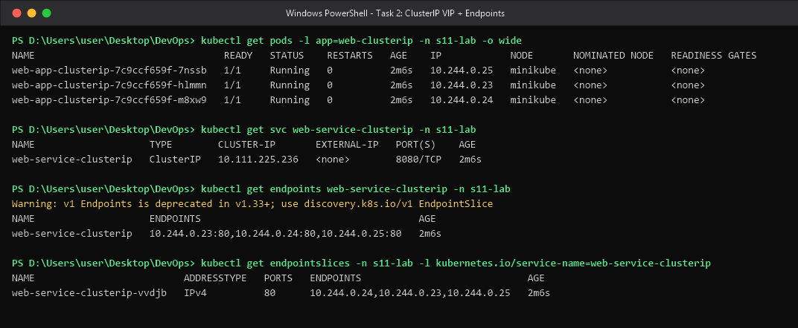

### Testing internal access

```bash
kubectl exec -n s11-lab curl-client -- wget -qO- http://web-service-clusterip:8080 | grep -i title
kubectl exec -n s11-lab curl-client -- wget -qO- http://web-service-clusterip.s11-lab.svc.cluster.local:8080 | grep -i title
kubectl exec -n s11-lab curl-client -- wget -qO- http://10.111.225.236:8080 | grep -i title
kubectl exec -n s11-lab curl-client -- nslookup web-service-clusterip
```

**Output**

```
<title>Welcome to nginx!</title>
<title>Welcome to nginx!</title>
<title>Welcome to nginx!</title>

Server:		10.96.0.10
Address:	10.96.0.10:53

** server can't find web-service-clusterip.cluster.local: NXDOMAIN

Name:	web-service-clusterip.s11-lab.svc.cluster.local
Address: 10.111.225.236

** server can't find web-service-clusterip.svc.cluster.local: NXDOMAIN
```

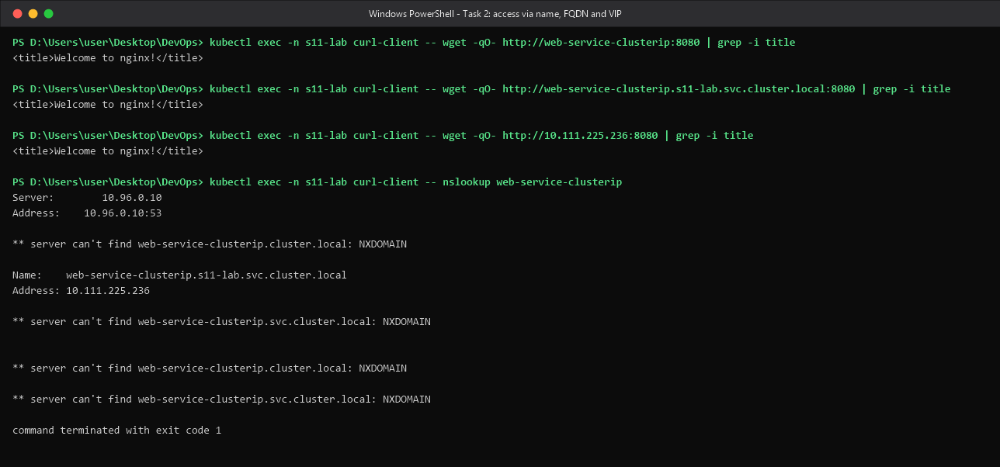

### What happened / why

Three things are worth pulling out of that output.

1. **The VIP is not a real interface.** `10.111.225.236` is not assigned to any NIC anywhere in the
   cluster; you cannot ping the pod behind it by that address. It only exists as a match target in
   the iptables/IPVS rules kube-proxy writes on every node. That is why it appears instantly even
   before any pod is Ready, and why it survives every pod in the Deployment being replaced.

2. **The Endpoints object is the glue.** The endpoints controller watched for pods matching
   `app: web-clusterip` that are **Ready**, and wrote their IPs into both the legacy `Endpoints`
   object and the modern `EndpointSlice`. Note kubectl's own deprecation warning:
   `v1 Endpoints is deprecated in v1.33+; use discovery.k8s.io/v1 EndpointSlice`. EndpointSlice
   exists because a single Endpoints object for a 5000-pod Service becomes a multi-megabyte blob
   that every kube-proxy in the cluster has to re-download on every single pod change.
   EndpointSlices shard that into 100-endpoint chunks.

3. **Note the port asymmetry.** The Service advertises `8080/TCP` but the endpoints list
   `10.244.0.23:80`. The client dials 8080; kube-proxy DNATs to 80. This is exactly the
   `port` vs `targetPort` distinction from Task 1, visible in a live object.

The `nslookup` output also previews Task 8: the two `NXDOMAIN` lines are not errors, they are the
resolver dutifully walking the search list (`s11-lab.svc.cluster.local`, `svc.cluster.local`,
`cluster.local`) and only the first suffix producing a hit.

---

## Task 3 — Type 2 Service — NodePort (Host-Level External Ingress)

**Objective:** expose a 2-replica nginx on a high port opened on every node, and prove the binding
by hitting it from the node's own network stack.

### Manifest

[`manifests/02-nodeport/service.yaml`](./manifests/02-nodeport/service.yaml)

```yaml
apiVersion: v1
kind: Service
metadata:
  name: web-service-nodeport
  namespace: s11-lab
spec:
  type: NodePort                         # superset of ClusterIP
  selector:
    app: web-nodeport
  ports:
    - protocol: TCP
      port: 80                           # Service VIP port (ClusterIP layer still exists)
      targetPort: 80                     # container port
      nodePort: 31080                    # <-- nodePort, range 30000-32767
                                         #     (30080 was already taken by another lab
                                         #      running on this shared cluster)
```

### Commands

```bash
kubectl apply -f manifests/02-nodeport/
kubectl get pods -l app=web-nodeport -n s11-lab -o wide
kubectl get svc web-service-nodeport -n s11-lab
kubectl get endpoints web-service-nodeport -n s11-lab
minikube ip
```

**Output**

```
NAME                                READY   STATUS    RESTARTS   AGE   IP            NODE       NOMINATED NODE   READINESS GATES
web-app-nodeport-64967b45b9-fsc99   1/1     Running   0          68s   10.244.0.27   minikube   <none>           <none>
web-app-nodeport-64967b45b9-mnhxm   1/1     Running   0          68s   10.244.0.28   minikube   <none>           <none>

NAME                   TYPE       CLUSTER-IP       EXTERNAL-IP   PORT(S)        AGE
web-service-nodeport   NodePort   10.100.109.118   <none>        80:31080/TCP   45s

Warning: v1 Endpoints is deprecated in v1.33+; use discovery.k8s.io/v1 EndpointSlice
NAME                   ENDPOINTS                       AGE
web-service-nodeport   10.244.0.27:80,10.244.0.28:80   46s

192.168.49.2
```

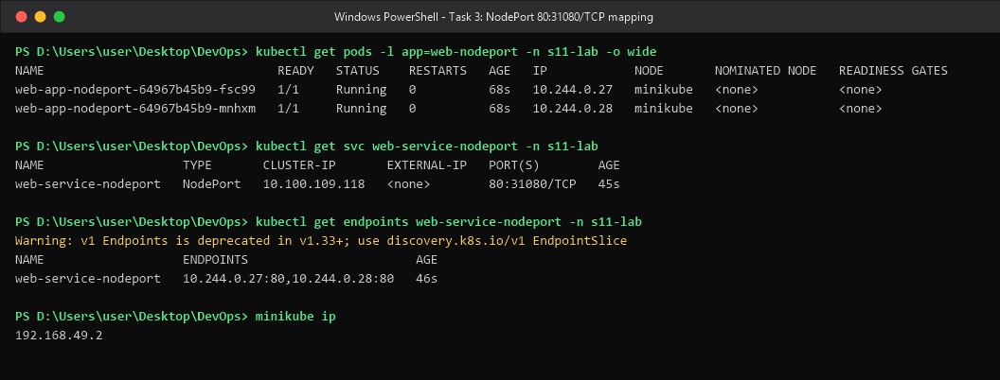

The `PORT(S)` column reads `80:31080/TCP` — that colon-separated pair is literally
`port:nodePort`.

### Proving the node binding

The Windows host cannot route to `192.168.49.2` (that is Task 12's gotcha), so the binding is
verified from the node's own network stack via `minikube ssh`:

```bash
minikube ssh -- curl -s -I http://localhost:31080
minikube ssh -- curl -s -I http://192.168.49.2:31080 | head -3
minikube ssh -- curl -s http://192.168.49.2:31080 | grep -i title
```

**Output**

```
HTTP/1.1 200 OK
Server: nginx/1.31.6
Date: Fri, 18 Sep 2026 04:52:28 GMT
Content-Type: text/html
Content-Length: 896
Last-Modified: Tue, 15 Sep 2026 14:18:52 GMT
Connection: keep-alive
ETag: "6aa953cc-380"
Accept-Ranges: bytes

HTTP/1.1 200 OK
Server: nginx/1.31.6
Date: Fri, 18 Sep 2026 04:52:29 GMT

<title>Welcome to nginx!</title>
```

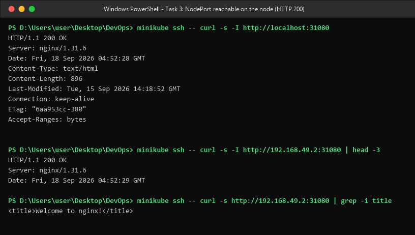

Access from the **Windows host** — which is the interesting case — is covered under
[Task 12](#task-12--minikube-docker-driver-port-binding--tunnel-gotcha-analysis), where
`minikube service web-service-nodeport -n s11-lab --url` returns `http://127.0.0.1:51226` and
`curl` against that URL returns `HTTP/1.1 200 OK`.

### What happened / why

`localhost:31080` and `192.168.49.2:31080` both answer from inside the node because kube-proxy's
NodePort rule matches on the **destination port**, not the destination address — it installs a
`KUBE-NODEPORTS` chain that fires for any packet arriving on TCP/31080 regardless of which local IP
it targeted. On a real 5-node cluster that same rule exists on all five nodes, so any node IP works
even for nodes that host zero replicas of the app; the packet is simply SNAT'd and forwarded to a
node that does (this is what `externalTrafficPolicy: Cluster`, visible in the Task 1 YAML, means).

The operational downsides are visible right here. The port had to be moved from 30080 to 31080
because of a cluster-wide collision; the port is ugly and non-standard (you cannot serve a public
website on `:31080`); and clients must know node IPs, which change as nodes are replaced. NodePort
is a dev/on-prem primitive, not a production front door.

---

## Task 4 — Type 3 Service — LoadBalancer (Cloud-Native Ingress Simulation)

**Objective:** deploy a 3-replica workload as `type: LoadBalancer`, observe the EXTERNAL-IP
allocation behaviour, and confirm that Kubernetes automatically layers ClusterIP and NodePort
underneath it.

> **Environment note — read this before the output.**
> This lab ran on minikube with the **docker** driver on Windows, on a cluster shared with two other
> concurrent exercises. `minikube tunnel` requires an Administrator shell, holds the terminal open
> for its whole lifetime, and rewrites host routing state that would have affected the other users of
> the cluster — so it was **deliberately not executed**. What is captured below is the honest,
> real `<pending>` state and a full explanation of what a tunnel (or a real cloud controller) would
> change. No external IP has been fabricated.

### Manifest

[`manifests/03-loadbalancer/service.yaml`](./manifests/03-loadbalancer/service.yaml)

```yaml
apiVersion: v1
kind: Service
metadata:
  name: web-service-loadbalancer
  namespace: s11-lab
spec:
  type: LoadBalancer      # superset of NodePort, which is a superset of ClusterIP
  selector:
    app: web-loadbalancer
  ports:
    - protocol: TCP
      port: 80            # the port the external LB listens on
      targetPort: 80      # container port
      nodePort: 31081     # auto-allocated if omitted; pinned here to prove the layer exists
```

### Commands

```bash
kubectl apply -f manifests/03-loadbalancer/
kubectl rollout status deployment/web-app-loadbalancer -n s11-lab --timeout=180s
kubectl get svc web-service-loadbalancer -n s11-lab
kubectl get svc web-service-loadbalancer -n s11-lab -o yaml | sed -n '/^spec:/,$p'
```

**Output**

```
NAME                       TYPE           CLUSTER-IP      EXTERNAL-IP   PORT(S)        AGE
web-service-loadbalancer   LoadBalancer   10.109.222.35   <pending>     80:31081/TCP   8s

spec:
  allocateLoadBalancerNodePorts: true
  clusterIP: 10.109.222.35
  clusterIPs:
  - 10.109.222.35
  externalTrafficPolicy: Cluster
  internalTrafficPolicy: Cluster
  ipFamilies:
  - IPv4
  ipFamilyPolicy: SingleStack
  ports:
  - nodePort: 31081
    port: 80
    protocol: TCP
    targetPort: 80
  selector:
    app: web-loadbalancer
  sessionAffinity: None
  type: LoadBalancer
status:
  loadBalancer: {}
```

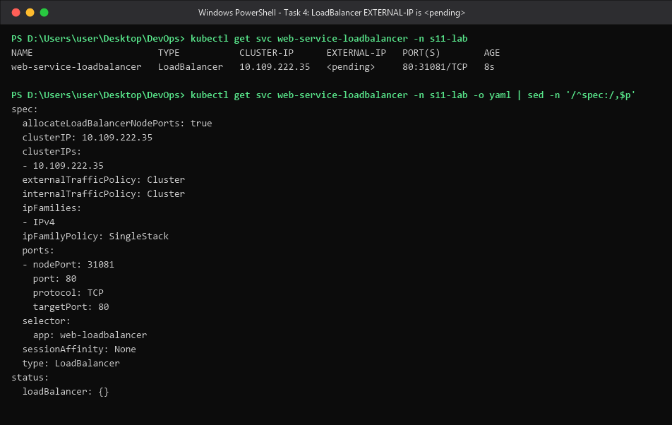

### Proving LoadBalancer is a superset of NodePort is a superset of ClusterIP

```bash
# layer 1 - ClusterIP: reachable by service name from inside the cluster
kubectl exec -n s11-lab curl-client -- wget -qO- http://web-service-loadbalancer:80 | grep -i title
# layer 2 - NodePort: automatically allocated and bound on the node
minikube ssh -- curl -s -I http://localhost:31081 | head -2
# layer 3 - the external LB: never provisioned
kubectl get svc web-service-loadbalancer -n s11-lab -o jsonpath='{.status.loadBalancer}'
kubectl describe svc web-service-loadbalancer -n s11-lab | sed -n '/^IP:/,/^Events/p'
```

**Output**

```
<title>Welcome to nginx!</title>

HTTP/1.1 200 OK
Server: nginx/1.31.6

{}   <- layer 3 empty: no cloud controller

IP:                       10.109.222.35
IPs:                      10.109.222.35
Port:                     <unset>  80/TCP
TargetPort:               80/TCP
NodePort:                 <unset>  31081/TCP
Endpoints:                10.244.0.40:80,10.244.0.41:80,10.244.0.42:80
Session Affinity:         None
External Traffic Policy:  Cluster
Internal Traffic Policy:  Cluster
Events:                   <none>
```

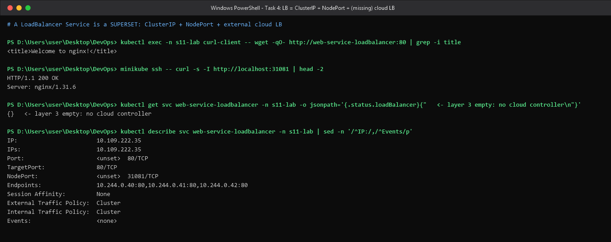

### What happened / why

`EXTERNAL-IP: <pending>` combined with `status.loadBalancer: {}` is the whole story in two fields.

Creating a `type: LoadBalancer` Service does **not** create a load balancer. All the Kubernetes API
server does is set the type and allocate the lower two layers. Filling in `status.loadBalancer.ingress`
is the job of a **cloud-controller-manager** — on EKS the AWS controller calls
`CreateLoadBalancer` and returns an ELB DNS name; on GKE it calls the GCE API and returns an
anycast IP. Vanilla minikube ships no cloud controller and no `LoadBalancer` implementation, so
nothing is watching, the status stays empty, and `<pending>` is permanent. It is not an error state
and no event is emitted (`Events: <none>`) — literally nobody is listening.

What the two layers underneath prove is that the types are **cumulative**:

| Layer | Field in the live object | Verified by |
|---|---|---|
| ClusterIP | `clusterIP: 10.109.222.35` | `wget http://web-service-loadbalancer:80` from `curl-client` → HTML returned |
| NodePort | `nodePort: 31081` | `minikube ssh -- curl -I http://localhost:31081` → `HTTP/1.1 200 OK` |
| External LB | `status.loadBalancer: {}` | empty — no controller |

Also note `allocateLoadBalancerNodePorts: true`. Since Kubernetes 1.20 you *can* set this to
`false` on a cloud where the LB targets pod IPs directly (AWS NLB in IP mode, GKE NEGs), which
skips the double hop. Here it is left at the default, which is why 31081 exists at all.

**What `minikube tunnel` would do (not executed — see the note above).** `minikube tunnel` runs a
privileged process on the host that (a) watches for Services of type `LoadBalancer` with an empty
status, (b) patches `status.loadBalancer.ingress[0].ip` with an address from minikube's own range
(on the Docker driver on Windows this is typically `127.0.0.1`), and (c) adds a host route / listens
on the host so that the *privileged* port — 80 here, not 31081 — forwards into the cluster. After
that, `kubectl get svc` would print a real EXTERNAL-IP and `curl http://127.0.0.1` with **no port
number** would serve the nginx page. It requires Administrator because binding :80 and editing the
routing table are privileged operations, and it must stay running because it *is* the data path —
close the terminal and the EXTERNAL-IP reverts to `<pending>`.

---

## Task 5 — Type 4 Service — ExternalName (CoreDNS CNAME Alias Redirection)

**Objective:** create a Service that is nothing but a DNS alias to an external domain, prove it has
no ClusterIP and no Endpoints, and prove CNAME redirection with `nslookup`.

### Manifest

[`manifests/04-externalname/service.yaml`](./manifests/04-externalname/service.yaml)

```yaml
apiVersion: v1
kind: Service
metadata:
  name: external-database-service
  namespace: s11-lab
spec:
  type: ExternalName                     # pure CoreDNS CNAME alias
  externalName: api.github.com           # the canonical target
  # NOTE: no selector, no ports, no clusterIP -- nothing is proxied by kube-proxy
```

### Commands

```bash
kubectl apply -f manifests/04-externalname/
kubectl get svc external-database-service -n s11-lab
kubectl get endpoints external-database-service -n s11-lab
kubectl get svc external-database-service -n s11-lab \
  -o jsonpath='{.spec.type}{" -> "}{.spec.externalName}{"  clusterIP="}{.spec.clusterIP}{"\n"}'
```

**Output**

```
service/external-database-service created

NAME                        TYPE           CLUSTER-IP   EXTERNAL-IP      PORT(S)   AGE
external-database-service   ExternalName   <none>       api.github.com   <none>    3s

Warning: v1 Endpoints is deprecated in v1.33+; use discovery.k8s.io/v1 EndpointSlice
Error from server (NotFound): endpoints "external-database-service" not found

ExternalName -> api.github.com  clusterIP=
```

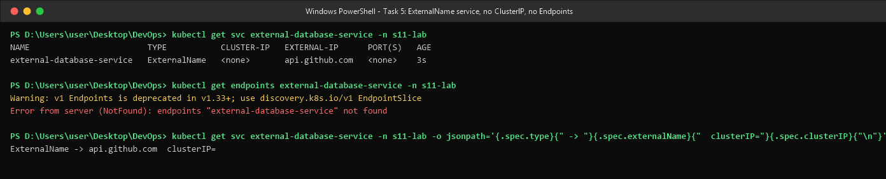

### Proving the CNAME

```bash
kubectl exec -n s11-lab curl-client -- nslookup external-database-service.s11-lab.svc.cluster.local
```

**Output**

```
Server:		10.96.0.10
Address:	10.96.0.10:53

external-database-service.s11-lab.svc.cluster.local	canonical name = api.github.com
Name:	api.github.com
Address: 20.207.73.85
```

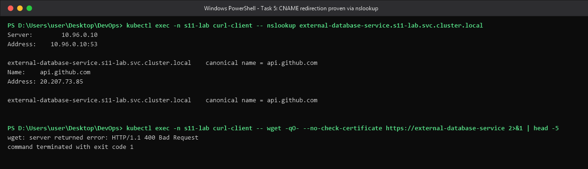

### Sending real traffic through the alias

```bash
kubectl exec -n s11-lab curl-client -- wget -qO- --no-check-certificate https://external-database-service | head -3
kubectl exec -n s11-lab curl-client -- wget -qO- --no-check-certificate \
  --header='Host: api.github.com' https://external-database-service/zen | head -3
```

**Output**

```
wget: server returned error: HTTP/1.1 400 Bad Request
command terminated with exit code 1

Accessible for all.
```

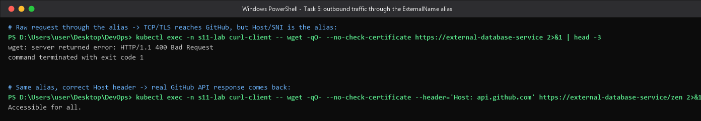

### What happened / why

Three fields tell the whole story: `CLUSTER-IP: <none>`, `EXTERNAL-IP: api.github.com`,
`PORT(S): <none>`. And `kubectl get endpoints` returns a hard `NotFound` — the object was never
even created, because the endpoints controller has nothing to reconcile.

ExternalName is the only Service type that **never touches kube-proxy**. There is no VIP, no iptables
rule, no NAT, no load balancing, no health checking and no traffic interception of any kind. The
entire implementation is a single CNAME record synthesised by CoreDNS's `kubernetes` plugin. That
means it works for any protocol (MySQL, Redis, gRPC, SMTP) because it is resolved before a socket
is ever opened — but it also means `spec.ports` is ignored, so it cannot do port remapping.

The pair of wget results is the most instructive part of this task. The first request **failed
with a real HTTP 400 from GitHub's edge** — which proves the TCP connection and the TLS handshake
both reached `20.207.73.85` successfully. What GitHub rejected was the `Host:` header and TLS SNI,
both of which the client set to `external-database-service` because that is the hostname it was
given. The second request, identical except for an explicit `Host: api.github.com`, returned
`Accessible for all.` — a genuine response from the GitHub `/zen` API.

That is the number one production gotcha with ExternalName: **DNS aliasing does not rewrite SNI or
the Host header**, so it breaks against any TLS endpoint or name-based virtual host unless the
client is configured with the real name anyway — at which point the alias has bought you very
little. ExternalName is genuinely useful for plain-TCP backends (an RDS endpoint on 3306, a Redis
box on 6379) where you want `db.s11-lab.svc.cluster.local` in your config and the freedom to
re-point it at a different RDS instance per environment without touching application code.

---

## Task 6 — Type 5 Service — Headless Service (`clusterIP: None` & Stateful Workloads)

**Objective:** pair a Headless Service with a 3-replica StatefulSet and prove that CoreDNS returns
one A record per pod instead of a single VIP, and that each ordinal pod is individually addressable.

### Manifests

[`manifests/05-headless/service.yaml`](./manifests/05-headless/service.yaml)

```yaml
apiVersion: v1
kind: Service
metadata:
  name: web-service-headless
  namespace: s11-lab
spec:
  clusterIP: None                        # <-- HEADLESS: no VIP, no kube-proxy rules
  selector:
    app: web-headless
  ports:
    - name: http
      protocol: TCP
      port: 80
      targetPort: 80
```

[`manifests/05-headless/app-statefulset.yaml`](./manifests/05-headless/app-statefulset.yaml)

```yaml
apiVersion: apps/v1
kind: StatefulSet
metadata:
  name: web-stateful
  namespace: s11-lab
spec:
  serviceName: web-service-headless      # governing headless Service -> stable pod DNS
  replicas: 3
  selector:
    matchLabels:
      app: web-headless
  template:
    metadata:
      labels:
        app: web-headless
    spec:
      terminationGracePeriodSeconds: 5
      containers:
        - name: nginx
          image: nginx:alpine
          ports:
            - name: http
              containerPort: 80
          resources:
            requests: { cpu: "10m", memory: "16Mi" }
            limits:   { cpu: "100m", memory: "64Mi" }
```

### Commands

```bash
kubectl apply -f manifests/05-headless/
kubectl rollout status statefulset/web-stateful -n s11-lab --timeout=240s
kubectl get svc web-service-headless -n s11-lab
kubectl get pods -l app=web-headless -n s11-lab -o wide
kubectl get endpoints web-service-headless -n s11-lab
```

**Output**

```
statefulset.apps/web-stateful created
service/web-service-headless created
Waiting for 3 pods to be ready...
Waiting for 2 pods to be ready...
Waiting for 1 pods to be ready...
partitioned roll out complete: 3 new pods have been updated...

NAME                   TYPE        CLUSTER-IP   EXTERNAL-IP   PORT(S)   AGE
web-service-headless   ClusterIP   None         <none>        80/TCP    6s

NAME             READY   STATUS    RESTARTS   AGE   IP            NODE       NOMINATED NODE   READINESS GATES
web-stateful-0   1/1     Running   0          5s    10.244.0.49   minikube   <none>           <none>
web-stateful-1   1/1     Running   0          4s    10.244.0.50   minikube   <none>           <none>
web-stateful-2   1/1     Running   0          2s    10.244.0.51   minikube   <none>           <none>

Warning: v1 Endpoints is deprecated in v1.33+; use discovery.k8s.io/v1 EndpointSlice
NAME                   ENDPOINTS                                      AGE
web-service-headless   10.244.0.49:80,10.244.0.50:80,10.244.0.51:80   7s
```

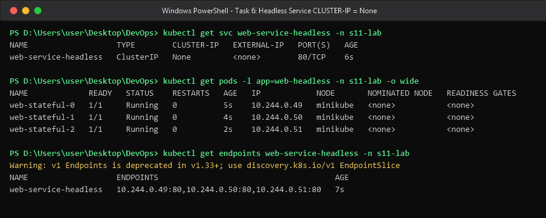

### CoreDNS returns three A records, not a VIP

```bash
kubectl exec -n s11-lab curl-client -- nslookup web-service-headless.s11-lab.svc.cluster.local
```

**Output**

```
Server:		10.96.0.10
Address:	10.96.0.10:53

Name:	web-service-headless.s11-lab.svc.cluster.local
Address: 10.244.0.50
Name:	web-service-headless.s11-lab.svc.cluster.local
Address: 10.244.0.49
Name:	web-service-headless.s11-lab.svc.cluster.local
Address: 10.244.0.51
```

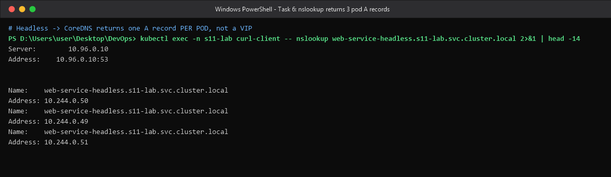

### Addressing an individual ordinal pod

```bash
kubectl exec -n s11-lab curl-client -- nslookup web-stateful-0.web-service-headless.s11-lab.svc.cluster.local
kubectl exec -n s11-lab curl-client -- nslookup web-stateful-2.web-service-headless.s11-lab.svc.cluster.local
kubectl exec -n s11-lab curl-client -- wget -qO- http://web-stateful-0.web-service-headless:80 | grep -i title
kubectl exec -n s11-lab web-stateful-1 -- hostname -f
```

**Output**

```
Name:	web-stateful-0.web-service-headless.s11-lab.svc.cluster.local
Address: 10.244.0.49

Name:	web-stateful-2.web-service-headless.s11-lab.svc.cluster.local
Address: 10.244.0.51

<title>Welcome to nginx!</title>

web-stateful-1.web-service-headless.s11-lab.svc.cluster.local
```

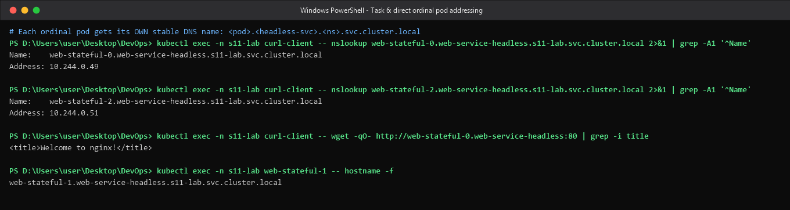

### What happened / why

Setting `clusterIP: None` is an explicit opt-out of the entire proxy layer. kube-proxy writes **zero**
rules for this Service. As a result:

- there is no VIP to fail over to, no connection-level load balancing and no `sessionAffinity`;
- CoreDNS's `kubernetes` plugin, instead of synthesising one A record pointing at a VIP, enumerates
  the Endpoints and returns **one A record per Ready pod** — all three IPs above in a single answer;
- because the governing Service is named in `spec.serviceName`, the StatefulSet controller also gets
  CoreDNS to publish a **per-pod** record `<pod>.<svc>.<ns>.svc.cluster.local`, which is why
  `web-stateful-0.web-service-headless` resolves to exactly one IP and why
  `hostname -f` *inside* `web-stateful-1` already knows its own full cluster FQDN.

Notice the three A records came back in the order `.50, .49, .51` — not ordinal order. CoreDNS's
`loadbalance` plugin (visible in the Corefile dumped in Task 8) round-robins the RRset on every
query. That is the *only* load balancing a headless Service provides, and it is client-side and
cache-dependent, which is exactly why you would never put a stateless web app behind one.

This is precisely what clustered stateful software needs. A Cassandra node joining a ring must
gossip with *specific* seed peers; a MongoDB replica-set member must know the exact address of the
primary to replicate its oplog; a Kafka client receives per-broker advertised listeners in the
metadata response and must then connect to that individual broker, not to a random one. Give any of
them a VIP and every connection lands on an arbitrary member — which for a quorum protocol is a
correctness bug, not a performance one.

---

## Task 7 — Services Without Selectors (Manual Endpoints Mapping)

**Objective:** create a `ClusterIP` Service with no label selector, then hand-write the matching
`Endpoints` object pointing at an IP that lives outside the cluster entirely.

### Manifests

[`manifests/06-no-selector/service.yaml`](./manifests/06-no-selector/service.yaml)

```yaml
apiVersion: v1
kind: Service
metadata:
  name: external-legacy-db
  namespace: s11-lab
spec:
  type: ClusterIP
  # NO selector on purpose -> the endpoints controller will NOT populate Endpoints
  ports:
    - protocol: TCP
      port: 3306
      targetPort: 3306
```

[`manifests/06-no-selector/endpoints.yaml`](./manifests/06-no-selector/endpoints.yaml)

```yaml
apiVersion: v1
kind: Endpoints
metadata:
  name: external-legacy-db               # MUST match the Service name exactly
  namespace: s11-lab
subsets:
  - addresses:
      - ip: 192.168.1.150                # external / legacy MySQL box outside the cluster
    ports:
      - port: 3306
```

### Step 1 — Service alone: endpoints are empty

```bash
kubectl apply -f manifests/06-no-selector/service.yaml
kubectl get svc external-legacy-db -n s11-lab
kubectl get endpoints external-legacy-db -n s11-lab
kubectl describe svc external-legacy-db -n s11-lab | grep -E 'Selector|Endpoints|Type|IP:'
```

**Output**

```
service/external-legacy-db created

NAME                 TYPE        CLUSTER-IP       EXTERNAL-IP   PORT(S)    AGE
external-legacy-db   ClusterIP   10.106.118.157   <none>        3306/TCP   0s

Warning: v1 Endpoints is deprecated in v1.33+; use discovery.k8s.io/v1 EndpointSlice
Error from server (NotFound): endpoints "external-legacy-db" not found

Selector:                 <none>
Type:                     ClusterIP
IP:                       10.106.118.157
Endpoints:                <none>
```

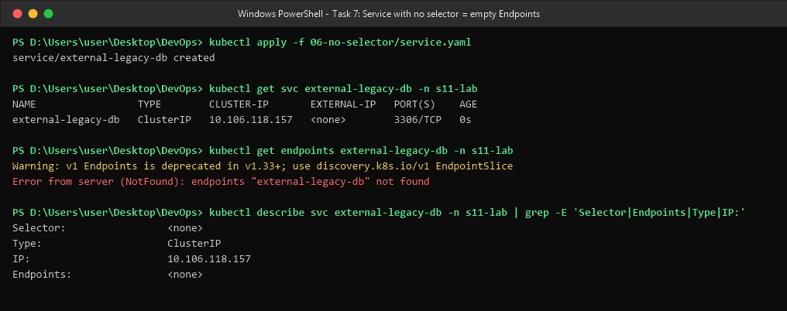

### Step 2 — manually bind the external backend

```bash
kubectl apply -f manifests/06-no-selector/endpoints.yaml
kubectl get endpoints external-legacy-db -n s11-lab
kubectl get endpointslices -n s11-lab -l kubernetes.io/service-name=external-legacy-db
kubectl describe svc external-legacy-db -n s11-lab | grep -E 'Selector|Endpoints'
kubectl exec -n s11-lab curl-client -- nslookup external-legacy-db
```

**Output**

```
Warning: v1 Endpoints is deprecated in v1.33+; use discovery.k8s.io/v1 EndpointSlice
endpoints/external-legacy-db created

NAME                 ENDPOINTS            AGE
external-legacy-db   192.168.1.150:3306   1s

NAME                       ADDRESSTYPE   PORTS   ENDPOINTS       AGE
external-legacy-db-hnwb4   IPv4          3306    192.168.1.150   0s

Selector:                 <none>
Endpoints:                192.168.1.150:3306

Name:	external-legacy-db.s11-lab.svc.cluster.local
Address: 10.106.118.157
```

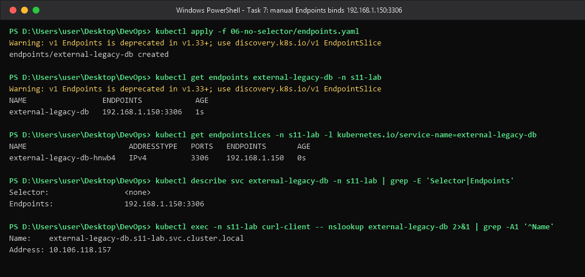

### What happened / why

The key insight is that **the Service and the Endpoints object are two separate resources joined
only by name**. Normally the endpoints controller creates and maintains the Endpoints object for
you, but it only does that when the Service has a `spec.selector`. With no selector, the controller
ignores the Service completely — hence `Error from server (NotFound)`, not an empty object.

That leaves the name free for a human (or an external operator) to claim. Applying an `Endpoints`
object called `external-legacy-db` into the same namespace is enough for kube-proxy to start
programming DNAT rules from `10.106.118.157:3306` to `192.168.1.150:3306`. Kubernetes never
validates that this IP belongs to a pod, or to the cluster, or that it exists at all — as long as
it is routable from the nodes, the traffic flows. Note that the control plane also auto-mirrored
the hand-written Endpoints into a modern `EndpointSlice` (`external-legacy-db-hnwb4`), which is how
newer kube-proxy versions actually consume it.

The payoff is abstraction. Application code, config maps and connection strings all say
`external-legacy-db:3306`, an ordinary in-cluster name that gets a normal DNS record
(`external-legacy-db.s11-lab.svc.cluster.local → 10.106.118.157`). When the legacy MySQL box is
finally containerised, you add a `selector` to the Service, delete the manual Endpoints, and every
client cuts over with zero code change and zero restart.

Real production uses of this pattern:
- **Strangler-fig migrations** — front an on-prem monolith with a cluster-native name while you
  migrate piece by piece.
- **Pinning a managed service by IP** where a DNS-based `ExternalName` would break TLS SNI (the
  exact failure demonstrated in Task 5).
- **Cross-cluster service import** — point at the endpoints of a Service in another cluster.

The caveat: nothing health-checks these addresses. There is no readiness probe, so a dead backend
stays in rotation forever unless you run your own controller to maintain the object.

---

## Task 8 — FQDN & CoreDNS Deep Dive Architecture Analysis

**Objective:** dissect the Kubernetes DNS hierarchy, read the real `/etc/resolv.conf` injected into a
pod, and measure the concrete cost of `options ndots:5`.

### Cluster DNS plane

```bash
kubectl get pods -n kube-system -l k8s-app=kube-dns -o wide
kubectl get svc -n kube-system kube-dns
kubectl exec -n s11-lab curl-client -- cat /etc/resolv.conf
kubectl get cm coredns -n kube-system -o jsonpath='{.data.Corefile}'
```

**Output**

```
NAME                       READY   STATUS    RESTARTS      AGE     IP           NODE       NOMINATED NODE   READINESS GATES
coredns-559f6c778d-swbrw   1/1     Running   4 (12m ago)   2d21h   10.244.0.8   minikube   <none>           <none>

NAME       TYPE        CLUSTER-IP   EXTERNAL-IP   PORT(S)                  AGE
kube-dns   ClusterIP   10.96.0.10   <none>        53/UDP,53/TCP,9153/TCP   2d21h

search s11-lab.svc.cluster.local svc.cluster.local cluster.local
nameserver 10.96.0.10
options ndots:5

.:53 {
    log
    errors
    health {
       lameduck 5s
    }
    ready
    kubernetes cluster.local in-addr.arpa ip6.arpa {
       pods insecure
       fallthrough in-addr.arpa ip6.arpa
       ttl 30
    }
    prometheus :9153
    hosts {
       192.168.65.254 host.minikube.internal
       fallthrough
    }
    forward . /etc/resolv.conf {
       max_concurrent 1000
    }
    cache 30 {
       disable success cluster.local
       disable denial cluster.local
    }
    loop
    reload
    loadbalance
}
```

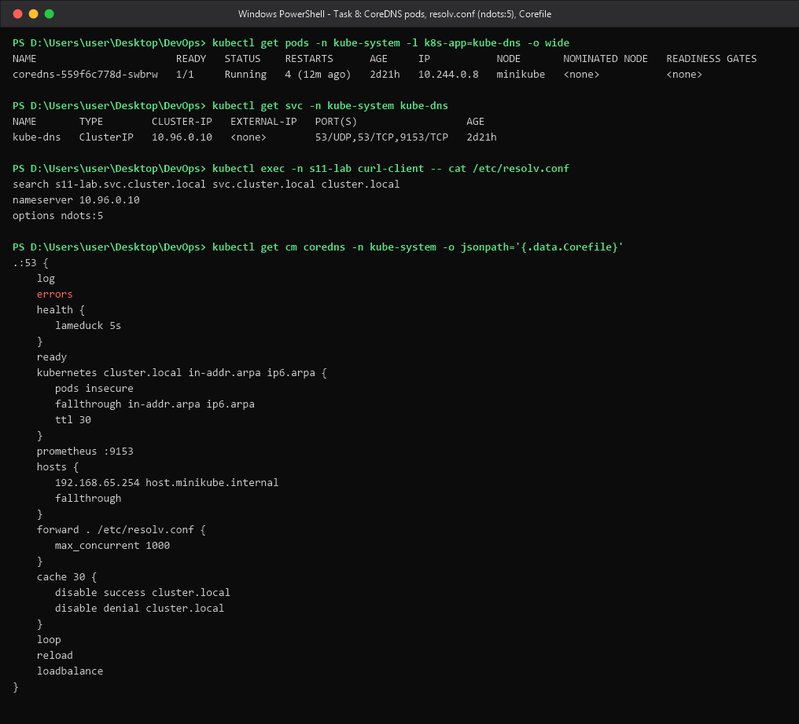

Note `kube-dns` is a *Service name kept for backwards compatibility* — the pods behind it are
CoreDNS. The kubelet injects `nameserver 10.96.0.10` (that Service's VIP) into every pod.

### Anatomy of a Kubernetes FQDN

```
web-service-clusterip . s11-lab . svc . cluster.local
        |                  |        |         |
        |                  |        |         +-- cluster domain (configurable at kubeadm init)
        |                  |        +------------ object class: 'svc' for Services, 'pod' for pods
        |                  +--------------------- namespace
        +---------------------------------------- Service name
```

| Form | Resolvable from | Mechanism |
|---|---|---|
| `web-service-clusterip` | same namespace only | search suffix #1 |
| `web-service-clusterip.s11-lab` | anywhere in the cluster | search suffix #2 completes it |
| `web-service-clusterip.s11-lab.svc` | anywhere | search suffix #3 completes it |
| `web-service-clusterip.s11-lab.svc.cluster.local` | anywhere | absolute, no search needed |
| `web-stateful-0.web-service-headless.s11-lab.svc.cluster.local` | anywhere | per-pod record from a headless Service |

All four forms were tested live:

```bash
kubectl exec -n s11-lab curl-client -- nslookup web-service-clusterip.s11-lab.svc.cluster.local
kubectl exec -n s11-lab curl-client -- wget -qO- http://web-service-clusterip:8080 | grep -i title
kubectl exec -n s11-lab curl-client -- wget -qO- http://web-service-clusterip.s11-lab:8080 | grep -i title
kubectl exec -n s11-lab curl-client -- wget -qO- http://web-service-clusterip.s11-lab.svc:8080 | grep -i title
kubectl exec -n s11-lab curl-client -- wget -qO- http://web-service-clusterip.s11-lab.svc.cluster.local:8080 | grep -i title
```

**Output**

```
Name:	web-service-clusterip.s11-lab.svc.cluster.local
Address: 10.111.225.236

<title>Welcome to nginx!</title>
<title>Welcome to nginx!</title>
<title>Welcome to nginx!</title>
<title>Welcome to nginx!</title>
```

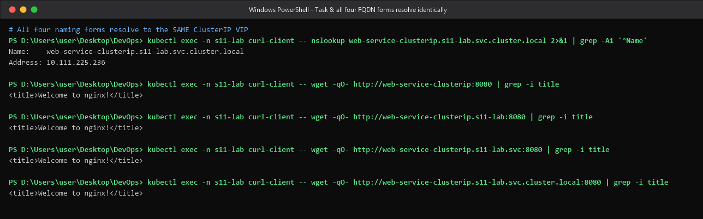

### The `ndots:5` latency mechanism, measured

CoreDNS in this cluster has the `log` plugin enabled, which means every query it answers is visible.
Resolving the external name `example.com` from inside a pod produces this:

```bash
kubectl exec -n s11-lab curl-client -- wget -q -O /dev/null http://example.com; echo "wget exit=$?"
kubectl logs -n kube-system -l k8s-app=kube-dns --tail=120 | grep -i example | tail -8
```

**Output**

```
wget exit=0

[INFO] 10.244.0.44:60875 - 20824 "AAAA IN example.com.s11-lab.svc.cluster.local. udp 55 false 512" NXDOMAIN qr,aa,rd 148 0.00022871s
[INFO] 10.244.0.44:60875 - 29022 "A IN example.com.s11-lab.svc.cluster.local. udp 55 false 512" NXDOMAIN qr,aa,rd 148 0.00029784s
[INFO] 10.244.0.44:53898 - 56977 "AAAA IN example.com.svc.cluster.local. udp 47 false 512" NXDOMAIN qr,aa,rd 140 0.000140263s
[INFO] 10.244.0.44:53898 - 61076 "A IN example.com.svc.cluster.local. udp 47 false 512" NXDOMAIN qr,aa,rd 140 0.000109761s
[INFO] 10.244.0.44:53820 - 5425 "A IN example.com.cluster.local. udp 43 false 512" NXDOMAIN qr,aa,rd 136 0.000108135s
[INFO] 10.244.0.44:53820 - 16432 "AAAA IN example.com.cluster.local. udp 43 false 512" NXDOMAIN qr,aa,rd 136 0.000259899s
[INFO] 10.244.0.44:37666 - 8337 "AAAA IN example.com. udp 29 false 512" NOERROR qr,rd,ra 29 0.002683112s
[INFO] 10.244.0.44:37666 - 41104 "A IN example.com. udp 29 false 512" NOERROR qr,rd,ra 83 0.002765873s
```

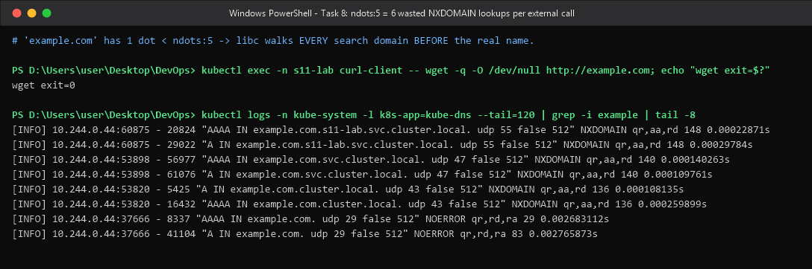

**Eight DNS queries were issued to fetch one URL. Six of them were guaranteed failures.**

### What happened / why

`options ndots:5` instructs the libc resolver: *"if the queried name contains fewer than 5 dots,
treat it as relative and try every search suffix BEFORE trying it as an absolute name."*

`example.com` contains one dot. 1 < 5, so the resolver walks the list in order — and because the
client does a dual-stack lookup, each attempt is two queries (A + AAAA):

| Attempt | Query | Result |
|---|---|---|
| 1 | `example.com.s11-lab.svc.cluster.local` | NXDOMAIN (x2) |
| 2 | `example.com.svc.cluster.local` | NXDOMAIN (x2) |
| 3 | `example.com.cluster.local` | NXDOMAIN (x2) |
| 4 | `example.com` (absolute) | **NOERROR** (x2) |

Why `ndots` is 5 at all: the longest *intentionally* relative name in Kubernetes is
`web-stateful-0.web-service-headless.s11-lab.svc.cluster.local`, and the longest partial form a user
might legitimately type has 4 dots. Setting `ndots:5` guarantees every in-cluster short form gets
expanded. The cost is pushed entirely onto external traffic.

**Why it hurts in production.** In this lab the failed lookups cost ~0.2 ms each because CoreDNS is
on the same node and answers `cluster.local` NXDOMAIN authoritatively. In a real cluster:

- CoreDNS may be on a different node — every query is a network round trip.
- The `cache 30 { disable denial cluster.local }` directive visible in the Corefile above means
  these NXDOMAINs are **deliberately not cached**, so the cost is paid on *every* call.
- Conntrack race conditions on parallel A/AAAA UDP queries through the same source port were a
  famous Linux kernel bug that caused **5-second** DNS timeouts under load.
- A payments service calling `api.stripe.com` 1000 times/sec generates **6000 extra wasted DNS
  queries per second**, which can saturate CoreDNS and turn DNS into the cluster's single point of
  failure.

**The four standard fixes:**

1. **Use a trailing dot.** `https://api.stripe.com.` is absolute; the resolver skips the search list
   entirely. Zero cost, but many HTTP clients and URL parsers mishandle it.
2. **Per-pod `dnsConfig`** — the surgical fix:
   ```yaml
   spec:
     dnsConfig:
       options:
         - name: ndots
           value: "2"
   ```
   Now `api.stripe.com` (2 dots) is tried absolute first, while `my-svc` (0 dots) still expands.
3. **NodeLocal DNSCache** — a DaemonSet that puts a caching resolver on every node's loopback, so
   the NXDOMAIN round trips never leave the node and the conntrack UDP race disappears.
4. **Trim the search list** with `dnsConfig.searches` for pods that only ever talk outbound.

---

## Task 9 — Pod Identity & Lifecycle Invariance Drill

**Objective:** prove empirically that a Deployment's pods have disposable random identities while a
StatefulSet's pods have invariant ordinal identities that survive deletion.

Workloads used: the Deployment from Task 2
([`manifests/07-statefulset/deployment.yaml`](./manifests/07-statefulset/deployment.yaml), identical
spec) and the StatefulSet from Task 6
([`manifests/05-headless/app-statefulset.yaml`](./manifests/05-headless/app-statefulset.yaml)).

### Step 1 — the two naming schemes, before any deletion

```bash
kubectl get pods -l app=web-clusterip -n s11-lab
kubectl get pods -l app=web-headless  -n s11-lab
```

**Output**

```
NAME                                 READY   STATUS    RESTARTS   AGE
web-app-clusterip-7c9ccf659f-7nssb   1/1     Running   0          10m
web-app-clusterip-7c9ccf659f-hlmmn   1/1     Running   0          10m
web-app-clusterip-7c9ccf659f-m8xw9   1/1     Running   0          10m

NAME             READY   STATUS    RESTARTS   AGE
web-stateful-0   1/1     Running   0          46s
web-stateful-1   1/1     Running   0          45s
web-stateful-2   1/1     Running   0          43s
```

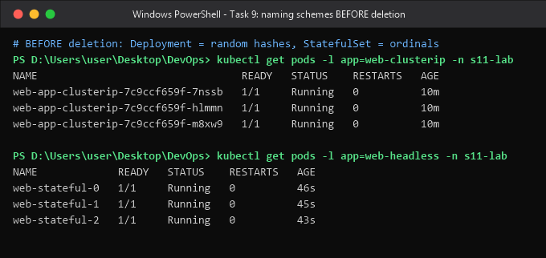

The Deployment pods are `<deployment>-<replicaset-hash>-<random-suffix>`: the shared `7c9ccf659f` is
the ReplicaSet's pod-template hash, and `7nssb` / `hlmmn` / `m8xw9` are per-pod entropy.
The StatefulSet pods are `<statefulset>-<ordinal>`, full stop.

### Step 2 — kill one pod of each and watch what comes back

```bash
kubectl delete pod web-app-clusterip-7c9ccf659f-7nssb -n s11-lab
kubectl delete pod web-stateful-0 -n s11-lab
sleep 12
kubectl get pods -l app=web-clusterip -n s11-lab
kubectl get pods -l app=web-headless  -n s11-lab
```

**Output**

```
pod "web-app-clusterip-7c9ccf659f-7nssb" deleted from s11-lab namespace
pod "web-stateful-0" deleted from s11-lab namespace

NAME                                 READY   STATUS    RESTARTS   AGE
web-app-clusterip-7c9ccf659f-4np22   1/1     Running   0          15s
web-app-clusterip-7c9ccf659f-hlmmn   1/1     Running   0          11m
web-app-clusterip-7c9ccf659f-m8xw9   1/1     Running   0          11m

NAME             READY   STATUS    RESTARTS   AGE
web-stateful-0   1/1     Running   0          12s
web-stateful-1   1/1     Running   0          68s
web-stateful-2   1/1     Running   0          66s
```

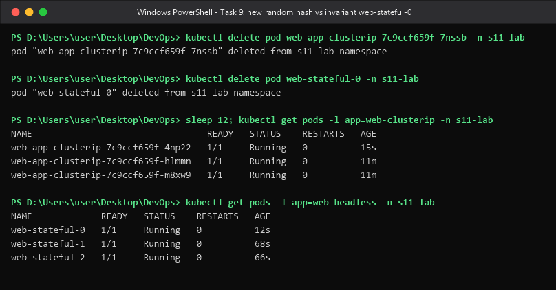

### Behavioural comparison (real values from this run)

| | Deleted | Replaced by | Identity |
|---|---|---|---|
| **Deployment** | `web-app-clusterip-7c9ccf659f-7nssb` | `web-app-clusterip-7c9ccf659f-4np22` | **new random identity** |
| **StatefulSet** | `web-stateful-0` | `web-stateful-0` | **identical, deterministic** |

Note that the ReplicaSet hash `7c9ccf659f` is unchanged — the pod *template* did not change, only
the pod instance. Only the 5-character suffix is new.

### Step 3 — the StatefulSet's network identity survived too

```bash
kubectl get pod web-stateful-0 -n s11-lab -o wide
kubectl exec -n s11-lab curl-client -- nslookup web-stateful-0.web-service-headless.s11-lab.svc.cluster.local
kubectl exec -n s11-lab web-stateful-0 -- hostname -f
```

**Output**

```
NAME             READY   STATUS    RESTARTS   AGE   IP            NODE       NOMINATED NODE   READINESS GATES
web-stateful-0   1/1     Running   0          25s   10.244.0.53   minikube   <none>           <none>

Name:	web-stateful-0.web-service-headless.s11-lab.svc.cluster.local
Address: 10.244.0.53

web-stateful-0.web-service-headless.s11-lab.svc.cluster.local
```

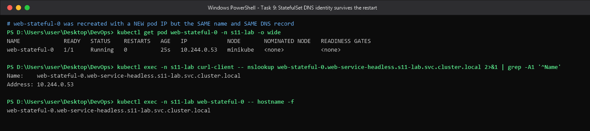

### What happened / why

A Deployment does not manage pods at all — it manages a ReplicaSet, and the ReplicaSet controller's
only contract is *"keep N Ready pods matching this selector alive."* Pods are fungible inventory:
the controller counted 2 where it wanted 3, called `create`, and the API server's name generator
produced `4np22`. It has no memory of `7nssb` and no concept that the new pod is a "replacement"
for anything.

A StatefulSet controller has a fundamentally different contract: *"for every ordinal `i` in
`[0, replicas)`, there must be exactly one Ready pod named `<name>-i`."* When `web-stateful-0`
vanished, the reconcile loop saw a missing ordinal and recreated **that specific slot**, by name.
Ordinal 0 is a durable slot in the cluster's state, not a transient instance.

The critical nuance visible in Step 3: **the pod IP changed** (10.244.0.49 → 10.244.0.53) but the
**name and DNS record did not**. The stability a StatefulSet offers is *naming* stability, not IP
stability — which is exactly why a StatefulSet is useless without its governing headless Service.
The name is only stable in a way peers can use because CoreDNS keeps
`web-stateful-0.web-service-headless...` pointed at whatever IP ordinal 0 currently has.

Three consequences that fall straight out of this:

1. **PVC binding.** With `volumeClaimTemplates`, the PVC is named `data-web-stateful-0` and is bound
   to ordinal 0 forever. A recreated `web-stateful-0` re-attaches the *same* disk with the same data.
   A recreated Deployment pod has no such link — which is why you must never put a database in a
   Deployment.
2. **Ordered lifecycle.** Note the AGE column in Step 1: `web-stateful-0` is 46s, `-1` is 45s, `-2`
   is 43s — created strictly in sequence, each waiting for the previous to be Ready. Scale-down
   reverses it (demonstrated in Task 10).
3. **Peer configuration becomes static.** A Cassandra seed list can be hard-coded as
   `web-stateful-0.web-service-headless,web-stateful-1.web-service-headless` and remains correct
   across every restart, reschedule and node failure for the life of the cluster.

---

## Task 10 — Master Architectural Matrix — Deployment vs StatefulSet vs DaemonSet

**Objective:** build an exhaustive engineering comparison of the three primary workload controllers,
backed by live objects.

### All three controllers running side by side

```bash
kubectl apply -f manifests/07-statefulset/daemonset.yaml
kubectl get deploy,sts,ds -n s11-lab
kubectl get pods -n s11-lab -o custom-columns='POD:.metadata.name,OWNER-KIND:.metadata.ownerReferences[0].kind,NODE:.spec.nodeName'
```

**Output**

```
daemonset.apps/node-agent-ds created

NAME                                READY   UP-TO-DATE   AVAILABLE   AGE
deployment.apps/web-app-clusterip   3/3     3            3           11m

NAME                            READY   AGE
statefulset.apps/web-stateful   3/3     114s

NAME                           DESIRED   CURRENT   READY   UP-TO-DATE   AVAILABLE   NODE SELECTOR   AGE
daemonset.apps/node-agent-ds   1         1         1       1            1           <none>          20s

POD                                  OWNER-KIND    NODE
curl-client                          <none>        minikube
node-agent-ds-mm9bt                  DaemonSet     minikube
web-app-clusterip-7c9ccf659f-4np22   ReplicaSet    minikube
web-app-clusterip-7c9ccf659f-hlmmn   ReplicaSet    minikube
web-app-clusterip-7c9ccf659f-m8xw9   ReplicaSet    minikube
web-stateful-0                       StatefulSet   minikube
web-stateful-1                       StatefulSet   minikube
web-stateful-2                       StatefulSet   minikube
```

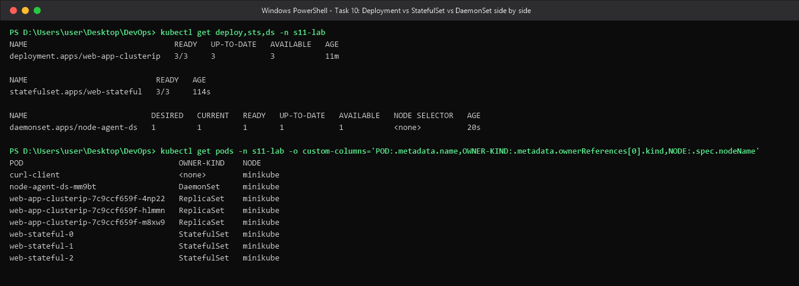

The `OWNER-KIND` column is the giveaway: Deployment pods are owned by a **ReplicaSet** (the
Deployment is one level removed), while StatefulSet and DaemonSet pods are owned by their controller
**directly** — there is no intermediate object. Note also the DaemonSet reports `DESIRED 1`: nobody
set that number; it equals the count of schedulable nodes, which on this single-node minikube is 1.

### Schema differences and ordered scale-down

```bash
kubectl explain statefulset.spec | grep -E 'volumeClaimTemplates|serviceName|podManagementPolicy|ordinals'
kubectl explain deployment.spec  | grep -E 'strategy|revisionHistoryLimit|progressDeadline'
kubectl explain daemonset.spec   | grep -E 'updateStrategy|selector|template'
kubectl scale statefulset web-stateful -n s11-lab --replicas=1
sleep 10
kubectl get pods -l app=web-headless -n s11-lab
```

**Output**

```
  ordinals	<StatefulSetOrdinals>
    ordinals controls the numbering of replica indices in a StatefulSet. The
    default ordinals behavior assigns a "0" index to the first replica and
    volume claims created from volumeClaimTemplates. By default, all persistent
  podManagementPolicy	<string>
    podManagementPolicy controls how pods are created during initial scale up,
  serviceName	<string>
    serviceName is the name of the service that governs this StatefulSet. This
    pod-specific-string.serviceName.default.svc.cluster.local where
  volumeClaimTemplates	<[]PersistentVolumeClaim>
    volumeClaimTemplates is a list of claims that pods are allowed to reference.

  progressDeadlineSeconds	<integer>
  revisionHistoryLimit	<integer>
  strategy	<DeploymentStrategy>
    The deployment strategy to use to replace existing pods with new ones.

  selector	<LabelSelector> -required-
  template	<PodTemplateSpec> -required-
    template's node selector (or on every node if no node selector is
    specified). The only allowed template.spec.restartPolicy value is "Always".
  updateStrategy	<DaemonSetUpdateStrategy>

statefulset.apps/web-stateful scaled
NAME             READY   STATUS    RESTARTS   AGE
web-stateful-0   1/1     Running   0          90s
```

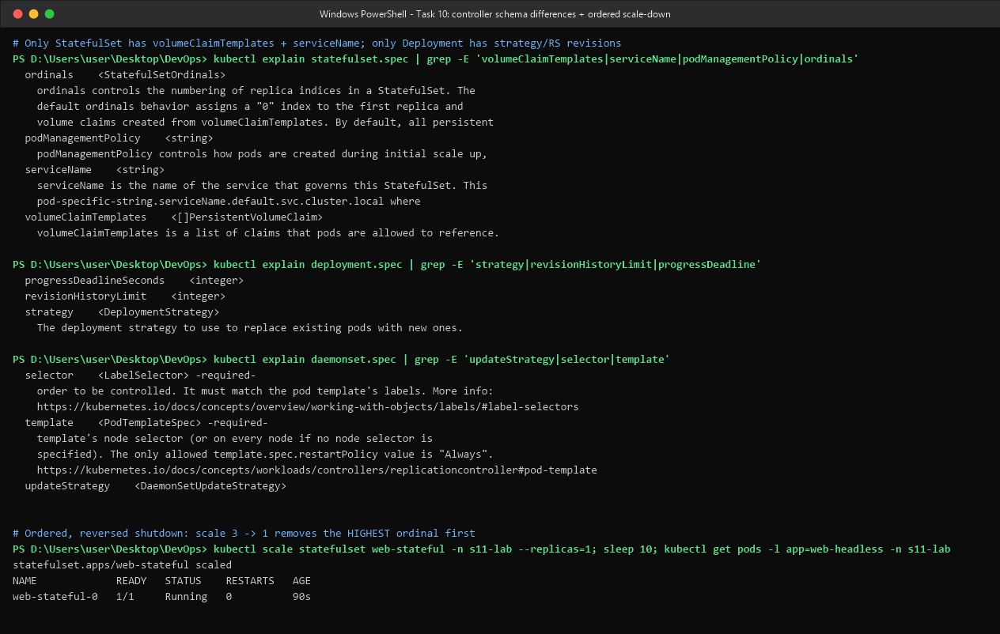

Scaling 3 → 1 removed `web-stateful-2` **then** `web-stateful-1`, in strict reverse ordinal order,
leaving ordinal 0 untouched with its original 90s uptime. A Deployment scaled down picks victims by
a heuristic (unready first, then newest, then least-constrained node) with no ordering guarantee.

Only `statefulset.spec` has `volumeClaimTemplates`, `serviceName`, `podManagementPolicy` and
`ordinals`. Only `deployment.spec` has `strategy` and `revisionHistoryLimit` (because only
Deployments keep ReplicaSet revisions to roll back to). `daemonset.spec` has no `replicas` field at
all — the node count *is* the replica count.

### The Master Architectural Matrix

| Architectural Metric | **Deployment** | **StatefulSet** | **DaemonSet** |
|---|---|---|---|
| **Primary workload type** | Stateless microservices, web/API tiers, workers | Clustered databases, distributed queues, consensus systems | Node-level infrastructure agents |
| **Managed object graph** | Deployment → ReplicaSet → Pod (2 levels) | StatefulSet → Pod (direct) | DaemonSet → Pod (direct) |
| **Pod naming scheme** | `<deploy>-<rs-hash>-<random5>`<br>e.g. `web-app-clusterip-7c9ccf659f-4np22` | `<name>-<ordinal>`<br>e.g. `web-stateful-0` | `<ds>-<random5>`<br>e.g. `node-agent-ds-mm9bt` |
| **Identity persistence** | **Ephemeral** — deleted pod returns with a brand-new name | **Invariant** — ordinal, hostname and DNS name all survive | Bound to the **node**, not the pod name |
| **Replica count source** | `spec.replicas` (you choose) | `spec.replicas` (you choose) | **Implicit** — equals the number of schedulable nodes |
| **Startup ordering** | Unordered, fully parallel | Strictly sequential `0 → 1 → 2`, each waits for the previous to be Ready | Parallel across all eligible nodes |
| **Shutdown / scale-down ordering** | Unordered heuristic | **Reverse ordinal** `2 → 1 → 0` (verified above) | As nodes are cordoned / removed |
| **Storage mechanism** | Shared PVC (`ReadWriteMany`), `emptyDir`, or none | **`volumeClaimTemplates`** — one dedicated PV per ordinal, re-attached on every restart | `hostPath` — node-local paths such as `/var/log` |
| **PVC lifecycle** | Deleted with the workload | **Survives** pod deletion and StatefulSet deletion (deliberate data-safety design) | N/A |
| **Required Service type** | `ClusterIP` / `NodePort` / `LoadBalancer` / behind an Ingress | **Headless (`clusterIP: None`) is effectively mandatory** — `spec.serviceName` must name it | Usually none; sometimes a local `ClusterIP` or `hostPort` |
| **Load balancing model** | VIP round-robin across fungible pods | Client picks a **specific peer** by DNS name | Client talks to the agent on its own node |
| **Scheduling model** | Scheduler places pods anywhere that fits | Scheduler places pods, but ordinal binds to its PV's zone/node | **Bypasses normal scheduling** — one pod per node by node affinity; tolerates taints |
| **Rolling update strategy** | `RollingUpdate` (surge/unavailable) or `Recreate`; instant rollback via RS revisions | `RollingUpdate` in **reverse ordinal order**, with `partition` for canaries; or `OnDelete` | `RollingUpdate` with `maxUnavailable`; or `OnDelete` |
| **Scaling behaviour** | Arbitrary, any direction, any speed | Ordinal at the tail only; slow (waits for Ready + volume attach) | Automatic — new node joins, pod appears |
| **Failure domain** | Any pod can die; traffic re-balances instantly | Losing an ordinal can break quorum; the ordinal must come back | Losing a node loses that node's observability/networking |
| **HPA compatible?** | Yes, the canonical target | Technically yes, rarely correct (data rebalancing) | **No** — replica count is node-driven |
| **Production examples** | Nginx, Flask/Django, Node.js APIs, Go services, frontends | Kafka, ZooKeeper, PostgreSQL, MongoDB, Cassandra, Elasticsearch, etcd, Redis Cluster | Fluentd/Fluent Bit, Prometheus Node Exporter, Cilium/Calico, Falco, CSI node plugins, kube-proxy itself |

### What happened / why

The three controllers are not three flavours of the same idea — they answer three different
questions.

**Deployment asks "how many?"** Its unit of reasoning is a count. Because pods are interchangeable,
it can do zero-downtime rolling updates by simply creating surplus pods and deleting old ones in any
order, and it can keep old ReplicaSets around as immutable revisions to roll back to.

**StatefulSet asks "which one?"** Its unit of reasoning is an ordinal slot. Every guarantee it
offers — ordered startup, reverse-ordered shutdown, per-ordinal PVCs, per-pod DNS — follows from
that single change. The price is that everything is slower and less elastic, because the controller
must serialise operations it cannot prove are safe to parallelise.

**DaemonSet asks "where?"** Its unit of reasoning is a node. It has no `replicas` field because the
answer is always "all of them." It bypasses the normal scheduling contest and tolerates control-plane
taints, because a log shipper that isn't on a node collects nothing from that node. That is also why
kube-proxy and every CNI agent ship as DaemonSets.

A useful heuristic: **if two pods of the same workload are not interchangeable, it is not a
Deployment.** If they are interchangeable but you need exactly one per machine, it is a DaemonSet.

---

## Task 11 — Production Cost Optimization & Service Selection Decision Tree

**Objective:** derive an end-to-end Service selection decision tree and quantify the cloud
load-balancer anti-pattern, demonstrating the Ingress alternative on the live cluster.

### The Service Selection Decision Tree

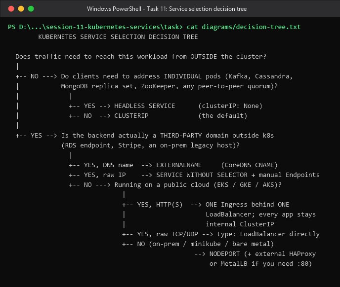

```
  Does traffic need to reach this workload from OUTSIDE the cluster?
  |
  +-- NO ---> Do clients need to address INDIVIDUAL pods (Kafka, Cassandra,
  |           MongoDB replica set, ZooKeeper, any peer-to-peer quorum)?
  |             |
  |             +-- YES --> HEADLESS SERVICE      (clusterIP: None)
  |             +-- NO  --> CLUSTERIP             (the default)
  |
  +-- YES --> Is the backend actually a THIRD-PARTY domain outside k8s
              (RDS endpoint, Stripe, an on-prem legacy host)?
                |
                +-- YES, DNS name  --> EXTERNALNAME     (CoreDNS CNAME)
                +-- YES, raw IP    --> SERVICE WITHOUT SELECTOR + manual Endpoints
                +-- NO ---> Running on a public cloud (EKS / GKE / AKS)?
                              |
                              +-- YES, HTTP(S)  --> ONE Ingress behind ONE
                              |                     LoadBalancer; every app stays
                              |                     internal ClusterIP
                              +-- YES, raw TCP/UDP --> type: LoadBalancer directly
                              +-- NO (on-prem / minikube / bare metal)
                                                 --> NODEPORT (+ external HAProxy
                                                     or MetalLB if you need :80)
```

### The cost anti-pattern

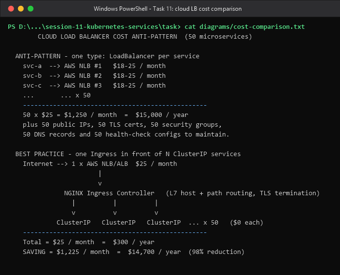

| | Anti-pattern: one LB per service | Best practice: one Ingress |
|---|---|---|
| Cloud load balancers | 50 | **1** |
| LB cost @ $25/mo | $1,250 / month | **$25 / month** |
| Annual LB cost | **$15,000 / year** | **$300 / year** |
| Public IPv4 addresses | 50 (AWS now bills ~$3.60/mo each ≈ +$180/mo) | 1 |
| TLS certificates to manage | 50 | 1 wildcard |
| DNS records | 50 | 1 (or 1 wildcard) |
| Security groups / firewall rules | 50 sets | 1 set |
| Time to expose a new service | Minutes (LB provisioning) + IaC change | Seconds (add a path to the Ingress) |
| L7 features (path routing, header rules, rate limiting, auth, WAF) | Per-LB, duplicated 50x | Centralised in the controller |
| **Net saving** | — | **$1,225 / month — $14,700 / year (98%)** |

The real-world price list this is based on (list price, single region, low traffic):

| Cloud | Resource | Approx. monthly cost |
|---|---|---|
| AWS | Network Load Balancer | ~$16.43 base + LCU charges ≈ $18–25 |
| AWS | Application Load Balancer | ~$16.43 base + LCU charges ≈ $18–25 |
| AWS | Public IPv4 address (since Feb 2024) | ~$3.60 each |
| GCP | Forwarding rule + network LB | ~$18–25 |
| Azure | Standard Load Balancer | ~$18–25 + data processing |

### Proving the Ingress pattern on this cluster

Two independent microservices, **both plain `ClusterIP`**, multiplexed behind the one
`ingress-nginx` controller that already fronts the cluster.

[`manifests/08-ingress/ingress.yaml`](./manifests/08-ingress/ingress.yaml)

```yaml
apiVersion: networking.k8s.io/v1
kind: Ingress
metadata:
  name: unified-ingress
  namespace: s11-lab
  annotations:
    nginx.ingress.kubernetes.io/rewrite-target: /
spec:
  ingressClassName: nginx
  rules:
    - host: s11.local
      http:
        paths:
          - path: /shop
            pathType: Prefix
            backend:
              service:
                name: shop-svc
                port: { number: 80 }
          - path: /billing
            pathType: Prefix
            backend:
              service:
                name: billing-svc
                port: { number: 80 }
```

(Both Deployments and their ClusterIP Services are in
[`manifests/08-ingress/two-apps.yaml`](./manifests/08-ingress/two-apps.yaml).)

```bash
kubectl apply -f manifests/08-ingress/
kubectl get svc shop-svc billing-svc -n s11-lab
kubectl get ingress -n s11-lab
minikube ssh -- curl -s -H "'Host: s11.local'" http://localhost:30946/shop
minikube ssh -- curl -s -H "'Host: s11.local'" http://localhost:30946/billing
```

**Output**

```
NAME          TYPE        CLUSTER-IP      EXTERNAL-IP   PORT(S)   AGE
shop-svc      ClusterIP   10.102.72.162   <none>        80/TCP    33s
billing-svc   ClusterIP   10.104.35.115   <none>        80/TCP    33s

NAME              CLASS   HOSTS       ADDRESS   PORTS   AGE
unified-ingress   nginx   s11.local             80      33s

<title>SHOP microservice</title>
<title>BILLING microservice</title>
```

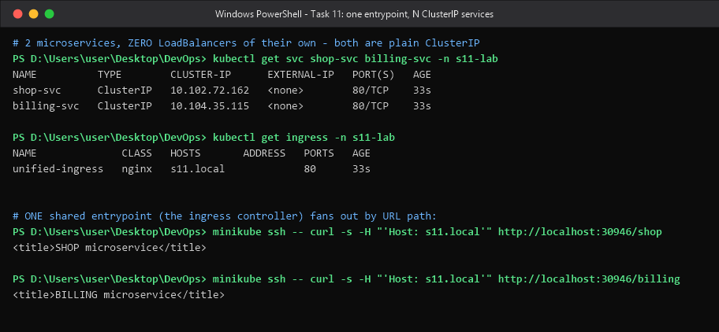

### What happened / why

Look at the `TYPE` column: both microservices are `ClusterIP`, and both are reachable from outside
the cluster. Neither has a `nodePort`; neither would have provisioned a cloud load balancer. The
only externally-bound object in the entire path is the single `ingress-nginx-controller` Service
(port 30946 on this cluster; on EKS it would be one `type: LoadBalancer` fronted by one NLB). Adding
a 51st microservice means adding four lines to the `paths:` list — no new cloud resource, no new IP,
no new certificate, no Terraform run.

The reason `type: LoadBalancer` cannot be shared is architectural, not a billing quirk: a
LoadBalancer Service is a **layer-4** object. It knows about IP addresses and TCP ports, and nothing
about HTTP. Two services cannot share one because at L4 there is no field to distinguish them —
`Host: shop.example.com` vs `Host: billing.example.com` is inside the HTTP request, which an L4
balancer never parses. A cloud LB therefore maps 1:1 to a Service, and 50 Services means 50 LBs.

An Ingress solves it by moving the fan-out up to **layer 7**. One L4 load balancer terminates the
connection into one nginx controller, which reads the `Host` header and URL path and reverse-proxies
to the correct internal ClusterIP — exactly what the two curl results above show, where the same
IP:port returned two different applications based purely on the path.

The saving compounds beyond the $14,700/yr: TLS termination, cert-manager ACME automation, rate
limiting, OAuth forward-auth, canary weighting, WAF rules and access logging are all configured once
in the controller rather than 50 times.

**When `type: LoadBalancer` is still the right answer.** Ingress only speaks HTTP/HTTPS (plus gRPC).
For raw TCP or UDP — a Postgres primary exposed to a VPN, a game server on UDP, an MQTT broker,
a DNS service — a direct LoadBalancer is correct, and you accept the per-service cost. Gateway API
(the successor to Ingress) is closing this gap with `TCPRoute` / `UDPRoute`.

---

## Task 12 — Minikube Docker-Driver Port Binding & Tunnel Gotcha Analysis

**Objective:** find the root cause of why `curl http://<Node-IP>:<NodePort>` fails from a Windows or
macOS host when minikube runs on the Docker driver, and demonstrate the workarounds.

> **Note on `minikube tunnel`.** As explained in Task 4, `minikube tunnel` was deliberately **not
> executed**: it requires an Administrator shell, blocks its terminal for its whole lifetime, and
> mutates host routing state on a cluster that two other exercises were using concurrently. Its
> mechanism is analysed in full below and its effect on Task 4's `<pending>` Service is described
> there. Workaround 1 (`minikube service --url`) was executed for real and is captured below.

### Step 1 — reproduce the failure

```bash
minikube ip
curl --connect-timeout 5 -s -I http://192.168.49.2:31080 || echo "FAILED: Node IP is NOT routable from the Windows host"
ping -n 2 192.168.49.2
```

**Output**

```
192.168.49.2

FAILED: Node IP 192.168.49.2 is NOT routable from the Windows host

Pinging 192.168.49.2 with 32 bytes of data:
Request timed out.
Request timed out.

Ping statistics for 192.168.49.2:
    Packets: Sent = 2, Received = 0, Lost = 2 (100% loss),
```

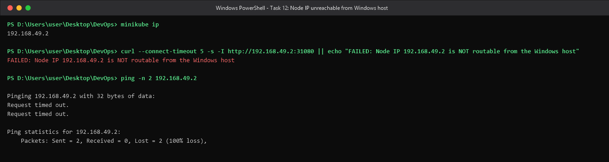

100% packet loss. This is the exact same NodePort that returned `HTTP/1.1 200 OK` from inside the
node in Task 3 — the Service is perfectly healthy; the *host* simply has no route to it.

### Step 2 — the root cause, proven

```bash
docker ps --filter name=minikube --format 'table {{.Names}}\t{{.Ports}}'
docker network inspect minikube --format '{{.Driver}} {{range .IPAM.Config}}subnet={{.Subnet}} gateway={{.Gateway}}{{end}}'
docker inspect minikube --format '{{range $k,$v := .NetworkSettings.Networks}}{{$k}} -> {{$v.IPAddress}}{{end}}'
```

**Output**

```
NAMES      PORTS
minikube   127.0.0.1:60411->22/tcp, 127.0.0.1:60407->2376/tcp, 127.0.0.1:60409->5000/tcp, 127.0.0.1:60410->8443/tcp, 127.0.0.1:60408->32443/tcp

bridge subnet=192.168.49.0/24 gateway=192.168.49.1

minikube -> 192.168.49.2
```

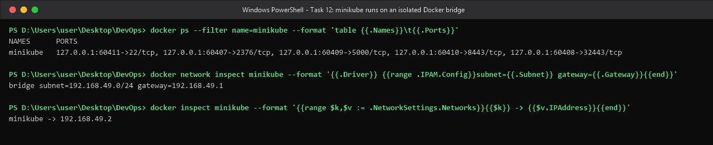

That output is the entire root cause in three lines:

1. **The "node" is a Docker container.** `docker inspect` shows `192.168.49.2` is the container's IP
   on a user-defined **bridge** network named `minikube`, subnet `192.168.49.0/24`.
2. **That subnet lives inside Docker's Linux VM, not on Windows.** On Windows (and macOS) Docker
   Desktop runs the daemon inside a lightweight Linux VM (WSL2 / HyperKit). The bridge and its
   gateway `192.168.49.1` are interfaces *in that VM's* network namespace. The Windows TCP/IP stack
   has no interface, no route and no NAT entry for `192.168.49.0/24` — so the SYN packets are
   dropped before they leave the host. On native Linux the bridge is on the host kernel itself,
   which is exactly why this gotcha does **not** occur there.
3. **Only five ports are published, and 31080 is not one of them.** `docker ps` shows the container
   publishes `22`, `2376`, `5000`, `8443` and `32443` — SSH, the Docker API, the registry, the
   Kubernetes API server, and one spare — each bound to an ephemeral port on `127.0.0.1` via
   `docker-proxy`. Publishing happens at `docker run` time. A NodePort created *afterwards* opens
   a listener **inside** the container, but no corresponding `-p` mapping exists on the host, so
   there is no path in.

### Step 3 — Workaround 1: `minikube service --url` (executed)

```bash
minikube service web-service-nodeport -n s11-lab --url    # backgrounded; it holds the tunnel open
curl -s -I --connect-timeout 5 http://127.0.0.1:51226
curl -s --connect-timeout 5 http://127.0.0.1:51226 | grep -i title
```

**Output**

```
http://127.0.0.1:51226
! Because you are using a Docker driver on windows, the terminal needs to be open to run it.

HTTP/1.1 200 OK
Server: nginx/1.31.6
Date: Fri, 18 Sep 2026 04:54:03 GMT
Content-Type: text/html
Content-Length: 896
Last-Modified: Tue, 15 Sep 2026 14:18:52 GMT
Connection: keep-alive
ETag: "6aa953cc-380"
Accept-Ranges: bytes

<title>Welcome to nginx!</title>
```

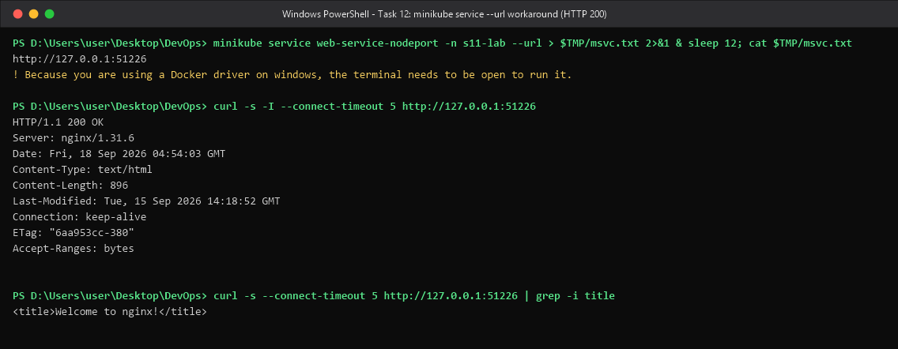

The same application that was 100% unreachable at `192.168.49.2:31080` now returns `HTTP/1.1 200 OK`
at `127.0.0.1:51226`. Minikube itself printed the explanation:
*"Because you are using a Docker driver on windows, the terminal needs to be open to run it."*

### Comparison of the two workarounds

| | `minikube service <svc> --url` | `minikube tunnel` |
|---|---|---|
| **What it does** | Opens an **SSH port-forward** from a random high port on host `127.0.0.1` into the node's NodePort | Runs a privileged host process that adds host **routes** to the cluster CIDRs and patches `status.loadBalancer.ingress` on pending Services |
| **OSI layer** | L4/L7 userspace proxy (per connection) | L3 routing + a status controller |
| **Target Service types** | NodePort (and the NodePort layer of LoadBalancer) | `type: LoadBalancer` |
| **Port you dial** | A random ephemeral port, e.g. `51226` (different every invocation) | The Service's real `port`, e.g. `80` — no port number in the URL |
| **Privileges** | None | **Administrator / sudo** (binding :80, editing the routing table) |
| **Scope** | One Service | All LoadBalancer Services in the cluster |
| **Lifetime** | Dies when the terminal closes | Dies when the terminal closes; EXTERNAL-IP reverts to `<pending>` |
| **Verified in this lab** | **Yes — HTTP 200 captured above** | No — deliberately not run (shared cluster, needs Admin) |

### What happened / why — and the other ways out

The mental model that makes this click: **with the Docker driver, minikube's "node" has the same
network reachability as any other Docker container.** You would not expect
`curl http://<container-ip>:8080` to work from a Windows host for an ordinary container either;
you would expect to need `docker run -p 8080:8080`. minikube's node is no different, and `docker ps`
above shows precisely which five ports it was launched with.

The complete set of ways to reach a workload from a Windows/macOS host:

| Approach | Command | Notes |
|---|---|---|
| Port-forward a Service | `minikube service <svc> -n <ns> --url` | Random port; blocks the terminal |
| Port-forward anything | `kubectl port-forward -n <ns> svc/<svc> 8080:80` | Works for **any** Service type including plain ClusterIP; you pick the port; driver-independent |
| L3 tunnel | `minikube tunnel` | Needs Admin; gives real EXTERNAL-IPs on standard ports |
| Publish at start time | `minikube start --ports=127.0.0.1:31080:31080` | Must be decided before the cluster is created |
| Change driver | `minikube start --driver=hyperv` | A real VM with a host-routable IP — the gotcha disappears |
| Exec from inside | `kubectl exec -n <ns> curl-client -- wget -qO- http://<svc>` | The technique used throughout this lab; no host networking involved at all |
| From the node | `minikube ssh -- curl http://localhost:<nodePort>` | Proves the NodePort binding itself, as in Task 3 |

The deeper lesson is one about production too: `192.168.49.2` being unreachable is not a bug, it is
the correct behaviour of an isolated network namespace. It is the same reason a pod IP
(`10.244.0.27`) is unreachable from your laptop on a real EKS cluster. Cluster-internal addresses —
pod IPs, ClusterIP VIPs, node IPs on private subnets — are *deliberately* not routable from
outside. Every legitimate way in (LoadBalancer, Ingress, port-forward, a bastion) is an explicit,
auditable boundary crossing. minikube on the Docker driver just makes you learn that on day one.

---

## Key Learnings

**1. The four ports are four different scopes, and only three are real.**
`containerPort` is documentation; nothing in the data path reads it. `targetPort` names the pod-side
port, `port` the VIP-side port, and `nodePort` the host-side port. Seeing `80:31080/TCP` in
`kubectl get svc` and `clusterIP` present on a NodePort Service is what makes the model click.

**2. Service types are cumulative, not alternative.**
`LoadBalancer ⊃ NodePort ⊃ ClusterIP`. The Task 4 output proved all three layers exist on one
object simultaneously: the ClusterIP served traffic from a client pod, the auto-allocated
`nodePort: 31081` served `HTTP/1.1 200 OK` from the node, and only the third layer
(`status.loadBalancer: {}`) was missing.

**3. `<pending>` is not a bug — it is an absent controller.**
Creating a `type: LoadBalancer` Service does not create a load balancer. A
cloud-controller-manager must be watching to fill in `status.loadBalancer.ingress`. Vanilla minikube
has none, so nothing is listening, no event is emitted, and `<pending>` is permanent and correct.

**4. Selector ⇒ automatic Endpoints; no selector ⇒ Endpoints are yours to write.**
The Service and Endpoints objects are joined only by name. Removing the selector makes the endpoints
controller ignore the Service entirely, which frees the name for a hand-written object pointing
anywhere routable — the standard bridge to legacy and external infrastructure.

**5. `clusterIP: None` opts out of the entire proxy layer.**
No VIP, no iptables rules, no load balancing. CoreDNS answers with one A record per Ready pod, and a
governing headless Service is what gives StatefulSet pods their per-pod DNS names. Clustered
software needs to address *specific* peers; a VIP would actively break quorum protocols.

**6. ExternalName never touches kube-proxy — and never rewrites SNI.**
It is a pure CoreDNS CNAME. The proof was the pair of wget results: the first got a real HTTP 400
from GitHub's edge (TCP and TLS succeeded, the Host header was wrong), and the second, identical but
with `Host: api.github.com`, returned a genuine API response. That is why ExternalName is safe for
plain-TCP backends and fragile in front of TLS virtual hosts.

**7. `ndots:5` makes every external call cost 6 extra DNS queries.**
Measured in CoreDNS's own logs: fetching `http://example.com` issued 8 queries, 6 of them
guaranteed NXDOMAINs against the search suffixes, and the Corefile's
`cache 30 { disable denial cluster.local }` means they are not even cached. Fix with a trailing dot,
per-pod `dnsConfig: {options: [{name: ndots, value: "2"}]}`, or NodeLocal DNSCache.

**8. Deployments guarantee a count; StatefulSets guarantee an identity.**
`web-app-clusterip-...-7nssb` came back as `...-4np22`; `web-stateful-0` came back as
`web-stateful-0`. And crucially, `web-stateful-0`'s IP *did* change (10.244.0.49 → 10.244.0.53)
while its name and DNS record did not — StatefulSets offer naming stability, not IP stability, which
is precisely why they are useless without a headless Service.

**9. Pick the controller by the question it answers.**
Deployment = "how many?" StatefulSet = "which one?" DaemonSet = "where?" If two pods of a workload
are not interchangeable, it is not a Deployment. If they are interchangeable but you need exactly
one per machine, it is a DaemonSet.

**10. One LoadBalancer per service is an L4 limitation, not a billing quirk.**
An L4 balancer cannot read the `Host` header, so it cannot fan out — hence 1 Service : 1 LB : ~$25.
Moving the fan-out to L7 with an Ingress collapses 50 LBs into 1 and saves ~$14,700/year, plus one
TLS cert instead of 50. Verified live: two `ClusterIP` Services served two different apps from the
same IP and port, distinguished only by URL path.

**11. Unreachable cluster IPs are a security feature you meet on day one.**
`192.168.49.2` is a Docker bridge address inside Docker Desktop's Linux VM; the Windows kernel has
no route to it and `docker ps` shows the container only ever published 5 ports. The workaround that
worked — `minikube service --url` giving `127.0.0.1:51226` → `HTTP/1.1 200 OK` — is a userspace
proxy, and `kubectl port-forward` generalises it to every Service type on every driver.

**12. Debug from inside the cluster.**
A single long-lived BusyBox pod plus `kubectl exec` answered nearly every question in this lab —
`wget`, `nslookup`, `cat /etc/resolv.conf`, `hostname -f` — without depending on host networking at
all. Combined with `minikube ssh` for node-level checks and `kubectl logs -n kube-system -l
k8s-app=kube-dns` for CoreDNS's own view, that is a complete networking toolkit.

---

## Repository Layout

```
session-11-kubernetes-services/task/
├── README.md                       <- this document
├── manifests/
│   ├── 00-client/client-pod.yaml           BusyBox diagnostic client (used by every task)
│   ├── 01-clusterip/                       Task 2  — app-deployment.yaml, service.yaml
│   ├── 02-nodeport/                        Task 3  — app-deployment.yaml, service.yaml
│   ├── 03-loadbalancer/                    Task 4  — app-deployment.yaml, service.yaml
│   ├── 04-externalname/service.yaml        Task 5
│   ├── 05-headless/                        Tasks 6 & 9 — service.yaml, app-statefulset.yaml
│   ├── 06-no-selector/                     Task 7  — service.yaml, endpoints.yaml
│   ├── 07-statefulset/                     Tasks 9 & 10 — deployment.yaml, daemonset.yaml
│   └── 08-ingress/                         Task 11 — two-apps.yaml, ingress.yaml
├── screenshots/                    31 PNGs, one or more per task
├── transcripts/                    the raw terminal transcripts each screenshot was rendered from
└── diagrams/                       the ASCII diagrams rendered in screenshots 01c, 11b, 11c
```

### Screenshot index

| File | Task | Shows |
|---|---|---|
| `01a-port-explain.png` | 1 | `kubectl explain` for `containerPort` and `nodePort` |
| `01b-port-mapping.png` | 1 | all four port values on one live Service |
| `01c-port-flow.png` | 1 | the nodePort → port → targetPort → containerPort flow |
| `02a-clusterip-endpoints.png` | 2 | VIP `10.111.225.236` + 3 pod endpoints + EndpointSlice |
| `02b-clusterip-access.png` | 2 | access by short name, FQDN and raw VIP |
| `03a-nodeport-svc.png` | 3 | `80:31080/TCP` mapping and `minikube ip` |
| `03b-nodeport-access.png` | 3 | `HTTP/1.1 200 OK` from the node on 31080 |
| `04a-loadbalancer-pending.png` | 4 | `EXTERNAL-IP <pending>` and `status.loadBalancer: {}` |
| `04b-loadbalancer-layers.png` | 4 | ClusterIP works, NodePort works, LB layer empty |
| `05a-externalname-svc.png` | 5 | `TYPE ExternalName`, `CLUSTER-IP <none>`, endpoints NotFound |
| `05b-externalname-dns.png` | 5 | `canonical name = api.github.com` → `20.207.73.85` |
| `05c-externalname-traffic.png` | 5 | HTTP 400 without the Host header, real API response with it |
| `06a-headless-svc.png` | 6 | `CLUSTER-IP None` + 3 ordinal pods |
| `06b-headless-dns.png` | 6 | three pod A records for one name |
| `06c-headless-ordinal.png` | 6 | per-pod DNS + `hostname -f` inside a pod |
| `07a-no-selector-empty.png` | 7 | `Selector <none>`, `Endpoints <none>` |
| `07b-no-selector-bound.png` | 7 | `192.168.1.150:3306` bound by hand |
| `08a-coredns-resolv.png` | 8 | CoreDNS pod, `kube-dns` Service, resolv.conf, Corefile |
| `08b-ndots-expansion.png` | 8 | 6 wasted NXDOMAIN queries in the CoreDNS log |
| `08c-fqdn-forms.png` | 8 | all four FQDN forms resolving identically |
| `09a-identity-before.png` | 9 | random hashes vs ordinals, before deletion |
| `09b-identity-after.png` | 9 | `7nssb`→`4np22` vs `web-stateful-0`→`web-stateful-0` |
| `09c-identity-dns.png` | 9 | new pod IP, same name, same DNS record |
| `10a-workload-matrix.png` | 10 | Deployment, StatefulSet, DaemonSet + owner kinds |
| `10b-controller-schemas.png` | 10 | schema differences + reverse-ordinal scale-down |
| `11a-ingress-fanout.png` | 11 | two ClusterIP apps served from one entrypoint |
| `11b-decision-tree.png` | 11 | the Service selection decision tree |
| `11c-cost-comparison.png` | 11 | the $1,250/mo vs $25/mo comparison |
| `12a-nodeip-fails.png` | 12 | 100% packet loss to `192.168.49.2` from Windows |
| `12b-minikube-service-url.png` | 12 | `127.0.0.1:51226` → `HTTP/1.1 200 OK` |
| `12c-docker-bridge.png` | 12 | the isolated Docker bridge and the 5 published ports |

---

## Cleanup

```bash
kubectl delete namespace s11-lab
```

Deleting the namespace garbage-collects every object created by this lab — Deployments,
StatefulSets, DaemonSets, Services, Endpoints, EndpointSlices, the Ingress and all pods — in one
operation, leaving the shared cluster exactly as it was found.
