# Session 12 — Ingress, ConfigMaps & Secrets


### Namespace bootstrap

```bash
kubectl create namespace s12-lab
```

```
namespace/s12-lab created
```

---

## Task 1 — Non-Sensitive Configuration Decoupling via ConfigMaps

**Objective:** move environment-specific runtime configuration out of the container image and into a declarative `ConfigMap`.

**Manifest:** [`manifests/01-configmap/app-config.yaml`](./manifests/01-configmap/app-config.yaml)

```yaml
apiVersion: v1
kind: ConfigMap
metadata:
  name: yatri-app-config
  namespace: s12-lab
  labels:
    app: yatri-app
data:
  ENVIRONMENT: "production"
  LOG_LEVEL: "INFO"
  PORT: "8080"
  DEFAULT_CURRENCY: "INR"
  MAX_BOOKING_DAYS: "90"
```

```bash
kubectl apply -f 01-configmap/app-config.yaml
kubectl get configmap yatri-app-config -n s12-lab
kubectl describe configmap yatri-app-config -n s12-lab
```

```
configmap/yatri-app-config created

NAME               DATA   AGE
yatri-app-config   5      0s

Name:         yatri-app-config
Namespace:    s12-lab
Labels:       app=yatri-app
Annotations:  <none>

Data
====
DEFAULT_CURRENCY:
----
INR

ENVIRONMENT:
----
production

LOG_LEVEL:
----
INFO

MAX_BOOKING_DAYS:
----
90

PORT:
----
8080


BinaryData
====

Events:  <none>
```

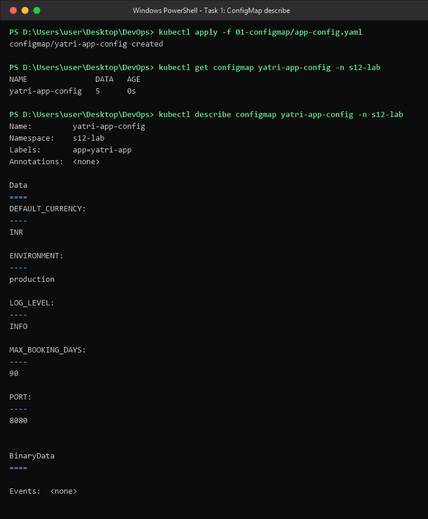

Individual keys queried imperatively with JSONPath:

```bash
kubectl get configmap yatri-app-config -n s12-lab -o jsonpath='{.data.ENVIRONMENT}' && echo ""
kubectl get configmap yatri-app-config -n s12-lab -o jsonpath='{.data.LOG_LEVEL}' && echo ""
kubectl get configmap yatri-app-config -n s12-lab -o jsonpath='{.data.DEFAULT_CURRENCY}' && echo ""
kubectl get configmap yatri-app-config -n s12-lab -o jsonpath='{.data.MAX_BOOKING_DAYS}' && echo ""
kubectl get configmap yatri-app-config -n s12-lab -o jsonpath='{range .data.*}{@}{"\n"}{end}'
```

```
production
INFO
INR
90

INFO
90
8080
INR
production
```

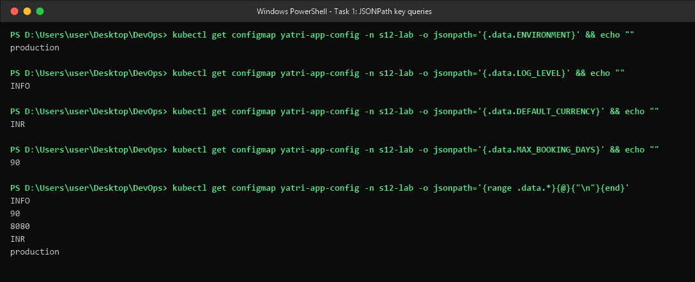

**What happened / why.** `DATA 5` confirms five keys were stored. `describe` renders the map
as sorted key/value pairs — note that values are stored as **plain text**, which is exactly why a
ConfigMap must never hold credentials. JSONPath (`{.data.<KEY>}`) reaches one key without
printing the whole object, which is how CI scripts read a single setting. The trailing
`&& echo ""` is needed because JSONPath output has no trailing newline. The `{range .data.*}`
form iterates values in map order, which is why the last query prints them unlabelled and
alphabetically by key.

---

## Task 2 — ConfigMap Live Update & Pod Immobility Verification Drill

**Objective:** prove that patching a live `ConfigMap` does **not** update environment variables
inside a running container, that a **volume-mounted** ConfigMap *does* refresh, and that
`kubectl rollout restart` is what actually reloads env vars with zero downtime.

The backend used for this drill consumes the ConfigMap **both ways** — `envFrom` (env vars) and
as a volume at `/etc/app-config` — so both behaviours can be observed in the *same* pod.
Manifest: [`manifests/03-combined/backend.yaml`](./manifests/03-combined/backend.yaml).

### Phase A — patch the ConfigMap, the running pod does not move

```bash
kubectl exec -n s12-lab deploy/yatri-backend -- env | grep ENVIRONMENT
kubectl exec -n s12-lab deploy/yatri-backend -- sh -c 'cat /etc/app-config/ENVIRONMENT; echo'
kubectl patch configmap yatri-app-config -n s12-lab --type merge -p '{"data":{"ENVIRONMENT":"staging"}}'
kubectl get configmap yatri-app-config -n s12-lab -o jsonpath='{.data.ENVIRONMENT}' && echo ''
kubectl exec -n s12-lab deploy/yatri-backend -- env | grep ENVIRONMENT
```

```
NAME                             READY   STATUS        RESTARTS   AGE
yatri-backend-594d9677c9-84vkl   1/1     Terminating   0          35s
yatri-backend-68795995c9-68pzx   1/1     Running       0          1s

ENVIRONMENT=production            <- env var in the running pod
production                        <- volume file in the running pod

configmap/yatri-app-config patched
staging                           <- the ConfigMap object IS updated

ENVIRONMENT=production            <- but the pod's env var is UNCHANGED
```

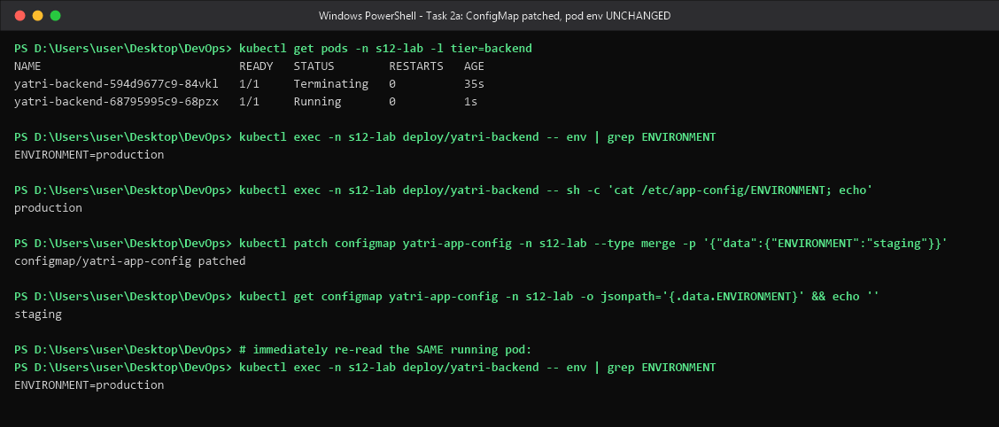

### Phase B — the volume mount *does* live-refresh (kubelet sync)

```bash
POD=$(kubectl get pod -n s12-lab -l tier=backend -o jsonpath='{.items[0].metadata.name}')
for i in 1 2 3 4 5 6 7 8; do
  E=$(kubectl exec -n s12-lab $POD -- sh -c 'printenv ENVIRONMENT')
  V=$(kubectl exec -n s12-lab $POD -- sh -c 'cat /etc/app-config/ENVIRONMENT')
  echo "t=$((i*15-15))s  env:ENVIRONMENT=$E   volume:/etc/app-config/ENVIRONMENT=$V"
  [ "$V" = staging ] && { echo '>>> volume mount REFRESHED - stopping poll'; break; }
  sleep 15
done
```

```
t=0s   env:ENVIRONMENT=production   volume:/etc/app-config/ENVIRONMENT=production
t=15s  env:ENVIRONMENT=production   volume:/etc/app-config/ENVIRONMENT=production
t=30s  env:ENVIRONMENT=production   volume:/etc/app-config/ENVIRONMENT=production
t=45s  env:ENVIRONMENT=production   volume:/etc/app-config/ENVIRONMENT=production
t=60s  env:ENVIRONMENT=production   volume:/etc/app-config/ENVIRONMENT=staging
>>> volume mount REFRESHED - stopping poll
```

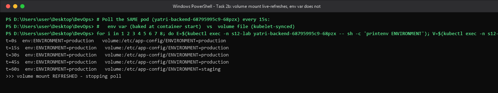

### Phase C — rolling restart loads the new value into env vars

```bash
kubectl rollout restart deployment/yatri-backend -n s12-lab
kubectl rollout status  deployment/yatri-backend -n s12-lab
kubectl get pods -n s12-lab -l tier=backend
kubectl exec -n s12-lab deploy/yatri-backend -- env | grep ENVIRONMENT
# revert for the following labs
kubectl patch configmap yatri-app-config -n s12-lab --type merge -p '{"data":{"ENVIRONMENT":"production"}}'
kubectl rollout restart deployment/yatri-backend -n s12-lab && kubectl rollout status deployment/yatri-backend -n s12-lab
kubectl exec -n s12-lab deploy/yatri-backend -- env | grep ENVIRONMENT
```

```
deployment.apps/yatri-backend restarted
Waiting for deployment "yatri-backend" rollout to finish: 1 old replicas are pending termination...
deployment "yatri-backend" successfully rolled out

NAME                             READY   STATUS        RESTARTS   AGE
yatri-backend-68795995c9-68pzx   1/1     Terminating   0          95s
yatri-backend-75cb557f4d-9v8ls   1/1     Running       0          2s

ENVIRONMENT=staging               <- new pod picked up the new value

configmap/yatri-app-config patched
deployment.apps/yatri-backend restarted
deployment "yatri-backend" successfully rolled out
ENVIRONMENT=production            <- reverted
```

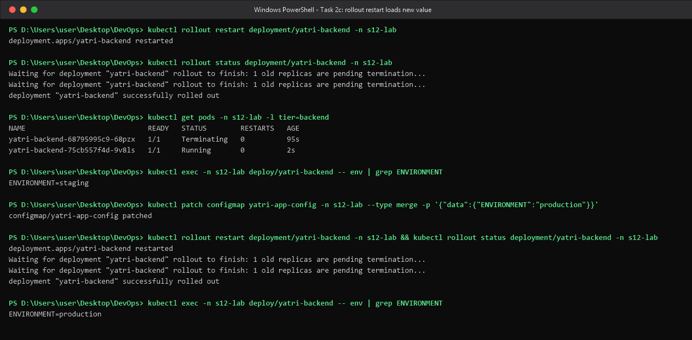

**What happened / why.** Environment variables are resolved **once**, by the kubelet, at container
*creation* time and then handed to the process image — the kernel has no mechanism to mutate
another process's environment, so no amount of API-server change can reach it. A ConfigMap
mounted as a **volume**, by contrast, is a projected directory the kubelet re-syncs on its refresh
cycle (default ~60 s, plus cache TTL) via an atomic `..data` symlink swap — which is exactly the
`t=60s` flip captured above, and also why `ls -l /etc/app-config` shows symlinks. Practical rule:
if you want hot reload, mount the ConfigMap as a volume *and* have the app watch the file;
otherwise you must roll the pods. `kubectl rollout restart` does that with zero downtime by
stamping a new `kubectl.kubernetes.io/restartedAt` annotation on the pod template, which triggers
the normal surge/terminate rolling update — note the old pod is `Terminating` while the new one is
already `Running`.

---

## Task 3 — Sensitive Data Isolation via Secrets & Base64 Mechanics

**Objective:** store credentials in an `Opaque` Secret and demonstrate that Base64 is an
**encoding**, not encryption.

**Manifest:** [`manifests/02-secret/db-secret.yaml`](./manifests/02-secret/db-secret.yaml)

```yaml
# NOTE: dummy throw-away lab credentials only - never real secrets.
# POSTGRES_USER      = yatri_admin    -> echo -n 'yatri_admin'    | base64
# POSTGRES_PASSWORD  = secretpassword -> echo -n 'secretpassword' | base64
apiVersion: v1
kind: Secret
metadata:
  name: yatri-db-secret
  namespace: s12-lab
  labels:
    app: yatri-app
type: Opaque
data:
  POSTGRES_USER: eWF0cmlfYWRtaW4=
  POSTGRES_PASSWORD: c2VjcmV0cGFzc3dvcmQ=
```

```bash
kubectl apply -f 02-secret/db-secret.yaml
kubectl get secret yatri-db-secret -n s12-lab
kubectl describe secret yatri-db-secret -n s12-lab
kubectl get secret yatri-db-secret -n s12-lab -o jsonpath='{.data.POSTGRES_USER}' && echo ''
kubectl get secret yatri-db-secret -n s12-lab -o jsonpath='{.data.POSTGRES_USER}'     | base64 --decode && echo ''
kubectl get secret yatri-db-secret -n s12-lab -o jsonpath='{.data.POSTGRES_PASSWORD}' | base64 --decode && echo ''
```

```
secret/yatri-db-secret unchanged

NAME              TYPE     DATA   AGE
yatri-db-secret   Opaque   2      2m27s

Name:         yatri-db-secret
Namespace:    s12-lab
Labels:       app=yatri-app
Annotations:  <none>

Type:  Opaque

Data
====
POSTGRES_PASSWORD:  14 bytes
POSTGRES_USER:      11 bytes

eWF0cmlfYWRtaW4=
yatri_admin
secretpassword
```

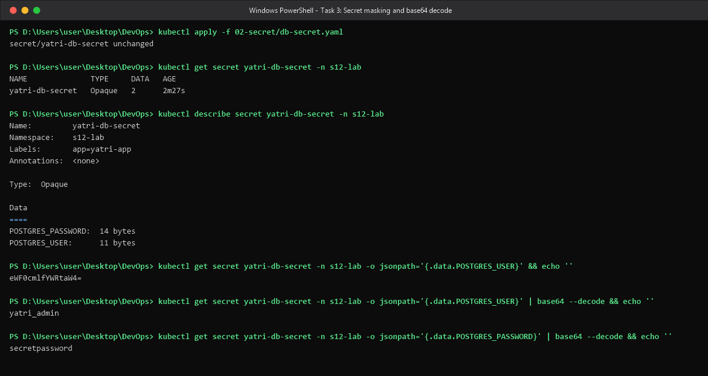

**What happened / why.** `describe` deliberately prints only **byte lengths** (`14 bytes`,
`11 bytes`) instead of values, so a secret is not leaked by a casual describe or by log scraping.
That masking is cosmetic though: `kubectl get -o jsonpath` returns the raw Base64, and a single
`base64 --decode` yields the plaintext. Base64 is a *transport* encoding that lets arbitrary binary
live inside YAML/JSON — it has no key and provides **zero** confidentiality. Real protection comes
from: RBAC on the `secrets` resource, etcd encryption-at-rest (`EncryptionConfiguration`), and
keeping the material outside Git entirely (Task 5).

---

## Task 4 — The Trailing Newline Secret Gotcha & Authentication Failure Analysis

**Objective:** demonstrate, at byte level, how `echo "pw" | base64` silently embeds a `0x0A`
newline in a Secret and breaks database authentication.

### Phase A — the byte-level proof on the workstation

```bash
# WRONG: plain echo appends 0x0a
echo "secretpassword" | xxd
echo "secretpassword" | base64
# RIGHT: echo -n emits the exact byte stream
echo -n "secretpassword" | xxd
echo -n "secretpassword" | base64
# decode both back and compare raw bytes
echo 'c2VjcmV0cGFzc3dvcmQK' | base64 -d | xxd
echo 'c2VjcmV0cGFzc3dvcmQ=' | base64 -d | xxd
echo -n 'c2VjcmV0cGFzc3dvcmQK' | base64 -d | wc -c
echo -n 'c2VjcmV0cGFzc3dvcmQ=' | base64 -d | wc -c
```

```
00000000: 7365 6372 6574 7061 7373 776f 7264 0a    secretpassword.
c2VjcmV0cGFzc3dvcmQK

00000000: 7365 6372 6574 7061 7373 776f 7264       secretpassword
c2VjcmV0cGFzc3dvcmQ=

00000000: 7365 6372 6574 7061 7373 776f 7264 0a    secretpassword.
00000000: 7365 6372 6574 7061 7373 776f 7264       secretpassword

Wrong (with newline): c2VjcmV0cGFzc3dvcmQK
Right (no newline):   c2VjcmV0cGFzc3dvcmQ=

15
14
```

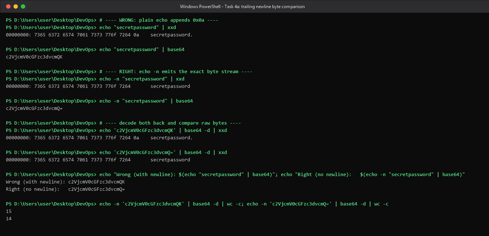

### Phase B — the same corruption reproduced *inside the cluster*

A second Secret was created holding the **wrong** encoding, and a `busybox:1.36` probe pod was
given both versions as env vars and as mounted files:
[`manifests/02-secret/db-secret-newline-bug.yaml`](./manifests/02-secret/db-secret-newline-bug.yaml),
[`manifests/02-secret/newline-probe-pod.yaml`](./manifests/02-secret/newline-probe-pod.yaml)

```yaml
type: Opaque
data:
  POSTGRES_PASSWORD: c2VjcmV0cGFzc3dvcmQK   # <- encoded with `echo`, carries 0x0A
```

```bash
kubectl describe secret yatri-db-secret     -n s12-lab | tail -5
kubectl describe secret yatri-db-secret-bad -n s12-lab | tail -4
kubectl exec -n s12-lab newline-probe -- sh -c 'printf "%s" "$PASS_GOOD" | od -c | head -3'
kubectl exec -n s12-lab newline-probe -- sh -c 'printf "%s" "$PASS_BAD"  | od -c | head -3'
kubectl exec -n s12-lab newline-probe -- sh -c 'wc -c < /etc/secret-good/POSTGRES_PASSWORD; wc -c < /etc/secret-bad/POSTGRES_PASSWORD'
kubectl exec -n s12-lab newline-probe -- sh -c 'if [ "$PASS_BAD" = "secretpassword" ]; then echo "AUTH OK"; else echo "AUTH FAILED"; fi'
```

```
Data
====
POSTGRES_PASSWORD:  14 bytes
POSTGRES_USER:      11 bytes

Data
====
POSTGRES_PASSWORD:  15 bytes

0000000   s   e   c   r   e   t   p   a   s   s   w   o   r   d
0000016

0000000   s   e   c   r   e   t   p   a   s   s   w   o   r   d  \n
0000017

14
15

AUTH FAILED: password mismatch (len=15)
```

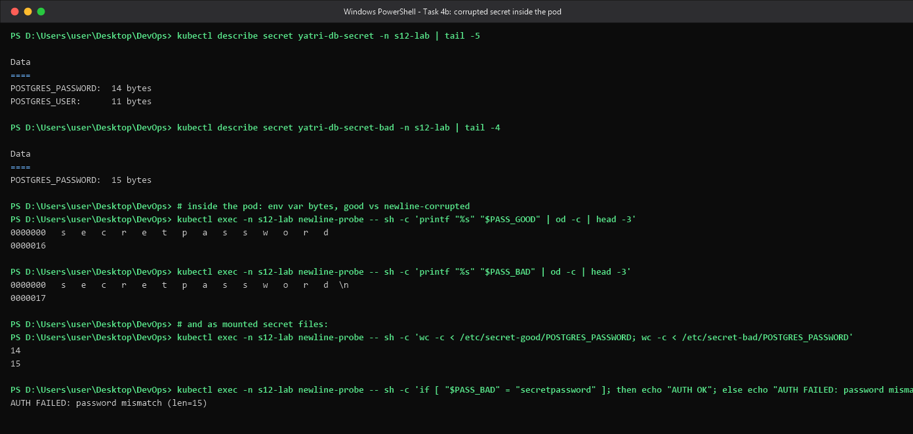

**What happened / why.** `echo` terminates its output with a newline; that newline is part of the
byte stream fed to `base64`, so the encoded payload is 15 bytes, not 14 — visible as the trailing
`0a` in `xxd` and as `\n` in the pod's `od -c`. The corruption survives all the way into the
container, both as an env var and as a mounted file (`15` vs `14` bytes), and the string comparison
inside the pod fails. In production this shows up as the maddening "the password is definitely
correct but Postgres/MySQL says *authentication failed*" bug, because the database receives
`secretpassword\n`. Note also that the two Base64 strings differ only in their tail
(`...d3JkQK` vs `...d3JkQ=`) — losing the `=` padding in favour of an extra character is the
tell-tale sign of the extra byte. Safe patterns: `echo -n`, `printf '%s'`, or best of all let
kubectl do the encoding:
`kubectl create secret generic ... --from-literal=POSTGRES_PASSWORD='secretpassword'`.

---

## Task 5 — Enterprise Secret Management & Pipeline Integration Analysis

**Objective:** document how real organisations keep credentials out of Git while still deploying
declaratively, and confirm what this cluster is actually doing today.

### Cluster evidence

```bash
kubectl get crds 2>/dev/null | grep -i -E 'secret|vault' || echo 'No external secret CRDs - standard native Kubernetes Secrets in use'
kubectl api-resources | grep -i -E '^secret|^configmap'
kubectl get secrets -n s12-lab
kubectl get secret yatri-db-secret -n s12-lab -o yaml | grep -A4 '^data:'
kubectl auth can-i get  secrets --namespace s12-lab
kubectl auth can-i list secrets --all-namespaces
```

```
No external secret CRDs - standard native Kubernetes Secrets in use

configmaps                          cm           v1                                true         ConfigMap
secrets                                          v1                                true         Secret

NAME                  TYPE     DATA   AGE
yatri-db-secret       Opaque   2      3m36s
yatri-db-secret-bad   Opaque   1      33s

data:
  POSTGRES_PASSWORD: c2VjcmV0cGFzc3dvcmQ=
  POSTGRES_USER: eWF0cmlfYWRtaW4=
kind: Secret
metadata:

yes
yes
```

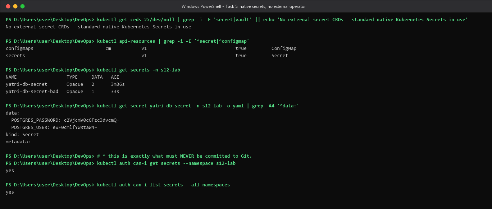

### 5.1 The vulnerability — why committing Secret YAML to Git is a DevSecOps failure

| Problem | Why it is fatal |
|---|---|
| **Base64 is not encryption** | Anyone who can read the repo runs one `base64 -d` and owns the production database password. |
| **Git history is immutable** | Deleting the file in a later commit achieves nothing — the blob lives forever in history, in every clone, fork, CI cache and laptop. Remediation needs a history rewrite *and* a credential rotation. |
| **Blast radius / no least privilege** | Repo read access silently becomes production credential access. Repo RBAC and cluster RBAC are separate systems that now have to agree. |
| **No rotation, no expiry** | A hardcoded value has no TTL. Rotating it means a PR, a review, a merge and a deploy — so in practice it never happens. |
| **No audit trail** | You can see who *changed* the manifest, never who *used* the credential. |
| **Leak amplification** | CI logs, `kubectl get -o yaml` dumps, `helm template` output, image layers and Slack pastes all spread the same value. |

### 5.2 The fix — external secret stores plus an in-cluster sync agent

```
        +--------------------------------------------------------------+
        |  EXTERNAL SOURCE OF TRUTH  (outside the cluster, outside Git) |
        |  AWS Secrets Manager | Azure Key Vault | HashiCorp Vault      |
        +-------------------------------+------------------------------+
                                        |
             (1) authenticate with a WORKLOAD IDENTITY, not a static key
                 IRSA / EKS Pod Identity - AAD Workload Identity - Vault k8s auth
                                        v
        +--------------------------------------------------------------+
        |  IN-CLUSTER SYNC AGENT                                        |
        |  External Secrets Operator (ESO)  -or-  Vault Agent Injector  |
        |  CRDs: SecretStore / ClusterSecretStore + ExternalSecret      |
        +-------------------------------+------------------------------+
                                        |
                        (2) reconcile loop, refreshInterval: 1h
                                        v
        +--------------------------------------------------------------+
        |  EPHEMERAL Kubernetes Secret                                  |
        |  created by the operator - never committed; the repo holds    |
        |  only the *reference* to it                                   |
        +-------------------------------+------------------------------+
                                        |
                  (3) envFrom / secretKeyRef / volume mount
                                        v
        +--------------------------------------------------------------+
        |  APPLICATION POD                                              |
        +--------------------------------------------------------------+
```

What lives in Git is only a **pointer**, which is safe to review in a pull request:

```yaml
apiVersion: external-secrets.io/v1beta1
kind: ExternalSecret
metadata:
  name: yatri-db-secret
  namespace: s12-lab
spec:
  refreshInterval: 1h                  # rotation is picked up automatically
  secretStoreRef:
    name: aws-secretsmanager
    kind: ClusterSecretStore
  target:
    name: yatri-db-secret              # the k8s Secret ESO will create and refresh
    creationPolicy: Owner
  data:
    - secretKey: POSTGRES_PASSWORD
      remoteRef:
        key: prod/yatri/db             # path inside AWS Secrets Manager
        property: password
```

**Variants and when to choose them**

| Approach | Mechanism | Best for |
|---|---|---|
| **External Secrets Operator** | Controller reconciles `ExternalSecret` CRs into native `Secret`s | Multi-cloud, GitOps (Argo CD / Flux), minimal app changes |
| **Vault Agent Injector** | Mutating webhook adds a sidecar that renders secrets into a shared `tmpfs` at `/vault/secrets` | Short-lived / dynamic credentials, "no Secret object at all" policies |
| **Secrets Store CSI Driver** | CSI volume mounts the store straight into the pod, optional `secretObjects` sync | Mount-only consumption with AWS/Azure/GCP provider parity |
| **Sealed Secrets (Bitnami)** | Asymmetric encryption; a `SealedSecret` is safe in Git, the controller decrypts in-cluster | Small teams with no external vault (note: no automatic rotation) |
| **SOPS + age/KMS** | Encrypts YAML values in place, decrypted by a Flux/Helm plugin | GitOps repos that want everything in Git, but encrypted |

### 5.3 CI/CD integration — injecting at deploy time

**GitHub Actions** — the value lives in repository/environment secrets or, better, is fetched
just-in-time from a cloud vault over OIDC so no long-lived key exists anywhere:

```yaml
jobs:
  deploy:
    permissions:
      id-token: write            # OIDC federation -> AWS; no static AWS keys in the repo
      contents: read
    steps:
      - uses: aws-actions/configure-aws-credentials@v4
        with:
          role-to-assume: arn:aws:iam::111122223333:role/gha-deploy
          aws-region: ap-south-1
      - name: Create the Secret at deploy time (never stored in the repo)
        run: |
          PW=$(aws secretsmanager get-secret-value --secret-id prod/yatri/db \
                 --query SecretString --output text | jq -r .password)
          kubectl create secret generic yatri-db-secret -n s12-lab \
            --from-literal=POSTGRES_PASSWORD="$PW" \
            --dry-run=client -o yaml | kubectl apply -f -
```

**Azure DevOps** — a Variable Group *linked to an Azure Key Vault*; values are resolved at pipeline
runtime through the service connection and injected as masked variables:

```yaml
variables:
  - group: yatri-prod-kv          # linked to Key Vault; values never appear in this YAML
steps:
  - task: HelmDeploy@0
    inputs:
      arguments: --set db.password=$(POSTGRES_PASSWORD)   # masked in the logs as ***
```

**Non-negotiable pipeline hygiene**

1. Never `echo` a secret — CI log masking is best-effort, so simply do not print them.
2. Prefer **OIDC / workload identity federation** over static cloud keys kept as CI secrets.
3. Scope credentials per environment and per namespace, with separate approval gates for prod.
4. Run a secret scanner (`gitleaks`, `trufflehog`, `detect-secrets`) as a pre-commit hook and in CI.
5. Restrict `get`/`list` on `secrets` through RBAC and enable etcd encryption-at-rest.
6. Treat any leaked value as compromised — **rotate it**, do not just delete the commit.

**On this cluster** (evidence above) there is **no** ESO or Vault CRD installed, so plain native
Secrets are in use — appropriate for a lab, and exactly the setup this task argues must never be
copied into production. The `kubectl get -o yaml` output is the live illustration: the Base64
payload sits right there in the object, one command away from plaintext.

---

## Task 6 — Combined ConfigMap and Secret Pod Injection Architecture

**Objective:** deploy a backend that consumes non-sensitive settings in **bulk** via
`envFrom.configMapRef` and sensitive values **key by key** via `env.valueFrom.secretKeyRef`,
then verify both arrive in the container environment.

**Manifest:** [`manifests/03-combined/backend.yaml`](./manifests/03-combined/backend.yaml)
(multi-document YAML: `Deployment` `---` `Service`)

```yaml
apiVersion: apps/v1
kind: Deployment
metadata:
  name: yatri-backend
  namespace: s12-lab
  labels: {app: yatri-app, tier: backend}
spec:
  replicas: 1
  selector:
    matchLabels: {app: yatri-app, tier: backend}
  template:
    metadata:
      labels: {app: yatri-app, tier: backend}
    spec:
      containers:
        - name: backend
          image: nginx:alpine
          ports:
            - containerPort: 80
          # --- BULK injection of every non-sensitive key in the ConfigMap ---
          envFrom:
            - configMapRef:
                name: yatri-app-config
          # --- GRANULAR injection of individual sensitive keys from the Secret ---
          env:
            - name: POSTGRES_USER
              valueFrom:
                secretKeyRef: {name: yatri-db-secret, key: POSTGRES_USER}
            - name: POSTGRES_PASSWORD
              valueFrom:
                secretKeyRef: {name: yatri-db-secret, key: POSTGRES_PASSWORD}
          # --- ConfigMap as a VOLUME (each key becomes a file) - used by Task 2 ---
          volumeMounts:
            - name: app-config-volume
              mountPath: /etc/app-config
              readOnly: true
          command: ["/bin/sh", "-c"]
          args:
            - |
              cat > /usr/share/nginx/html/index.html <<HTML
              <html><head><title>Yatri Backend API</title></head><body>
              <h1>Yatri Backend API</h1>
              <pre>
              SERVED_BY:        $(hostname)
              ENVIRONMENT:      ${ENVIRONMENT}
              LOG_LEVEL:        ${LOG_LEVEL}
              PORT:             ${PORT}
              DEFAULT_CURRENCY: ${DEFAULT_CURRENCY}
              MAX_BOOKING_DAYS: ${MAX_BOOKING_DAYS}
              POSTGRES_USER:    ${POSTGRES_USER}
              POSTGRES_PASSWORD:${POSTGRES_PASSWORD}
              </pre></body></html>
              HTML
              exec nginx -g 'daemon off;'
          resources:
            requests: {cpu: "10m", memory: "16Mi"}
            limits:   {cpu: "200m", memory: "64Mi"}
      volumes:
        - name: app-config-volume
          configMap:
            name: yatri-app-config
---
apiVersion: v1
kind: Service
metadata:
  name: yatri-backend-svc
  namespace: s12-lab
  labels: {app: yatri-app, tier: backend}
spec:
  type: ClusterIP
  selector: {app: yatri-app, tier: backend}
  ports:
    - port: 80
      targetPort: 80
```

```bash
kubectl apply -f 03-combined/backend.yaml
kubectl rollout status deployment/yatri-backend -n s12-lab
kubectl exec -n s12-lab deploy/yatri-backend -- env \
  | grep -E '^(ENVIRONMENT|LOG_LEVEL|PORT|DEFAULT_CURRENCY|MAX_BOOKING_DAYS|POSTGRES_USER|POSTGRES_PASSWORD)=' | sort
kubectl exec -n s12-lab deploy/yatri-backend -- sh -c 'ls /etc/app-config'
kubectl get deploy yatri-backend -n s12-lab -o jsonpath='{.spec.template.spec.containers[0].envFrom}'
```

```
deployment.apps/yatri-backend unchanged
service/yatri-backend-svc unchanged
deployment "yatri-backend" successfully rolled out

DEFAULT_CURRENCY=INR
ENVIRONMENT=production
LOG_LEVEL=INFO
MAX_BOOKING_DAYS=90
PORT=8080
POSTGRES_PASSWORD=secretpassword
POSTGRES_USER=yatri_admin

DEFAULT_CURRENCY
ENVIRONMENT
LOG_LEVEL
MAX_BOOKING_DAYS
PORT

[{"configMapRef":{"name":"yatri-app-config"}}]

POSTGRES_USER <- secret/yatri-db-secret:POSTGRES_USER
POSTGRES_PASSWORD <- secret/yatri-db-secret:POSTGRES_PASSWORD
```

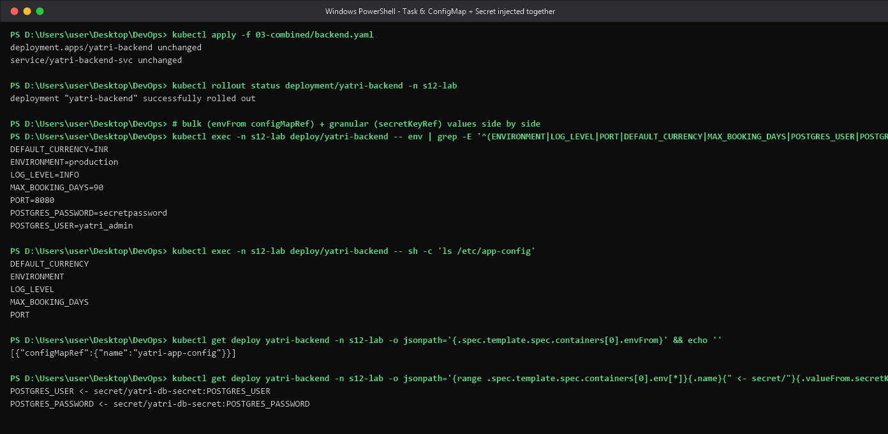

**What happened / why.** `envFrom.configMapRef` is a *bulk* import: all five ConfigMap keys become
env vars automatically, so adding a key to the ConfigMap needs no manifest change — convenient, but
it also means you cannot rename a key or control collisions. `env.valueFrom.secretKeyRef` is
*granular*: each sensitive key is listed explicitly, which keeps the pod's credential surface
auditable and lets you rename the variable (e.g. map `POSTGRES_PASSWORD` to `DB_PASS`). Both
sources merge into one flat environment; explicit `env` entries win over `envFrom` on a name clash.
The same ConfigMap is *also* mounted at `/etc/app-config`, which is what made Task 2's
live-refresh comparison possible. One caution visible in this output: `env` inside the container
prints the password in plaintext, so anyone with `exec` rights effectively has the credential —
`exec` permission must be treated as equivalent to secret-read permission.

---

## Task 7 — Architectural Comparative Study — Ingress Resource vs. Ingress Controller

**Objective:** separate the declarative **rules** (an API object) from the running **reverse proxy**
(a workload) that enforces them.

### Cluster evidence

```bash
kubectl api-resources | grep -i ingress
kubectl get ingressclass
kubectl get ingressclass nginx -o jsonpath='{.spec.controller}' && echo ''
kubectl get deploy -n ingress-nginx
kubectl get validatingwebhookconfigurations | grep -i ingress
```

```
ingressclasses                                   networking.k8s.io/v1              false        IngressClass
ingresses                           ing          networking.k8s.io/v1              true         Ingress

NAME              CONTROLLER             PARAMETERS   AGE
nginx (default)   k8s.io/ingress-nginx   <none>       18h

k8s.io/ingress-nginx

NAME                       READY   UP-TO-DATE   AVAILABLE   AGE
ingress-nginx-controller   1/1     1            1           18h

ingress-nginx-admission   1          18h
```

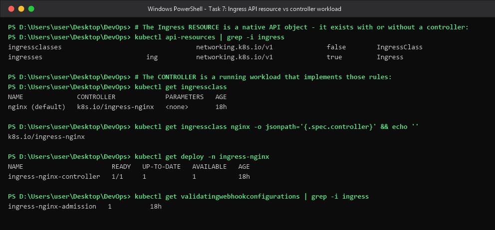

### Comparison

| | **Ingress Resource** | **Ingress Controller** |
|---|---|---|
| **What it is** | A declarative object of the built-in API group `networking.k8s.io/v1` | A Deployment/DaemonSet of pods running a real reverse proxy |
| **Where it lives** | In etcd, namespaced, created with `kubectl apply -f ingress.yaml` | In a namespace such as `ingress-nginx`, installed via Helm / operator / `minikube addons enable ingress` |
| **What it contains** | Hostnames, paths + pathTypes, backend Service + port, `spec.tls` secret refs, controller-specific annotations | The proxy engine (NGINX / Traefik / HAProxy / Envoy), a control loop, a template renderer and a config reloader |
| **Does it move traffic?** | **No.** On its own it is inert configuration — apply it with no controller installed and nothing happens; the `ADDRESS` column simply stays empty | **Yes.** It is the data plane that actually terminates the client connection and proxies to pod IPs |
| **Who implements it** | Selected by `spec.ingressClassName` -> an `IngressClass` object -> `spec.controller` string (`k8s.io/ingress-nginx` above) | The controller only acts on Ingresses whose class matches its own `--controller-class` |
| **Failure mode** | A typo yields a rule that matches nothing (404 from the default backend) | If the controller pods die, *all* ingress traffic stops even though the Ingress objects are untouched |
| **Layer** | Layer 7 *specification* | Layer 7 *implementation* (plus TLS termination, sticky sessions, rate limiting, WAF, …) |

### The control loop, concretely

```
   kubectl apply -f ingress.yaml
              |
              v
   +---------------------+      watch Ingress / Service / EndpointSlice / Secret
   |     API server      |<---------------------------------------------------+
   |  (Ingress object    |                                                     |
   |   stored in etcd)   |                                                     |
   +----------+----------+                                                     |
              |  (a) admission webhook `validate.nginx.ingress.kubernetes.io`  |
              |      rejects a bad rule BEFORE it is persisted                 |
              v                                                                |
   +--------------------------------------------------------------+           |
   |  ingress-nginx-controller pod                                 |-----------+
   |   1. reads all Ingress objects whose class is `nginx`         |
   |   2. renders them into /etc/nginx/nginx.conf (server + location blocks)
   |   3. reloads nginx, or updates upstreams in-place via Lua     |
   |   4. writes status.loadBalancer.ingress back -> the ADDRESS column
   +----------------------+---------------------------------------+
                          |  proxies straight to POD IPs from EndpointSlices
                          v                (bypassing kube-proxy/ClusterIP)
                   application pods
```

**What happened / why.** `kubectl api-resources` proves the Ingress *schema* is native to
Kubernetes — every cluster can store one. But the `IngressClass` output is the link that makes it
real: `nginx (default)` points at the controller string `k8s.io/ingress-nginx`, which is claimed by
the `ingress-nginx-controller` Deployment. The `ingress-nginx-admission` validating webhook is a
nice extra piece of evidence for the split: when a duplicate host+path was applied during this lab,
the **webhook** (part of the controller) rejected the **resource** at admission time with
`host ... and path ... is already defined in ingress default/yatri-ingress` — proof that the rules
are validated and executed by a component entirely separate from the API object itself. Likewise,
the `ADDRESS` column of `kubectl get ingress` is empty for a few seconds after apply and is then
filled in with `192.168.49.2` by the controller — that write-back is the controller announcing
"I have accepted and programmed this rule".

---

## Task 8 — NGINX Ingress Controller Activation & Lifecycle Verification

**Objective:** enable and verify the NGINX ingress controller and inspect the `ingress-nginx`
system namespace.

> The addon was **already enabled** on this shared cluster (`minikube addons enable ingress` had
> been run previously, and re-running it is a no-op), so the evidence below is the live state of
> that installation rather than a fresh enable.

```bash
minikube addons enable ingress            # already enabled - shown via `addons list` below
minikube addons list | grep -i ingress
kubectl get pods -n ingress-nginx
kubectl wait --namespace ingress-nginx --for=condition=ready pod \
  --selector=app.kubernetes.io/component=controller --timeout=120s
kubectl get svc -n ingress-nginx
kubectl get ingressclass
```

```
│ ingress                     │ minikube │ enabled ✅ │ Kubernetes                             │
│ ingress-dns                 │ minikube │ disabled   │ minikube                               │

NAME                                       READY   STATUS      RESTARTS      AGE
ingress-nginx-admission-create-jdnn5       0/1     Completed   0             18h
ingress-nginx-admission-patch-gkbzs        0/1     Completed   0             18h
ingress-nginx-controller-d7cd8c989-qm6dx   1/1     Running     2 (10m ago)   18h

pod/ingress-nginx-controller-d7cd8c989-qm6dx condition met

NAME                                 TYPE        CLUSTER-IP      EXTERNAL-IP   PORT(S)                      AGE
ingress-nginx-controller             NodePort    10.99.187.46    <none>        80:30946/TCP,443:32326/TCP   18h
ingress-nginx-controller-admission   ClusterIP   10.102.129.93   <none>        443/TCP                      18h

NAME              CONTROLLER             PARAMETERS   AGE
nginx (default)   k8s.io/ingress-nginx   <none>       18h
```

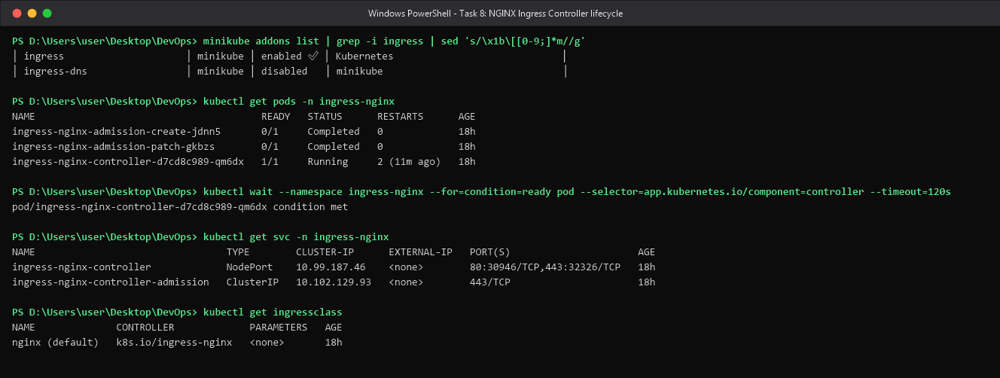

**What happened / why.** The addon installs three things. (1) The **controller Deployment**, whose
pod is `1/1 Running` — this is the data plane. (2) Two **admission Jobs** (`…-create`,
`…-patch`) that are `0/1 Completed`, not failures: they are one-shot jobs that generate the
webhook's self-signed certificate and patch it into the `ValidatingWebhookConfiguration`'s
`caBundle`. (3) Two **Services** — `ingress-nginx-controller` (`NodePort`, exposing `80:30946` and
`443:32326`) and `ingress-nginx-controller-admission` (`ClusterIP :443`, used only by the API
server to call the webhook). `EXTERNAL-IP <none>` is expected on minikube: there is no cloud load
balancer, and the minikube addon additionally binds the controller to **hostPorts 80/443 on the
node**, which is what makes the `minikube ssh -- curl http://localhost/` tests in Tasks 10–13 work.
`kubectl wait --for=condition=ready` is the scriptable readiness gate — it returned
`pod/... condition met`, and in CI it is what you put between "install ingress" and "run smoke
tests" so the pipeline never races the controller's startup.

---

## Task 9 — Local DNS Resolution & System Hosts File Mapping

**Objective:** map the minikube IP to the lab hostnames so a browser/curl on the workstation can
reach them.

> **Could not be applied in this environment — documented instead.**
> Editing `C:\Windows\System32\drivers\etc\hosts` (the Windows equivalent of `/etc/hosts`) requires
> an **elevated / Run-as-Administrator** shell. This session runs unelevated, and elevating was out
> of scope, so the mapping is documented exactly and the *reason* is proven with real output below.
> A working host-side alternative that needs no admin rights is shown afterwards.

```bash
minikube ip
grep -v '^#' /c/Windows/System32/drivers/etc/hosts | grep .
powershell.exe -NoProfile -Command "([Security.Principal.WindowsPrincipal][Security.Principal.WindowsIdentity]::GetCurrent()).IsInRole([Security.Principal.WindowsBuiltInRole]::Administrator)"
printf '' >> /c/Windows/System32/drivers/etc/hosts && echo 'append allowed' || echo 'append DENIED - Administrator required'
echo "$(minikube ip)  yatri.local portal.campus.local api.campus.local secure.campus.local"
ping -n 1 -w 3000 $(minikube ip)
```

```
192.168.49.2

# Copyright (c) 1993-2009 Microsoft Corp.
100.129.161.51 host.docker.internal
100.129.161.51 gateway.docker.internal
127.0.0.1 kubernetes.docker.internal

False                                           <- shell is NOT elevated

/c/Windows/System32/drivers/etc/hosts: Permission denied
append DENIED - Administrator required          <- zero-byte, non-destructive write probe

192.168.49.2  yatri.local portal.campus.local api.campus.local secure.campus.local

Ping statistics for 192.168.49.2:
    Packets: Sent = 1, Received = 0, Lost = 1 (100% loss),
```

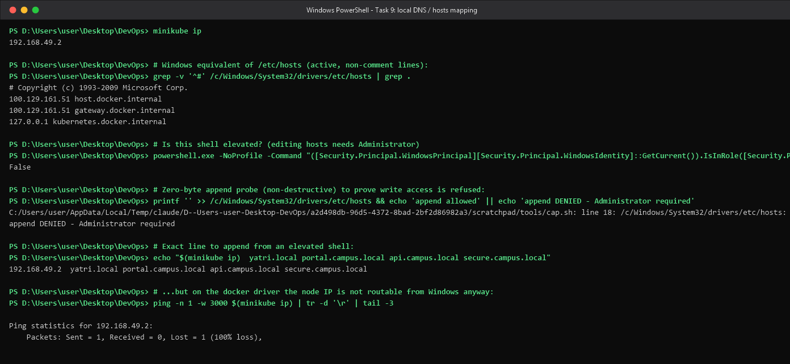

### The exact line a student must add

Open **Notepad as Administrator** (or `sudo nano /etc/hosts` on Linux/macOS) and append to
`C:\Windows\System32\drivers\etc\hosts`:

```
192.168.49.2  yatri-s12.local portal.campus-s12.local api.campus-s12.local secure.campus-s12.local
```

On Linux/macOS the assignment's one-liner is:

```bash
MINIKUBE_IP=$(minikube ip)
echo "${MINIKUBE_IP}  yatri.local" | sudo tee -a /etc/hosts
grep "yatri.local" /etc/hosts
```

### Why the hosts entry alone still would not work here

The ping above is the proof: with the **docker driver on Windows**, minikube's node runs inside a
Docker Desktop Linux VM on a bridge network that is **not routed from the Windows host**, so
`192.168.49.2` is unreachable no matter what `hosts` says. Name resolution is only half the
problem — you also need a route. On this platform the practical options are `minikube tunnel`
(needs Administrator and blocks a terminal) or `kubectl port-forward` (no admin needed).

### Bonus — host-side verification with `kubectl port-forward` (no admin rights)

```bash
kubectl port-forward -n ingress-nginx svc/ingress-nginx-controller 18080:80 &
curl -s -o /dev/null -w 'portal.campus-s12.local -> HTTP %{http_code}\n' -H 'Host: portal.campus-s12.local' http://127.0.0.1:18080/
curl -s -H 'Host: portal.campus-s12.local' http://127.0.0.1:18080/ | grep -i title
curl -s -H 'Host: api.campus-s12.local'    http://127.0.0.1:18080/ | grep -E -i 'title|ENVIRONMENT'
curl -s -H 'Host: yatri-s12.local'         http://127.0.0.1:18080/api/ | grep -E -i 'SERVED_BY|POSTGRES_USER'
```

```
portal.campus-s12.local -> HTTP 200
<title>Welcome to nginx!</title>
<html><head><title>Yatri Backend API</title></head><body>
ENVIRONMENT:      production
SERVED_BY:        yatri-backend-7c44769979-th547
POSTGRES_USER:    yatri_admin
```

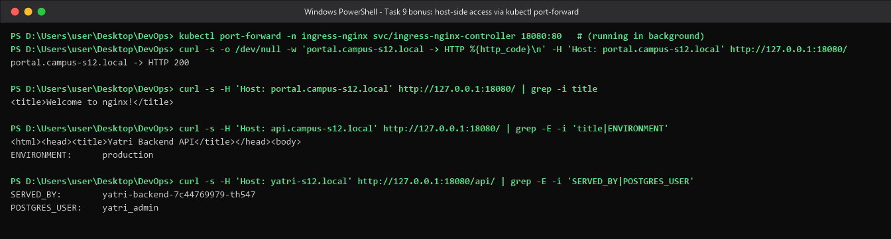

**What happened / why.** A `hosts` entry does exactly one thing: it short-circuits DNS so that
`yatri.local` resolves to the ingress IP. The HTTP `Host:` header is then set automatically by the
browser/curl, and it is that header the NGINX controller uses to choose a virtual host. `curl -H
"Host: …"` (used throughout Tasks 10–13) simulates the same thing *without* touching `hosts` — the
routing behaviour proven there is identical to what a student with an edited hosts file would see
in a browser. The port-forward run above shows the whole chain working from the Windows side:
Windows `127.0.0.1:18080` -> port-forward tunnel -> `ingress-nginx-controller:80` -> host-based
routing -> the right pod.

---

## Task 10 — Layer 7 Path-Based Routing Implementation

**Objective:** route `/` and `/api/*` of a single hostname to two different Services, stripping the
`/api` prefix with an NGINX rewrite.

**Manifest:** [`manifests/04-ingress-path/ingress-path.yaml`](./manifests/04-ingress-path/ingress-path.yaml)

```yaml
apiVersion: networking.k8s.io/v1
kind: Ingress
metadata:
  name: yatri-ingress
  namespace: s12-lab
  labels:
    app: yatri-app
  annotations:
    nginx.ingress.kubernetes.io/use-regex: "true"
    nginx.ingress.kubernetes.io/rewrite-target: /$2
spec:
  ingressClassName: nginx
  rules:
    - host: yatri-s12.local
      http:
        paths:
          - path: /api(/|$)(.*)
            pathType: ImplementationSpecific
            backend:
              service:
                name: yatri-backend-svc
                port: {number: 80}
          - path: /()(.*)
            pathType: ImplementationSpecific
            backend:
              service:
                name: yatri-frontend-svc
                port: {number: 80}
```

```bash
kubectl apply -f 04-ingress-path/ingress-path.yaml
kubectl get ingress yatri-ingress -n s12-lab
kubectl describe ingress yatri-ingress -n s12-lab | head -25
```

```
ingress.networking.k8s.io/yatri-ingress unchanged

NAME            CLASS   HOSTS             ADDRESS        PORTS   AGE
yatri-ingress   nginx   yatri-s12.local   192.168.49.2   80      42s

Name:             yatri-ingress
Labels:           app=yatri-app
Namespace:        s12-lab
Address:          192.168.49.2
Ingress Class:    nginx
Default backend:  <default>
Rules:
  Host             Path  Backends
  ----             ----  --------
  yatri-s12.local
                   /api(/|$)(.*)   yatri-backend-svc:80 (10.244.0.35:80)
                   /()(.*)         yatri-frontend-svc:80 (10.244.0.30:80)
Annotations:       nginx.ingress.kubernetes.io/rewrite-target: /$2
                   nginx.ingress.kubernetes.io/use-regex: true
Events:
  Type    Reason  Age                From                      Message
  ----    ------  ----               ----                      -------
  Normal  Sync    31s (x2 over 43s)  nginx-ingress-controller  Scheduled for sync
```

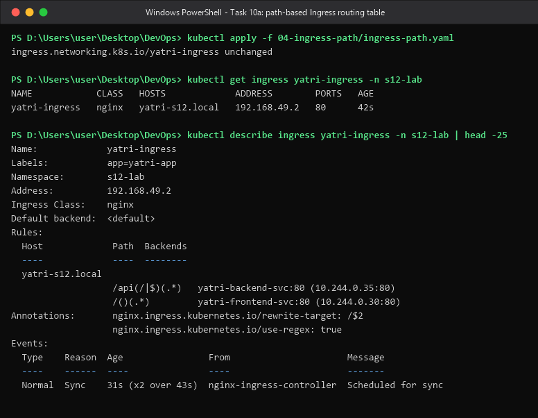

### End-to-end test through the real ingress controller

```bash
minikube ssh -- "curl -s -o /dev/null -w 'HTTP %{http_code}\n' -H 'Host: yatri-s12.local' http://localhost/"
minikube ssh -- "curl -s -H 'Host: yatri-s12.local' http://localhost/"     | grep -i title
minikube ssh -- "curl -s -H 'Host: yatri-s12.local' http://localhost/api/" | sed -n '1,11p'
minikube ssh -- "curl -s -o /dev/null -w 'unknown host -> HTTP %{http_code}\n' -H 'Host: nope.local' http://localhost/"
```

```
HTTP 200

<title>Welcome to nginx!</title>

<html><head><title>Yatri Backend API</title></head><body>
<h1>Yatri Backend API</h1>
<pre>
SERVED_BY:        yatri-backend-7c44769979-th547
ENVIRONMENT:      production
LOG_LEVEL:        INFO
PORT:             8080
DEFAULT_CURRENCY: INR
MAX_BOOKING_DAYS: 90
POSTGRES_USER:    yatri_admin
POSTGRES_PASSWORD:secretpassword

unknown host -> HTTP 404
```

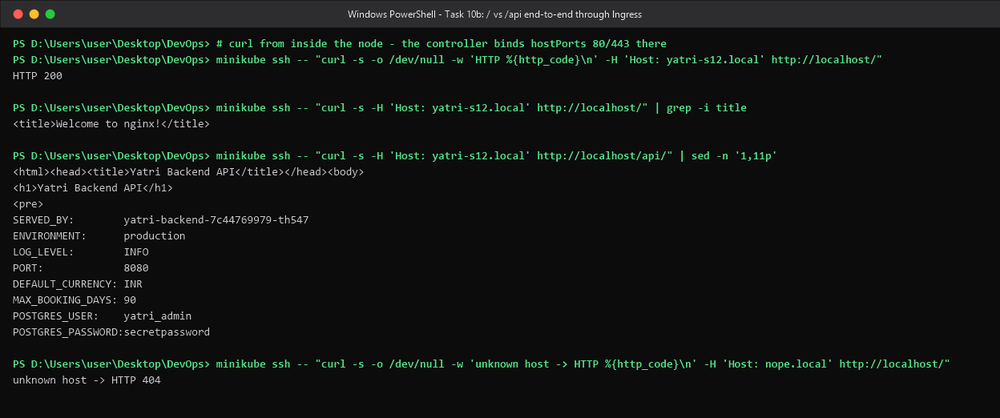

**What happened / why.** One hostname, one IP, one port — the *path* selects the Service. NGINX
matches location blocks in order of specificity, so `/api(/|$)(.*)` wins for `/api/...` and the
catch-all takes everything else. The rewrite is the subtle part: `rewrite-target: /$2` rebuilds the
upstream URI from capture group **2**, so `/api/orders` becomes `/orders` and the backend never sees
the `/api` prefix — that is why the backend's root `index.html` is returned for `/api/`. Because the
annotation applies to *every* rule in the resource, the frontend path is written `/()(.*)` rather
than plain `/`: it is functionally a prefix match but supplies an empty `$1` and a real `$2` so that
`/$2` is still well-defined. `use-regex: "true"` plus `pathType: ImplementationSpecific` is what
allows those regexes at all. Finally, the `nope.local` request returning **404** confirms the
controller is genuinely host-aware: an unmatched Host header falls through to the default backend
rather than leaking into someone else's app. `describe` also resolves each backend to live pod IPs
(`10.244.0.35:80`) — ingress-nginx proxies straight to pod endpoints, bypassing the ClusterIP.

---

## Task 11 — Virtual Host-Based Routing (Subdomain Routing)

**Objective:** serve two different Services from two hostnames that share one ingress IP and port.

**Manifest:** [`manifests/05-ingress-host/ingress-host.yaml`](./manifests/05-ingress-host/ingress-host.yaml)

```yaml
apiVersion: networking.k8s.io/v1
kind: Ingress
metadata:
  name: campus-ingress-host
  namespace: s12-lab
  labels:
    app: yatri-app
spec:
  ingressClassName: nginx
  rules:
    - host: portal.campus-s12.local
      http:
        paths:
          - path: /
            pathType: Prefix
            backend:
              service:
                name: yatri-frontend-svc
                port: {number: 80}
    - host: api.campus-s12.local
      http:
        paths:
          - path: /
            pathType: Prefix
            backend:
              service:
                name: yatri-backend-svc
                port: {number: 80}
```

```bash
kubectl apply -f 05-ingress-host/ingress-host.yaml
kubectl get ingress campus-ingress-host -n s12-lab
kubectl describe ingress campus-ingress-host -n s12-lab | sed -n '1,16p'
minikube ssh -- "curl -s -H 'Host: portal.campus-s12.local' http://localhost/" | grep -i title
minikube ssh -- "curl -s -H 'Host: api.campus-s12.local'    http://localhost/" | grep -E -i 'title|ENVIRONMENT|POSTGRES_USER'
```

```
ingress.networking.k8s.io/campus-ingress-host created

NAME                  CLASS   HOSTS                                          ADDRESS        PORTS   AGE
campus-ingress-host   nginx   portal.campus-s12.local,api.campus-s12.local   192.168.49.2   80      20s

Name:             campus-ingress-host
Labels:           app=yatri-app
Namespace:        s12-lab
Address:          192.168.49.2
Ingress Class:    nginx
Default backend:  <default>
Rules:
  Host                     Path  Backends
  ----                     ----  --------
  portal.campus-s12.local
                           /   yatri-frontend-svc:80 (10.244.0.30:80)
  api.campus-s12.local
                           /   yatri-backend-svc:80 (10.244.0.35:80)
Annotations:               <none>

<title>Welcome to nginx!</title>

<html><head><title>Yatri Backend API</title></head><body>
ENVIRONMENT:      production
POSTGRES_USER:    yatri_admin
```

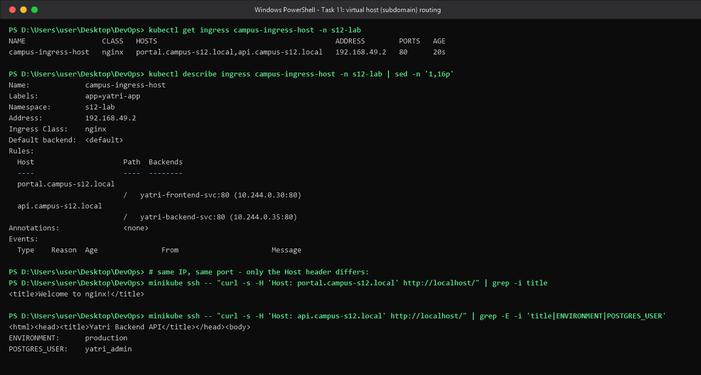

**What happened / why.** Both hostnames show the **same** `ADDRESS 192.168.49.2` and the same port
80, and the two curl calls differ *only* in the `Host:` header — yet they land on different
Services. The controller renders one nginx `server { server_name … }` block per `host:` rule, so
selection happens on the HTTP Host header, exactly like classic Apache/NGINX virtual hosting. No
rewrite annotation is needed here because both rules serve `/` and the backend receives the URI
unchanged. This is the standard multi-tenant / per-team pattern (`portal.` for the UI, `api.` for
the service), and it means adding a tenant costs one more rule rather than one more LoadBalancer.

---

## Task 12 — Hybrid Ingress Routing Architecture

**Objective:** combine host-based *and* path-based routing inside a single Ingress and prove traffic
isolation across all four host+path combinations.

> `campus-ingress-host` from Task 11 was deleted first: the ingress-nginx admission webhook refuses
> to register the same `host + path` twice, which is itself a nice demonstration of Task 7's
> controller-side validation.

**Manifest:** [`manifests/06-ingress-hybrid/ingress-hybrid.yaml`](./manifests/06-ingress-hybrid/ingress-hybrid.yaml)

```yaml
apiVersion: networking.k8s.io/v1
kind: Ingress
metadata:
  name: campus-ingress-hybrid
  namespace: s12-lab
  labels:
    app: yatri-app
  annotations:
    nginx.ingress.kubernetes.io/use-regex: "true"
    nginx.ingress.kubernetes.io/rewrite-target: /$2
spec:
  ingressClassName: nginx
  rules:
    - host: portal.campus-s12.local
      http:
        paths:
          - path: /api(/|$)(.*)
            pathType: ImplementationSpecific
            backend: {service: {name: yatri-backend-svc,  port: {number: 80}}}
          - path: /()(.*)
            pathType: ImplementationSpecific
            backend: {service: {name: yatri-frontend-svc, port: {number: 80}}}
    - host: api.campus-s12.local
      http:
        paths:
          - path: /ui(/|$)(.*)
            pathType: ImplementationSpecific
            backend: {service: {name: yatri-frontend-svc, port: {number: 80}}}
          - path: /()(.*)
            pathType: ImplementationSpecific
            backend: {service: {name: yatri-backend-svc,  port: {number: 80}}}
```

```bash
kubectl delete ingress campus-ingress-host -n s12-lab
kubectl apply  -f 06-ingress-hybrid/ingress-hybrid.yaml
kubectl get      ingress campus-ingress-hybrid -n s12-lab
kubectl describe ingress campus-ingress-hybrid -n s12-lab | sed -n '1,20p'
```

```
ingress.networking.k8s.io "campus-ingress-host" deleted from s12-lab namespace
ingress.networking.k8s.io/campus-ingress-hybrid created

NAME                    CLASS   HOSTS                                          ADDRESS   PORTS   AGE
campus-ingress-hybrid   nginx   portal.campus-s12.local,api.campus-s12.local             80      26s

Name:             campus-ingress-hybrid
Labels:           app=yatri-app
Namespace:        s12-lab
Address:
Ingress Class:    nginx
Default backend:  <default>
Rules:
  Host                     Path  Backends
  ----                     ----  --------
  portal.campus-s12.local
                           /api(/|$)(.*)   yatri-backend-svc:80 (10.244.0.35:80)
                           /()(.*)         yatri-frontend-svc:80 (10.244.0.30:80)
  api.campus-s12.local
                           /ui(/|$)(.*)   yatri-frontend-svc:80 (10.244.0.30:80)
                           /()(.*)        yatri-backend-svc:80 (10.244.0.35:80)
Annotations:               nginx.ingress.kubernetes.io/rewrite-target: /$2
                           nginx.ingress.kubernetes.io/use-regex: true
```

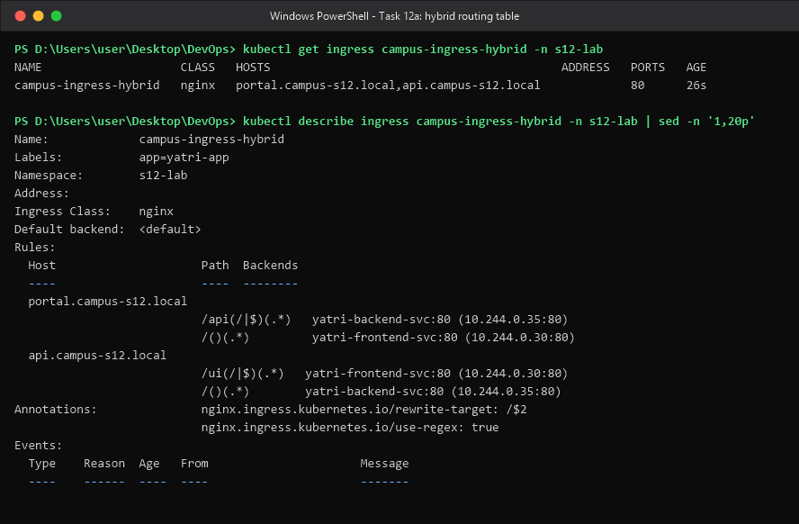

### Traffic-isolation matrix — 2 hosts x 2 paths, one Ingress object

```bash
for h in 'portal.campus-s12.local /' 'portal.campus-s12.local /api/' \
         'api.campus-s12.local /'    'api.campus-s12.local /ui/'; do
  set -- $h
  printf '%-28s %-7s -> ' "$1" "$2"
  minikube ssh -- "curl -s -H 'Host: $1' http://localhost$2" | grep -o -i '<title>[^<]*' | head -1
done
```

```
portal.campus-s12.local      /       -> <title>Welcome to nginx!
portal.campus-s12.local      /api/   -> <title>Yatri Backend API
api.campus-s12.local         /       -> <title>Yatri Backend API
api.campus-s12.local         /ui/    -> <title>Welcome to nginx!
```

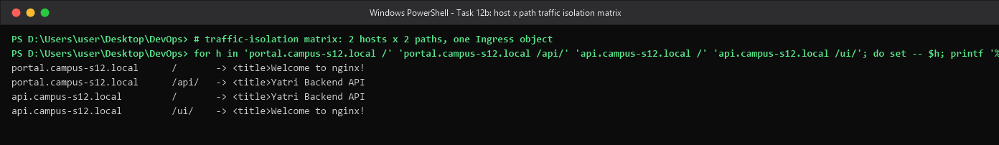

**What happened / why.** The four results are all different in the right way, which is the whole
point: the controller evaluates the `Host` header **first** to pick the virtual server, then matches
the URI **within** that server. That is why the *same* path `/` produces the frontend on
`portal.` and the backend on `api.` — the paths are scoped per host, not globally. The mirrored
`/api` and `/ui` prefixes show the two dimensions composing freely, and the shared
`rewrite-target: /$2` strips whichever prefix matched. Note that `ADDRESS` is still blank in the
`get` output taken seconds after apply and is populated later — the controller's status write-back
is asynchronous, so an empty ADDRESS immediately after `kubectl apply` is not an error.

---

## Task 13 — Ingress TLS/HTTPS Termination & Secret Binding

**Objective:** generate a self-signed certificate, store it as a `kubernetes.io/tls` Secret, bind it
through `spec.tls`, and verify HTTPS termination on port 443.

```bash
openssl req -x509 -nodes -days 365 -newkey rsa:2048 \
  -keyout tls.key -out tls.crt \
  -subj "/CN=secure.campus-s12.local/O=CampusDevOps" \
  -addext "subjectAltName=DNS:secure.campus-s12.local"

kubectl create secret tls campus-tls-cert -n s12-lab --cert=tls.crt --key=tls.key
kubectl apply -f 07-ingress-tls/ingress-tls.yaml
```

**Manifest:** [`manifests/07-ingress-tls/ingress-tls.yaml`](./manifests/07-ingress-tls/ingress-tls.yaml)

```yaml
apiVersion: networking.k8s.io/v1
kind: Ingress
metadata:
  name: campus-ingress-tls
  namespace: s12-lab
  labels:
    app: yatri-app
  annotations:
    nginx.ingress.kubernetes.io/ssl-redirect: "true"
spec:
  ingressClassName: nginx
  tls:
    - hosts:
        - secure.campus-s12.local
      secretName: campus-tls-cert
  rules:
    - host: secure.campus-s12.local
      http:
        paths:
          - path: /
            pathType: Prefix
            backend:
              service:
                name: yatri-frontend-svc
                port: {number: 80}
```

```
secret/campus-tls-cert created
ingress.networking.k8s.io/campus-ingress-tls created

subject=CN=secure.campus-s12.local, O=CampusDevOps
issuer=CN=secure.campus-s12.local, O=CampusDevOps
notBefore=Sep 18 05:00:40 2026 GMT
notAfter=Sep 18 05:00:40 2027 GMT
X509v3 Subject Alternative Name:
    DNS:secure.campus-s12.local

NAME              TYPE                DATA   AGE
campus-tls-cert   kubernetes.io/tls   2      40s

Type:  kubernetes.io/tls

Data
====
tls.crt:  1282 bytes
tls.key:  1732 bytes

NAME                 CLASS   HOSTS                     ADDRESS        PORTS     AGE
campus-ingress-tls   nginx   secure.campus-s12.local   192.168.49.2   80, 443   40s

Name:             campus-ingress-tls
Labels:           app=yatri-app
Namespace:        s12-lab
Address:          192.168.49.2
Ingress Class:    nginx
Default backend:  <default>
TLS:
  campus-tls-cert terminates secure.campus-s12.local
Rules:
  Host                     Path  Backends
  ----                     ----  --------
  secure.campus-s12.local
                           /   yatri-frontend-svc:80 (10.244.0.30:80)
Annotations:               nginx.ingress.kubernetes.io/ssl-redirect: true
```

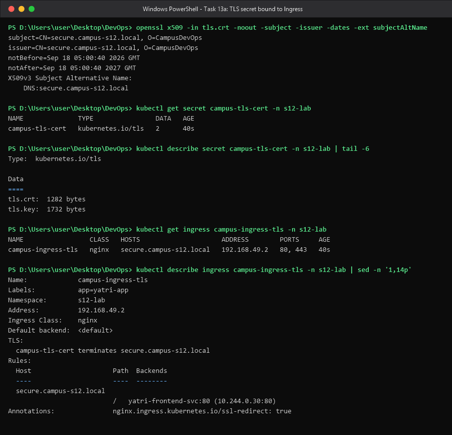

### Verifying the handshake

```bash
minikube ssh -- "curl -sk -o /dev/null -w 'https -> HTTP %{http_code}\n' -H 'Host: secure.campus-s12.local' https://localhost/"
minikube ssh -- "curl -s  -o /dev/null -w 'http  -> HTTP %{http_code} (ssl-redirect)\n' -H 'Host: secure.campus-s12.local' http://localhost/"
minikube ssh -- "curl -skv --resolve secure.campus-s12.local:443:127.0.0.1 https://secure.campus-s12.local/ 2>&1 | grep -E 'SSL connection|subject:|issuer:|ALPN: server|HTTP/2 '"
minikube ssh -- "curl -sk -H 'Host: secure.campus-s12.local' https://localhost/" | grep -i title
```

```
https -> HTTP 200
http  -> HTTP 308 (ssl-redirect)

* SSL connection using TLSv1.3 / TLS_AES_256_GCM_SHA384
* ALPN: server accepted h2
*  subject: CN=secure.campus-s12.local; O=CampusDevOps
*  issuer: CN=secure.campus-s12.local; O=CampusDevOps
< HTTP/2 200

<title>Welcome to nginx!</title>
```

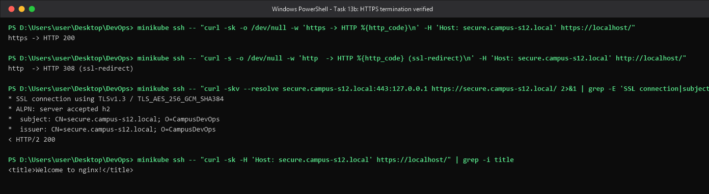

**What happened / why.** `kubectl create secret tls` produces a typed `kubernetes.io/tls` Secret,
which (unlike `Opaque`) is schema-validated to contain exactly the keys `tls.crt` and `tls.key` —
visible as `DATA 2` and the two byte counts. `spec.tls` binds that Secret to a hostname, and
`describe` states it plainly: `campus-tls-cert terminates secure.campus-s12.local`. The PORTS column
flips from `80` to `80, 443` once TLS is configured. The handshake output is the real proof: the
served certificate's `subject`/`issuer` are identical (self-signed), TLS 1.3 was negotiated, and
ALPN upgraded to HTTP/2 — `HTTP/2 200`. `-k` is required only because the CA is not trusted; in
production cert-manager would issue a real Let's Encrypt certificate into the very same Secret,
with no change to the Ingress manifest. The plain-HTTP request returning **308 Permanent Redirect**
shows `ssl-redirect: "true"` at work. Note the architecture: TLS is **terminated at the ingress**,
and the hop from controller to `yatri-frontend-svc:80` is plain HTTP inside the cluster network
(a service mesh or `backend-protocol: HTTPS` would be needed for end-to-end encryption).

> **The private key was deliberately not kept in this submission.** Only `certs/tls.crt` is
> retained; `tls.key` was deleted after the lab. Re-run the `openssl` command above to regenerate
> the pair. Committing a private key — even a throw-away one — is the habit Task 5 argues against.

---

## Bonus Task 14 — End-to-End Integration & Automation Scripting

**Objective:** deploy the whole Session 12 stack with one script, audit it with one command, and
tear it down with another.

**Scripts:** [`manifests/08-full-demo/run-demo.sh`](./manifests/08-full-demo/run-demo.sh) ·
[`manifests/08-full-demo/cleanup.sh`](./manifests/08-full-demo/cleanup.sh)

```bash
bash 08-full-demo/run-demo.sh
```

```
service/yatri-frontend-svc unchanged
==> Ingress routing
ingress.networking.k8s.io/yatri-ingress unchanged
ingress.networking.k8s.io/campus-ingress-hybrid unchanged
==> Waiting for rollouts
deployment "yatri-backend" successfully rolled out
deployment "yatri-frontend" successfully rolled out
==> Stack:
NAME                         DATA   AGE
configmap/yatri-app-config   5      11m

NAME                     TYPE     DATA   AGE
secret/yatri-db-secret   Opaque   2      11m

NAME                             READY   UP-TO-DATE   AVAILABLE   AGE
deployment.apps/yatri-backend    1/1     1            1           11m
deployment.apps/yatri-frontend   1/1     1            1           11m

NAME                         TYPE        CLUSTER-IP       EXTERNAL-IP   PORT(S)   AGE
service/yatri-backend-svc    ClusterIP   10.101.219.7     <none>        80/TCP    11m
service/yatri-frontend-svc   ClusterIP   10.111.151.216   <none>        80/TCP    11m

NAME                                              CLASS   HOSTS                                          ADDRESS        PORTS     AGE
ingress.networking.k8s.io/campus-ingress-hybrid   nginx   portal.campus-s12.local,api.campus-s12.local   192.168.49.2   80        2m55s
ingress.networking.k8s.io/campus-ingress-tls      nginx   secure.campus-s12.local                        192.168.49.2   80, 443   115s
ingress.networking.k8s.io/yatri-ingress           nginx   yatri-s12.local                                192.168.49.2   80        4m38s

NAME                                  READY   STATUS    RESTARTS   AGE
pod/yatri-backend-7c44769979-th547    1/1     Running   0          9m14s
pod/yatri-frontend-7cdf6977bd-txv6p   1/1     Running   0          11m
```

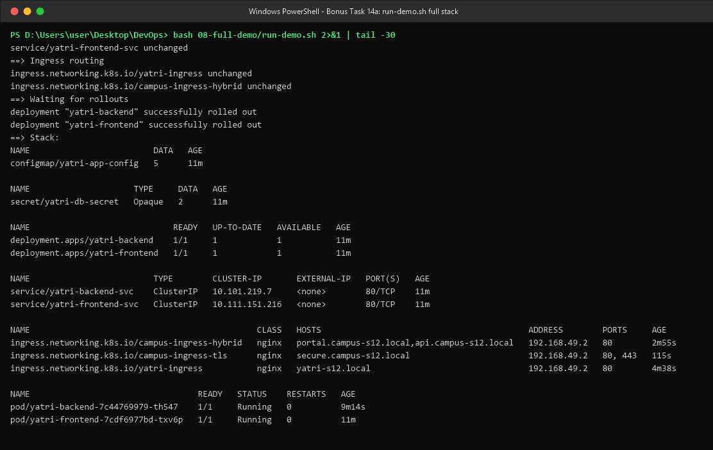

```bash
bash 08-full-demo/cleanup.sh
kubectl get ingress,deploy,svc -n s12-lab
```

```
ingress.networking.k8s.io "campus-ingress-hybrid" deleted from s12-lab namespace
ingress.networking.k8s.io "campus-ingress-tls" deleted from s12-lab namespace
ingress.networking.k8s.io "yatri-ingress" deleted from s12-lab namespace
deployment.apps "yatri-backend" deleted from s12-lab namespace
deployment.apps "yatri-frontend" deleted from s12-lab namespace
service "yatri-backend-svc" deleted from s12-lab namespace
service "yatri-frontend-svc" deleted from s12-lab namespace
configmap "yatri-app-config" deleted from s12-lab namespace
secret "yatri-db-secret" deleted from s12-lab namespace
secret "campus-tls-cert" deleted from s12-lab namespace
==> Remaining in s12-lab:
NAME                                  READY   STATUS      RESTARTS   AGE
pod/yatri-backend-7c44769979-th547    0/1     Completed   0          9m28s
pod/yatri-frontend-7cdf6977bd-txv6p   0/1     Completed   0          11m

No resources found in s12-lab namespace.
```

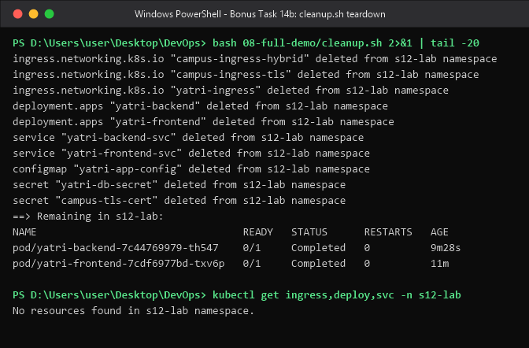

**What happened / why.** The whole stack is six manifests applied in dependency order — ConfigMap
and Secret first, because a pod referencing a missing ConfigMap would sit in
`CreateContainerConfigError`. `kubectl apply` is idempotent, hence the `unchanged` lines on a
re-run: that is the declarative model, where the script states the desired end state instead of a
sequence of mutations. `kubectl rollout status` is the script's synchronisation barrier so it never
reports success before the pods are actually ready. Both `backend.yaml` and `frontend.yaml` use
**multi-document YAML** — a `---` separator co-locating the `Deployment` and its `Service` in one
file, applied as a unit, which keeps a microservice's parts together. During teardown the pods show
transiently as `Completed` because deleting the Deployment removes the controller first and the
pods are then reaped asynchronously; the follow-up `kubectl get` confirms an empty namespace.

**Final teardown of the lab namespace:**

```bash
kubectl delete namespace s12-lab
```

The shared `ingress-nginx` namespace and the minikube addon were left untouched.

---

## Key Learnings

**Configuration and secrets**

1. **ConfigMaps decouple config from images.** The same image ships to dev/stage/prod; only the
   ConfigMap changes. Values are plain text, so a ConfigMap is for settings, never credentials.
2. **Env vars are a snapshot, volumes are a stream.** An env var is resolved once at container
   creation and can never change for that process — measured directly in Task 2. A ConfigMap mounted
   as a volume is re-synced by the kubelet (~60 s here, via an atomic `..data` symlink swap). Hot
   reload therefore requires a volume mount *and* an app that watches the file; otherwise
   `kubectl rollout restart` is the correct, zero-downtime way to reload.
3. **Base64 is encoding, not encryption.** `describe secret` masks values to byte counts, but one
   `kubectl get -o jsonpath | base64 -d` reveals them. Real protection = RBAC + etcd
   encryption-at-rest + keeping the material out of Git. Anyone with `kubectl exec` can read the
   env, so `exec` rights are effectively secret-read rights.
4. **One invisible byte breaks authentication.** `echo` appends `0x0A`; `echo -n` does not. The
   corruption is invisible in YAML, survives into the container (15 vs 14 bytes) and surfaces as
   "the password is right but auth fails". Use `echo -n`, `printf '%s'`, or
   `kubectl create secret --from-literal`. The `=` padding versus a trailing letter in the Base64
   string is the visual tell.
5. **Production keeps secrets outside the repo.** External Secrets Operator / Vault Agent Injector /
   Secrets Store CSI sync from AWS Secrets Manager, Azure Key Vault or Vault into short-lived
   Kubernetes Secrets; Git holds only a reference. Pipelines inject at deploy time via GitHub
   Actions OIDC or Azure DevOps Variable Groups linked to Key Vault. A leaked secret must be
   **rotated**, not merely deleted from the branch.
6. **Bulk vs granular injection are different tools.** `envFrom.configMapRef` imports everything and
   scales effortlessly; `env.valueFrom.secretKeyRef` names each credential explicitly, which keeps
   the credential surface auditable and allows renaming.

**Ingress**

7. **The Ingress resource is inert; the controller is the engine.** The rules are a Layer 7
   specification stored in etcd; the controller watches the API, renders `nginx.conf`, reloads, and
   writes the `ADDRESS` back. `IngressClass` (`nginx` -> `k8s.io/ingress-nginx`) is the binding
   between them. The admission webhook rejecting a duplicate `host + path` proved the split live.
8. **One entry point, many applications.** Host-based rules select a virtual server from the HTTP
   `Host:` header, path-based rules select a location inside it, and hybrid routing composes both —
   all sharing a single IP and port, which is the entire economic argument for Ingress over a
   LoadBalancer per service.
9. **Rewrites need capture groups.** `rewrite-target: /$2` with `use-regex: "true"` and
   `pathType: ImplementationSpecific` strips a prefix; because the annotation applies to every rule
   in the resource, even the catch-all path must be written `/()(.*)` so `$2` exists.
10. **TLS terminates at the edge.** A `kubernetes.io/tls` Secret bound via `spec.tls` makes the
    controller serve the certificate on 443 and proxy plain HTTP inside the cluster;
    `ssl-redirect` turns HTTP into a 308. Swapping self-signed for cert-manager/Let's Encrypt is a
    change to the Secret, not to the Ingress.
11. **Name resolution and routing are separate problems.** A hosts entry only makes the name
    resolve; you still need a route to the ingress IP. On the Windows docker driver the node IP is
    unreachable, so `kubectl port-forward` (no admin) or `minikube tunnel` (admin) is the practical
    path — and `curl -H "Host: ..."` reproduces the routing behaviour without touching `hosts` at all.
12. **Namespacing is what makes a shared cluster survivable.** Everything here lived in `s12-lab`,
    and the one collision that did occur was a *cluster-scoped* one — a duplicate ingress hostname —
    which is a real-world reminder that ingress hostnames are a global namespace even when the
    Ingress objects are not.
