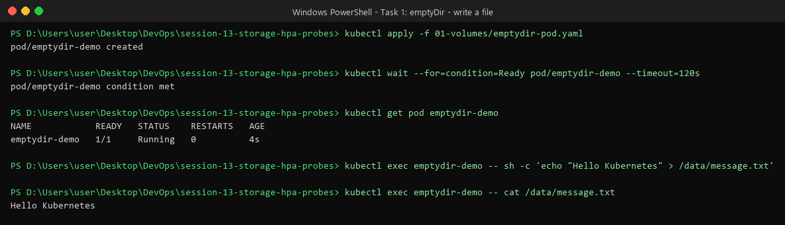
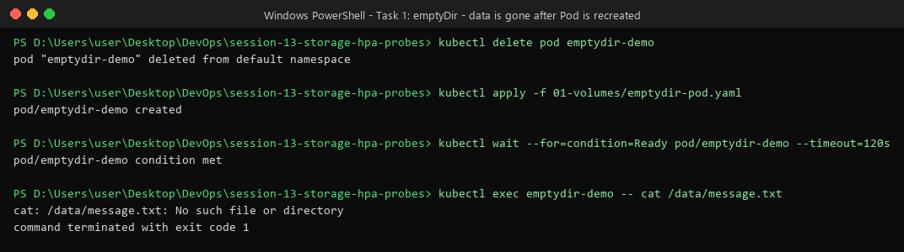
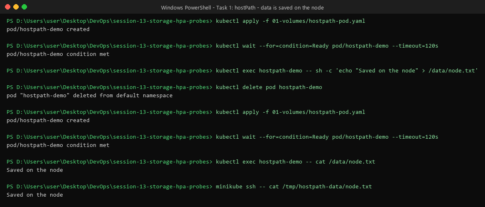
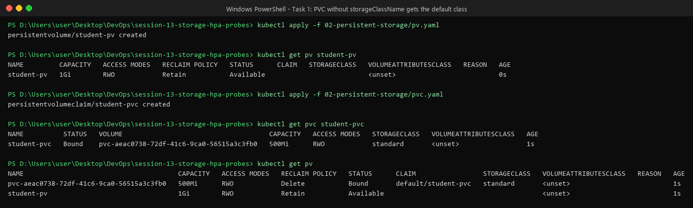
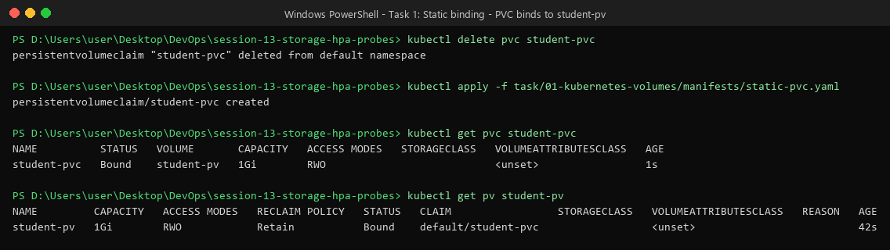
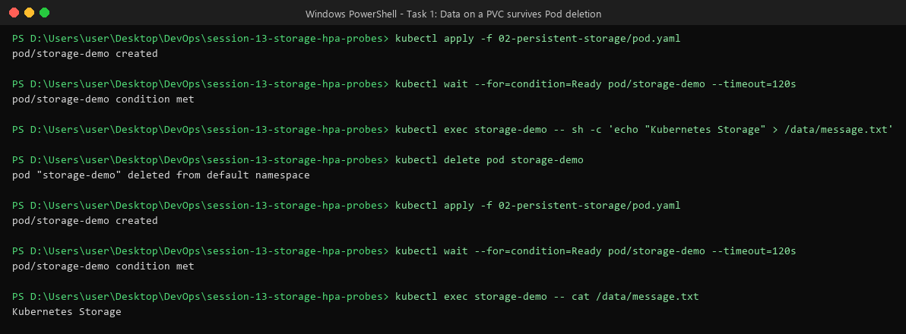
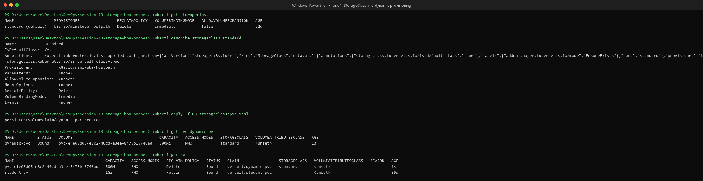
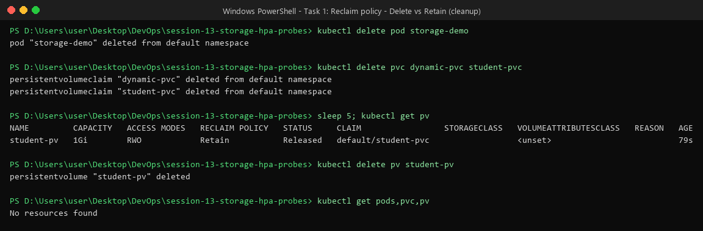

# Task 1 — Kubernetes Volumes

This file explains what I learned about storage in Kubernetes, in simple words.
I ran every example on a **minikube** cluster and saved the real output as screenshots.

The YAML files I used are the ones that already exist in this session:

| Topic | Files used |
| :--- | :--- |
| emptyDir | [`01-volumes/emptydir-pod.yaml`](../../01-volumes/emptydir-pod.yaml) |
| hostPath | [`01-volumes/hostpath-pod.yaml`](../../01-volumes/hostpath-pod.yaml) |
| PV + PVC | [`02-persistent-storage/pv.yaml`](../../02-persistent-storage/pv.yaml), [`pvc.yaml`](../../02-persistent-storage/pvc.yaml), [`pod.yaml`](../../02-persistent-storage/pod.yaml) |
| StorageClass | [`03-storageclass/pvc.yaml`](../../03-storageclass/pvc.yaml) |
| Extra (made by me) | [`manifests/static-pvc.yaml`](./manifests/static-pvc.yaml) — see the "gotcha" in section 4 |

All commands below are run from the `session-13-storage-hpa-probes` folder.

---

## 0. Why do we need volumes at all?

A container has its own small filesystem. When the container is deleted, **everything written inside it is lost**.

A **volume** is extra storage that we "plug in" to a container at a folder path (for example `/data`).
Different volume types decide **how long** that data lives.

```text
Container  ──writes to──>  /data  ──is really──>  a Volume
```

Quick summary of the types:

| Type | Where data lives | Data survives Pod delete? | Good for |
| :--- | :--- | :--- | :--- |
| `emptyDir` | Inside the Pod (on the node) | ❌ No | Temporary files, cache, sharing files between containers in one Pod |
| `hostPath` | A folder on the node | ✅ Yes, but only on **that** node | Learning, local testing, node-level tools |
| PV + PVC | Real storage managed by the cluster | ✅ Yes | Databases, uploads — real app data |
| StorageClass | Creates PVs for you automatically | ✅ Yes | Production clusters (cloud disks) |

---

## 1. emptyDir

**What it is:** an empty folder that Kubernetes creates **when the Pod starts**.
All containers in that same Pod can read and write it.

**Lifetime:** same as the Pod. Container restart → data stays. **Pod deleted → data is gone.**

```yaml
volumes:
  - name: app-storage
    emptyDir: {}          # empty folder, lives as long as the Pod
```

### Practical: write a file

```bash
kubectl apply -f 01-volumes/emptydir-pod.yaml
kubectl exec emptydir-demo -- sh -c 'echo "Hello Kubernetes" > /data/message.txt'
kubectl exec emptydir-demo -- cat /data/message.txt
```



### Practical: delete the Pod and check again

```bash
kubectl delete pod emptydir-demo
kubectl apply -f 01-volumes/emptydir-pod.yaml
kubectl exec emptydir-demo -- cat /data/message.txt
```



**Result:** `No such file or directory` — the new Pod got a brand new, empty folder.

---

## 2. hostPath

**What it is:** mounts a folder **from the node (the machine)** into the Pod.

```yaml
volumes:
  - name: host-storage
    hostPath:
      path: /tmp/hostpath-data      # folder on the node
      type: DirectoryOrCreate       # create it if it does not exist
```

### Practical: data stays on the node

```bash
kubectl apply -f 01-volumes/hostpath-pod.yaml
kubectl exec hostpath-demo -- sh -c 'echo "Saved on the node" > /data/node.txt'
kubectl delete pod hostpath-demo
kubectl apply -f 01-volumes/hostpath-pod.yaml
kubectl exec hostpath-demo -- cat /data/node.txt
minikube ssh -- cat /tmp/hostpath-data/node.txt      # look at the node directly
```



**Result:** the file is still there after the Pod is recreated, and we can see it on the node itself with `minikube ssh`.

**Why it is not used for real apps:**
- If the Pod moves to **another node**, the data does not move with it.
- It gives the Pod access to the node's files, which is a **security risk**.

---

## 3. PersistentVolume (PV) and PersistentVolumeClaim (PVC)

Think of it like renting storage:

| Object | Simple meaning | Who usually creates it |
| :--- | :--- | :--- |
| **PersistentVolume (PV)** | A piece of storage that exists in the cluster ("the flat") | Cluster admin (or a StorageClass, automatically) |
| **PersistentVolumeClaim (PVC)** | A request: "I need 500Mi, ReadWriteOnce" ("the rental request") | Developer |
| **Pod** | Uses the PVC by name | Developer |

```text
Pod ──uses──> PVC ──is bound to──> PV ──points to──> real storage
```

Kubernetes looks for a PV that matches the PVC (size, access mode, **storage class**) and **binds** them together. Status becomes `Bound`.

**Access modes:**

| Mode | Short | Meaning |
| :--- | :--- | :--- |
| ReadWriteOnce | RWO | Read/write from **one node** |
| ReadOnlyMany | ROX | Read-only from many nodes |
| ReadWriteMany | RWX | Read/write from many nodes |
| ReadWriteOncePod | RWOP | Read/write from **one Pod** only |

**Reclaim policy** (what happens to the PV when the PVC is deleted):
- `Retain` → PV and data are kept (status becomes `Released`). Admin cleans up by hand.
- `Delete` → PV and data are deleted automatically.

---

## 4. ⚠️ Gotcha I hit: the PVC did not bind to my PV

I applied `pv.yaml` (creates `student-pv`) and then `pvc.yaml` (creates `student-pvc`):

```bash
kubectl apply -f 02-persistent-storage/pv.yaml
kubectl apply -f 02-persistent-storage/pvc.yaml
kubectl get pvc student-pvc
kubectl get pv
```



**What happened:** `student-pvc` was bound to a **new** volume `pvc-aeac...`, and `student-pv` stayed `Available` (unused).

**Why:**
- `pvc.yaml` does not say which `storageClassName` to use.
- minikube has a **default StorageClass** called `standard`, so Kubernetes filled in `standard` for us.
- `student-pv` has **no** storage class. A PVC with class `standard` only matches PVs with class `standard`, so they did not match.
- Instead, the `standard` StorageClass **created a new PV automatically** (this is dynamic provisioning — see section 5).

**Fix:** set `storageClassName: ""` (empty) in the PVC. This means "do not use any StorageClass, give me a manually created PV".
I did this in a new file so the original stays unchanged: [`manifests/static-pvc.yaml`](./manifests/static-pvc.yaml)

```yaml
spec:
  storageClassName: ""     # <- the only difference from pvc.yaml
```

```bash
kubectl delete pvc student-pvc
kubectl apply -f task/01-kubernetes-volumes/manifests/static-pvc.yaml
kubectl get pvc student-pvc
kubectl get pv student-pv
```



Now `student-pvc` is `Bound` to `student-pv`. ✅ (Capacity shows `1Gi` because the PVC gets the whole PV, even though it asked for 500Mi.)

### Practical: data survives Pod deletion

```bash
kubectl apply -f 02-persistent-storage/pod.yaml
kubectl exec storage-demo -- sh -c 'echo "Kubernetes Storage" > /data/message.txt'
kubectl delete pod storage-demo
kubectl apply -f 02-persistent-storage/pod.yaml
kubectl exec storage-demo -- cat /data/message.txt
```



**Result:** the file is still there. The storage belongs to the PV, not to the Pod.

---

## 5. StorageClass

**What it is:** a "template" that says **what kind of storage** to create and **which provisioner** creates it.

Examples of provisioners:
- minikube → `k8s.io/minikube-hostpath`
- AWS → `ebs.csi.aws.com` (EBS disks)
- GCP → `pd.csi.storage.gke.io`

Important fields:

| Field | Meaning |
| :--- | :--- |
| `provisioner` | Who creates the storage |
| `reclaimPolicy` | `Delete` (default) or `Retain` |
| `volumeBindingMode` | `Immediate` = create PV right away; `WaitForFirstConsumer` = wait until a Pod uses the PVC (so the disk is made in the right zone) |
| `allowVolumeExpansion` | Can the PVC be made bigger later? |
| `(default)` annotation | Used when a PVC does not give a class |

Example StorageClass (for reference, AWS EBS):

```yaml
apiVersion: storage.k8s.io/v1
kind: StorageClass
metadata:
  name: fast-ssd
provisioner: ebs.csi.aws.com
parameters:
  type: gp3
reclaimPolicy: Delete
volumeBindingMode: WaitForFirstConsumer
allowVolumeExpansion: true
```

---

## 6. Dynamic provisioning

**Without** a StorageClass (static): admin must create a PV by hand **before** the developer's PVC can bind.

**With** a StorageClass (dynamic): the developer just creates a PVC — the PV is **created automatically**.

```text
Developer creates PVC  ──>  StorageClass "standard"  ──>  provisioner creates PV  ──>  PVC is Bound
```

### Practical

```bash
kubectl get storageclass
kubectl describe storageclass standard
kubectl apply -f 03-storageclass/pvc.yaml
kubectl get pvc dynamic-pvc
kubectl get pv
```



**Result:** I never wrote a PV for `dynamic-pvc`, but a PV named `pvc-efe68d65-...` appeared and was bound within 1 second.

---

## 7. Reclaim policy in action (and cleanup)

```bash
kubectl delete pod storage-demo
kubectl delete pvc dynamic-pvc student-pvc
kubectl get pv
kubectl delete pv student-pv
```



- The **dynamic** PV (policy `Delete`) was removed automatically together with its PVC.
- `student-pv` (policy `Retain`) stayed, with status `Released`. Its data is kept until an admin deletes it by hand.

---

## Key learning

- `emptyDir` = temporary, dies with the Pod.
- `hostPath` = stays on one node, use only for testing.
- **PV** = storage, **PVC** = request for storage, **Pod** uses the PVC.
- **StorageClass** = creates PVs automatically → **dynamic provisioning**.
- If a PVC has no `storageClassName`, the **default** class is used — set `storageClassName: ""` to bind to a hand-made PV.
- `Retain` keeps data after the PVC is deleted, `Delete` removes it.

## References

- https://kubernetes.io/docs/concepts/storage/volumes/
- https://kubernetes.io/docs/concepts/storage/persistent-volumes/
- https://kubernetes.io/docs/concepts/storage/storage-classes/
- https://kubernetes.io/docs/concepts/storage/dynamic-provisioning/
