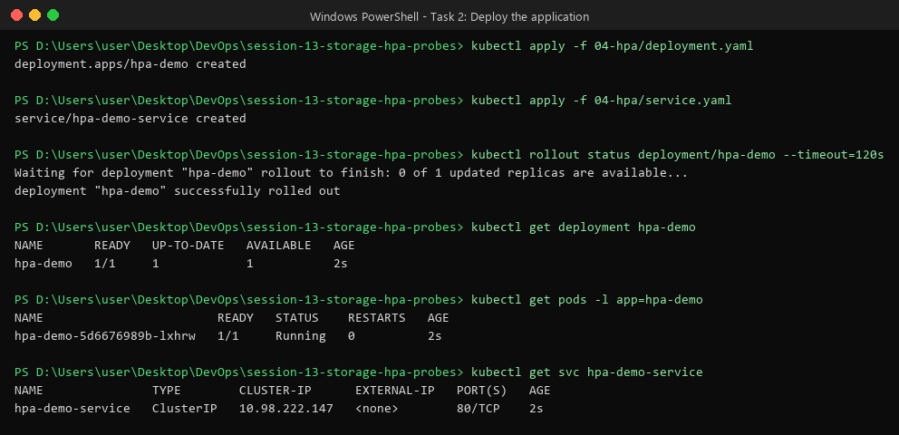
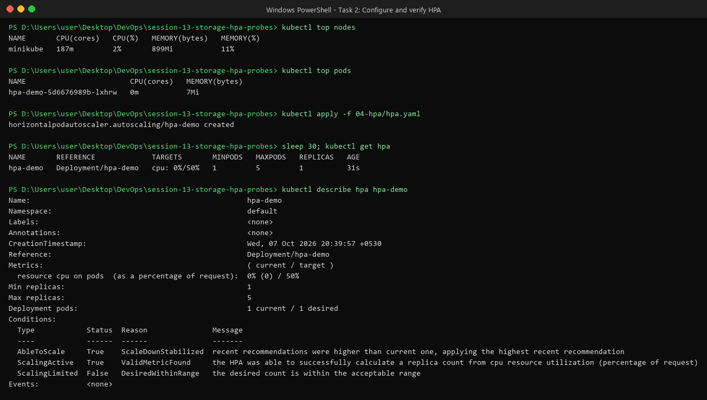
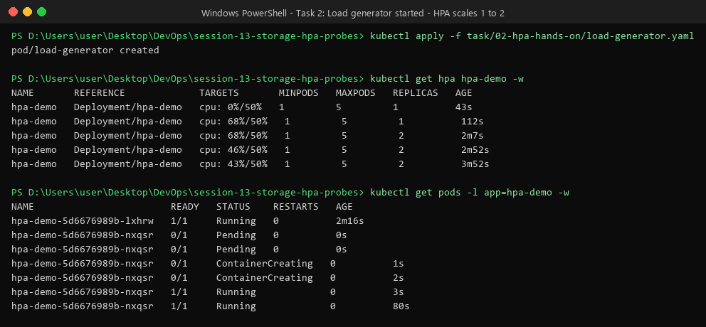
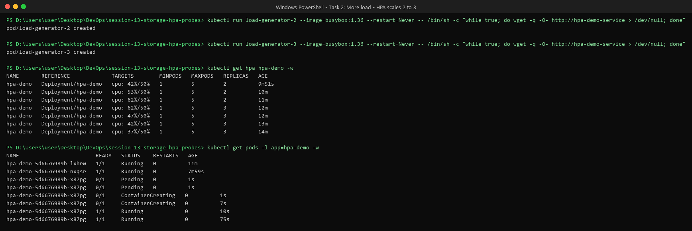
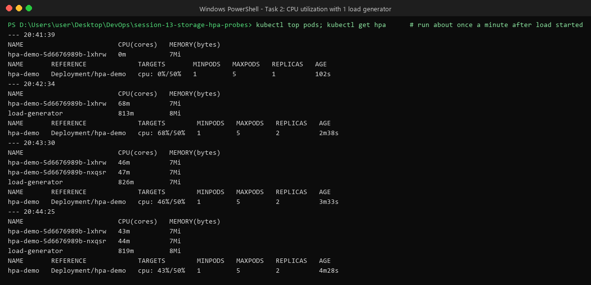
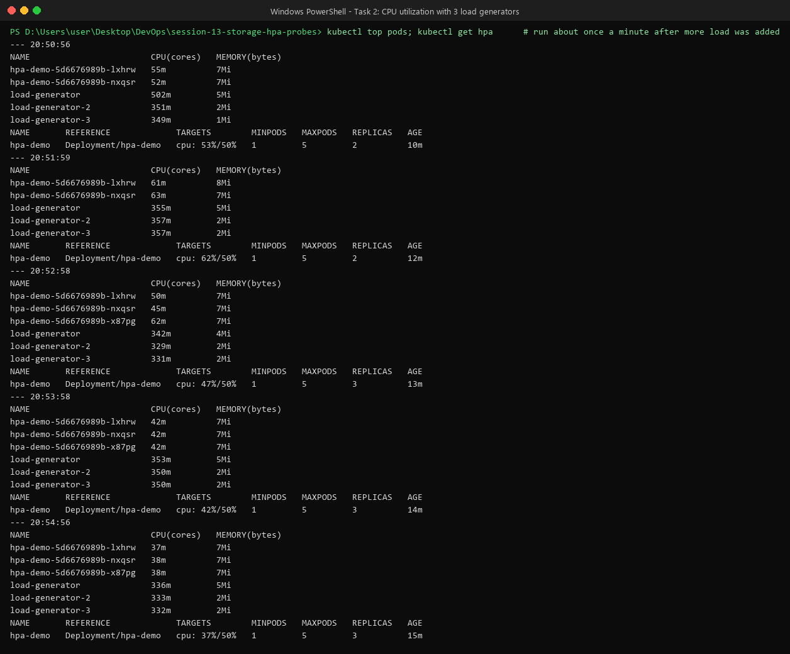
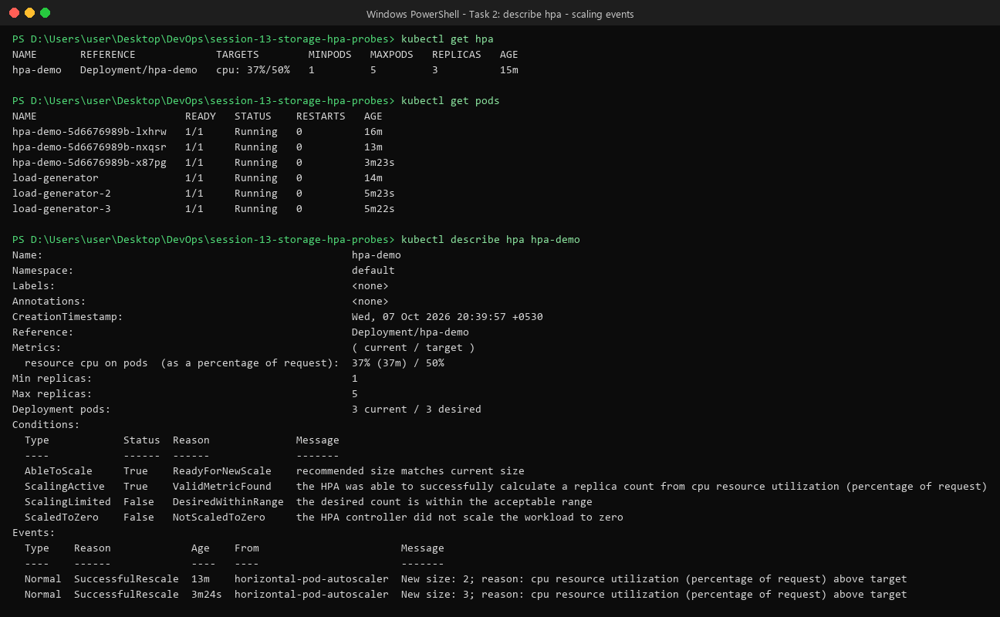
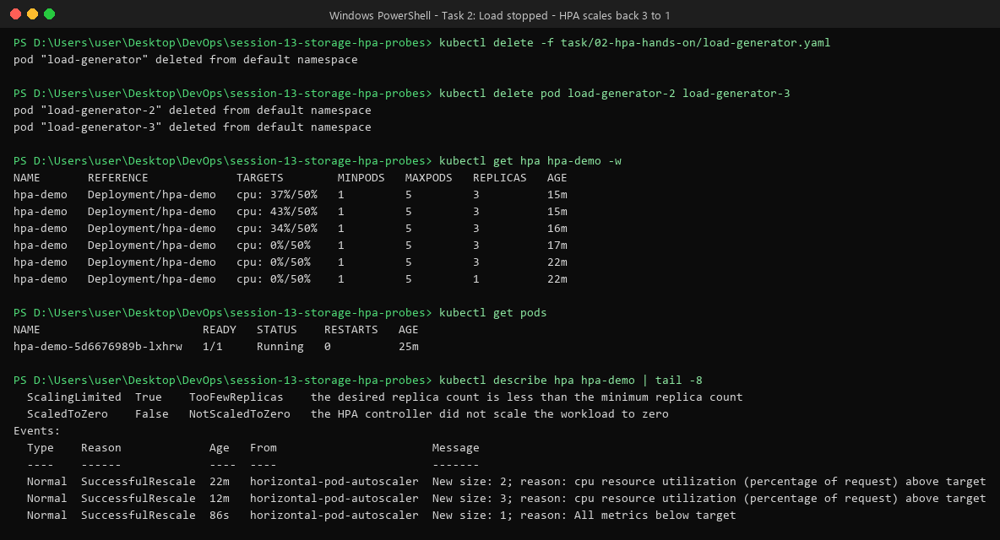

# Task 2 — HPA Hands-on

**HPA (Horizontal Pod Autoscaler)** watches CPU usage and **adds or removes Pods** automatically.
High load → more Pods. Low load → fewer Pods.

I used the files that already exist in [`04-hpa/`](../../04-hpa/) and added one new file for the load generator.

| File | What it does |
| :--- | :--- |
| [`04-hpa/deployment.yaml`](../../04-hpa/deployment.yaml) | nginx app, **CPU request 100m**, limit 200m, 1 replica |
| [`04-hpa/service.yaml`](../../04-hpa/service.yaml) | ClusterIP service `hpa-demo-service` on port 80 |
| [`04-hpa/hpa.yaml`](../../04-hpa/hpa.yaml) | **HPA YAML** — min 1, max 5 Pods, target **50% CPU** |
| [`load-generator.yaml`](./load-generator.yaml) | **Load generator** (made by me) — busybox Pod that calls the service in a never-ending loop |

**Cluster:** minikube (single node) with the `metrics-server` addon enabled.
All commands are run from the `session-13-storage-hpa-probes` folder.

---

## How HPA decides the number of Pods

```text
nginx Pods ──CPU usage──> metrics-server ──> HPA ──changes replicas──> Deployment
```

HPA checks every **15 seconds** and uses this formula:

```text
desired Pods = current Pods × ( current CPU % ÷ target CPU % )      (rounded up)
```

Example: 1 Pod at 68% with a target of 50% → `1 × 68/50 = 1.36` → round up → **2 Pods**.

Things to know:
- CPU % is measured **against the CPU request** (100m). 68m used ÷ 100m requested = 68%. **No request = HPA shows `<unknown>`.**
- HPA ignores small differences (**10% tolerance**). At 50–55% nothing happens.
- Scale **up** happens fast. Scale **down** waits **5 minutes** (stabilization window) so Pods are not removed and added again and again.

---

## Step 1 — Deploy the application

```bash
kubectl apply -f 04-hpa/deployment.yaml
kubectl apply -f 04-hpa/service.yaml
kubectl get deployment hpa-demo
kubectl get pods -l app=hpa-demo
kubectl get svc hpa-demo-service
```



---

## Step 2 & 3 — Configure HPA and verify it

First, check that metrics work (`kubectl top`), then create the HPA:

```bash
kubectl top nodes
kubectl top pods
kubectl apply -f 04-hpa/hpa.yaml
kubectl get hpa
kubectl describe hpa hpa-demo
```



How I know it is working:
- `TARGETS` shows `cpu: 0%/50%` (a real number, not `<unknown>`).
- `ScalingActive True — ValidMetricFound` in `describe hpa`.

---

## Step 4 & 5 — Deploy a load generator and increase load

```bash
kubectl apply -f task/02-hpa-hands-on/load-generator.yaml
```

In other terminals I watched the HPA and the Pods:

```bash
kubectl get hpa hpa-demo -w
kubectl get pods -l app=hpa-demo -w
```



CPU went from **0% → 68%**, which is above 50%, so HPA scaled **1 → 2 Pods**. After that the load was split over 2 Pods and CPU settled at ~43–46% (below target), so it stopped there.

### Increase the load more

To push it further, I added **2 more** load generators (same command as in `04-hpa/readme1.md`):

```bash
kubectl run load-generator-2 --image=busybox:1.36 --restart=Never -- /bin/sh -c "while true; do wget -q -O- http://hpa-demo-service > /dev/null; done"
kubectl run load-generator-3 --image=busybox:1.36 --restart=Never -- /bin/sh -c "while true; do wget -q -O- http://hpa-demo-service > /dev/null; done"
```



CPU went up to **62%**, and HPA scaled **2 → 3 Pods**. With 3 Pods sharing the work, CPU dropped to ~37–47%.

---

## Step 6 — Observe CPU utilization (`kubectl top pods`)

I ran `kubectl top pods` and `kubectl get hpa` about once a minute.

With 1 load generator:



With 3 load generators:



You can see each new Pod **takes part of the load**, so the CPU per Pod goes down after scaling.

---

## Step 7 — Observe Pod scaling (`kubectl describe hpa`)

```bash
kubectl get hpa
kubectl get pods
kubectl describe hpa hpa-demo
```



The **Events** section shows exactly when and why HPA scaled:

```text
New size: 2; reason: cpu resource utilization (percentage of request) above target
New size: 3; reason: cpu resource utilization (percentage of request) above target
```

---

## Step 8 — Stop the load and watch it scale down

```bash
kubectl delete -f task/02-hpa-hands-on/load-generator.yaml
kubectl delete pod load-generator-2 load-generator-3
kubectl get hpa hpa-demo -w
```



- CPU dropped to **0%** right away (at 17m).
- HPA **waited 5 minutes** (stabilization window) and then scaled **3 → 1** (at 22m).
- `ScalingLimited True — TooFewReplicas`: HPA wanted to go lower, but `minReplicas: 1` stops it.

---

## Summary of what happened

| Time (HPA age) | CPU | Pods | What happened |
| :--- | :--- | :--- | :--- |
| 43s | 0% / 50% | 1 | HPA created, app idle |
| ~2m | 68% / 50% | 1 → **2** | 1 load generator started |
| ~3m–9m | 40–46% / 50% | 2 | load split over 2 Pods, below target |
| ~11m | 62% / 50% | 2 → **3** | 2 more load generators added |
| ~12m–16m | 34–47% / 50% | 3 | stable |
| 17m | 0% / 50% | 3 | load stopped |
| 22m | 0% / 50% | 3 → **1** | scaled down after 5 min wait |

**Why it never reached 5 Pods:** all load generators run on the same single minikube node and together use about 1 CPU core. That much traffic needs about 3 nginx Pods. On a real multi-node cluster with more traffic, it would keep going up to `maxReplicas: 5`.

---

## Problem I hit (Windows / Git Bash)

My first `kubectl run ... -- /bin/sh -c "..."` Pods failed with `StartError`:

```text
exec: "D:/Apps/Git/usr/bin/sh": stat D:/Apps/Git/usr/bin/sh: no such file or directory
```

**Why:** Git Bash on Windows changes anything that looks like a Linux path (`/bin/sh`) into a Windows path before sending it to kubectl.
**Fix:** run `export MSYS_NO_PATHCONV=1` first (or use PowerShell, or use the YAML file `load-generator.yaml`, which avoids this problem).

---

## Useful commands

```bash
kubectl get hpa
kubectl get hpa -w
kubectl get pods
kubectl get pods -w
kubectl top pods
kubectl top nodes
kubectl describe hpa hpa-demo
```

## Cleanup

```bash
kubectl delete -f 04-hpa/hpa.yaml
kubectl delete -f 04-hpa/service.yaml
kubectl delete -f 04-hpa/deployment.yaml
```

## References

- https://kubernetes.io/docs/concepts/workloads/autoscaling/horizontal-pod-autoscale/
- https://kubernetes.io/docs/tasks/run-application/horizontal-pod-autoscale-walkthrough/
