# Task 3 — Mini Project: Production-Ready Web App

The mini project YAML files already exist in [`../../mini-project/`](../../mini-project/), and its guide is [`mini-project/README.md`](../../mini-project/README.md).
I deployed it **as-is** on minikube and did every verification task. This file shows my real output.

## What the project puts together

| Part | File | Details |
| :--- | :--- | :--- |
| Namespace | `namespace.yaml` | `production-webapp` |
| Storage | `pvc.yaml` | PVC `web-data`, 500Mi, RWO, mounted at `/data` |
| App | `deployment.yaml` | nginx, 2 replicas, CPU request 100m / limit 200m, **startup + readiness + liveness probes** |
| Network | `service.yaml` | ClusterIP `web-service` on port 80 |
| Scaling | `hpa.yaml` | `web-app-hpa`, min 2, max 5, target 50% CPU |

```text
                 web-service (ClusterIP :80)
                 /           |            \
          web-app Pod    web-app Pod    web-app Pod ...   <- HPA changes this count (2–5)
          (3 probes)     (3 probes)     (3 probes)
                 \           |            /
                    PVC web-data (/data)
                           |
                 StorageClass "standard" -> PV (created automatically)
```

All commands are run from the `session-13-storage-hpa-probes` folder.

---

## Step 1–2: Namespace and PVC

```bash
kubectl apply -f mini-project/namespace.yaml
kubectl apply -f mini-project/pvc.yaml
kubectl get pvc -n production-webapp
```

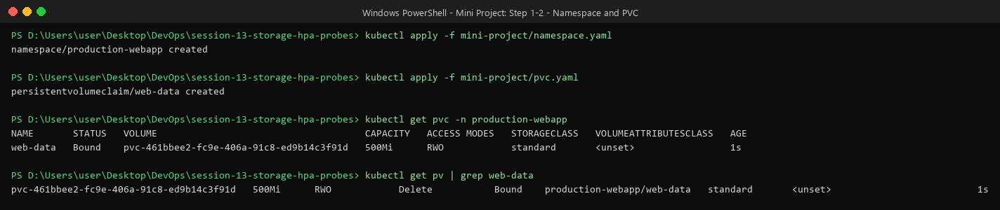

The PVC was `Bound` right away. The default `standard` StorageClass **created the PV automatically** (dynamic provisioning).

## Step 3: Deployment and Service

```bash
kubectl apply -f mini-project/deployment.yaml
kubectl apply -f mini-project/service.yaml
kubectl get pods -n production-webapp -o wide
kubectl get svc,endpoints -n production-webapp
```

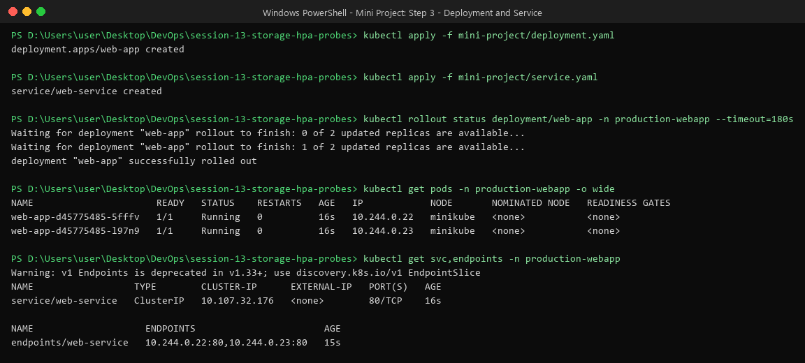

Both Pods are `1/1 Running`, and both Pod IPs are listed as Service **endpoints**. A Pod only shows up there once its **readiness probe** passes.

## Step 4: HPA

```bash
kubectl apply -f mini-project/hpa.yaml
kubectl get hpa -n production-webapp
kubectl top pods -n production-webapp
```

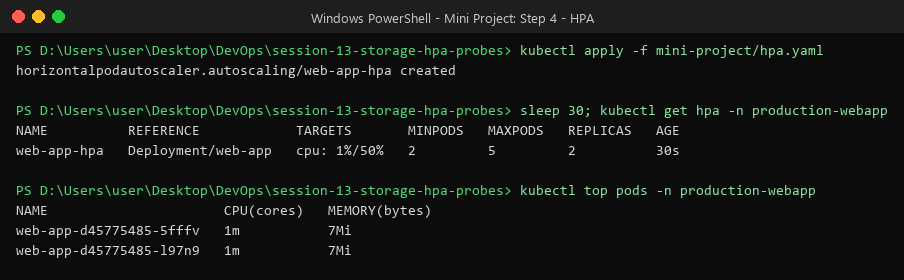

---

## Probes — checking they are set up and working

```bash
kubectl describe pod <pod-name> -n production-webapp
```

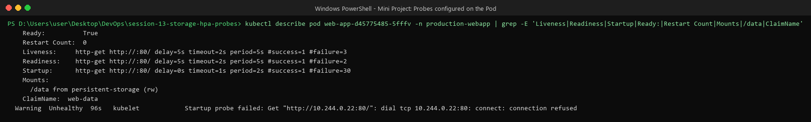

| Probe | Question it asks | Settings | If it fails |
| :--- | :--- | :--- | :--- |
| **Startup** | "Has the app finished starting?" | every 2s, up to 30 fails (= 60s to start) | Container is restarted. The other two probes wait until this one passes. |
| **Readiness** | "Can this Pod take traffic now?" | every 5s, 2 fails | Pod is **removed from the Service** (no restart) |
| **Liveness** | "Is the app still alive?" | every 5s, 3 fails | Container is **restarted** |

**Real example from my run:** the event `Startup probe failed: ... connection refused` shows up once. nginx was still starting, so port 80 wasn't open yet. The startup probe allows up to 30 tries, so it just tried again 2 seconds later, passed, and the container was **not** restarted (`Restart Count: 0`). This is exactly what a startup probe is for.

You can also see the readiness probe when HPA adds a new Pod (screenshot in the HPA section below). The new Pod was `Running` but `0/1` for about 10 seconds, and only became `1/1` once the readiness probe passed. Until then it got no traffic.

---

## Verification Task 1: Storage persistence

```bash
POD_NAME=$(kubectl get pods -n production-webapp -l app=web-app -o jsonpath='{.items[0].metadata.name}')
kubectl exec -n production-webapp "$POD_NAME" -- sh -c 'echo "Student: Divii2205" > /data/student.txt'
kubectl exec -n production-webapp "$POD_NAME" -- cat /data/student.txt
kubectl delete pod -n production-webapp "$POD_NAME"
# check the file again on every Pod
```

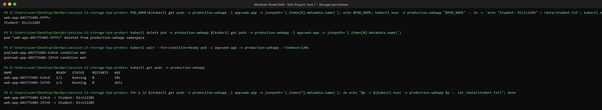

- The Pod `...5fffv` was deleted, and the Deployment made a new one, `...kl6vb`.
- The new Pod **still has the file**, because the data lives in the PVC, not in the Pod.
- Both Pods see the same file because they mount the **same PVC**. This works here because minikube has only one node (RWO = one *node*, not one Pod).

## Verification Task 2: Service

```bash
kubectl port-forward -n production-webapp svc/web-service 8080:80
curl http://localhost:8080
```

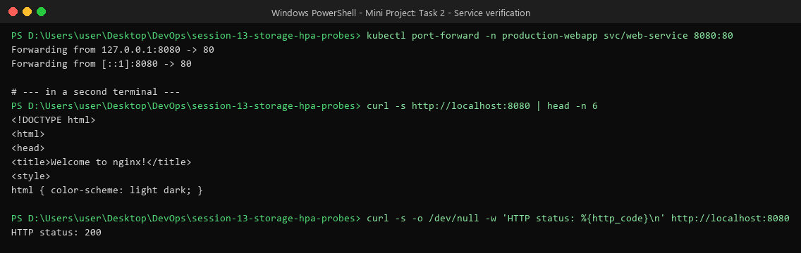

nginx answered with `Welcome to nginx!` and HTTP **200**.

---

## Verification Task 3: Trigger HPA scaling

### With 1 load generator (command from the mini-project guide)

```bash
kubectl run load-generator -n production-webapp --image=busybox:1.36 --restart=Never \
  -- /bin/sh -c "while true; do wget -q -O- http://web-service; done"
kubectl get hpa -n production-webapp -w
```

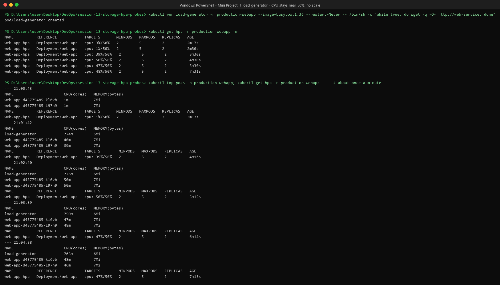

CPU went up from 1% to **47–50%**. That is **right at the 50% target**, and HPA ignores differences smaller than 10%, so it **did not scale**. This is correct behavior: the 2 Pods could handle that load.

### With 3 load generators

```bash
kubectl run load-generator-2 -n production-webapp --image=busybox:1.36 --restart=Never -- /bin/sh -c "while true; do wget -q -O- http://web-service; done"
kubectl run load-generator-3 -n production-webapp --image=busybox:1.36 --restart=Never -- /bin/sh -c "while true; do wget -q -O- http://web-service; done"
```

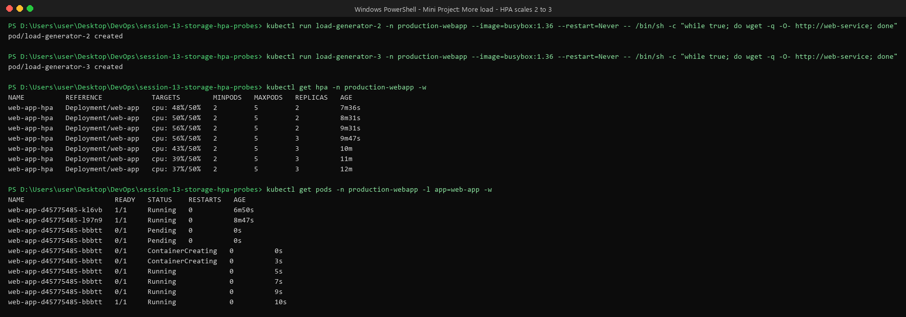

CPU went up to **56%**, and HPA scaled **2 → 3 Pods**. After that, CPU per Pod dropped to ~37–43%.

CPU per Pod over time (`kubectl top pods`):

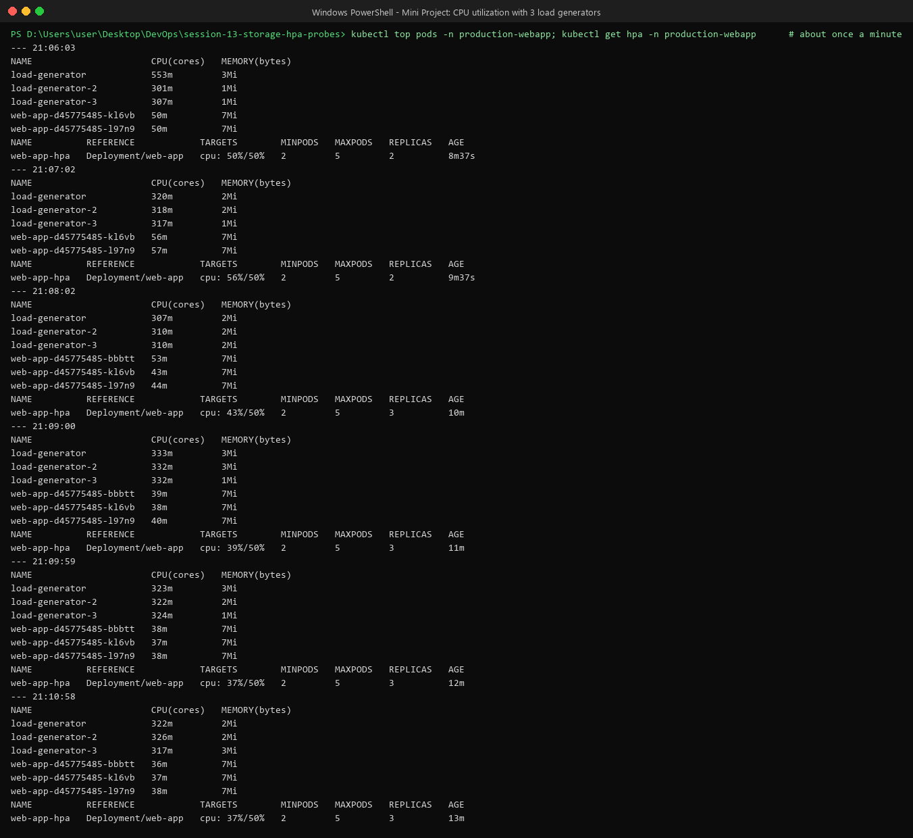

HPA events, and a check that the **new** Pod also sees the PVC data:

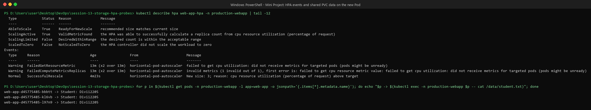

The 2 warnings from 13 minutes earlier (`did not receive metrics for targeted pods`) came right after the HPA was first created, before metrics-server had collected any data. They went away by themselves.

### Stop the load — scale down

```bash
kubectl delete pod load-generator load-generator-2 load-generator-3 -n production-webapp
kubectl get hpa -n production-webapp -w
```

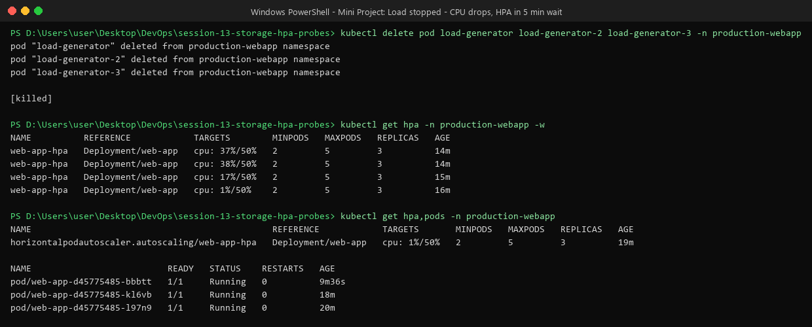

- CPU dropped from ~38% to **1%** within about 2 minutes of stopping the load.
- Replicas **stayed at 3** for now. HPA waits **5 minutes** (stabilization window) before removing Pods. This stops it from removing Pods and then adding them again if traffic comes back quickly.
- When the 5 minutes are up, it goes back to **2 Pods**, not 1, because `minReplicas: 2`. You can see the same scale-down for the 04-hpa demo in Task 2 (3 → 1 after the wait).

---

## What I learned

- **PVC** keeps app data safe when Pods are deleted, replaced, or added by HPA.
- **HPA** only works if the container has a **CPU request**, and it only scales when usage is clearly above the target (more than ~10% over).
- **Startup probe** gives slow apps time to start without being killed. **Readiness** keeps traffic away from Pods that aren't ready. **Liveness** restarts stuck containers.
- Putting all three together gives an app that heals itself and grows with traffic.

## Cleanup

```bash
kubectl delete namespace production-webapp
```
