# Session 15: Helm - Assignment Submission

All work was done on my local **minikube** cluster with **Helm v4.3.0**.
Everything ran in its own namespace `s15-helm`, so other work on the cluster was not touched.
At the end I deleted the namespace.

The charts used are the ones already in this session folder:

| What | Path |
|------|------|
| Task 1 chart | made with `helm create my-first-chart` (a scratch chart, removed after the task) |
| Task 2 chart | `07-install-upgrade/app-chart/` (used in `08-rollback/` like the README says) |
| Task 3 chart | `mini-project/notes-chart/` |

All screenshots are real terminal output, saved in [`screenshots/`](screenshots/).

---

## Quick Words

| Word | Meaning |
|------|---------|
| **Chart** | A package of Kubernetes YAML templates. Like a recipe. |
| **values.yaml** | The default settings for the chart (image, replicas, ports...). |
| **Templates** | YAML files with `{{ }}` blanks. Helm fills the blanks from the values. |
| **Release** | One installed copy of a chart in the cluster. Like the cooked meal. |
| **Revision** | A version number of the release. Every install, upgrade and rollback adds one. |

---

# Task 1: Helm Commands

## 1. `helm create`

**What it does:** Makes a new chart folder with a ready-made structure (Chart.yaml, values.yaml, templates).

```bash
helm create my-first-chart
```

**Output:** `Creating my-first-chart`. The chart has `Chart.yaml`, `values.yaml`, `.helmignore` and a `templates/` folder (deployment, service, ingress, hpa, serviceaccount, NOTES.txt, `_helpers.tpl`, a test). The default image is `nginx` with `replicaCount: 1`.

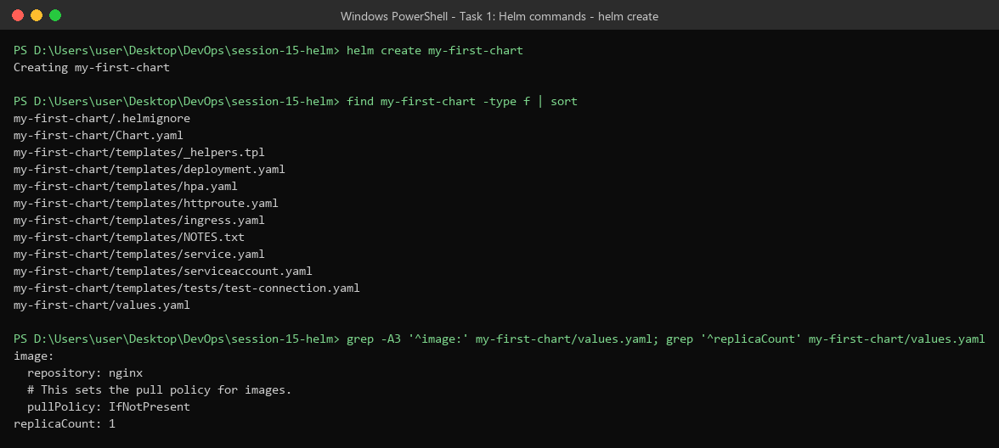

## 2. `helm install`

**What it does:** Takes a chart, fills the templates with values, and creates the objects in the cluster. This makes a new release (revision 1).

```bash
kubectl create namespace s15-helm
helm install first-app ./my-first-chart -n s15-helm
```

**Output:** `STATUS: deployed`, `REVISION: 1`, plus the chart's NOTES. One nginx pod and one Service were created.

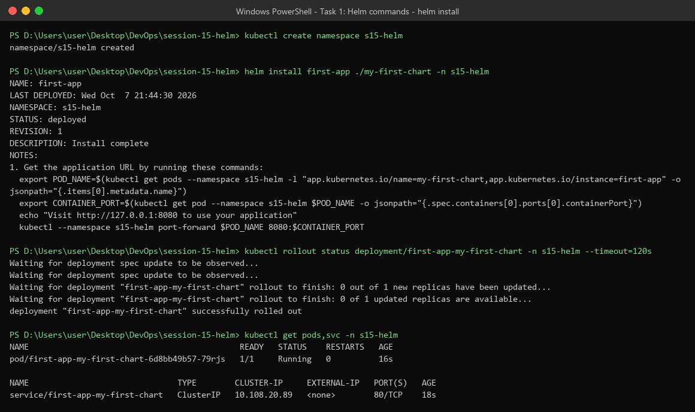

## 3. `helm list`

**What it does:** Shows the releases. `-n` shows one namespace. `-A` shows all namespaces.

```bash
helm list -n s15-helm
helm list -A
```

**Output:** `first-app` with revision 1, status `deployed`, chart `my-first-chart-0.1.0`. With `-A` I also see my older releases from class in `default`.

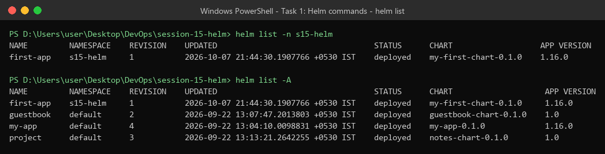

## 4. `helm status`

**What it does:** Shows the details of one release: when it was deployed, its status, the resources it made and its NOTES.

```bash
helm status first-app -n s15-helm
```

**Output:** Status `deployed`, revision 1, and a list of the Pod, ServiceAccount, Service and Deployment.

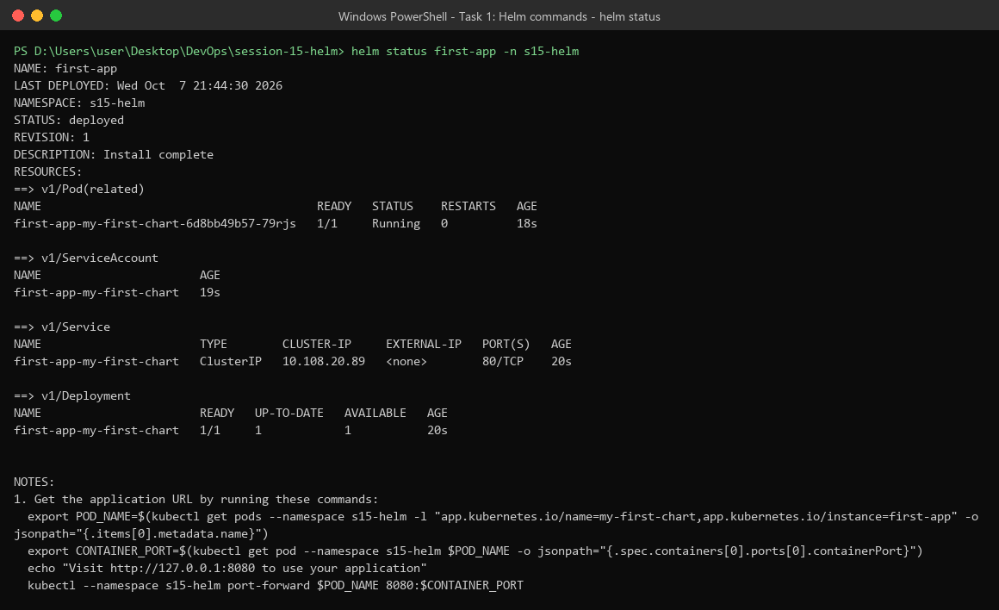

## 5. `helm get`

**What it does:** Downloads saved information about a release.

| Command | Shows |
|---------|-------|
| `helm get values` | Only the values I gave (`--set` / `-f`). |
| `helm get metadata` | Chart name, version, revision, status, deploy time. |
| `helm get notes` | The NOTES text printed after install. |
| `helm get manifest` | The final YAML that Helm sent to Kubernetes. |

```bash
helm get values first-app -n s15-helm
helm get metadata first-app -n s15-helm
helm get notes first-app -n s15-helm
helm get manifest first-app -n s15-helm
```

**Output:** `USER-SUPPLIED VALUES: null` (I used only defaults). The manifest shows `replicas: 1` and `image: "nginx:1.16.0"`.

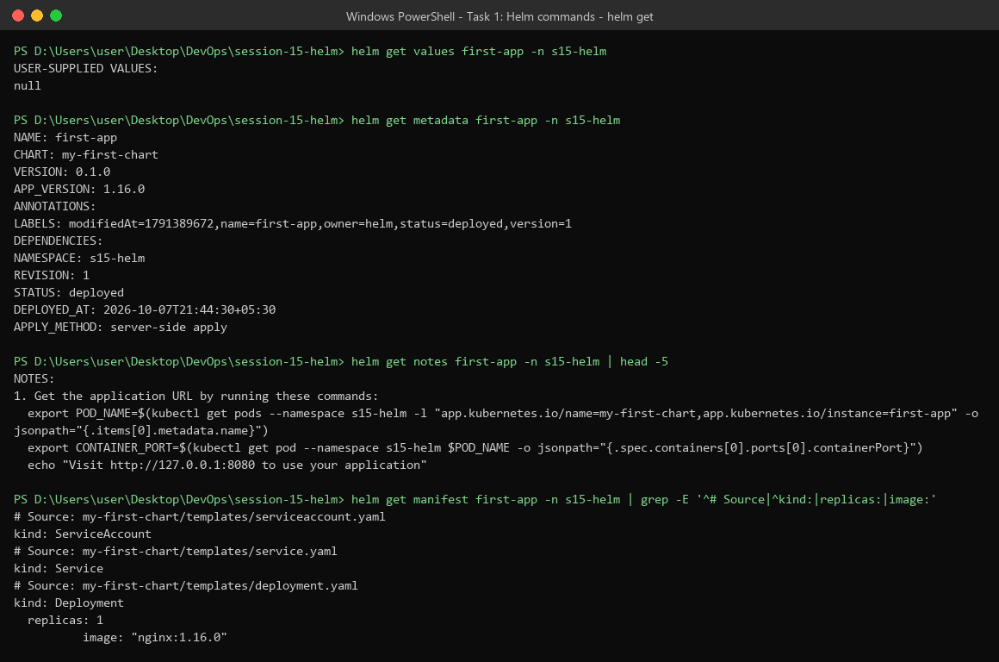

## 6. `helm upgrade`

**What it does:** Changes a running release with new values or a new chart version. This makes a new revision.

```bash
helm upgrade first-app ./my-first-chart -n s15-helm --set replicaCount=3
```

**Output:** `Release "first-app" has been upgraded`, `REVISION: 2`. Now 3 pods are running. `helm get values` shows `replicaCount: 3`.

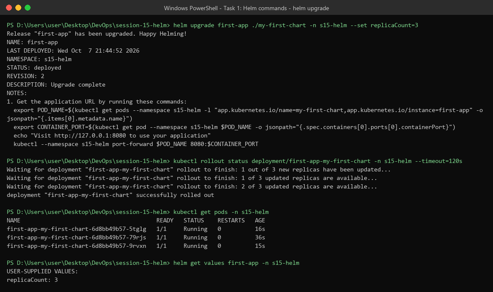

## 7. `helm history`

**What it does:** Shows all revisions of a release.

```bash
helm history first-app -n s15-helm
```

**Output:** Revision 1 `superseded` (Install complete), revision 2 `deployed` (Upgrade complete).

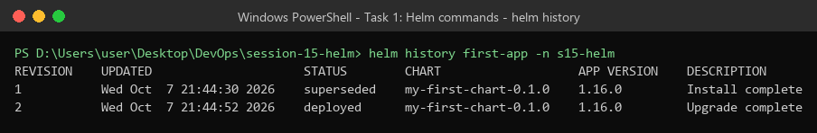

## 8. `helm rollback`

**What it does:** Goes back to an older revision. It does not delete history. It adds a new revision that is a copy of the old one.

```bash
helm rollback first-app 1 -n s15-helm
```

**Output:** `Rollback was a success! Happy Helming!`. The deployment is back to 1/1 pod. History now has revision 3 = `Rollback to 1`.

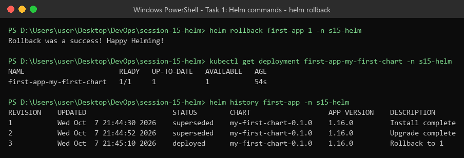

## 9. `helm uninstall`

**What it does:** Deletes the release and every object it created.

```bash
helm uninstall first-app -n s15-helm
```

**Output:** `release "first-app" uninstalled`. `helm list` is empty and `kubectl get all` says `No resources found`.

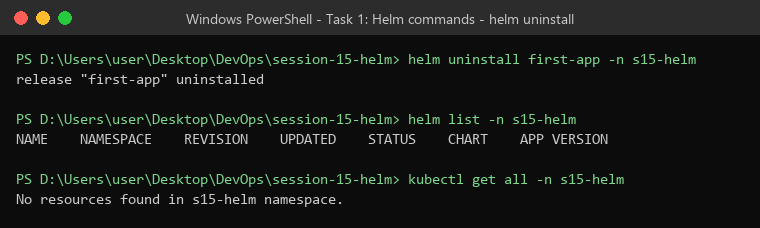

## 10. `helm repo`

**What it does:** Manages chart repositories (online stores of charts).

| Command | Does |
|---------|------|
| `helm repo list` | Show added repos. |
| `helm repo add <name> <url>` | Add a repo. |
| `helm repo update` | Download the newest chart list from every repo. |
| `helm repo remove <name>` | Remove a repo. |

```bash
helm repo list
helm repo add ingress-nginx https://kubernetes.github.io/ingress-nginx
helm repo update
helm repo list
helm repo remove ingress-nginx
helm repo list
```

**Output:** `ingress-nginx` was added, updated together with `bitnami`, then removed. So my repo list is back to how it was.

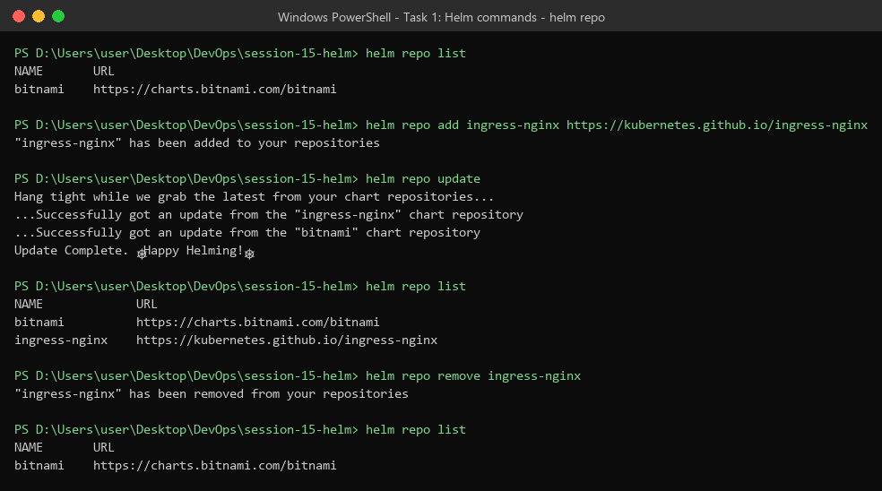

## 11. `helm search`

**What it does:** Finds charts.

- `helm search repo` searches the repos I added (local, fast).
- `helm search hub` searches Artifact Hub on the internet.

```bash
helm search repo bitnami/nginx
helm search repo nginx --versions
helm search hub prometheus
```

**Output:** `bitnami/nginx` chart 25.2.1 (app 1.31.6). `--versions` shows older chart versions too. The hub search shows Prometheus charts from Artifact Hub.

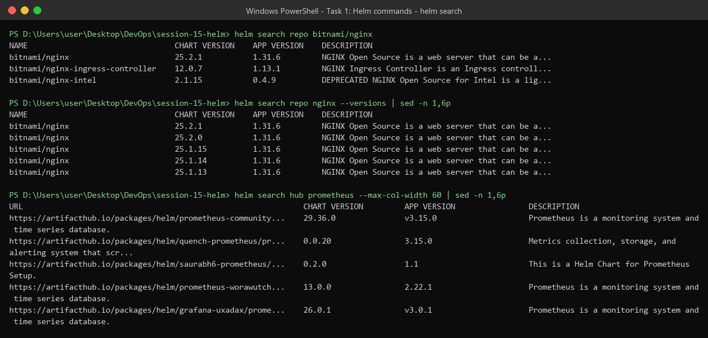

### Task 1 Summary

| Command | One line |
|---------|----------|
| `helm create` | Make a new chart skeleton |
| `helm install` | Deploy a chart as a release (revision 1) |
| `helm list` | List releases |
| `helm status` | Details of one release |
| `helm get` | Values / manifest / notes / metadata of a release |
| `helm upgrade` | Change a release (new revision) |
| `helm history` | All revisions of a release |
| `helm rollback` | Go back to an old revision (adds a new revision) |
| `helm uninstall` | Delete a release and its objects |
| `helm repo` | Add / update / list / remove chart repos |
| `helm search` | Find charts in repos or Artifact Hub |

> **Helm v4 note:** `helm list --all` from Helm 3 does not exist anymore (I got `unknown flag: --all`), so I left it out.

---

# Task 2: Helm Rollback

**Chart:** `07-install-upgrade/app-chart` (default: 1 replica, `nginx:1.24`). Commands were run from `08-rollback/`.
**Release:** `rollback-demo`.

```text
Install (rev 1) -> Upgrade (rev 2) -> Verify -> Upgrade again (rev 3, broken) -> Verify -> Rollback to rev 2 (rev 4) -> Verify
```

## Step 1: Install

```bash
helm install rollback-demo ../07-install-upgrade/app-chart -n s15-helm
kubectl rollout status deployment/rollback-demo-app -n s15-helm
kubectl get deployment/rollback-demo-app -n s15-helm -o wide
helm history rollback-demo -n s15-helm
```

**Result:** Revision 1, 1/1 pod ready, image `nginx:1.24`.

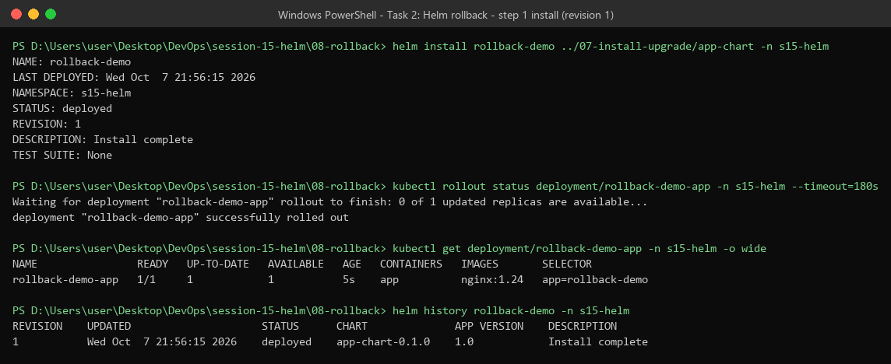

## Step 2: Upgrade + Verify

Change to 3 replicas and a newer image.

```bash
helm upgrade rollback-demo ../07-install-upgrade/app-chart -n s15-helm --set replicaCount=3 --set image.tag=1.25
kubectl rollout status deployment/rollback-demo-app -n s15-helm
kubectl get pods -n s15-helm -l app=rollback-demo
kubectl get deployment/rollback-demo-app -n s15-helm -o wide
helm get values rollback-demo -n s15-helm
helm history rollback-demo -n s15-helm
```

**Verify:** Revision 2. 3/3 pods ready on `nginx:1.25` (old 1.24 pods are `Terminating`). `helm get values` shows `replicaCount: 3` and `tag: "1.25"`.

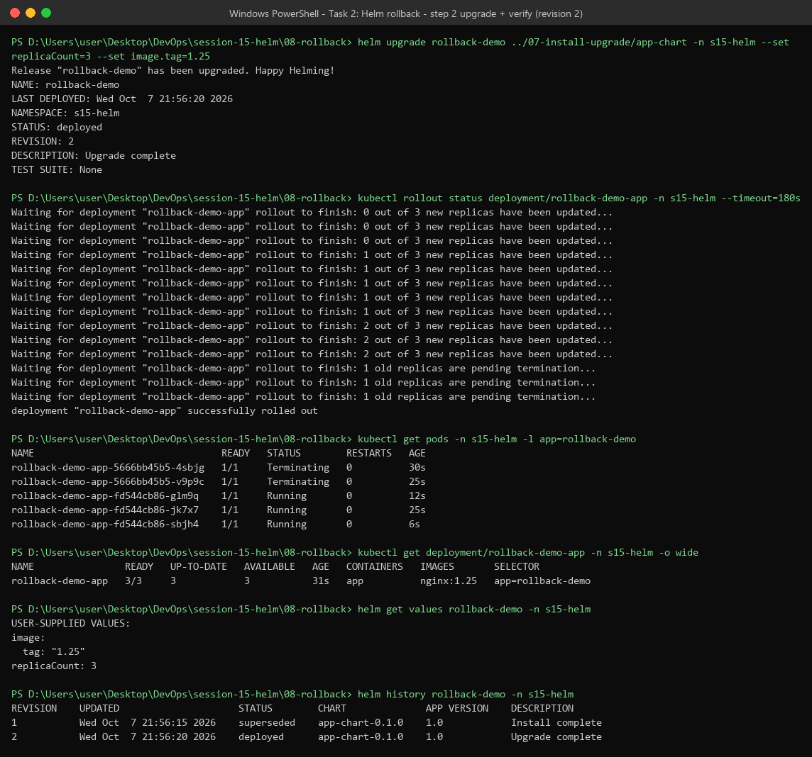

## Step 3: Upgrade Again (bad version) + Verify

I upgrade with an image tag that does not exist, to act like a bad release.
`--reuse-values` keeps the values from revision 2 (3 replicas) and only changes the tag.

```bash
helm upgrade rollback-demo ../07-install-upgrade/app-chart -n s15-helm --reuse-values --set image.tag=doesnotexist
kubectl get pods -n s15-helm -l app=rollback-demo
kubectl get deployment/rollback-demo-app -n s15-helm -o wide
kubectl get events -n s15-helm --field-selector reason=Failed
helm history rollback-demo -n s15-helm
```

**Verify:**
- The new pod is `ImagePullBackOff`. The event says `nginx:doesnotexist: not found`.
- The 3 old pods keep running, because the rolling update waits for the new pod to be ready. So users are not affected yet.
- **Important:** `helm history` still shows revision 3 as `deployed`. Helm says "Upgrade complete" because, without `--wait`, it only checks that Kubernetes accepted the YAML. It does not check that the pods are healthy. So always check the pods after an upgrade.

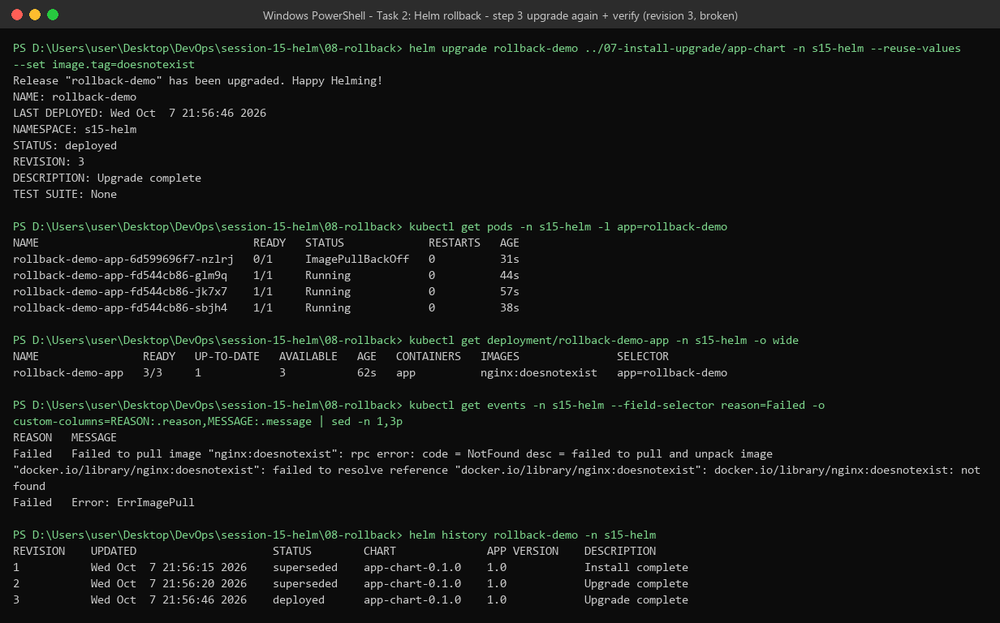

## Step 4: Rollback + Verify

Go back to revision 2 (the last good one).

```bash
helm rollback rollback-demo 2 -n s15-helm
kubectl rollout status deployment/rollback-demo-app -n s15-helm
kubectl get pods -n s15-helm -l app=rollback-demo
kubectl get deployment/rollback-demo-app -n s15-helm -o wide
helm get values rollback-demo -n s15-helm
helm history rollback-demo -n s15-helm
```

**Verify:** `Rollback was a success!`. All 3 pods are `Running` on `nginx:1.25` again and the broken pod is gone. History has a new revision 4 = `Rollback to 2`. Revisions 1-3 are still kept.

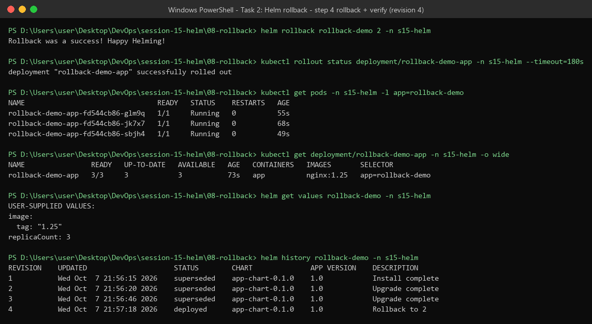

## Bonus: Automatic Rollback

In Helm 3 this flag was `--atomic`. In **Helm v4 it is called `--rollback-on-failure`**. Helm waits for the pods. If they are not ready before `--timeout`, it rolls back by itself.

```bash
helm upgrade rollback-demo ../07-install-upgrade/app-chart -n s15-helm --reuse-values \
  --set image.tag=doesnotexist --rollback-on-failure --timeout 60s
helm history rollback-demo -n s15-helm
helm uninstall rollback-demo -n s15-helm
```

**Result:** After 60 seconds: `UPGRADE FAILED ... has been rolled back due to rollback-on-failure being set`. History shows revision 5 = `failed` and revision 6 = `Rollback to 4`. The app stayed on `nginx:1.25` with 3/3 pods. Then I uninstalled the release.

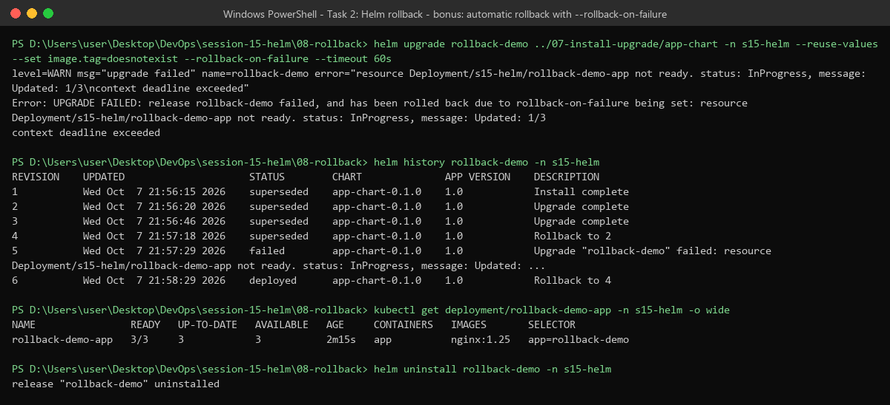

### Task 2 Revision Table

| Revision | Action | Image | Replicas | Status at the end |
|----------|--------|-------|----------|-------------------|
| 1 | Install | nginx:1.24 | 1 | superseded |
| 2 | Upgrade | nginx:1.25 | 3 | superseded |
| 3 | Upgrade again | nginx:doesnotexist | 3 (1 broken new pod) | superseded |
| 4 | Rollback to 2 | nginx:1.25 | 3 | superseded |
| 5 | Upgrade with `--rollback-on-failure` | nginx:doesnotexist | - | failed |
| 6 | Auto rollback to 4 | nginx:1.25 | 3 | deployed |

---

# Task 3: Mini Project - Notes App with Helm

Following `mini-project/README.md`. The app is an nginx pod that stands for a Notes web app.

## The Helm Chart

```text
mini-project/notes-chart/
  Chart.yaml          chart name and version (notes-chart 0.1.0, appVersion 1.0)
  values.yaml         development settings
  values-prod.yaml    production settings
  templates/
    configmap.yaml    APP_NAME and ENVIRONMENT
    deployment.yaml   the pods; gets env vars from the ConfigMap
    service.yaml      NodePort service on port 30090
```

### values.yaml vs values-prod.yaml

| Setting | values.yaml (dev) | values-prod.yaml (prod) |
|---------|-------------------|-------------------------|
| `replicaCount` | 1 | 3 |
| `image.tag` | latest | 1.25 |
| `service.nodePort` | 30090 | 30090 |
| `app.environment` | development | production |

### Templates

The templates use the release name and values, for example:

- `name: {{ .Release.Name }}-deploy`: a release called `notes-dev` makes `notes-dev-deploy`.
- `replicas: {{ .Values.replicaCount }}` comes from the values file.
- `image: "{{ .Values.image.repository }}:{{ .Values.image.tag }}"`.
- `ENVIRONMENT: {{ .Values.app.environment | quote }}` in the ConfigMap. The pod reads it with `envFrom`.

## Step 1: Lint (check for errors)

```bash
helm lint notes-chart
helm lint notes-chart -f notes-chart/values-prod.yaml
```

**Result:** `1 chart(s) linted, 0 chart(s) failed` for both values files. Only an `[INFO]` that an icon is recommended.

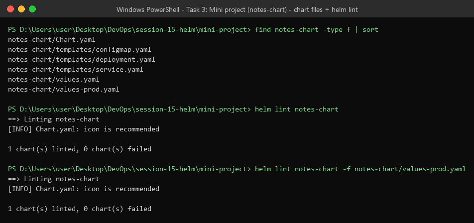

## Step 2: Render Locally

```bash
helm template notes-dev notes-chart
```

**Result:** All `{{ }}` are filled: `notes-dev-config`, `notes-dev-svc` (nodePort 30090), `notes-dev-deploy` with `replicas: 1` and `image: "nginx:latest"`. Nothing is sent to the cluster.

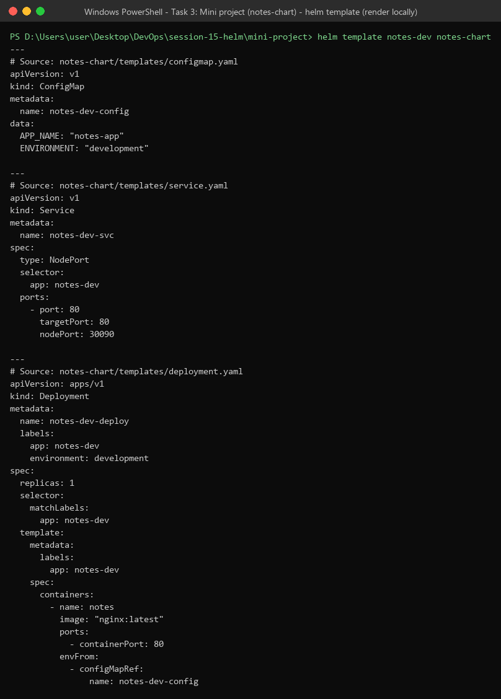

## Step 3: Installation (development)

```bash
helm install notes-dev notes-chart -n s15-helm
kubectl rollout status deployment/notes-dev-deploy -n s15-helm
kubectl get deploy,pods,svc,configmap -n s15-helm
```

**Result:** Revision 1. 1 pod `Running`, Service `notes-dev-svc` is `80:30090/TCP`, ConfigMap `notes-dev-config` has 2 keys.

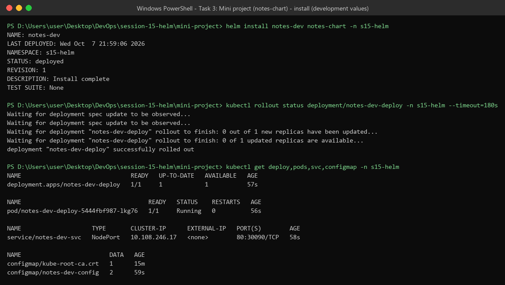

### Verify the app works

```bash
kubectl exec deployment/notes-dev-deploy -n s15-helm -- env | grep -E 'APP_NAME|ENVIRONMENT'
kubectl exec deployment/notes-dev-deploy -n s15-helm -- curl -s http://notes-dev-svc | grep '<title>'
```

**Result:** `APP_NAME=notes-app`, `ENVIRONMENT=development` (from the ConfigMap). The Service answers with `<title>Welcome to nginx!</title>`.

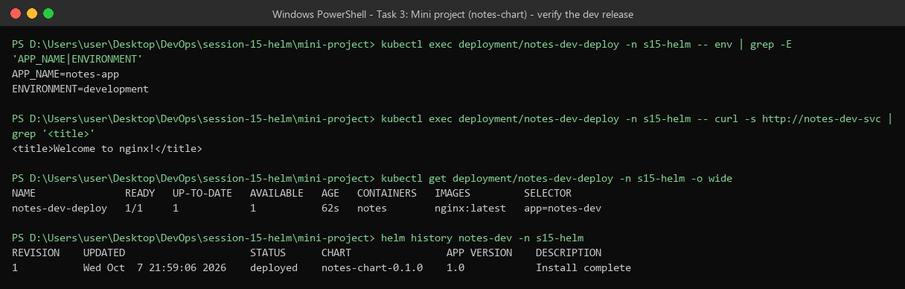

## Step 4: Upgrade to Production

```bash
helm upgrade notes-dev notes-chart -f notes-chart/values-prod.yaml -n s15-helm
kubectl rollout status deployment/notes-dev-deploy -n s15-helm
kubectl get pods -n s15-helm
kubectl exec deployment/notes-dev-deploy -n s15-helm -- env | grep -E 'APP_NAME|ENVIRONMENT'
helm history notes-dev -n s15-helm
```

**Result:** Revision 2. 3 pods running `nginx:1.25` and `ENVIRONMENT=production`. Same chart, different values file.

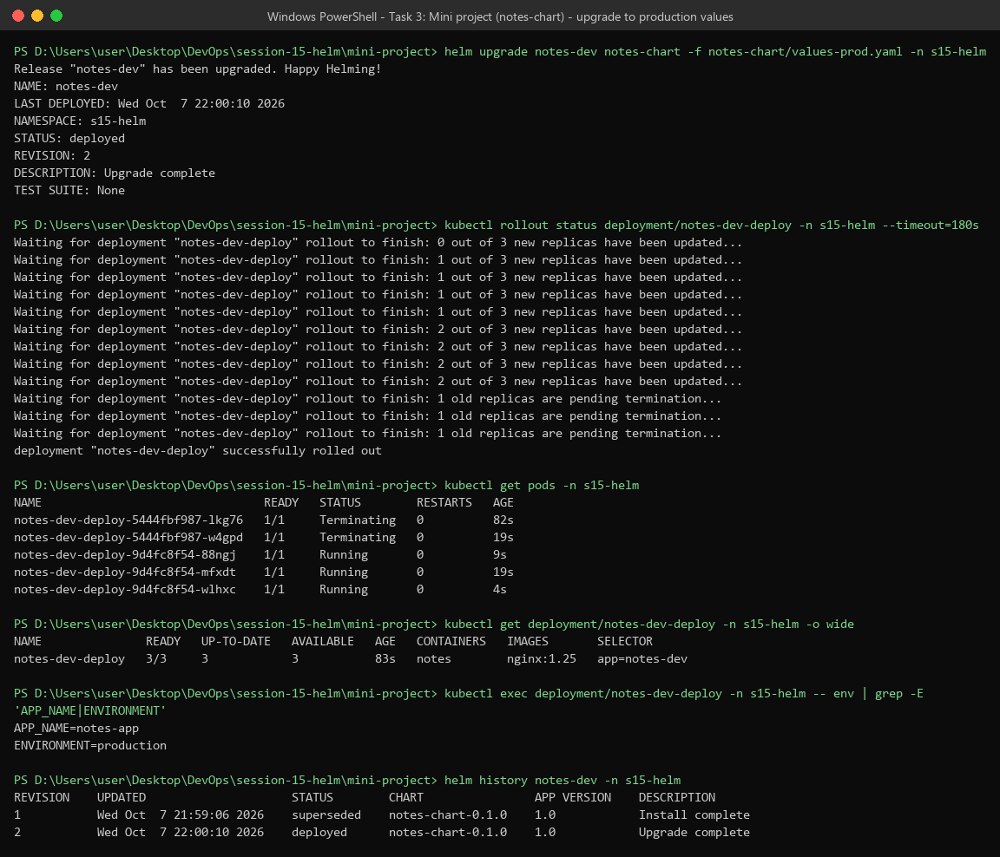

## Step 5: Simulate a Bad Upgrade

I keep the prod values and only break the image tag.

```bash
helm upgrade notes-dev notes-chart -f notes-chart/values-prod.yaml --set image.tag=broken-tag-does-not-exist -n s15-helm
kubectl get pods -n s15-helm
helm history notes-dev -n s15-helm
```

**Result:** Revision 3. The new pod is `ErrImagePull`. The 3 old pods stay `Running`. Helm still marks revision 3 as `deployed`, so the pods tell the real story.

> I kept `-f values-prod.yaml` here on purpose. Without it, Helm would also reset everything else to `values.yaml` (1 replica, development). Then the test would change more than one thing.

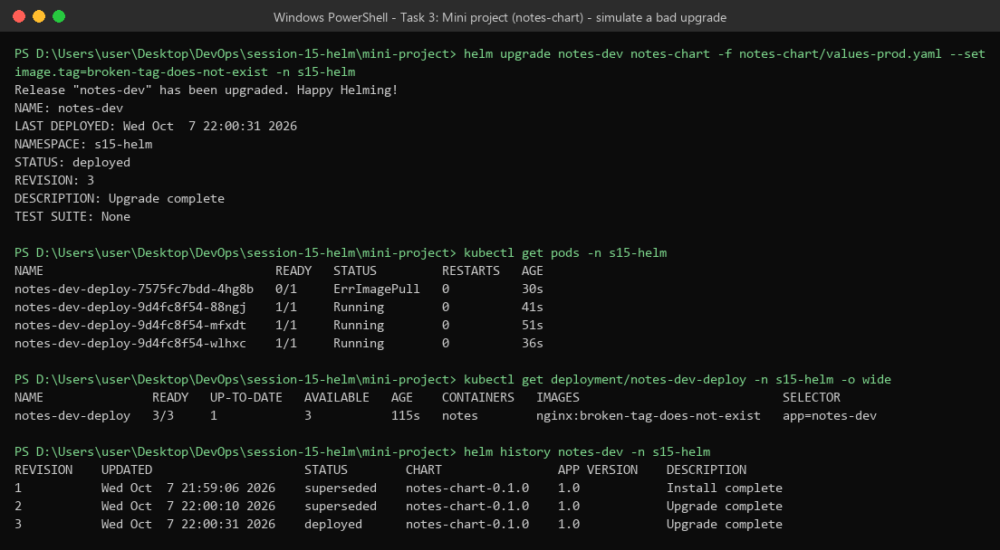

## Step 6: Rollback to Revision 2

```bash
helm rollback notes-dev 2 -n s15-helm
kubectl rollout status deployment/notes-dev-deploy -n s15-helm
kubectl get pods -n s15-helm
kubectl exec deployment/notes-dev-deploy -n s15-helm -- curl -s http://notes-dev-svc | grep '<title>'
helm history notes-dev -n s15-helm
```

**Result:** `Rollback was a success!`. 3/3 pods `Running` on `nginx:1.25`, and the app answers again. Revision 4 = `Rollback to 2`.

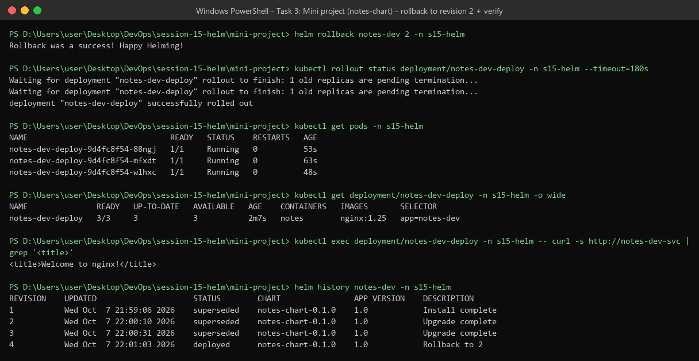

## Step 7: Clean Up

```bash
helm uninstall notes-dev -n s15-helm
helm list -n s15-helm
kubectl get all -n s15-helm
```

**Result:** `release "notes-dev" uninstalled`. No releases and no resources are left. After all tasks I also ran `kubectl delete namespace s15-helm`.

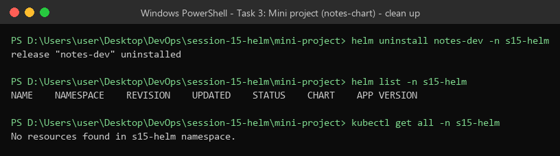

## What I Practiced

```text
[PASS] Used a Helm chart with Chart.yaml, values.yaml, values-prod.yaml and templates
[PASS] Checked the chart with helm lint and helm template
[PASS] Installed the chart (development)
[PASS] Upgraded with production values (1 -> 3 pods, dev -> production)
[PASS] Simulated a bad upgrade (broken image tag)
[PASS] Rolled back to the healthy revision
[PASS] Cleaned up with helm uninstall
```

---

## Key Learnings

1. **One chart, many environments.** Only the values file changes (`-f values-prod.yaml`).
2. **Every change is a revision.** Install, upgrade and rollback all add one, and rollback never deletes history.
3. **"deployed" does not mean "healthy".** A plain `helm upgrade` only checks that Kubernetes accepted the YAML. Use `kubectl get pods`, or `--wait` / `--rollback-on-failure`.
4. **Rolling updates protect users.** The broken pod never became ready, so the old pods kept serving.
5. **`--reuse-values` vs a fresh `--set`.** Without `--reuse-values` or `-f`, an upgrade goes back to the chart defaults plus only the new `--set` values.
6. **Helm v4 changes:** `--atomic` is now `--rollback-on-failure`, and `helm list --all` was removed.

## Deliverables Checklist

| Deliverable | Where |
|-------------|-------|
| Helm chart | `mini-project/notes-chart/`, `07-install-upgrade/app-chart/`, `my-first-chart` (Task 1) |
| values.yaml | Task 3 values table, `notes-chart/values.yaml` + `values-prod.yaml` |
| Templates | Task 3 Templates section, `t3-02-template.png` |
| Installation | Task 1 #2, Task 2 Step 1, Task 3 Step 3 |
| Upgrade | Task 1 #6, Task 2 Steps 2-3, Task 3 Steps 4-5 |
| Rollback | Task 1 #8, Task 2 Step 4 + Bonus, Task 3 Step 6 |
| Screenshots | `screenshots/` (24 images) |
| README | this file |
| Mini project | Task 3 |
