# Session 16 – CI/CD & GitHub Actions: Demo Project (Submission)

A complete CI/CD demo for a small **Python calculator app**.
Every push runs **tests → security check → build → Docker image**. That part is **CI**.
On a push to `main`, the image is then **pushed to a registry and checked**. That part is **CD**.

Reference used: `session-16-github-actions/10-final-cicd-pipeline` (app, tests, `build.sh` and the CI jobs come from it).
I added two files to that project: a **Dockerfile** and a **CD part** in the workflow.

---

## Table of contents

1. [Deliverables checklist](#1-deliverables-checklist)
2. [Concepts covered](#2-concepts-covered)
3. [Project structure](#3-project-structure)
4. [Application source code](#4-application-source-code)
5. [Dockerfile](#5-dockerfile)
6. [GitHub Actions workflow (CI + CD)](#6-github-actions-workflow-ci--cd)
7. [CI pipeline explained](#7-ci-pipeline-explained)
8. [CD pipeline explained](#8-cd-pipeline-explained)
9. [Secrets](#9-secrets)
10. [Artifacts](#10-artifacts)
11. [Pipeline execution (screenshots)](#11-pipeline-execution-screenshots)
12. [How to run it on GitHub](#12-how-to-run-it-on-github)
13. [Summary](#13-summary)

---

## 1. Deliverables checklist

| Deliverable | Where |
|---|---|
| Application source code | `10-final-cicd-pipeline/app/calculator.py`, `tests/test_calculator.py`, `build.sh` (section 4) |
| Dockerfile | Section 5 |
| GitHub Actions workflow | `.github/workflows/cicd.yml` (section 6) |
| CI pipeline | Jobs `test`, `security-check`, `build`, `docker-build` (section 7) |
| CD pipeline | Job `deploy` (section 8) |
| Screenshots of successful pipeline execution | `screenshots/` (section 11) |
| README.md | This file |

---

## 2. Concepts covered

| Concept | Simple meaning | Where it is in this project |
|---|---|---|
| **CI (Continuous Integration)** | Every code change is tested and built automatically. | Jobs `test`, `security-check`, `build`, `docker-build` |
| **CD (Continuous Delivery / Deployment)** | After CI passes, the app is shipped automatically. | Job `deploy` (push image to registry, then verify it) |
| **CI vs CD** | CI checks that the code is good. CD ships the good code. CD runs only if CI passes. | `deploy` has `needs: docker-build` and only runs on push to `main` |
| **CI/CD pipeline** | The chain of stages: Code → Test → Build → Package → Deploy. | The 5 jobs linked with `needs:` |
| **GitHub Actions** | GitHub's built-in automation tool. It runs YAML workflows. | `.github/workflows/cicd.yml` |
| **Workflow** | One YAML file with triggers (`on:`) and jobs. | `on: push / pull_request / workflow_dispatch` |
| **Job** | A group of steps that runs on one runner. Jobs run in parallel unless `needs:` links them. | 5 jobs. `security-check` and `build` run in parallel after `test`. |
| **Step** | One command (`run:`) or one ready-made action (`uses:`). | e.g. `uses: actions/checkout@v6`, `run: pytest -v` |
| **Runner** | The machine that runs a job. | `runs-on: ubuntu-latest` (GitHub-hosted runner). Each job gets a fresh machine. |
| **Secrets** | Passwords and tokens kept encrypted in GitHub, and shown as `***` in logs. | `DOCKERHUB_USERNAME`, `DOCKERHUB_TOKEN` in `deploy` |
| **Artifacts** | Files saved from one job, to download later or use in another job. | `test-report`, `calculator-build`, `docker-image` |
| **Build** | Turn source code into something you can ship. | `build.sh` → `build/` folder, `docker build` → image |
| **Test** | Check that the code works. | `pytest -v` (5 unit tests), plus tests and a smoke test inside the image |
| **Pipeline execution** | One real run of the workflow, with a pass/fail result for each job. | Section 11 screenshots |

### Pipeline flow

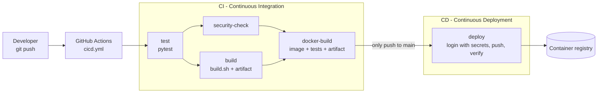

```text
push to main :  test ──┬── security-check ──┬── docker-build ── deploy
                       └── build ───────────┘
pull request :  test ──┬── security-check ──┬── docker-build    (deploy skipped)
                       └── build ───────────┘
tests fail   :  test ✗ → all other jobs skipped (nothing is deployed)
```

---

## 3. Project structure

```text
cicd-demo/                      (= 10-final-cicd-pipeline + Dockerfile + CI/CD workflow)
├── .github/
│   └── workflows/
│       └── cicd.yml            # GitHub Actions workflow (CI + CD)
├── app/
│   ├── __init__.py
│   └── calculator.py           # the application
├── tests/
│   └── test_calculator.py      # 5 pytest unit tests
├── build.sh                    # build script → build/ folder
├── requirements.txt            # pytest
├── Dockerfile                  # container image
├── .dockerignore
└── .gitignore
```

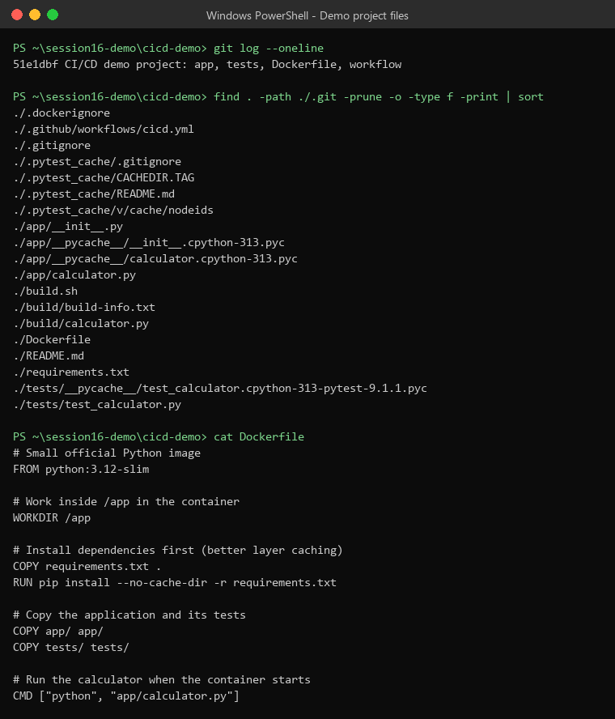

---

## 4. Application source code

The app is the calculator from `10-final-cicd-pipeline` (no changes).

**`app/calculator.py`** (main functions; the full file also has an interactive loop: `10 + 5`, `q` to quit)

```python
def add(a, b):
    return a + b

def subtract(a, b):
    return a - b

def multiply(a, b):
    return a * b

def divide(a, b):
    if b == 0:
        raise ValueError("Cannot divide by zero")
    return a / b
```

**`tests/test_calculator.py`**

```python
def test_add():            assert add(10, 5) == 15
def test_subtract():       assert subtract(10, 5) == 5
def test_multiply():       assert multiply(10, 5) == 50
def test_divide():         assert divide(10, 5) == 2
def test_divide_by_zero():
    with pytest.raises(ValueError):
        divide(10, 0)
```

**`build.sh`** copies the app into `build/` and writes `build/build-info.txt`.
**`requirements.txt`** has one line: `pytest`.

---

## 5. Dockerfile

```dockerfile
# Small official Python image
FROM python:3.12-slim

# Work inside /app in the container
WORKDIR /app

# Install dependencies first (better layer caching)
COPY requirements.txt .
RUN pip install --no-cache-dir -r requirements.txt

# Copy the application and its tests
COPY app/ app/
COPY tests/ tests/

# Run the calculator when the container starts
CMD ["python", "app/calculator.py"]
```

`.dockerignore`

```text
.git
.github
build/
__pycache__/
*.pyc
.pytest_cache/
```

Build and run it yourself:

```bash
docker build -t calculator-app:local .
printf '10 + 5\nq\n' | docker run -i --rm calculator-app:local
docker run --rm calculator-app:local python -m pytest -q     # tests inside the image
```

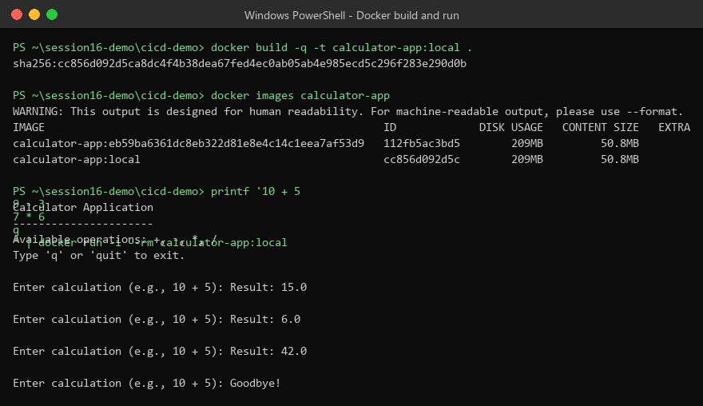

---

## 6. GitHub Actions workflow (CI + CD)

File: **`.github/workflows/cicd.yml`**

```yaml
name: CI/CD Pipeline

on:
  push:
    branches:
      - main
  pull_request:
    branches:
      - main
  workflow_dispatch:

env:
  IMAGE_NAME: calculator-app
  REGISTRY: docker.io

jobs:
  # ===================== CI =====================
  test:
    name: Test Application
    runs-on: ubuntu-latest
    steps:
      - name: Checkout source code
        uses: actions/checkout@v6

      - name: Setup Python
        uses: actions/setup-python@v7
        with:
          python-version: "3.12"

      - name: Install dependencies
        run: |
          python -m pip install --upgrade pip
          pip install -r requirements.txt

      - name: Run tests
        run: pytest -v --junitxml=test-results.xml

      - name: Upload test report
        if: always()
        uses: actions/upload-artifact@v4
        with:
          name: test-report
          path: test-results.xml

  security-check:
    name: Security Check
    needs: test
    runs-on: ubuntu-latest
    steps:
      - name: Checkout source code
        uses: actions/checkout@v6

      - name: Check for sensitive files
        run: |
          echo "Checking repository for common sensitive files..."
          if find . -type f \( -name ".env" -o -name "*.pem" -o -name "*.key" \) | grep -q .; then
            echo "Potential sensitive file found."
            exit 1
          else
            echo "No common sensitive files found."
          fi

  build:
    name: Build Application
    needs: test
    runs-on: ubuntu-latest
    steps:
      - name: Checkout source code
        uses: actions/checkout@v6

      - name: Build application
        run: |
          chmod +x build.sh
          ./build.sh

      - name: Show build output
        run: cat build/build-info.txt

      - name: Upload build artifact
        uses: actions/upload-artifact@v4
        with:
          name: calculator-build
          path: build/

  docker-build:
    name: Build Docker Image
    needs: [build, security-check]
    runs-on: ubuntu-latest
    steps:
      - name: Checkout source code
        uses: actions/checkout@v6

      - name: Build Docker image
        run: docker build -t ${{ env.IMAGE_NAME }}:${{ github.sha }} .

      - name: Run tests inside the image
        run: docker run --rm ${{ env.IMAGE_NAME }}:${{ github.sha }} python -m pytest -q

      - name: Smoke test the container
        run: printf '10 + 5\n8 / 2\nq\n' | docker run -i --rm ${{ env.IMAGE_NAME }}:${{ github.sha }}

      - name: Save image as tar file
        run: docker save ${{ env.IMAGE_NAME }}:${{ github.sha }} -o calculator-image.tar

      - name: Upload Docker image artifact
        uses: actions/upload-artifact@v4
        with:
          name: docker-image
          path: calculator-image.tar
          retention-days: 1

  # ===================== CD =====================
  deploy:
    name: Deploy (CD)
    needs: docker-build
    if: github.event_name == 'push' && github.ref == 'refs/heads/main'
    runs-on: ubuntu-latest
    environment: production
    steps:
      - name: Download Docker image artifact
        uses: actions/download-artifact@v4
        with:
          name: docker-image

      - name: Load image
        run: docker load -i calculator-image.tar

      - name: Login to registry
        run: echo "${{ secrets.DOCKERHUB_TOKEN }}" | docker login ${{ env.REGISTRY }} -u "${{ secrets.DOCKERHUB_USERNAME }}" --password-stdin

      - name: Tag and push image
        run: |
          TARGET=${{ env.REGISTRY }}/${{ secrets.DOCKERHUB_USERNAME }}/${{ env.IMAGE_NAME }}
          docker tag ${{ env.IMAGE_NAME }}:${{ github.sha }} $TARGET:${{ github.sha }}
          docker tag ${{ env.IMAGE_NAME }}:${{ github.sha }} $TARGET:latest
          docker push -q $TARGET:${{ github.sha }}
          docker push -q $TARGET:latest

      - name: Verify deployment
        run: |
          TARGET=${{ env.REGISTRY }}/${{ secrets.DOCKERHUB_USERNAME }}/${{ env.IMAGE_NAME }}
          docker pull $TARGET:latest
          printf '6 * 7\nq\n' | docker run -i --rm $TARGET:latest
          echo "Deployed $TARGET:latest (commit ${{ github.sha }})"
```

<details>
<summary>Screenshot: full workflow file (click to open)</summary>

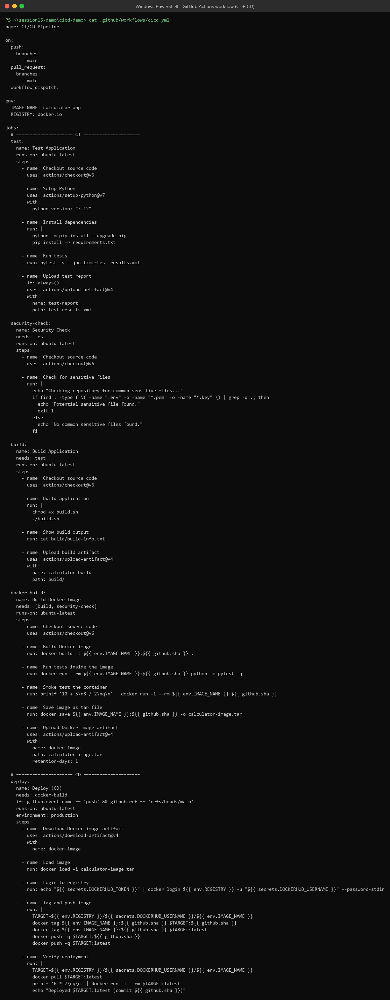

</details>

### Workflow parts

| Part | Meaning |
|---|---|
| `on:` | **Triggers**: push to `main`, pull request to `main`, manual button (`workflow_dispatch`). |
| `env:` | Workflow-level variables (`IMAGE_NAME`, `REGISTRY`). |
| `jobs:` | 5 jobs. Each one runs on its own fresh `ubuntu-latest` runner. |
| `needs:` | Sets the order. A job starts only when the jobs it needs have **passed**. |
| `if:` | Runs `deploy` only for a push to `main` (not for pull requests). |
| `uses:` | Ready-made actions: `checkout`, `setup-python`, `upload-artifact`, `download-artifact`. |
| `run:` | Shell commands. |
| `${{ github.sha }}` | Commit ID, used as the image tag, so each image can be traced to its commit. |
| `${{ secrets.X }}` | Encrypted secrets, shown as `***` in logs. |
| `environment: production` | Ties `deploy` to a GitHub Environment. You can add approval rules and environment-only secrets. |

---

## 7. CI pipeline explained

| # | Job | Needs | Steps | Purpose |
|---|---|---|---|---|
| 1 | `test` – Test Application | – | checkout → setup Python 3.12 → install deps → `pytest -v` → upload `test-report` | Catch bugs first |
| 2 | `security-check` | test | checkout → look for `.env`, `*.pem`, `*.key` | Stop leaked secret files (basic classroom check) |
| 3 | `build` – Build Application | test | checkout → `./build.sh` → show info → upload `calculator-build` | Make a build output |
| 4 | `docker-build` – Build Docker Image | build, security-check | `docker build` → tests in image → smoke test → `docker save` → upload `docker-image` | Package the app as a tested image |

### Before the pipeline: test and build on my machine

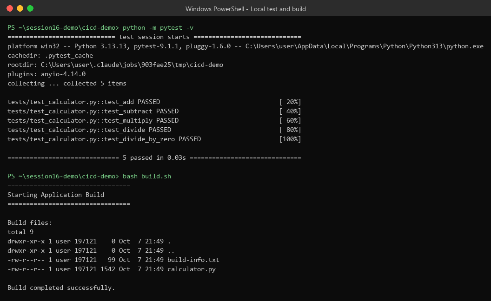

### Job 1 – `test`

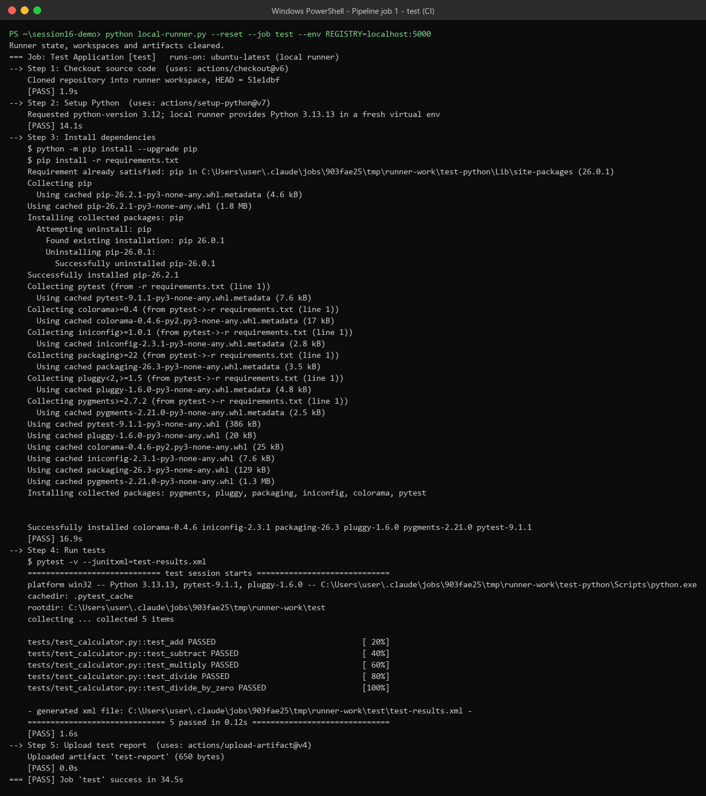

### Job 2 – `security-check`

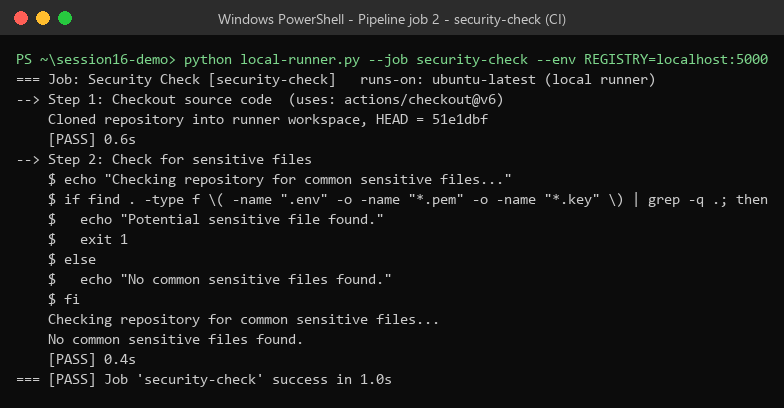

### Job 3 – `build` (uploads artifact `calculator-build`)

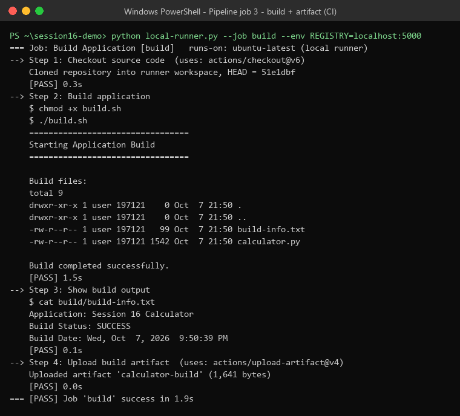

### Job 4 – `docker-build` (uploads artifact `docker-image`)

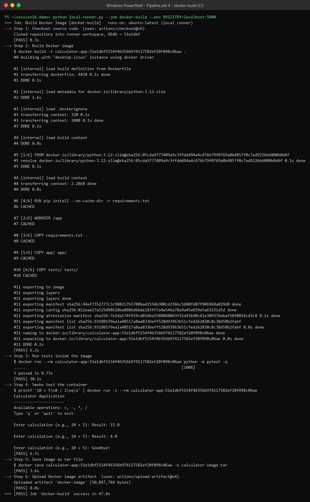

`security-check` and `build` run **in parallel**, because both only need `test`.
If `test` fails, nothing after it runs (screenshot 13).

## 8. CD pipeline explained

| # | Job | Needs | Steps | Purpose |
|---|---|---|---|---|
| 5 | `deploy` – Deploy (CD) | docker-build + `if:` push to main | download `docker-image` artifact → `docker load` → `docker login` with secrets → tag `:<sha>` and `:latest` → push → pull and run to verify | Ship the tested image |

- The deploy job **does not build again**. It uses the exact image that CI tested, passed in as an artifact. That shows "build once, deploy many".
- Pull requests run CI only. Deploy is skipped by the `if:` condition (screenshot 12).

### Job 5 – `deploy` (secrets masked as `***`)

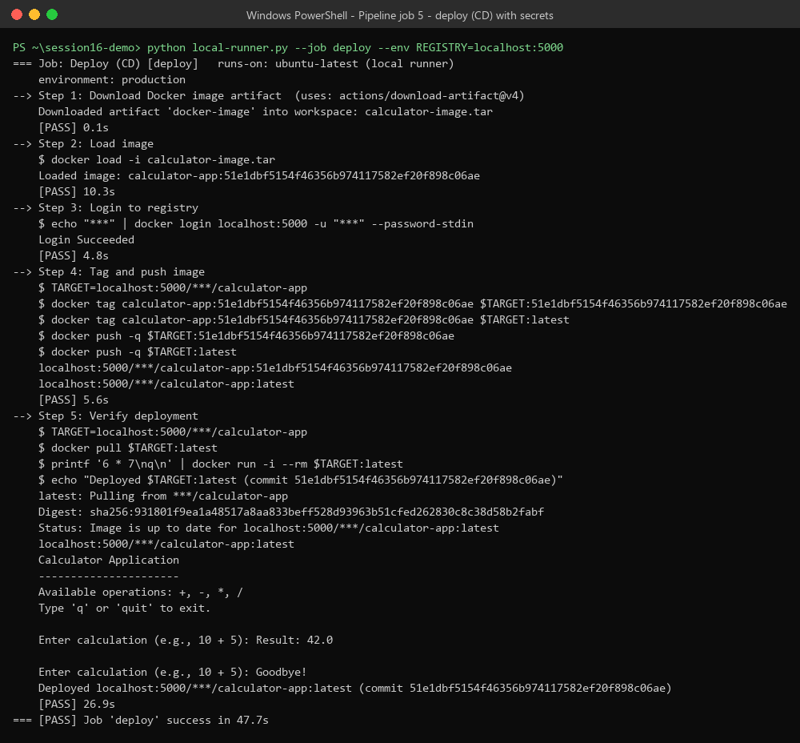

### Result: the image is in the registry and runs

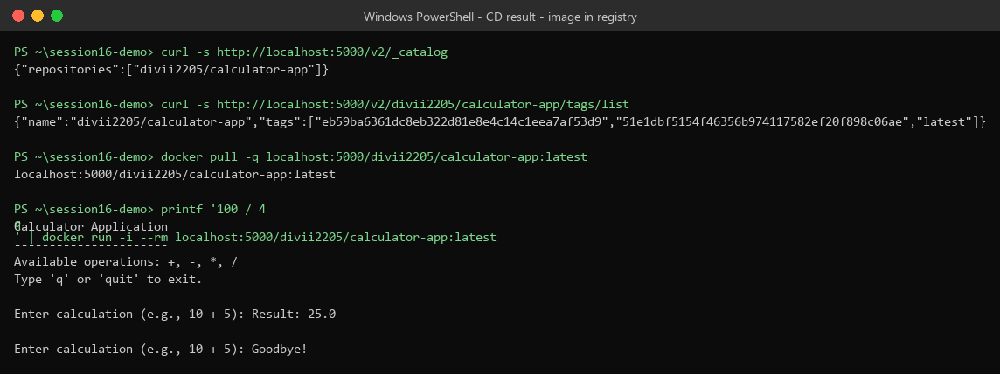

---

## 9. Secrets

Add these in GitHub: **Repo → Settings → Secrets and variables → Actions → New repository secret**
(or under **Environments → production** to keep them only for the deploy job).

| Secret | Value |
|---|---|
| `DOCKERHUB_USERNAME` | Your Docker Hub username |
| `DOCKERHUB_TOKEN` | Docker Hub access token (Account settings → Personal access tokens) |

Rules followed:
- No password is written in the YAML. Only `${{ secrets.NAME }}` is used.
- The token is sent with `--password-stdin`, so it never appears on the command line.
- Secret values are **masked as `***`** in the logs (see screenshot 09: `docker login localhost:5000 -u "***"`).

---

## 10. Artifacts

| Artifact | Made by | Content | Used by |
|---|---|---|---|
| `test-report` | `test` (`if: always()`, so it uploads even when tests fail) | `test-results.xml` (JUnit) | People (download from the run page) |
| `calculator-build` | `build` | `build/calculator.py`, `build/build-info.txt` | People / later releases |
| `docker-image` | `docker-build` | `calculator-image.tar` (about 50 MB, kept for 1 day) | `deploy` job (`download-artifact`) |

All three artifacts and their content after the run:

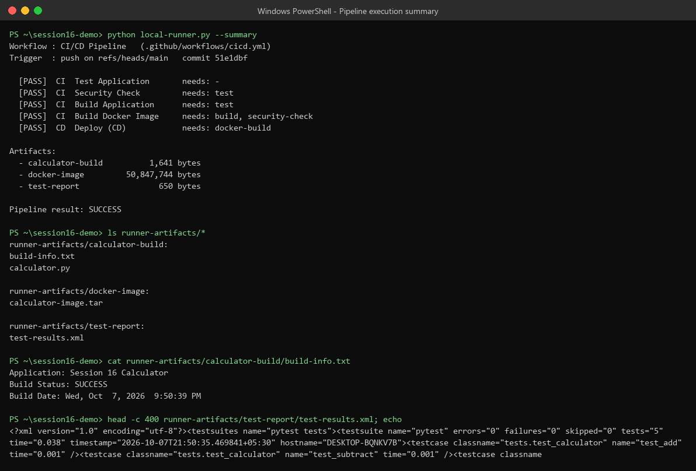

---

## 11. Pipeline execution (screenshots)

### How it was executed

The workflow was run on my machine with a small helper script, `local-runner.py`. It reads `.github/workflows/cicd.yml` and acts like a GitHub runner:

- every job starts in a **fresh folder** with a real `git clone` of the repo (`actions/checkout`)
- `actions/setup-python` → a **fresh virtual env** (local Python 3.13 instead of 3.12)
- every `run:` step runs **as written** in bash, and a step that fails stops its job
- `needs:` and `if:` are respected, so a job is skipped when a needed job did not pass
- `upload-artifact` / `download-artifact` → a shared `runner-artifacts/` folder
- `secrets.*` come from a local file and are **masked as `***`** in the output

For CD, a local Docker registry (`registry:2` on `localhost:5000`) was used in place of Docker Hub (`--env REGISTRY=localhost:5000`). The workflow itself was not changed.

### Screenshots

| # | Screenshot | What it shows |
|---|---|---|
| 01 | `screenshots/01-project-structure.png` | Repo files, commit, Dockerfile |
| 02 | `screenshots/02-github-actions-workflow.png` | Full `cicd.yml` |
| 03 | `screenshots/03-local-test-and-build.png` | `pytest -v` → **5 passed**, `build.sh` → build OK |
| 04 | `screenshots/04-docker-build-and-run.png` | `docker build`, image listed, container runs: `10+5=15`, `9-3=6`, `7*6=42` |
| 05 | `screenshots/05-ci-job-test.png` | **Job `test`**: checkout → setup-python → install → `pytest` 5 passed → upload `test-report` ✅ |
| 06 | `screenshots/06-ci-job-security-check.png` | **Job `security-check`**: "No common sensitive files found." ✅ |
| 07 | `screenshots/07-ci-job-build-artifact.png` | **Job `build`**: `build.sh`, `build-info.txt`, upload `calculator-build` ✅ |
| 08 | `screenshots/08-ci-job-docker-build.png` | **Job `docker-build`**: image `calculator-app:<sha>`, 5 tests pass inside the image, smoke test, upload `docker-image` ✅ |
| 09 | `screenshots/09-cd-job-deploy.png` | **Job `deploy` (CD)**: download artifact, load, `docker login` with masked secrets (`***`), push `:<sha>` and `:latest`, pull and run (`6*7=42`) ✅ |
| 10 | `screenshots/10-pipeline-success-summary.png` | **All 5 jobs PASS, pipeline result SUCCESS**, plus the 3 artifacts |
| 11 | `screenshots/11-deployed-image-registry.png` | Registry catalog shows `divii2205/calculator-app` with tags `<sha>` and `latest`; pulled image runs (`100/4=25`) |
| 12 | `screenshots/12-pull-request-ci-only.png` | Pull-request run: 4 CI jobs pass, `deploy` **skipped** by the `if:` condition (CI vs CD) |
| 13 | `screenshots/13-failure-scenario-tests-fail.png` | `add()` broken on purpose: `test_add` FAILED (`assert 5 == 15`), all later jobs **skipped**, nothing deployed |

### Successful run result (from screenshot 10)

```text
Workflow : CI/CD Pipeline   (.github/workflows/cicd.yml)
Trigger  : push on refs/heads/main   commit 51e1dbf

  [PASS]  CI  Test Application       needs: -
  [PASS]  CI  Security Check         needs: test
  [PASS]  CI  Build Application      needs: test
  [PASS]  CI  Build Docker Image     needs: build, security-check
  [PASS]  CD  Deploy (CD)            needs: docker-build

Artifacts:
  - calculator-build     (build-info.txt, calculator.py)
  - docker-image         (calculator-image.tar)
  - test-report          (test-results.xml)

Pipeline result: SUCCESS
```

### Pull-request run: CI only, CD skipped (screenshot 12)

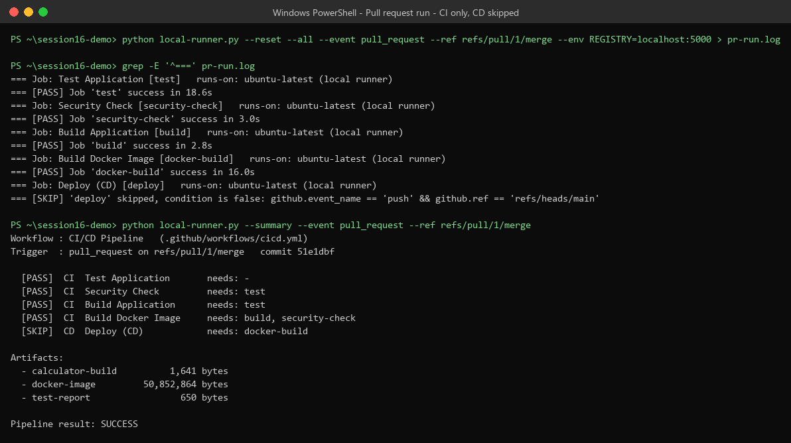

### Failure run result (from screenshot 13)

```text
FAILED tests/test_calculator.py::test_add - assert 5 == 15
Error: Process completed with exit code 1.

  [FAIL]  CI  Test Application
  [SKIP]  CI  Security Check
  [SKIP]  CI  Build Application
  [SKIP]  CI  Build Docker Image
  [SKIP]  CD  Deploy (CD)

Pipeline result: FAILED
```

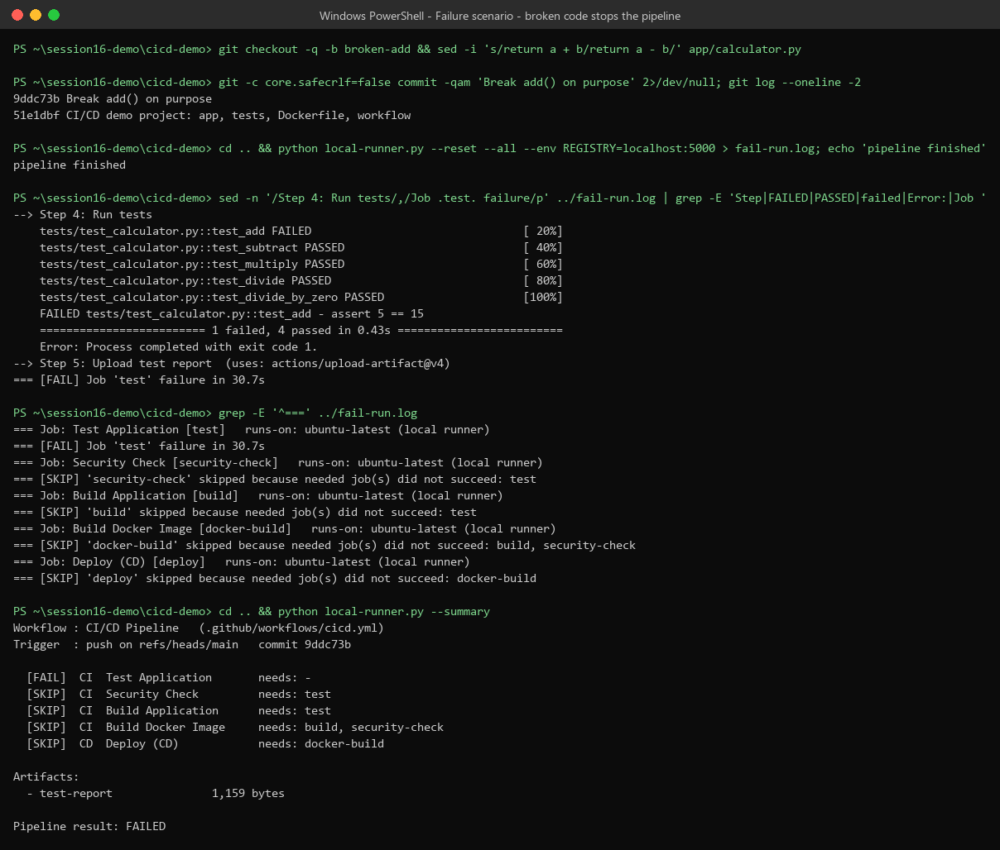

This is the main point of CI/CD: **broken code never reaches deployment.**

---

## 12. How to run it on GitHub

```bash
# 1. New GitHub repo (example name: session16-cicd-demo), then from the project folder:
git init
git add .
git commit -m "CI/CD demo: app, tests, Dockerfile, GitHub Actions workflow"
git branch -M main
git remote add origin https://github.com/<your-username>/session16-cicd-demo.git

# 2. Add secrets DOCKERHUB_USERNAME and DOCKERHUB_TOKEN (section 9)
#    and create the Environment "production" (Settings → Environments).

# 3. Push. This starts the workflow.
git push -u origin main
```

Then open the **Actions** tab → **CI/CD Pipeline** → the latest run. You will see:

```text
CI/CD Pipeline
├── ✓ Test Application
├── ✓ Security Check
├── ✓ Build Application
├── ✓ Build Docker Image
└── ✓ Deploy (CD)
Artifacts: test-report, calculator-build, docker-image
```

Other ways to start it:
- **Actions → CI/CD Pipeline → Run workflow** (manual, `workflow_dispatch`)
- Open a pull request to `main` (CI only, deploy skipped)
- With GitHub CLI: `gh workflow run cicd.yml` and `gh run watch`

---

## 13. Summary

- **CI** (`test` → `security-check` + `build` → `docker-build`) runs on every push and every PR. It tests the code, checks for secret files, builds the app, and builds and tests a Docker image.
- **CD** (`deploy`) runs only on push to `main` and only after CI passes. It logs in with **secrets**, pushes the **same tested image** (passed as an **artifact**) to the registry, and checks that it runs.
- **Runners** (`ubuntu-latest`) give each job a fresh machine. **Jobs** are ordered with `needs:`, and **steps** use `uses:` (actions) or `run:` (commands).
- The pipeline ran with all 5 jobs passing. Broken code stopped it at the test job, and pull requests ran CI only.
