# Session 17 — Complete CI/CD & DevSecOps (Assignment Submission)

This is a full **CI/CD + DevSecOps pipeline** for the Flask demo app in [`../demo/`](../demo/).
I ran **every stage for real** on my laptop, in the order the assignment asks for. Each screenshot below is real command output.

> **How I ran it:** the existing workflow file (`demo/.github/workflows/devsecops.yml`) is inside a sub-folder, so GitHub never runs it. GitHub only runs workflows from the repo's top-level `.github/workflows/` folder. It also pushes to the instructor's Docker Hub account. So I ran the **same stages locally**, using the same tools in Docker containers. I **did not change any files** in the session folder.

---

## 1. Pipeline flow

```text
Code ─► Build ─► Unit Test ─► SAST ─► SCA ─► Secret Scan ─► Docker Build ─► Image Scan ─► SECURITY GATE ─► Push Image ─► Deploy to K8s
                                                                                               │
                                                                    any check fails ──► BLOCK (nothing is pushed or deployed)
```

## 2. Results at a glance

| # | Stage | Tool | Result |
| :--- | :--- | :--- | :--- |
| 1 | Build | Python 3.12 + pip | ✅ app builds and loads (8 routes) |
| 2 | Unit tests | pytest + pytest-cov | ✅ **8 / 8 passed**, 69% coverage |
| 3 | SAST | Bandit (CodeQL in the workflow) | ❌ **1 HIGH**: `debug=True` → fixed → ✅ |
| 4 | SCA | pip-audit | ✅ no known vulnerable packages |
| 5 | Secret scan | gitleaks | ✅ no secrets (files + git history) |
| 6 | Docker build | Docker | ✅ `session17-python:d4821d2` |
| 7 | Image scan | Trivy / Docker Scout | ⚠️ **not run**: see section 6 |
| 8 | Security gate | gate script (below) | ❌ **BLOCKED** on the original code → ✅ **PASSED** after the fix |
| 9 | Push image | Docker registry (`registry:2`) | ✅ `localhost:5000/session17-python:d4821d2-secfix` |
| 10 | Deploy | Kubernetes (minikube) | ✅ 2/2 Pods running, app answers |

The important part: **the security gate did its job**. It found a real, dangerous problem and stopped the pipeline before the image could be pushed or deployed.

---

## 3. Project files (all already in the session)

| Deliverable | File |
| :--- | :--- |
| Application | [`demo/app/app.py`](../demo/app/app.py) (Flask: web page + JSON APIs) |
| Unit tests | [`demo/tests/test_app.py`](../demo/tests/test_app.py) (8 tests), [`demo/pytest.ini`](../demo/pytest.ini) |
| Dependencies | [`demo/requirements.txt`](../demo/requirements.txt), [`demo/requirements-dev.txt`](../demo/requirements-dev.txt) |
| Dockerfile | [`demo/Dockerfile`](../demo/Dockerfile) |
| GitHub Actions workflow | [`demo/.github/workflows/devsecops.yml`](../demo/.github/workflows/devsecops.yml) |
| Kubernetes manifests | [`demo/k8s/deployment.yaml`](../demo/k8s/deployment.yaml), [`demo/k8s/service.yaml`](../demo/k8s/service.yaml) |
| Security tools config | the workflow file + the tool commands and gate script in this README (section 5) |

### What the workflow does (job by job)

| Job | Needs | What it runs |
| :--- | :--- | :--- |
| `test` | – | `pytest --cov=app` |
| `sast` | – | GitHub **CodeQL** for Python |
| `sca` | – | `pip-audit` |
| `docker-build` | test, sast, sca | `docker build -t session17-python:${{ github.sha }} .` |
| `image-scan` | docker-build | `trivy image --severity HIGH,CRITICAL` |
| `push` | image-scan | log in to Docker Hub, push `:sha` and `:latest` |
| `deploy` | push | create a **kind** cluster, `sed` the image tag into `k8s/deployment.yaml`, apply, `rollout status`, curl the site |

`needs:` is what makes this a pipeline. Each job only starts if the jobs it needs have passed.

---

## 4. Running the pipeline, stage by stage

All commands run from `session-17-devsecops/demo` in Git Bash. The project folder is mounted **read-only** (`:ro`) into each tool container, so no tool can change the repo.

### Stage 1 — Build

Install the dependencies and make sure the app compiles and loads.

```bash
docker run --rm -v "$(pwd -W):/src:ro" python:3.12-slim sh -c '
  cp -r /src /work && cd /work &&
  pip install -r requirements-dev.txt &&
  python -m compileall -q app &&
  python -c "from app.app import app; print(app.name)"'
```

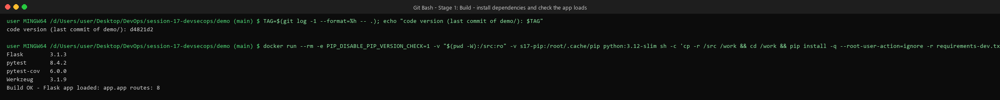

The image tag is the **git commit of the demo code** (`d4821d2`), just like `${{ github.sha }}` in the workflow.

### Stage 2 — Unit tests

```bash
pytest -v --cov=app --cov-report=term-missing
```

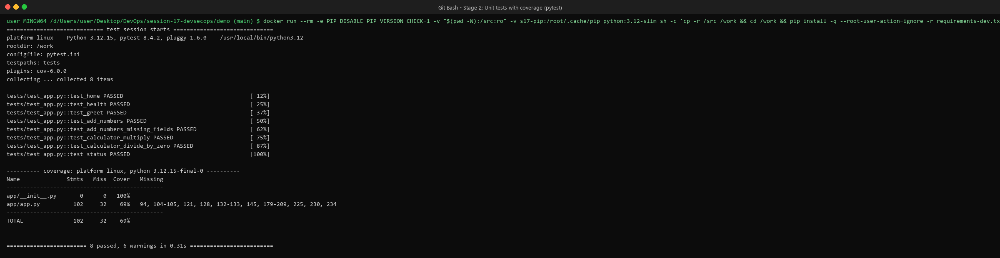

**8 passed**, 69% coverage. The untested part (lines 179–209) is the `/api/pipeline/run` simulator, which a future test could cover.
(pytest also prints 6 warnings because `datetime.utcnow()` is deprecated in Python 3.12. They don't break anything, but the app should switch to `datetime.now(datetime.UTC)`.)

### Stage 3 — SAST (Static Application Security Testing)

SAST reads the **source code** and looks for risky patterns. The workflow uses **CodeQL**, which only runs on GitHub, so locally I used **Bandit**, the standard SAST tool for Python.

```bash
pip install bandit
bandit -r app
```

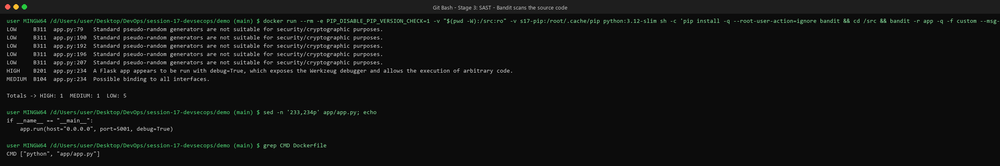

| Severity | Rule | Where | Meaning |
| :--- | :--- | :--- | :--- |
| **HIGH** | B201 | `app.py:234` | `app.run(..., debug=True)`. The Flask/Werkzeug **debugger is turned on**. |
| Medium | B104 | `app.py:234` | Listens on `0.0.0.0` (all network interfaces) |
| Low ×5 | B311 | `app.py:79, 190…207` | Uses `random`, which isn't safe for passwords or tokens |

**Why the HIGH finding is serious:** the Dockerfile runs `CMD ["python", "app/app.py"]`, which is exactly this line. So the **container runs in debug mode**. The Werkzeug debugger lets anyone who can open an error page **run Python code on the server** (CWE-94, remote code execution).

The other two are fine here: a container *must* listen on `0.0.0.0` so that Kubernetes can reach it, and `random` is only used to pick a greeting message.

### Stage 4 — SCA (Software Composition Analysis)

SCA checks the **libraries we depend on** (and their dependencies) against public vulnerability databases.

```bash
pip install pip-audit
pip-audit -r requirements.txt
```

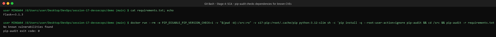

`Flask==3.1.3` and everything it pulls in (Werkzeug, Jinja2, …): **no known vulnerabilities**.

### Stage 5 — Secret scanning

Looks for passwords, API keys and tokens that were accidentally committed. The workflow has **no secret-scanning job** (see section 7), so I added this stage using **gitleaks**:

```bash
# 1) the files as they are now
docker run --rm -v "$(pwd -W):/src:ro" zricethezav/gitleaks:latest dir /src --redact
# 2) the git history of this folder (secrets often hide in old commits)
docker run --rm -v "<repo>:/repo:ro" zricethezav/gitleaks:latest git /repo --redact --log-opts='-- session-17-devsecops'
```

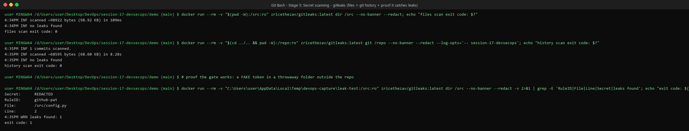

- Files: **no leaks found**. Git history: **no leaks found**.
- **Proof that it really works:** I put a **fake** GitHub token in a throwaway folder *outside* the repo, and gitleaks caught it (`RuleID: github-pat`, exit code 1). A scanner that never finds anything could just be broken, so this test matters.

### Stage 6 — Docker build

```bash
docker build -t session17-python:$(git log -1 --format=%h -- .) .
```

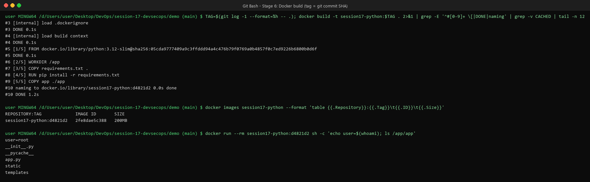

Image `session17-python:d4821d2`, about 200 MB. Two things I noticed inside the image:
- It runs as **root** (`user=root`). If someone breaks into the app, they get root inside the container.
- `__pycache__` was copied in. The `.dockerignore` file is **empty**, and its name has extra characters (`.dockerignore  │`), so Docker ignores it.

### Stage 7 — Container image scan ⚠️ not run

The image scan checks the **operating system packages** inside the image (Debian packages in `python:3.12-slim`), which pip-audit can't see.

- **Trivy** (the tool the workflow uses) needs to download a large vulnerability database first. On my laptop this download **failed twice**: the network reset the connection, and then the computer ran out of memory. I deleted the partial download.
- **Docker Scout** (built into Docker Desktop, scans in the cloud) needs a Docker Hub login, which I didn't have on this machine.

So **this stage was not run**. This is the command I would use. In the workflow it runs on GitHub's servers, where the download isn't a problem:

```bash
trivy image --severity HIGH,CRITICAL --ignore-unfixed --exit-code 1 session17-python:<tag>
# or, after `docker login`:
docker scout cves --only-severity critical,high --exit-code session17-python:<tag>
```

### Stage 8 — Security gate

A **security gate** is the "stop" point in the pipeline. If any security check fails, the image is **not** pushed or deployed.
My gate re-runs every check and decides **PASS** or **BLOCK**:

| Check | Rule to pass |
| :--- | :--- |
| Unit tests | all tests pass |
| SAST (Bandit) | **no HIGH** severity issues (`bandit -lll`) |
| SCA (pip-audit) | no known vulnerable packages |
| Secrets (gitleaks) | no secrets found |

<details>
<summary>Gate script, slightly shortened (click to open)</summary>

```bash
#!/usr/bin/env bash
# Security gate: runs every check against a source folder and blocks if any fails.
SRC="$(cd "$1" && pwd -W)"
PY="docker run --rm -v $SRC:/src:ro python:3.12-slim sh -c"
FAILED=0
check() { name="$1"; rule="$2"; shift 2
  if "$@" >/dev/null 2>&1; then printf '  %-22s %-38s PASS\n' "$name" "$rule"
  else printf '  %-22s %-38s FAIL\n' "$name" "$rule"; FAILED=1; fi; }

echo "================ SECURITY GATE ================"
check "Unit tests"      "all tests must pass"          $PY 'cp -r /src /work && cd /work && pip install -q -r requirements-dev.txt && pytest -q'
check "SAST (Bandit)"   "no HIGH severity issues"      $PY 'pip install -q bandit && bandit -r /src/app -q -lll'
check "SCA (pip-audit)" "no known vulnerable packages" $PY 'pip install -q pip-audit && pip-audit -r /src/requirements.txt'
check "Secrets (gitleaks)" "no secrets in the code"    docker run --rm -v "$SRC:/src:ro" zricethezav/gitleaks:latest dir /src
echo "==============================================="
[ $FAILED -eq 0 ] && echo "GATE RESULT: PASSED" || echo "GATE RESULT: BLOCKED"
exit $FAILED
```
</details>

#### Run 1: the original code is BLOCKED ❌

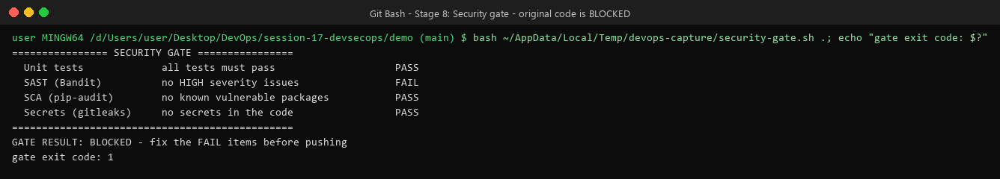

SAST failed because of the HIGH `debug=True` finding, so the gate returned exit code 1 and **the pipeline stopped**. This is the correct result: this image should never reach production.

#### The fix (one line)

```diff
- app.run(host="0.0.0.0", port=5001, debug=True)
+ app.run(host="0.0.0.0", port=5001, debug=os.environ.get("FLASK_DEBUG") == "1")  # nosec B104 - must listen on all interfaces inside the container
```

Debug mode is now **off by default** and can only be turned on on purpose (`FLASK_DEBUG=1`, for local development only). The `# nosec B104` comment records *why* listening on `0.0.0.0` is acceptable here, instead of silently ignoring it.

> I applied this fix in a **temporary copy** of the demo outside the repo, because I don't change existing session files. **The same one-line change should be made in `demo/app/app.py`.**

#### Run 2: after the fix, the gate PASSES ✅

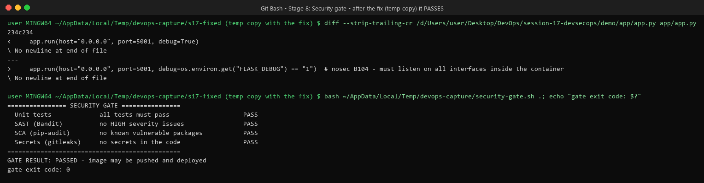

All four checks pass, so the pipeline is allowed to continue.

### Stage 9 — Push image to the container registry

Only after the gate passed did I push the image. I used a **local Docker registry**, the same kind of server as Docker Hub, but running on my laptop and free. That way I didn't need the instructor's Docker Hub account or token.

```bash
docker run -d -p 5000:5000 --name s17-registry registry:2
docker build -t localhost:5000/session17-python:d4821d2-secfix .
docker push localhost:5000/session17-python:d4821d2-secfix
curl http://localhost:5000/v2/_catalog
```

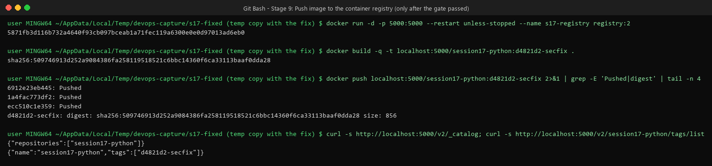

The registry now holds `session17-python` with tag `d4821d2-secfix`.

### Stage 10 — Deploy to Kubernetes

The workflow creates a kind cluster. I used my existing **minikube** cluster.
minikube runs in its own container and can't reach `localhost:5000` on my laptop, so I copied the pushed image into minikube with `minikube image load`. Then I applied the repo's own manifests. Like the workflow's `sed` step, I put the real image name in through a pipe, so the file itself isn't changed:

```bash
minikube image load localhost:5000/session17-python:d4821d2-secfix
sed -e 's|nensiravaliya28/hey-cicd:__IMAGE_TAG__|localhost:5000/session17-python:d4821d2-secfix|' \
    -e 's|imagePullPolicy: Always|imagePullPolicy: IfNotPresent|' \
    k8s/deployment.yaml | kubectl apply -f -
kubectl apply -f k8s/service.yaml
kubectl rollout status deployment/session17-python
```

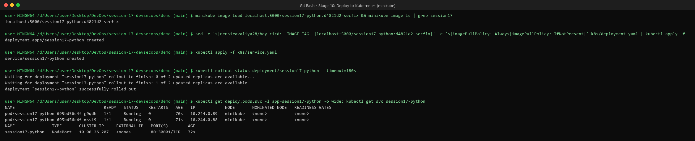

2 Pods `Running`, NodePort Service on port `30001`.

#### Verify (the same checks as the workflow's last step)

```bash
kubectl port-forward service/session17-python 5001:80
curl http://localhost:5001                 # web page
curl http://localhost:5001/health
curl http://localhost:5001/api/status
curl -X POST http://localhost:5001/api/add -H 'Content-Type: application/json' -d '{"number1":10,"number2":20}'
kubectl logs deployment/session17-python
```

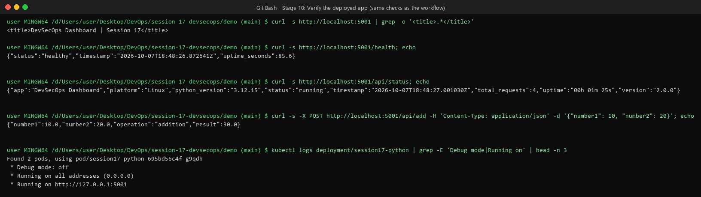

The page title is `DevSecOps Dashboard`, `/health` says `healthy`, the add API returns `30.0`, and the logs say **`Debug mode: off`**. The security fix is live. ✅

---

## 5. Security tools used

| Type | Tool | What it looks at | When it fails the pipeline |
| :--- | :--- | :--- | :--- |
| SAST | CodeQL (GitHub) / **Bandit** (local) | our **source code** | Bandit: any HIGH issue (`-lll`) |
| SCA | **pip-audit** | our **dependencies** | any known CVE |
| Secret scan | **gitleaks** | files **and git history** | any secret found |
| Image scan | **Trivy** / Docker Scout | OS packages **inside the image** | HIGH/CRITICAL with a fix available (`--exit-code 1`) |
| Gate | gate script / `needs:` in the workflow | results of all of the above | any check fails |

---

## 6. Problems I ran into

| Problem | What happened | What I did |
| :--- | :--- | :--- |
| Workflow never runs | It's in `demo/.github/workflows/`, but GitHub only reads `.github/workflows/` at the **repo root** | Ran the same stages locally |
| Push needs someone else's account | `nensiravaliya28` Docker Hub + `DOCKERHUB_TOKEN` | Used a local `registry:2` registry |
| Trivy database download | Network reset, then the laptop ran out of memory | Stage not run; partial download deleted; commands documented |
| Docker Hub DNS blip | `lookup registry-1.docker.io: no such host` | Retried, worked |
| App "Running" but not ready | Under memory pressure Python took ~2 min to start, and the first curl was refused | Waited and re-tested. There's **no readiness probe** in `deployment.yaml` (see below). |

---

## 7. Problems found in the existing project, and how to fix them

These are real findings from running the pipeline. I didn't change the files; these are my recommendations.

1. **`debug=True` in `app.py` (HIGH, CWE-94):** use the one-line fix from Stage 8.
2. **The Trivy step is not a real gate:** `trivy image --severity HIGH,CRITICAL` without `--exit-code 1` only *prints* problems and always passes. Change it to:
   ```yaml
   - name: Scan image
     run: trivy image --severity HIGH,CRITICAL --ignore-unfixed --exit-code 1 session17-python:${{ github.sha }}
   ```
3. **No secret-scanning job:** add one, and make `docker-build` depend on it:
   ```yaml
   secret-scan:
     name: Secret Scan - gitleaks
     runs-on: ubuntu-latest
     steps:
       - uses: actions/checkout@v4
         with:
           fetch-depth: 0          # full history, not just the last commit
       - uses: gitleaks/gitleaks-action@v2
         env:
           GITHUB_TOKEN: ${{ secrets.GITHUB_TOKEN }}

   docker-build:
     needs: [test, sast, sca, secret-scan]
   ```
4. **The workflow location:** move it to the repo root (`.github/workflows/`) and set `defaults.run.working-directory: session-17-devsecops/demo`, or GitHub will never run it.
5. **Push uses the instructor's account:** change `nensiravaliya28` to your own Docker Hub user and add your own `DOCKERHUB_TOKEN` secret.
6. **The image is built 3 times** (`docker-build`, `image-scan`, `push`), so the image that gets pushed is not exactly the one that was scanned. Build once, then save it as an artifact or push it to a staging tag, and reuse it.
7. **The container runs as root:** add a normal user to the Dockerfile:
   ```dockerfile
   RUN useradd --create-home appuser
   USER appuser
   ```
8. **Flask's development server in production:** use a real server like `gunicorn -b 0.0.0.0:5001 app.app:app`.
9. **The broken `.dockerignore`:** rename it to exactly `.dockerignore` and list `__pycache__/`, `.coverage`, `tests/`, `.github/`.
10. **No probes in `deployment.yaml`:** add a readiness probe on `/health`, so traffic only arrives once the app is really ready (this was the startup problem I hit):
    ```yaml
    readinessProbe:
      httpGet: { path: /health, port: 5001 }
      initialDelaySeconds: 5
      periodSeconds: 5
    ```
11. **No resource requests/limits** in `deployment.yaml`. Add them, as in Session 13.

---

## 8. What I learned

- **Shift left:** checks that run early (tests, SAST, SCA, secrets) are cheap and fast. A problem found before `docker build` costs almost nothing to fix.
- **Each tool sees something different:** SAST sees *our* code, SCA sees *our libraries*, secret scanning sees *leaked keys*, and image scanning sees the *operating system* in the image. You need all of them.
- **A scan is not a gate.** If a tool doesn't fail the pipeline (exit code ≠ 0), it's only a report. The Trivy step in the workflow had exactly this problem.
- **Test your scanners.** The fake-token test proved gitleaks really blocks leaks.
- **Tag images with the commit SHA**, so you always know which code is running.

## Cleanup

```bash
kubectl delete -f ../demo/k8s/service.yaml
kubectl delete deployment session17-python
docker rm -f s17-registry
```
