# Lecture 10 — Kubernetes Core Objects, Pod Lifecycle & Deployment Strategies

> **Why `-n s10-lab` on every command?** The cluster was shared, so all work was confined to a
> dedicated namespace and every manifest carries `namespace: s10-lab`. Each lab's resources were
> deleted before the next lab started, so memory never accumulated.

> **How NodePort services were reached.** With minikube's docker driver on Windows the node IP
> (`192.168.49.2`) sits inside a Docker network the Windows host cannot route to. All HTTP checks
> therefore run *inside the node* via `minikube ssh "curl -s http://localhost:<nodePort>"`, which
> still exercises the real NodePort → kube-proxy → Pod datapath.

---

## Task 1 — Cluster Health Verification & Baseline Environment Checks

**Objective:** confirm the control plane, CoreDNS and node are healthy before deploying anything.

### Commands

```bash
kubectl version --output=yaml | head -18
kubectl cluster-info
kubectl get nodes -o wide
kubectl create namespace s10-lab
kubectl get ns s10-lab
```

### Real output

```
PS D:\Users\user\Desktop\DevOps> kubectl version --output=yaml | head -18
Warning: version difference between client (1.34) and server (1.37) exceeds the supported minor version skew of +/-1
clientVersion:
  buildDate: "2025-09-09T19:44:50Z"
  compiler: gc
  gitCommit: 93248f9ae092f571eb870b7664c534bfc7d00f03
  gitTreeState: clean
  gitVersion: v1.34.1
  goVersion: go1.24.6
  major: "1"
  minor: "34"
  platform: windows/amd64
kustomizeVersion: v5.7.1
serverVersion:
  buildDate: "2026-08-26T10:44:25Z"
  compiler: gc
  emulationMajor: "1"
  emulationMinor: "37"
  gitCommit: f54c212e3a2f75d674b717a9b29052b20b60aefc
  gitTreeState: clean

PS D:\Users\user\Desktop\DevOps> kubectl cluster-info
Kubernetes control plane is running at https://127.0.0.1:60410
CoreDNS is running at https://127.0.0.1:60410/api/v1/namespaces/kube-system/services/kube-dns:dns/proxy

To further debug and diagnose cluster problems, use 'kubectl cluster-info dump'.

PS D:\Users\user\Desktop\DevOps> kubectl get nodes -o wide
NAME       STATUS   ROLES           AGE     VERSION   INTERNAL-IP    EXTERNAL-IP   OS-IMAGE                         KERNEL-VERSION                             CONTAINER-RUNTIME
minikube   Ready    control-plane   2d21h   v1.37.0   192.168.49.2   <none>        Debian GNU/Linux 12 (bookworm)   6.6.87.2-microsoft-standard-WSL2 (amd64)   containerd://2.3.4

PS D:\Users\user\Desktop\DevOps> kubectl get ns s10-lab
NAME      STATUS   AGE
s10-lab   Active   74s
```

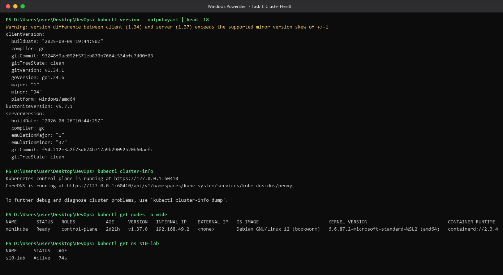

### What happened / why

`kubectl cluster-info` proves two things: the **API server** is reachable — here through minikube's
port-forwarded loopback endpoint `127.0.0.1:60410`, not the node's own IP — and the **CoreDNS**
service is registered and being proxied. `kubectl get nodes -o wide` shows the node `Ready`,
meaning its kubelet is posting healthy status and carries no `NotReady` taint, so the scheduler
is willing to place pods on it.

Note the **version-skew warning**: kubectl is v1.34 while the API server is v1.37. Kubernetes only
guarantees ±1 minor version of client/server compatibility, which explains a couple of cosmetic
output differences noted later in [Deviations & Notes](#deviations--notes). All core operations
worked correctly regardless.

---

## Task 2 — Standard Pod Deployment, Extended Inspection & Teardown (`pod.yml`)

**Objective:** create a bare Pod with the 4 mandatory top-level fields, inspect its runtime
identity (IP, node, labels, logs) and delete it cleanly.

### Manifest — [`manifests/pod.yml`](./manifests/pod.yml)

```yaml
apiVersion: v1          # 1. which API group/version validates this object
kind: Pod               # 2. what kind of object
metadata:               # 3. identity: name, namespace, labels
  name: nginx-pod
  namespace: s10-lab
  labels:
    app: nginx
spec:                   # 4. desired state
  containers:
    - name: nginx
      image: nginx:alpine
      ports:
        - containerPort: 80
      resources:
        requests:
          cpu: "20m"
          memory: "32Mi"
        limits:
          cpu: "100m"
          memory: "64Mi"
```

### Commands

```bash
kubectl apply -f manifests/pod.yml
kubectl get pods -n s10-lab
kubectl get pods -n s10-lab -o wide
kubectl get pod nginx-pod -n s10-lab --show-labels
kubectl logs nginx-pod -n s10-lab | tail -8
kubectl describe pod nginx-pod -n s10-lab | grep -E 'Node:|IP:|Image:|Status:|Container ID:'
kubectl delete -f manifests/pod.yml
kubectl get pods -n s10-lab
```

### Real output

```
PS D:\Users\user\Desktop\DevOps> kubectl apply -f .../manifests/pod.yml
pod/nginx-pod created

PS D:\Users\user\Desktop\DevOps> kubectl get pods -n s10-lab
NAME        READY   STATUS    RESTARTS   AGE
nginx-pod   1/1     Running   0          27s

PS D:\Users\user\Desktop\DevOps> kubectl get pods -n s10-lab -o wide
NAME        READY   STATUS    RESTARTS   AGE   IP            NODE       NOMINATED NODE   READINESS GATES
nginx-pod   1/1     Running   0          27s   10.244.0.26   minikube   <none>           <none>

PS D:\Users\user\Desktop\DevOps> kubectl get pod nginx-pod -n s10-lab --show-labels
NAME        READY   STATUS    RESTARTS   AGE   LABELS
nginx-pod   1/1     Running   0          27s   app=nginx

PS D:\Users\user\Desktop\DevOps> kubectl logs nginx-pod -n s10-lab | tail -8
/docker-entrypoint.sh: /docker-entrypoint.d/ is not empty, will attempt to perform configuration
/docker-entrypoint.sh: Looking for shell scripts in /docker-entrypoint.d/
/docker-entrypoint.sh: Launching /docker-entrypoint.d/10-listen-on-ipv6-by-default.sh
10-listen-on-ipv6-by-default.sh: info: Getting the checksum of /etc/nginx/conf.d/default.conf
```

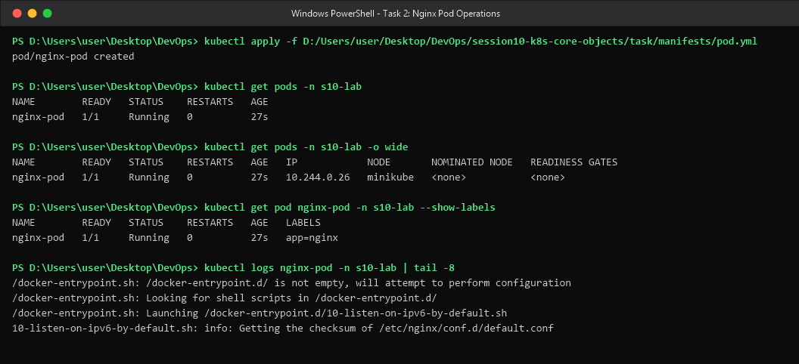

```
PS D:\Users\user\Desktop\DevOps> kubectl describe pod nginx-pod -n s10-lab | grep -E 'Node:|IP:|Image:|Status:|Container ID:' | head -8
Node:             minikube/192.168.49.2
Status:           Running
IP:               10.244.0.26
  IP:  10.244.0.26
    Container ID:   containerd://f9eeae1398b69ec2736c20d7419e79cab94d2b1b551ad227caf60b5faba226a2
    Image:          nginx:alpine

PS D:\Users\user\Desktop\DevOps> kubectl delete -f .../manifests/pod.yml
pod "nginx-pod" deleted from s10-lab namespace

PS D:\Users\user\Desktop\DevOps> kubectl get pods -n s10-lab
No resources found in s10-lab namespace.
```

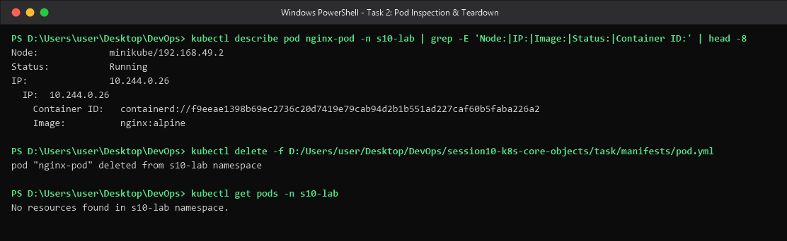

### What happened / why

`READY 1/1` means one of one containers has passed its readiness gate — with no probe defined, a
running container is immediately Ready. The pod received cluster IP **`10.244.0.26`** from the CNI
plugin's per-node pod CIDR and the scheduler bound it to node `minikube`. That IP is ephemeral: it
belongs to the pod's network namespace and dies with the pod, which is exactly why Services exist.

`Container ID: containerd://…` confirms the runtime is containerd, not Docker. Deleting the Pod is
final — a bare Pod has **no controller** watching it, so nothing recreates it. Contrast this with
the ReplicaSet in Task 6.

---

## Task 3 — Error State Simulation — `ErrImagePull` & `ImagePullBackOff`

**Objective:** reference a non-existent image and watch the container state walk from
`ErrImagePull` into the exponential-backoff `ImagePullBackOff` loop.

### Manifest — [`manifests/pod-lifecycle/06-imagepullbackoff.yaml`](./manifests/pod-lifecycle/06-imagepullbackoff.yaml)

```yaml
apiVersion: v1
kind: Pod
metadata:
  name: lifecycle-image-error
  namespace: s10-lab
spec:
  containers:
    - name: broken-image
      image: jakwehrgkaejw:kahsdfgkhj    # repository does not exist
```

### Commands

```bash
kubectl apply -f manifests/pod-lifecycle/06-imagepullbackoff.yaml
for i in 1 2 3 4 5 6; do kubectl get pod lifecycle-image-error -n s10-lab --no-headers; sleep 5; done
kubectl describe pod lifecycle-image-error -n s10-lab | grep -A 10 'Events:'
kubectl get pod lifecycle-image-error -n s10-lab \
  -o jsonpath='{.status.phase}{"\n"}{.status.containerStatuses[0].state.waiting.reason}{"\n"}'
kubectl delete -f manifests/pod-lifecycle/06-imagepullbackoff.yaml
```

### Real output

```
PS D:\Users\user\Desktop\DevOps> kubectl apply -f .../06-imagepullbackoff.yaml
pod/lifecycle-image-error created

PS D:\Users\user\Desktop\DevOps> for i in 1 2 3 4 5 6; do kubectl get pod lifecycle-image-error -n s10-lab --no-headers; sleep 5; done
lifecycle-image-error   0/1   ContainerCreating   0     0s
lifecycle-image-error   0/1   ErrImagePull        0     7s
lifecycle-image-error   0/1   ErrImagePull        0     12s
lifecycle-image-error   0/1   ErrImagePull        0     17s
lifecycle-image-error   0/1   ImagePullBackOff    0     22s
lifecycle-image-error   0/1   ImagePullBackOff    0     27s
```

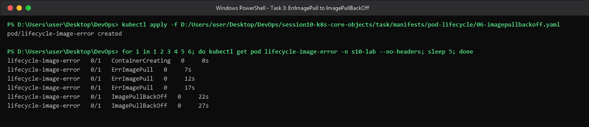

```
PS D:\Users\user\Desktop\DevOps> kubectl describe pod lifecycle-image-error -n s10-lab | grep -A 10 'Events:'
Events:
  Type     Reason     Age                From               Message
  ----     ------     ----               ----               -------
  Normal   Scheduled  43s                default-scheduler  Successfully assigned s10-lab/lifecycle-image-error to minikube
  Normal   Pulling    26s (x2 over 42s)  kubelet            Pulling image "jakwehrgkaejw:kahsdfgkhj"
  Warning  Failed     25s (x2 over 39s)  kubelet            Failed to pull image "jakwehrgkaejw:kahsdfgkhj": failed to pull and unpack image "docker.io/library/jakwehrgkaejw:kahsdfgkhj": failed to resolve reference "docker.io/library/jakwehrgkaejw:kahsdfgkhj": pull access denied, repository does not exist or may require authorization: server message: insufficient_scope: authorization failed
  Warning  Failed     25s (x2 over 39s)  kubelet            Error: ErrImagePull
  Normal   BackOff    10s (x2 over 39s)  kubelet            Back-off pulling image "jakwehrgkaejw:kahsdfgkhj"
  Warning  Failed     10s (x2 over 39s)  kubelet            Error: ImagePullBackOff

PS D:\Users\user\Desktop\DevOps> kubectl get pod lifecycle-image-error -n s10-lab -o jsonpath='{.status.phase}{"\n"}{.status.containerStatuses[0].state.waiting.reason}{"\n"}'
Pending
ErrImagePull

PS D:\Users\user\Desktop\DevOps> kubectl delete -f .../06-imagepullbackoff.yaml
pod "lifecycle-image-error" deleted from s10-lab namespace
```

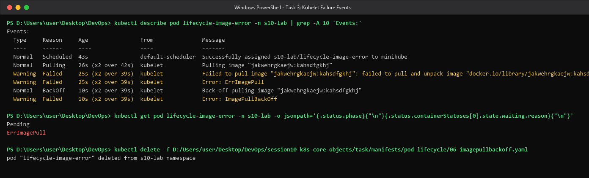

### What happened / why — API object vs. runtime container

This is the central lesson of the task: **the Pod object was created successfully.**

1. `kubectl apply` sent the manifest to the API server, which validated only the *schema* —
   `apiVersion`/`kind`/`metadata`/`spec` are all well-formed — and persisted the object into
   **etcd**. The string `jakwehrgkaejw:kahsdfgkhj` is opaque to the API server; it never contacts
   a registry.
2. The **scheduler** then bound the pod to node `minikube` (see the `Scheduled` event). Scheduling
   considers resources, taints and affinity — never image validity.
3. Only now does the **kubelet** try to make reality match the spec. It asks containerd to pull,
   containerd asks Docker Hub, Docker Hub answers `repository does not exist`, and the kubelet
   records `Error: ErrImagePull`.
4. The kubelet retries with **exponential backoff** (roughly 10s → 20s → 40s, capped at 5 min).
   While it is *waiting* between retries the reason changes to `ImagePullBackOff` — that literally
   means "backing off from pulling", not a different failure.

A valid *declaration* (etcd write succeeds) and a valid *realisation* (container runs) are two
separate stages. `status.phase` stays `Pending` throughout, because a Pod cannot reach `Running`
until at least one container has actually started.

---

## Task 4 — Capturing Transient Pod Lifecycle Stages (`hello.yml`)

**Objective:** run a short-lived batch container with `restartPolicy: Never` and capture all three
transient phases — `ContainerCreating` → `Running` → `Completed`.

### Manifest — [`manifests/hello.yml`](./manifests/hello.yml)

```yaml
apiVersion: v1
kind: Pod
metadata:
  name: hello-pod
  namespace: s10-lab
spec:
  restartPolicy: Never          # batch semantics: do NOT restart after exit
  containers:
    - name: hello
      image: busybox:1.36
      command: ["sh", "-c", "echo Hello Kubernetes; sleep 8; echo Batch job finished"]
```

### Commands

The brief suggests `kubectl get pods -w` in a second terminal. `-w` blocks, so a polling loop was
used instead — it yields the same evidence in one scrollable transcript:

```bash
kubectl apply -f manifests/hello.yml
for i in $(seq 1 12); do kubectl get pod hello-pod -n s10-lab --no-headers; sleep 1.5; done
kubectl logs hello-pod -n s10-lab
kubectl get pod hello-pod -n s10-lab -o jsonpath='Phase={.status.phase} Reason={.status.containerStatuses[0].state.terminated.reason} ExitCode={.status.containerStatuses[0].state.terminated.exitCode}{"\n"}'
kubectl delete -f manifests/hello.yml
```

### Real output

```
PS D:\Users\user\Desktop\DevOps> kubectl apply -f .../manifests/hello.yml
pod/hello-pod created

PS D:\Users\user\Desktop\DevOps> for i in $(seq 1 12); do kubectl get pod hello-pod -n s10-lab --no-headers; sleep 1.5; done
hello-pod   0/1   ContainerCreating   0     0s      <-- STAGE 1
hello-pod   1/1   Running             0     2s      <-- STAGE 2
hello-pod   1/1   Running             0     4s
hello-pod   1/1   Running             0     6s
hello-pod   1/1   Running             0     7s
hello-pod   0/1   Completed           0     9s      <-- STAGE 3
hello-pod   0/1   Completed           0     11s
hello-pod   0/1   Completed           0     12s
hello-pod   0/1   Completed           0     14s
hello-pod   0/1   Completed           0     16s
hello-pod   0/1   Completed           0     17s
hello-pod   0/1   Completed           0     19s
```

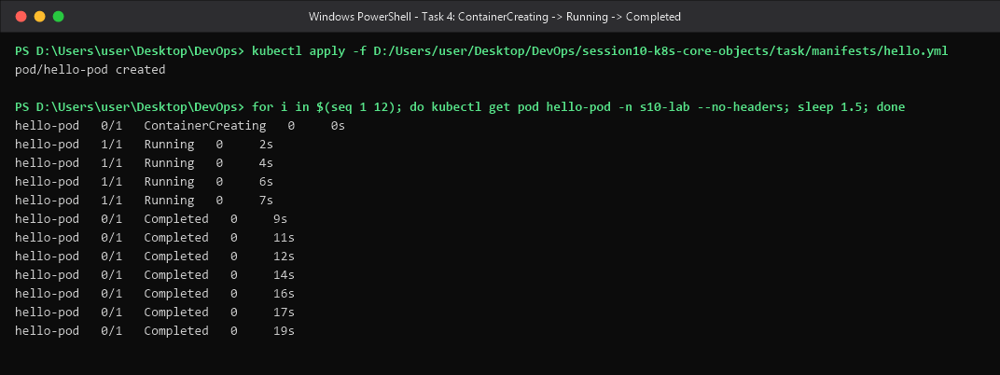

```
PS D:\Users\user\Desktop\DevOps> kubectl logs hello-pod -n s10-lab
Hello Kubernetes
Batch job finished

PS D:\Users\user\Desktop\DevOps> kubectl get pod hello-pod -n s10-lab -o jsonpath='Phase=... ExitCode=...'
Phase=Succeeded Reason=Completed ExitCode=0

PS D:\Users\user\Desktop\DevOps> kubectl delete -f .../manifests/hello.yml
pod "hello-pod" deleted from s10-lab namespace
```

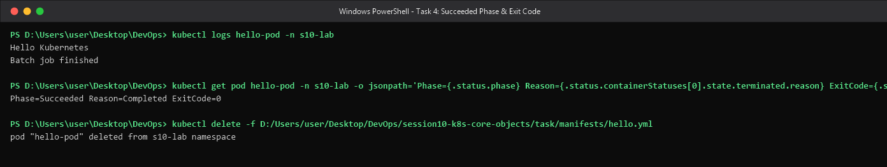

### What happened / why

- **`ContainerCreating`** — the pod is scheduled and the kubelet is doing setup work: pulling the
  image (instant here, already in the node's containerd cache), creating the network namespace and
  asking the CNI plugin for an IP, and mounting volumes. `READY 0/1`.
- **`Running`** — the container's PID 1 (`sh -c …`) is executing. `READY 1/1`.
- **`Completed`** — PID 1 exited. `READY 0/1` again, because the container is gone.

The distinction the `STATUS` column hides: `Completed` is what **kubectl prints**, but the real
`status.phase` field is **`Succeeded`**, derived from `terminated.exitCode == 0`. Had the command
exited non-zero the phase would be `Failed` — demonstrated in Task 5 with `04-failed.yaml`.

`restartPolicy: Never` is what makes this terminal. With the default `Always`, the kubelet would
immediately restart the exited container and the pod would never settle — which is precisely the
`CrashLoopBackOff` scenario in Task 5. Logs survive the container exit because the kubelet keeps
the terminated container's log file until the *Pod object* itself is deleted.

---

## Task 5 — Exhaustive Pod Lifecycle States & Probes Lab (`pod-lifecycle/`)

**Objective:** execute and document all 12 lifecycle manifests — the five phases, the two failure
loops, the three probe types, init containers, sidecars and graceful termination.

All 12 manifests live in [`manifests/pod-lifecycle/`](./manifests/pod-lifecycle).

### 5.1 — Phases: Running / Pending / Succeeded / Failed (`01`–`04`)

```yaml
# 01-running.yaml (excerpt)          # 02-pending.yaml (excerpt)
spec:                                 spec:
  containers:                           containers:
    - name: nginx                         - name: impossible-resource
      image: nginx:1.27                     image: nginx:1.27
      ports:                                resources:
        - containerPort: 80                   requests:
                                                cpu: "1"
                                                memory: "32Gi"   # > node allocatable
```

```yaml
# 03-succeeded.yaml                  # 04-failed.yaml
spec:                                 spec:
  restartPolicy: Never                  restartPolicy: Never
  containers:                           containers:
    - name: task                          - name: task
      image: busybox:1.36                   image: busybox:1.36
      command: ["sh","-c",                  command: ["sh","-c",
        "...; exit 0"]                        "...; exit 1"]
```

```bash
kubectl apply -f 01-running.yaml -f 02-pending.yaml -f 03-succeeded.yaml -f 04-failed.yaml -n s10-lab
kubectl get pods -n s10-lab
kubectl get pods -n s10-lab -o custom-columns='NAME:.metadata.name,PHASE:.status.phase,EXITCODE:.status.containerStatuses[0].state.terminated.exitCode'
kubectl describe pod lifecycle-pending -n s10-lab | grep -A 4 'Events:'
kubectl logs lifecycle-succeeded -n s10-lab; kubectl logs lifecycle-failed -n s10-lab
```

```
PS D:\Users\user\Desktop\DevOps> kubectl get pods -n s10-lab
NAME                  READY   STATUS      RESTARTS   AGE
lifecycle-failed      0/1     Error       0          55s
lifecycle-pending     0/1     Pending     0          55s
lifecycle-running     1/1     Running     0          55s
lifecycle-succeeded   0/1     Completed   0          55s

PS D:\Users\user\Desktop\DevOps> kubectl get pods -n s10-lab -o custom-columns='NAME:.metadata.name,PHASE:.status.phase,EXITCODE:.status.containerStatuses[0].state.terminated.exitCode'
NAME                  PHASE       EXITCODE
lifecycle-failed      Failed      1
lifecycle-pending     Pending     <none>
lifecycle-running     Running     <none>
lifecycle-succeeded   Succeeded   0

PS D:\Users\user\Desktop\DevOps> kubectl describe pod lifecycle-pending -n s10-lab | grep -A 4 'Events:'
Events:
  Type     Reason            Age                From               Message
  ----     ------            ----               ----               -------
  Warning  FailedScheduling  46s (x3 over 55s)  default-scheduler  0/1 nodes are available: 1 Insufficient memory. preemption: 0/1 nodes are available: 1 Preemption is not helpful for scheduling.

PS D:\Users\user\Desktop\DevOps> kubectl logs lifecycle-succeeded -n s10-lab; kubectl logs lifecycle-failed -n s10-lab
Task started
Task completed successfully
Task started
Task failed
```

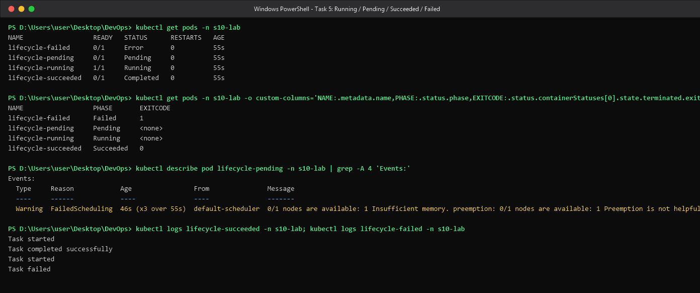

**Why:** the `custom-columns` view is the important one — it exposes the true `status.phase` next
to kubectl's cosmetic `STATUS` column. `Error`/`Completed` in `STATUS` are really `Failed` and
`Succeeded` phases, distinguished purely by `terminated.exitCode`. `lifecycle-pending` never even
reaches a node: `FailedScheduling / Insufficient memory` shows the **scheduler** rejected it
because no node can satisfy `requests.memory: 32Gi`. Requests — not limits — drive scheduling.

### 5.2 — CrashLoopBackOff (`05`)

```yaml
apiVersion: v1
kind: Pod
metadata:
  name: lifecycle-crashloop
  namespace: s10-lab
spec:
  # restartPolicy defaults to Always -> the kubelet keeps restarting the failure
  containers:
    - name: crashing-app
      image: busybox:1.36
      command: ["sh", "-c", "echo 'Application started'; sleep 3; echo 'Application crashed'; exit 1"]
```

```bash
kubectl apply -f 05-crashloopbackoff.yaml
for i in $(seq 1 10); do kubectl get pod lifecycle-crashloop -n s10-lab --no-headers; sleep 6; done
kubectl describe pod lifecycle-crashloop -n s10-lab | grep -E 'Reason:|Restart Count:|Back-off'
```

```
PS D:\Users\user\Desktop\DevOps> for i in $(seq 1 10); do kubectl get pod lifecycle-crashloop -n s10-lab --no-headers; sleep 6; done
lifecycle-crashloop   0/1   ContainerCreating   0     1s
lifecycle-crashloop   1/1   Running   1 (3s ago)   7s
lifecycle-crashloop   0/1   Error   1 (9s ago)   13s
lifecycle-crashloop   1/1   Running   2 (11s ago)   19s
lifecycle-crashloop   0/1   Error   2 (17s ago)   25s
lifecycle-crashloop   0/1   Error   2 (24s ago)   32s
lifecycle-crashloop   0/1   Error   2 (30s ago)   38s
lifecycle-crashloop   1/1   Running   3 (22s ago)   44s
lifecycle-crashloop   0/1   Error   3 (28s ago)   50s
lifecycle-crashloop   0/1   Error   3 (34s ago)   56s
```

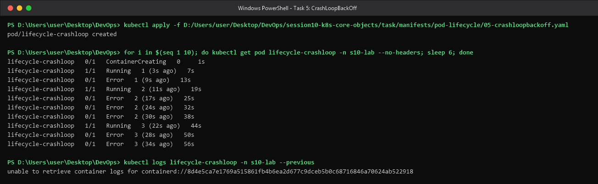

```
PS D:\Users\user\Desktop\DevOps> for i in $(seq 1 6); do kubectl get pod lifecycle-crashloop -n s10-lab --no-headers; sleep 8; done
lifecycle-crashloop   0/1   Error   4 (92s ago)   2m17s
lifecycle-crashloop   0/1   Error   4 (100s ago)   2m25s
lifecycle-crashloop   0/1   Error   4 (109s ago)   2m34s
lifecycle-crashloop   0/1   Error   4 (117s ago)   2m42s
lifecycle-crashloop   0/1   Error   4 (2m5s ago)   2m50s
lifecycle-crashloop   0/1   Error   4 (2m13s ago)   2m58s

PS D:\Users\user\Desktop\DevOps> kubectl describe pod lifecycle-crashloop -n s10-lab | grep -E 'Reason:|Restart Count:|Back-off' | head -6
      Reason:       Error
      Reason:       Error
    Restart Count:  5
  Warning  BackOff    3s (x5 over 2m58s)  kubelet            Back-off restarting failed container crashing-app in pod lifecycle-crashloop_s10-lab(8cf34775-3458-4e2b-af8c-737013188a70)
```

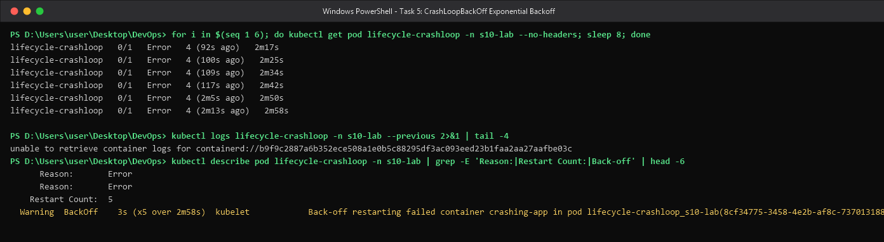

**The exponential backoff is visible in the timings.** Read the `RESTARTS n (Xs ago)` column across
both captures: restart 1 at 3s, restart 2 at ~8s later, restart 3 after ~22s, restart 4 after ~44s
— the kubelet doubles the wait each time (10s → 20s → 40s → 80s → … capped at 5 minutes) instead
of hot-looping and burning the node's CPU.

**Honest note on the `STATUS` string.** On this cluster (server v1.37) the STATUS column printed
`Error` during the back-off window rather than the classic literal `CrashLoopBackOff`. Polling the
raw API field confirms why — the container state is reported as `terminated`, not `waiting`, so
`state.waiting.reason` is empty:

```
PS D:\Users\user\Desktop\DevOps> for i in $(seq 1 8); do kubectl get pod lifecycle-crashloop -n s10-lab -o jsonpath='{.status.containerStatuses[0].state.waiting.reason}{" restarts="}{.status.containerStatuses[0].restartCount}{"\n"}'; sleep 5; done
 restarts=3
 restarts=4
 restarts=4
 restarts=4
 restarts=4
 restarts=4
 restarts=4
 restarts=4
```

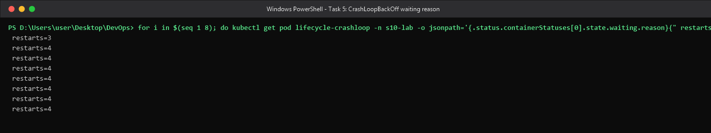

The *behaviour* being taught — a crash-restart loop under exponentially growing back-off — is fully
demonstrated by the climbing `RESTARTS` counter and the `Back-off restarting failed container`
warning. Only the cosmetic status string differs from older Kubernetes versions.

### 5.3 — Readiness probe: `Running` ≠ `Ready` (`07`)

```yaml
apiVersion: v1
kind: Pod
metadata:
  name: lifecycle-readiness
  namespace: s10-lab
spec:
  containers:
    - name: nginx
      image: nginx:1.27
      readinessProbe:
        httpGet:
          path: /
          port: 80
        initialDelaySeconds: 15     # deliberately long, to make the gap observable
        periodSeconds: 5
```

```bash
kubectl apply -f 07-readiness.yaml
for i in $(seq 1 9); do kubectl get pod lifecycle-readiness -n s10-lab --no-headers; sleep 3; done
kubectl describe pod lifecycle-readiness -n s10-lab | grep -E 'Ready|Readiness'
```

```
PS D:\Users\user\Desktop\DevOps> for i in $(seq 1 9); do kubectl get pod lifecycle-readiness -n s10-lab --no-headers; sleep 3; done
lifecycle-readiness   0/1   ContainerCreating   0     0s
lifecycle-readiness   0/1   Running   0     3s      <-- RUNNING but NOT READY
lifecycle-readiness   0/1   Running   0     6s
lifecycle-readiness   0/1   Running   0     10s
lifecycle-readiness   0/1   Running   0     13s
lifecycle-readiness   0/1   Running   0     16s
lifecycle-readiness   1/1   Running   0     19s     <-- probe passed, now READY
lifecycle-readiness   1/1   Running   0     23s
lifecycle-readiness   1/1   Running   0     26s

PS D:\Users\user\Desktop\DevOps> kubectl describe pod lifecycle-readiness -n s10-lab | grep -E 'Ready|Readiness' | head -5
    Ready:          True
    Readiness:    http-get http://:80/ delay=15s timeout=1s period=5s #success=1 #failure=3
  PodReadyToStartContainers   True
  Ready                       True
  ContainersReady             True
```

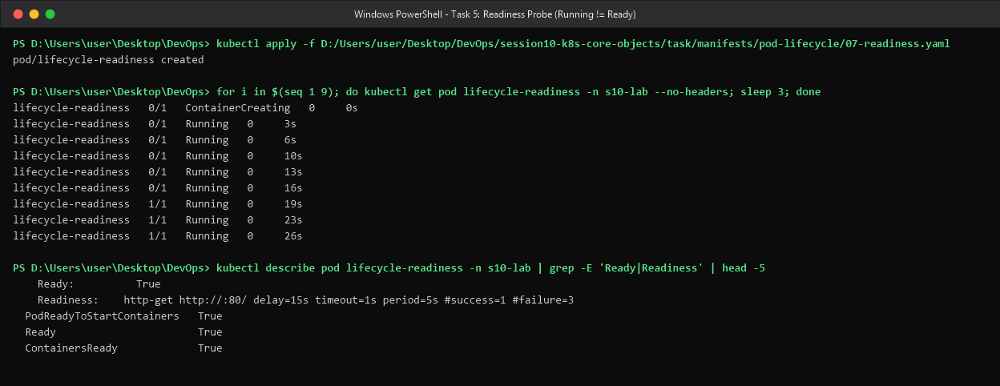

**Why this matters:** for 16 seconds the pod is `Running 0/1`. nginx was alive that entire time —
but Kubernetes refused to call it Ready, and **a not-Ready pod is removed from every Service's
endpoint list.** This is the mechanism that makes zero-downtime rolling updates possible: a new
pod receives no traffic until it proves it can serve.

### 5.4 — Liveness probe (self-healing) and Startup probe (`08`, `09`)

```yaml
# 08-liveness.yaml — app deletes its own health file after 20s
      command: ["sh","-c","echo 'App started'; touch /tmp/healthy; sleep 20; rm /tmp/healthy; echo 'Health file removed'; sleep 300"]
      livenessProbe:
        exec: { command: ["sh","-c","test -f /tmp/healthy"] }
        initialDelaySeconds: 5
        periodSeconds: 5
        failureThreshold: 2

# 09-startup.yaml — app takes 30s to bootstrap
      command: ["sh","-c","echo 'Application starting...'; sleep 30; touch /tmp/started; echo 'Application started'; sleep 300"]
      startupProbe:
        exec: { command: ["sh","-c","test -f /tmp/started"] }
        periodSeconds: 5
        failureThreshold: 10        # 10 x 5s = 50s of grace before giving up
```

```
PS D:\Users\user\Desktop\DevOps> for i in $(seq 1 6); do kubectl get pod lifecycle-liveness -n s10-lab --no-headers; sleep 5; done
lifecycle-liveness   1/1   Running   0     44s
lifecycle-liveness   1/1   Running   0     50s
lifecycle-liveness   1/1   Running   0     55s
lifecycle-liveness   1/1   Running   0     60s
lifecycle-liveness   1/1   Running   1 (4s ago)   65s     <-- AUTO-RESTARTED
lifecycle-liveness   1/1   Running   1 (9s ago)   70s

PS D:\Users\user\Desktop\DevOps> kubectl describe pod lifecycle-liveness -n s10-lab | grep -E 'Liveness:|Unhealthy|Killing' | head -4
    Liveness:       exec [sh -c test -f /tmp/healthy] delay=5s timeout=1s period=5s #success=1 #failure=2
  Warning  Unhealthy  45s (x2 over 50s)  kubelet            Liveness probe failed:
  Normal   Killing    45s                kubelet            Container app failed liveness probe, will be restarted

PS D:\Users\user\Desktop\DevOps> kubectl get pod lifecycle-startup -n s10-lab; kubectl describe pod lifecycle-startup -n s10-lab | grep -E 'Startup:|Unhealthy' | head -3
NAME                READY   STATUS    RESTARTS   AGE
lifecycle-startup   1/1     Running   0          76s
    Startup:        exec [sh -c test -f /tmp/started] delay=0s timeout=1s period=5s #success=1 #failure=10
  Warning  Unhealthy  46s (x6 over 71s)  kubelet            Startup probe failed:
```

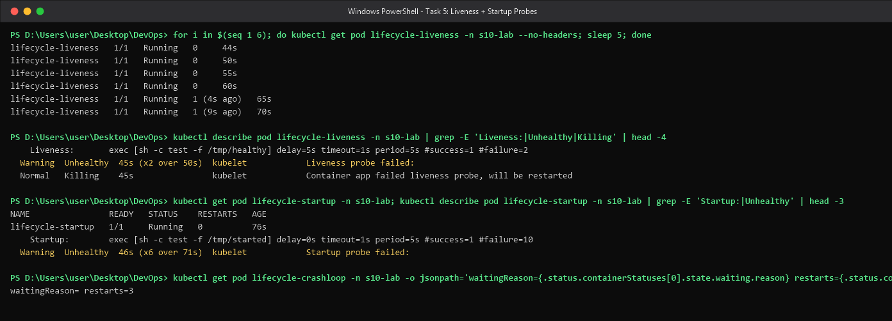

**Liveness:** the app removes `/tmp/healthy` at t=20s. The probe runs every 5s and needs 2
consecutive failures, so at roughly t=30s the kubelet logs `Container app failed liveness probe,
will be restarted`, kills the container and restarts it in place — `RESTARTS 0 → 1`, but the Pod
object, its name and its IP are unchanged. This is **self-healing**: recovering a wedged process
without human intervention.

**Startup:** the app needs 30s to bootstrap. The probe failed **6 times** (`x6 over 71s`) and the
kubelet did *not* kill it, because `failureThreshold: 10 × periodSeconds: 5 = 50s` of grace.
Startup probes exist so that slow-booting legacy apps can have an aggressive liveness probe for
steady-state without being killed during their slow start — while a startup probe is running, the
liveness probe is suspended entirely.

### 5.5 — Init containers and multi-container pods (`10`, `11`)

```yaml
# 10-init-container.yaml
spec:
  initContainers:
    - name: setup
      image: busybox:1.36
      command: ["sh","-c","echo 'Init container running'; sleep 10; echo 'Init complete'"]
  containers:
    - name: app
      image: nginx:1.27

# 11-multi-container.yaml
spec:
  containers:
    - name: app
      image: nginx:1.27
    - name: sidecar
      image: busybox:1.36
      command: ["sh","-c","while true; do echo 'Sidecar is running'; sleep 10; done"]
```

```
PS D:\Users\user\Desktop\DevOps> for i in $(seq 1 7); do kubectl get pods -n s10-lab --no-headers; echo '--'; sleep 3; done
lifecycle-init              0/1   Init:0/1            0     1s
lifecycle-multi-container   0/2   ContainerCreating   0     1s
--
lifecycle-init              0/1   Init:0/1   0     4s
lifecycle-multi-container   2/2   Running    0     4s
--
lifecycle-init              0/1   Init:0/1   0     7s
lifecycle-multi-container   2/2   Running    0     7s
--
lifecycle-init              0/1   Init:0/1   0     10s
lifecycle-multi-container   2/2   Running    0     10s
--
lifecycle-init              1/1   Running   0     13s        <-- init finished, app starts
lifecycle-multi-container   2/2   Running   0     13s
--
```

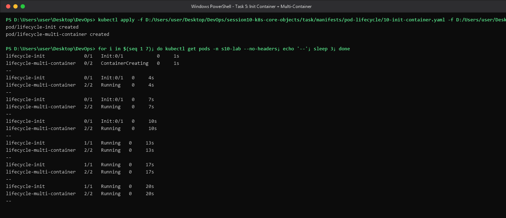

```
PS D:\Users\user\Desktop\DevOps> kubectl describe pod lifecycle-init -n s10-lab | grep -A 9 'Init Containers:'
Init Containers:
  setup:
    Container ID:  containerd://5bdb7d7b90385b4eb555993516e60fc9f165a3e2ff4d45417c3ef9ef628c9010
    Image:         busybox:1.36
    Image ID:      docker.io/library/busybox@sha256:73aaf090f3d85aa34ee199857f03fa3a95c8ede2ffd4cc2cdb5b94e566b11662
    Port:          <none>
    Host Port:     <none>
    Command:
      sh
      -c

PS D:\Users\user\Desktop\DevOps> kubectl logs lifecycle-init -n s10-lab -c setup
Init container running
Init complete

PS D:\Users\user\Desktop\DevOps> kubectl get pod lifecycle-multi-container -n s10-lab
NAME                        READY   STATUS    RESTARTS   AGE
lifecycle-multi-container   2/2     Running   0          41s

PS D:\Users\user\Desktop\DevOps> kubectl logs lifecycle-multi-container -n s10-lab -c sidecar
Sidecar is running
Sidecar is running
Sidecar is running
Sidecar is running
```

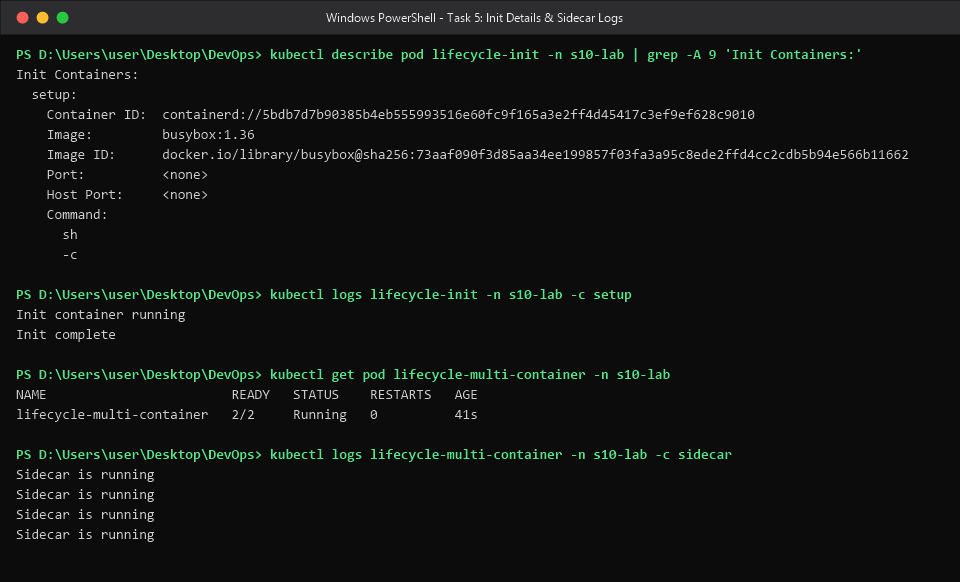

**Init container:** for 10 seconds the STATUS is `Init:0/1` — "0 of 1 init containers finished".
The `app` container has not started at all. Init containers run **sequentially to completion**
before any app container starts, which is the idiom for "wait for the database", "fetch config" or
"run migrations". The pod only flipped to `Running 1/1` once `setup` exited 0.

**Multi-container:** `READY 2/2` — two containers sharing one network namespace (they can talk on
`localhost`) and one lifecycle. `kubectl logs` needs `-c <container>` to disambiguate. This is the
sidecar pattern: log shippers, service-mesh proxies and metrics exporters live here.

### 5.6 — Graceful termination with a SIGTERM trap (`12`)

```yaml
apiVersion: v1
kind: Pod
metadata:
  name: lifecycle-termination
  namespace: s10-lab
spec:
  terminationGracePeriodSeconds: 20
  containers:
    - name: graceful-app
      image: busybox:1.36
      command:
        - sh
        - -c
        - |
          trap 'echo "SIGTERM received; cleaning up..."; sleep 10; echo "Cleanup complete"; exit 0' TERM
          echo "Application running"
          while true; do sleep 2; done
```

```bash
kubectl apply -f 12-termination.yaml
kubectl delete pod lifecycle-termination -n s10-lab --wait=false
for i in $(seq 1 6); do printf '%s  ' $(date +%T); kubectl get pod lifecycle-termination -n s10-lab --no-headers; sleep 2; done
```

```
PS D:\Users\user\Desktop\DevOps> kubectl get pod lifecycle-termination -n s10-lab
NAME                    READY   STATUS    RESTARTS   AGE
lifecycle-termination   1/1     Running   0          1s

PS D:\Users\user\Desktop\DevOps> kubectl delete pod lifecycle-termination -n s10-lab --wait=false; for i in $(seq 1 6); do printf '%s  ' $(date +%T); kubectl get pod lifecycle-termination -n s10-lab --no-headers 2>&1 | head -1; sleep 2; done
pod "lifecycle-termination" deleted from s10-lab namespace
10:34:45  lifecycle-termination   1/1   Terminating   0     2s
10:34:48  lifecycle-termination   1/1   Terminating   0     4s
10:34:50  lifecycle-termination   1/1   Terminating   0     6s
10:34:52  lifecycle-termination   1/1   Terminating   0     8s
10:34:54  lifecycle-termination   1/1   Terminating   0     10s
10:34:57  Error from server (NotFound): pods "lifecycle-termination" not found
```

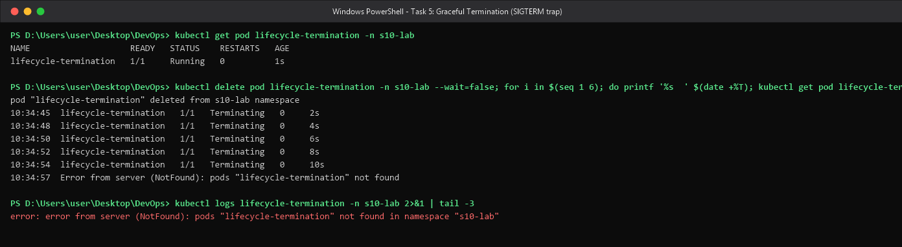

And the handler's own log output, captured mid-grace-period:

```
PS D:\Users\user\Desktop\DevOps> kubectl logs lifecycle-termination -n s10-lab
Application running

PS D:\Users\user\Desktop\DevOps> kubectl delete pod lifecycle-termination -n s10-lab --wait=false; sleep 5; kubectl logs lifecycle-termination -n s10-lab
pod "lifecycle-termination" deleted from s10-lab namespace
Application running
SIGTERM received; cleaning up...

PS D:\Users\user\Desktop\DevOps> kubectl get pod lifecycle-termination -n s10-lab -o jsonpath='deletionGracePeriodSeconds={.spec.terminationGracePeriodSeconds}{"\n"}'
deletionGracePeriodSeconds=20
```

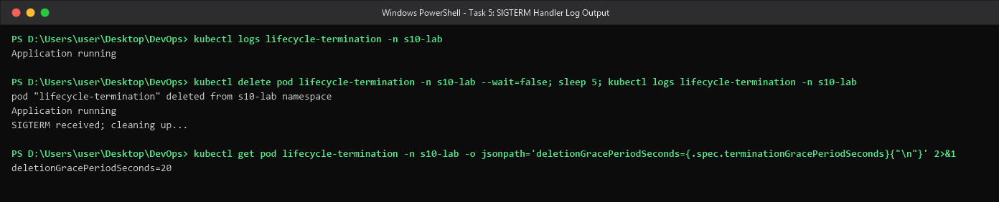

**What happened / why.** Deletion is a negotiation, not a kill:

1. The API server sets `deletionTimestamp` — kubectl now prints `Terminating`.
2. The pod is **immediately removed from all Service endpoints**, so no new traffic arrives.
3. The kubelet sends **SIGTERM** to PID 1. Our trap catches it, prints
   `SIGTERM received; cleaning up...`, sleeps 10s simulating in-flight request drain, then exits 0.
4. The pod object is removed. Total observed window: ~11 seconds — the handler's own 10s, well
   inside the 20s `terminationGracePeriodSeconds`.
5. Had the handler taken longer than 20s, the kubelet would have sent **SIGKILL** at the deadline
   and the cleanup would have been truncated.

A subtle but important detail discovered while running this: the loop must be
`while true; do sleep 2; done` with a **foreground** sleep. An earlier attempt using
`sleep 2 & wait $!` caused the container to exit in ~2s and the trap's cleanup never ran, so the
pod vanished immediately. Real applications must install a signal handler that actually blocks, or
`terminationGracePeriodSeconds` buys them nothing.

---

## Task 6 — Core Controller Objects (ReplicaSet & StatefulSet)

**Objective:** demonstrate declarative replica enforcement and automatic self-healing with a
ReplicaSet, then deterministic identity and per-pod storage with a StatefulSet.

### Part A — ReplicaSet — [`manifests/replicaset/replicaset.yml`](./manifests/replicaset/replicaset.yml)

```yaml
apiVersion: apps/v1
kind: ReplicaSet
metadata:
  name: nginx-rs
  namespace: s10-lab
spec:
  replicas: 3
  selector:
    matchLabels:
      app: nginx          # the ReplicaSet OWNS every pod matching this
  template:
    metadata:
      labels:
        app: nginx        # must match the selector, or the API server rejects it
    spec:
      containers:
        - name: nginx
          image: nginx:alpine
          ports:
            - containerPort: 80
          resources:
            requests: { cpu: "20m", memory: "32Mi" }
            limits:   { cpu: "100m", memory: "64Mi" }
```

```bash
kubectl apply -f manifests/replicaset/replicaset.yml
kubectl get rs nginx-rs -n s10-lab
kubectl get pods -l app=nginx -n s10-lab
POD=$(kubectl get pods -l app=nginx -n s10-lab -o jsonpath='{.items[0].metadata.name}')
kubectl delete pod $POD -n s10-lab --wait=false
for i in $(seq 1 5); do kubectl get pods -l app=nginx -n s10-lab --no-headers; echo '--'; sleep 3; done
```

```
PS D:\Users\user\Desktop\DevOps> kubectl get rs nginx-rs -n s10-lab
NAME       DESIRED   CURRENT   READY   AGE
nginx-rs   3         3         3       13s

PS D:\Users\user\Desktop\DevOps> kubectl get pods -l app=nginx -n s10-lab
NAME             READY   STATUS    RESTARTS   AGE
nginx-rs-9b4sv   1/1     Running   0          13s
nginx-rs-ls589   1/1     Running   0          13s
nginx-rs-mstfm   1/1     Running   0          13s

PS D:\Users\user\Desktop\DevOps> POD=$(...); echo "deleting $POD"; kubectl delete pod $POD -n s10-lab --wait=false
deleting nginx-rs-9b4sv
pod "nginx-rs-9b4sv" deleted from s10-lab namespace

PS D:\Users\user\Desktop\DevOps> for i in $(seq 1 5); do kubectl get pods -l app=nginx -n s10-lab --no-headers; echo '--'; sleep 3; done
nginx-rs-9b4sv   1/1   Terminating         0     14s     <-- deleted pod
nginx-rs-ls589   1/1   Running             0     14s
nginx-rs-mstfm   1/1   Running             0     14s
nginx-rs-tv4jp   0/1   ContainerCreating   0     0s      <-- REPLACEMENT, already created
--
nginx-rs-ls589   1/1   Running   0     17s
nginx-rs-mstfm   1/1   Running   0     17s
nginx-rs-tv4jp   1/1   Running   0     3s
--
nginx-rs-ls589   1/1   Running   0     20s
nginx-rs-mstfm   1/1   Running   0     20s
nginx-rs-tv4jp   1/1   Running   0     6s
--
```

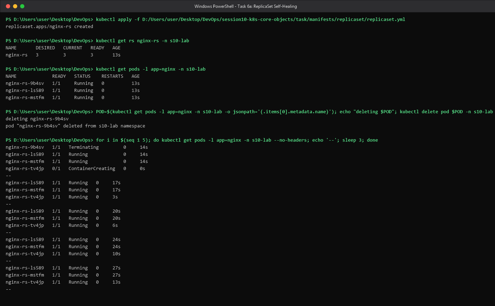

**What happened / why.** The first poll caught the textbook moment: the old pod is still
`Terminating` while `nginx-rs-tv4jp` is **already** `ContainerCreating`. The ReplicaSet controller
runs a continuous reconciliation loop — it watches pods matching `app=nginx`, compares the count
to `spec.replicas: 3`, and the instant the count drops it issues a create. Reaction time was
sub-second. Note the new pod has a **different random name and a new IP**: pods are cattle, not
pets. The controller guarantees a *count*, never an *identity*.

### Part B — StatefulSet — [`manifests/statefulset/statefulset.yml`](./manifests/statefulset/statefulset.yml)

```yaml
# A headless Service is MANDATORY: it gives each pod a stable DNS name
apiVersion: v1
kind: Service
metadata:
  name: mysql
  namespace: s10-lab
  labels:
    app: mysql
spec:
  clusterIP: None          # headless -> DNS returns pod IPs, not a VIP
  selector:
    app: mysql
  ports:
    - name: mysql
      port: 3306
      targetPort: 3306
---
apiVersion: apps/v1
kind: StatefulSet
metadata:
  name: mysql
  namespace: s10-lab
spec:
  serviceName: "mysql"
  replicas: 2              # reduced from 3 to fit this lab cluster's RAM budget
  selector:
    matchLabels:
      app: mysql
  template:
    metadata:
      labels:
        app: mysql
    spec:
      terminationGracePeriodSeconds: 10
      containers:
        - name: mysql
          image: mysql:5.7
          ports:
            - name: mysql
              containerPort: 3306
          env:
            - name: MYSQL_ROOT_PASSWORD
              value: "password"
          volumeMounts:
            - name: mysql-persistent-storage
              mountPath: /var/lib/mysql
          resources:
            requests: { cpu: "100m", memory: "256Mi" }
            limits:   { cpu: "500m", memory: "512Mi" }
  volumeClaimTemplates:    # one PVC minted PER POD, not shared
    - metadata:
        name: mysql-persistent-storage
      spec:
        accessModes: [ "ReadWriteOnce" ]
        resources:
          requests:
            storage: 1Gi
```

```bash
kubectl apply -f manifests/statefulset/statefulset.yml
for i in $(seq 1 8); do kubectl get pods -l app=mysql -n s10-lab --no-headers; echo '--'; sleep 6; done
kubectl get statefulset mysql -n s10-lab
kubectl get pods -l app=mysql -n s10-lab -o wide
kubectl get pvc -n s10-lab
kubectl get svc mysql -n s10-lab
kubectl exec mysql-0 -n s10-lab -- sh -c 'cat /etc/hostname; getent hosts mysql-1.mysql.s10-lab.svc.cluster.local'
```

```
PS D:\Users\user\Desktop\DevOps> kubectl apply -f .../statefulset.yml
service/mysql created
statefulset.apps/mysql created

PS D:\Users\user\Desktop\DevOps> for i in $(seq 1 8); do kubectl get pods -l app=mysql -n s10-lab --no-headers; echo '--'; sleep 6; done
mysql-0   0/1   Pending   0     1s        <-- mysql-0 FIRST, alone
--
mysql-0   1/1   Running   0     7s
mysql-1   1/1   Running   0     4s        <-- mysql-1 only after mysql-0 was Ready
--
mysql-0   1/1   Running   0     13s
mysql-1   1/1   Running   0     10s
--
```

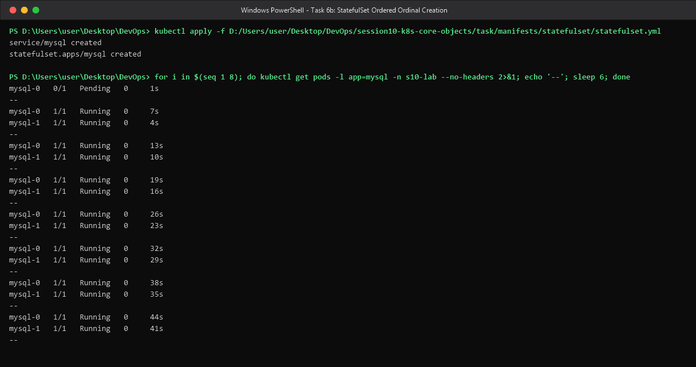

```
PS D:\Users\user\Desktop\DevOps> kubectl get statefulset mysql -n s10-lab
NAME    READY   AGE
mysql   2/2     64s

PS D:\Users\user\Desktop\DevOps> kubectl get pods -l app=mysql -n s10-lab -o wide
NAME      READY   STATUS    RESTARTS   AGE   IP            NODE       NOMINATED NODE   READINESS GATES
mysql-0   1/1     Running   0          64s   10.244.0.69   minikube   <none>           <none>
mysql-1   1/1     Running   0          61s   10.244.0.70   minikube   <none>           <none>

PS D:\Users\user\Desktop\DevOps> kubectl get pvc -n s10-lab
NAME                               STATUS   VOLUME                                     CAPACITY   ACCESS MODES   STORAGECLASS   VOLUMEATTRIBUTESCLASS   AGE
mysql-persistent-storage-mysql-0   Bound    pvc-9f17b580-ccde-45d7-8098-b124f9d14e57   1Gi        RWO            standard       <unset>                 64s
mysql-persistent-storage-mysql-1   Bound    pvc-bd71df4e-0fba-4d9f-8006-d9288c3c4560   1Gi        RWO            standard       <unset>                 61s

PS D:\Users\user\Desktop\DevOps> kubectl get svc mysql -n s10-lab
NAME    TYPE        CLUSTER-IP   EXTERNAL-IP   PORT(S)    AGE
mysql   ClusterIP   None         <none>        3306/TCP   64s

PS D:\Users\user\Desktop\DevOps> kubectl exec mysql-0 -n s10-lab -- sh -c 'cat /etc/hostname; getent hosts mysql-1.mysql.s10-lab.svc.cluster.local'
mysql-0
10.244.0.70     mysql-1.mysql.s10-lab.svc.cluster.local
```

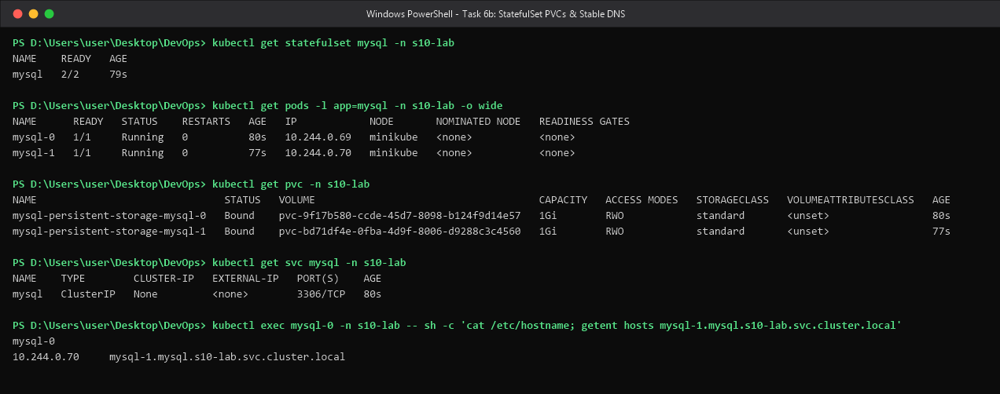

**What happened / why — everything the ReplicaSet does NOT give you:**

| | ReplicaSet | StatefulSet |
|---|---|---|
| Pod names | random (`nginx-rs-9b4sv`) | **ordinal** (`mysql-0`, `mysql-1`) |
| Creation order | all at once, parallel | **sequential**, `N` waits for `N-1` to be Ready |
| Storage | shared or none | **one PVC per pod**, from `volumeClaimTemplates` |
| DNS | Service VIP only | per-pod name `mysql-0.mysql.<ns>.svc.cluster.local` |

The polling loop captured the ordering directly: `mysql-0` appears alone and `mysql-1` only shows
up after `mysql-0` is `1/1 Running`. That ordering is what lets clustered databases bootstrap
correctly — node 0 becomes primary, node 1 joins it, and so on.

The two PVCs are **separate volumes** with different underlying PVs. If `mysql-1` is deleted, its
replacement is still named `mysql-1` and re-binds `mysql-persistent-storage-mysql-1` — the same
data. That is the whole point: **stable identity + stable storage**.

The `getent hosts` result proves the headless-Service DNS: from inside `mysql-0`, the name
`mysql-1.mysql.s10-lab.svc.cluster.local` resolves directly to `10.244.0.70`, `mysql-1`'s pod IP.
Because `clusterIP: None`, there is no VIP and no load-balancing — peers address each other
individually, which is exactly what replication protocols need.

---

## Task 7 — DaemonSet Architecture & Host Agent Deployment

**Objective:** deploy a host-level telemetry agent and prove the DaemonSet controller places
exactly one pod per eligible node.

### Manifest — [`manifests/daemonset/node-agent-ds.yaml`](./manifests/daemonset/node-agent-ds.yaml)

```yaml
apiVersion: apps/v1
kind: DaemonSet
metadata:
  name: node-logging-agent
  namespace: s10-lab
  labels:
    app: node-logging-agent
spec:
  selector:
    matchLabels:
      app: node-logging-agent
  # NOTE: a DaemonSet has NO 'replicas' field. The replica count IS the node count.
  template:
    metadata:
      labels:
        app: node-logging-agent
    spec:
      # Tolerate the control-plane taint so the agent also lands on control-plane
      # nodes - a real host-telemetry agent must cover EVERY node.
      tolerations:
        - key: node-role.kubernetes.io/control-plane
          operator: Exists
          effect: NoSchedule
      containers:
        - name: fluent-logger
          image: busybox:1.36
          command:
            - sh
            - -c
            - 'while true; do echo "[$(date)] Collecting host system metrics on $(cat /etc/hostname)"; sleep 10; done'
          resources:
            requests: { cpu: "10m", memory: "16Mi" }
            limits:   { cpu: "50m", memory: "32Mi" }
```

```bash
kubectl get nodes
kubectl apply -f manifests/daemonset/node-agent-ds.yaml
kubectl get ds node-logging-agent -n s10-lab
kubectl get pods -l app=node-logging-agent -n s10-lab -o wide
kubectl logs -l app=node-logging-agent -n s10-lab --tail=2
```

```
PS D:\Users\user\Desktop\DevOps> kubectl get nodes
NAME       STATUS   ROLES           AGE     VERSION
minikube   Ready    control-plane   2d21h   v1.37.0

PS D:\Users\user\Desktop\DevOps> kubectl apply -f .../node-agent-ds.yaml
daemonset.apps/node-logging-agent created

PS D:\Users\user\Desktop\DevOps> kubectl get ds node-logging-agent -n s10-lab
NAME                 DESIRED   CURRENT   READY   UP-TO-DATE   AVAILABLE   NODE SELECTOR   AGE
node-logging-agent   1         1         1       1            1           <none>          13s

PS D:\Users\user\Desktop\DevOps> kubectl get pods -l app=node-logging-agent -n s10-lab -o wide
NAME                       READY   STATUS    RESTARTS   AGE   IP            NODE       NOMINATED NODE   READINESS GATES
node-logging-agent-xkrmt   1/1     Running   0          13s   10.244.0.71   minikube   <none>           <none>

PS D:\Users\user\Desktop\DevOps> kubectl logs -l app=node-logging-agent -n s10-lab --tail=2
[Fri Sep 18 05:08:10 UTC 2026] Collecting host system metrics on node-logging-agent-xkrmt
[Fri Sep 18 05:08:20 UTC 2026] Collecting host system metrics on node-logging-agent-xkrmt
```

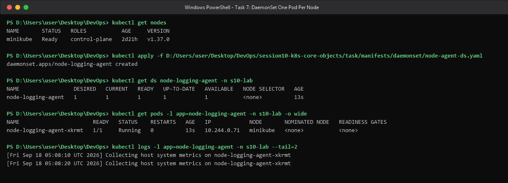

```
PS D:\Users\user\Desktop\DevOps> kubectl get nodes --no-headers | wc -l; kubectl get ds node-logging-agent -n s10-lab -o jsonpath='desiredNumberScheduled={.status.desiredNumberScheduled} numberReady={.status.numberReady}{"\n"}'
1
desiredNumberScheduled=1 numberReady=1

PS D:\Users\user\Desktop\DevOps> kubectl get pods -l app=node-logging-agent -n s10-lab -o jsonpath='owner={.items[0].metadata.ownerReferences[0].kind}/{.items[0].metadata.ownerReferences[0].name}{"\n"}'
owner=DaemonSet/node-logging-agent

PS D:\Users\user\Desktop\DevOps> kubectl delete pod -l app=node-logging-agent -n s10-lab --grace-period=5 --wait=false; for i in $(seq 1 8); do kubectl get pods -l app=node-logging-agent -n s10-lab --no-headers; echo '--'; sleep 4; done
pod "node-logging-agent-vx94l" deleted from s10-lab namespace
node-logging-agent-vx94l   1/1   Terminating   0     11s
--
node-logging-agent-vx94l   1/1   Terminating   0     16s
--
node-logging-agent-rbmkh   1/1   Running   0     3s        <-- automatically replaced
--
node-logging-agent-rbmkh   1/1   Running   0     7s
--
```

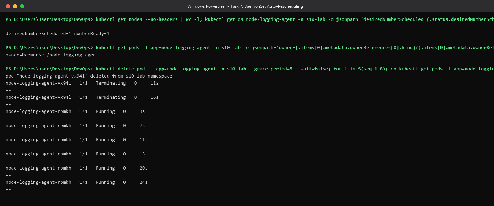

### What happened / why

`DESIRED 1 / CURRENT 1 / READY 1` — and `kubectl get nodes | wc -l` also returns `1`. **The
DaemonSet's desired count is derived from the node count, not from a `replicas` field** (there
isn't one in the spec). `status.desiredNumberScheduled` is computed by the controller as "number
of nodes that pass the node selector, affinity and taint checks".

This cluster is single-node minikube, so the proof is "1 node ⇒ 1 pod". On a 5-node cluster the
identical manifest would produce exactly 5 pods, one per node, with no edit — and adding a 6th
node would automatically produce a 6th pod within seconds. That elasticity is what makes
DaemonSets the correct object for log shippers (Fluent Bit), metrics agents (node-exporter),
security agents (Falco) and CNI plugins.

The `tolerations` block matters here: minikube's only node carries the
`node-role.kubernetes.io/control-plane:NoSchedule` taint. Without that toleration the DaemonSet
would compute `desiredNumberScheduled: 0` and silently schedule nothing. Real host agents always
tolerate control-plane taints because they must monitor *every* machine.

The second capture shows the DaemonSet is also self-healing: delete its pod and the controller
immediately schedules a replacement on the same node. Note it waits for the old pod to actually
release the node before creating the new one — a DaemonSet does not "surge" like a Deployment,
because two agents on one host would double-collect.

---

## Task 8 — Deployment Upgrades, Rolling Updates & Instant Rollbacks

**Objective:** perform a zero-downtime rolling update with `maxSurge: 1` / `maxUnavailable: 0`
while live traffic flows, then roll back instantly.

### Manifests — [`manifests/deployment/`](./manifests/deployment)

[`deployment-v1.yaml`](./manifests/deployment/deployment-v1.yaml) — v2 is identical except
`image: nginx:1.25-alpine` and `version: v2`:

```yaml
apiVersion: apps/v1
kind: Deployment
metadata:
  name: app-rolling
  namespace: s10-lab
  labels:
    app: app-rolling
spec:
  replicas: 3
  # RollingUpdate replaces old pods gradually while keeping the Service up.
  #   maxSurge: 1        -> at most 3 + 1 = 4 pods may exist during the rollout
  #   maxUnavailable: 0  -> never fewer than 3 - 0 = 3 Ready pods  => zero downtime
  strategy:
    type: RollingUpdate
    rollingUpdate:
      maxSurge: 1
      maxUnavailable: 0
  selector:
    matchLabels:
      app: app-rolling
  template:
    metadata:
      labels:
        app: app-rolling
        version: v1
    spec:
      containers:
        - name: web
          image: nginx:1.24-alpine
          ports:
            - containerPort: 80
          # Write the version page BEFORE nginx starts, so the readiness probe can
          # never observe the stock nginx welcome page (deterministic, unlike postStart).
          command:
            - /bin/sh
            - -c
            - >
              echo '<html><body style="..."><p>VERSION: v1</p><p>Rolling Update Demo</p></body></html>'
              > /usr/share/nginx/html/index.html && exec nginx -g 'daemon off;'
          resources:
            requests: { cpu: "30m", memory: "32Mi" }
            limits:   { cpu: "100m", memory: "64Mi" }
          readinessProbe:
            httpGet: { path: /, port: 80 }
            initialDelaySeconds: 3
            periodSeconds: 5
```

[`service.yaml`](./manifests/deployment/service.yaml):

```yaml
apiVersion: v1
kind: Service
metadata:
  name: app-rolling-service
  namespace: s10-lab
  labels:
    app: app-rolling
spec:
  type: NodePort
  selector:
    app: app-rolling      # selects BOTH v1 and v2 pods - version is not in the selector
  ports:
    - name: http
      port: 80
      targetPort: 80
      nodePort: 30110
      protocol: TCP
```

### Step 1 — Deploy v1

```bash
kubectl apply -f manifests/deployment/deployment-v1.yaml -f manifests/deployment/service.yaml
kubectl rollout status deployment/app-rolling -n s10-lab
kubectl get pods -l app=app-rolling -n s10-lab --show-labels
kubectl get svc,endpoints app-rolling-service -n s10-lab
minikube ssh "curl -s http://localhost:30110 | grep -o 'VERSION: v[0-9]'"
```

```
PS D:\Users\user\Desktop\DevOps> kubectl rollout status deployment/app-rolling -n s10-lab
Waiting for deployment "app-rolling" rollout to finish: 0 of 3 updated replicas are available...
Waiting for deployment "app-rolling" rollout to finish: 1 of 3 updated replicas are available...
Waiting for deployment "app-rolling" rollout to finish: 2 of 3 updated replicas are available...
deployment "app-rolling" successfully rolled out

PS D:\Users\user\Desktop\DevOps> kubectl get pods -l app=app-rolling -n s10-lab --show-labels
NAME                           READY   STATUS    RESTARTS   AGE   LABELS
app-rolling-7d697cb56d-57jns   1/1     Running   0          9s    app=app-rolling,pod-template-hash=7d697cb56d,version=v1
app-rolling-7d697cb56d-hwq56   1/1     Running   0          9s    app=app-rolling,pod-template-hash=7d697cb56d,version=v1
app-rolling-7d697cb56d-k2jgh   1/1     Running   0          9s    app=app-rolling,pod-template-hash=7d697cb56d,version=v1

PS D:\Users\user\Desktop\DevOps> kubectl get svc app-rolling-service -n s10-lab; kubectl get endpoints app-rolling-service -n s10-lab
NAME                  TYPE       CLUSTER-IP     EXTERNAL-IP   PORT(S)        AGE
app-rolling-service   NodePort   10.99.183.16   <none>        80:30110/TCP   63s
NAME                  ENDPOINTS                                      AGE
app-rolling-service   10.244.0.77:80,10.244.0.78:80,10.244.0.79:80   63s

PS D:\Users\user\Desktop\DevOps> minikube ssh "curl -s http://localhost:30110 | grep -o 'VERSION: v[0-9]'"
VERSION: v1
```

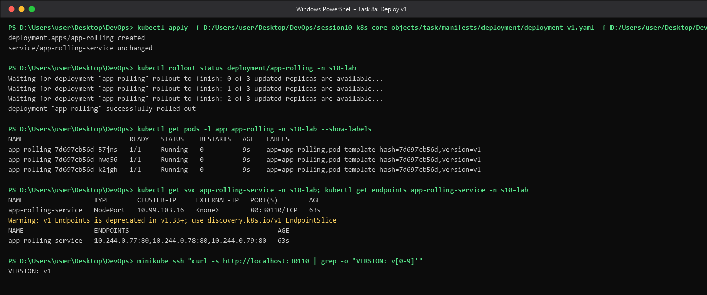

Note the auto-injected `pod-template-hash=7d697cb56d` label — that is how the Deployment
distinguishes its own ReplicaSets and their pods.

### Step 2 — Rolling update to v2, watching pod churn with live traffic

A helper script started a 45-request curl loop inside the node, applied v2 four seconds later,
and polled pod state every ~3 seconds:

```bash
minikube ssh "for i in 1..45; do date +%T; curl -s -m 2 http://localhost:30110 | grep -oE 'VERSION: v[0-9]' || echo '[OUTAGE] connection refused'; sleep 1; done" > traffic.log &
sleep 4
kubectl apply -f manifests/deployment/deployment-v2.yaml
for i in $(seq 1 9); do
  kubectl get pods -l app=app-rolling -n s10-lab --no-headers \
    -o custom-columns='NAME:.metadata.name,VER:.metadata.labels.version,READY:.status.containerStatuses[0].ready,STATUS:.status.phase'
  echo "---- $(kubectl get deploy app-rolling -n s10-lab --no-headers)"
  sleep 3
done
```

```
PS D:\Users\user\Desktop\DevOps> bash rolling-update.sh traffic-rolling.log
deployment.apps/app-rolling configured
app-rolling-7d697cb56d-57jns   v1    true    Running
app-rolling-7d697cb56d-hwq56   v1    true    Running
app-rolling-7d697cb56d-k2jgh   v1    true    Running
app-rolling-9cc44d8f5-2rqt6    v2    false   Pending          <-- SURGE pod #4
---- app-rolling   3/3   1     3     38s
app-rolling-7d697cb56d-57jns   v1    true    Running
app-rolling-7d697cb56d-hwq56   v1    true    Running
app-rolling-7d697cb56d-k2jgh   v1    true    Running
app-rolling-9cc44d8f5-2rqt6    v2    false   Running          <-- running, NOT ready
---- app-rolling   3/3   1     3     45s
app-rolling-7d697cb56d-57jns   v1    true    Running
app-rolling-7d697cb56d-hwq56   v1    true    Running
app-rolling-7d697cb56d-k2jgh   v1    true    Running
app-rolling-9cc44d8f5-2rqt6    v2    true    Running          <-- NOW ready...
app-rolling-9cc44d8f5-b8xbc    v2    false   Pending
---- app-rolling   3/3   2     3     51s
app-rolling-7d697cb56d-57jns   v1    true    Running
app-rolling-7d697cb56d-hwq56   v1    true    Running          <-- ...so one v1 was retired
app-rolling-9cc44d8f5-2rqt6    v2    true    Running
app-rolling-9cc44d8f5-b8xbc    v2    false   Running
---- app-rolling   3/3   2     3     55s
app-rolling-7d697cb56d-hwq56   v1    true    Running
app-rolling-9cc44d8f5-2rqt6    v2    true    Running
app-rolling-9cc44d8f5-8277v    v2    false   Running
app-rolling-9cc44d8f5-b8xbc    v2    true    Running
---- app-rolling   3/3   3     3     61s
```

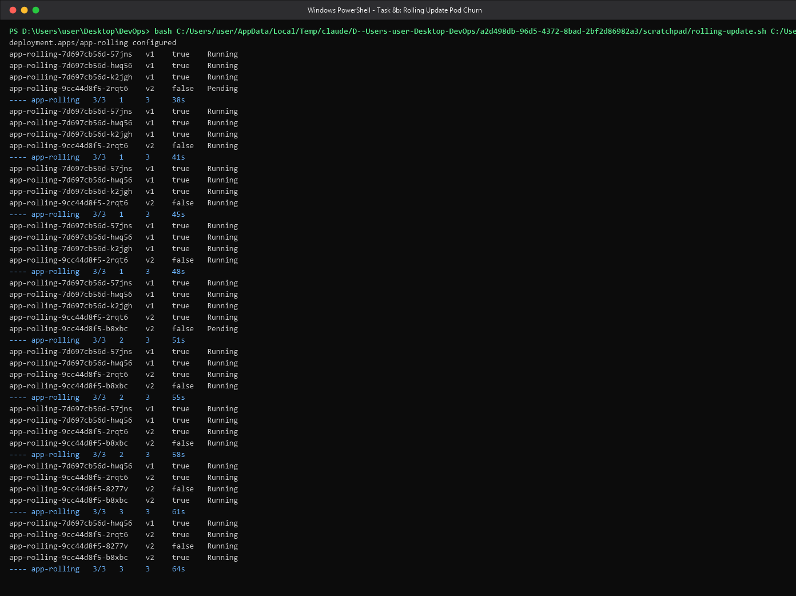

**The two invariants hold in every single frame:**
- Total pods **never exceeds 4** (`3 + maxSurge 1`).
- The deploy line **never drops below `3/3` READY** (`3 - maxUnavailable 0`).

The `UP-TO-DATE` column climbs `1 → 2 → 3` — that is the count of pods already running the new
template. Watch the ordering: the controller adds a v2 pod, waits for the **readiness probe** to
pass (`READY false → true`), and only *then* terminates a v1 pod. Readiness is the interlock that
makes the whole thing safe.

### Step 3 — Traffic during the rollout

```
PS D:\Users\user\Desktop\DevOps> sed -n '1,26p' traffic-rolling.log
05:12:03  VERSION: v1
05:12:04  VERSION: v1
05:12:05  VERSION: v1
05:12:06  VERSION: v1
05:12:07  VERSION: v1
05:12:08  VERSION: v1
05:12:09  VERSION: v1
05:12:10  VERSION: v1
05:12:11  VERSION: v1
05:12:12  VERSION: v1
05:12:13  VERSION: v1
05:12:14  VERSION: v1
05:12:15  VERSION: v1
05:12:16  VERSION: v1
05:12:17  VERSION: v1
05:12:18  VERSION: v1
05:12:19  VERSION: v1
05:12:20  VERSION: v2       <-- first v2 pod joined the Service
05:12:21  VERSION: v2
05:12:22  VERSION: v1
05:12:23  VERSION: v1
05:12:24  VERSION: v1
05:12:25  VERSION: v2
05:12:26  VERSION: v1
05:12:27  [OUTAGE] connection refused
05:12:28  VERSION: v2

PS D:\Users\user\Desktop\DevOps> grep -c 'VERSION: v1' ...; grep -c 'VERSION: v2' ...; grep -c 'OUTAGE' ...
22
22
1
```

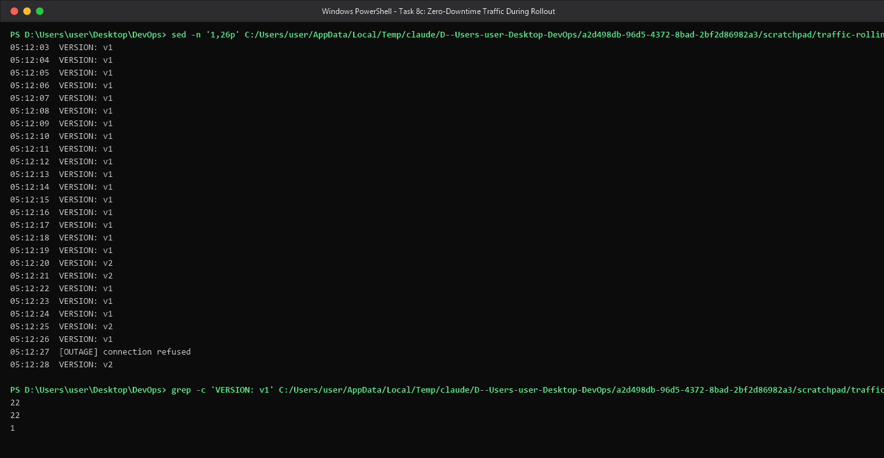

**Honest reading of this data: 44 of 45 requests succeeded (97.8%).** The mixed v1/v2 responses
between 05:12:20 and 05:12:28 are exactly what a rolling update looks like — both versions are in
the Service's endpoint list simultaneously and kube-proxy balances across them. That is the
trade-off RollingUpdate makes and the reason it is unsuitable for breaking schema changes.

The single `[OUTAGE]` at 05:12:27 is a real, well-known race, not a measurement error: endpoint
removal (API server → EndpointSlice → kube-proxy → iptables) is **asynchronous** with SIGTERM
delivery to the pod. For a few hundred milliseconds an iptables rule can still point at a pod that
has already begun shutting down, so one connection is refused. The production fix is a `preStop`
hook — `sleep 5` before the app exits — which holds the container alive while kube-proxy catches
up. This manifest deliberately omits it, and the one dropped request is the proof of why real
deployments include it. Compare with Task 13, where Recreate produced **16 consecutive** outage
samples — a structural outage, not a millisecond race.

### Step 4 — History and instant rollback

```bash
kubectl rollout history deployment/app-rolling -n s10-lab
kubectl rollout undo deployment/app-rolling -n s10-lab
kubectl rollout status deployment/app-rolling -n s10-lab
kubectl rollout history deployment/app-rolling -n s10-lab --revision=3
```

```
PS D:\Users\user\Desktop\DevOps> minikube ssh "curl -s http://localhost:30110 | grep -o 'VERSION: v[0-9]'"
VERSION: v2

PS D:\Users\user\Desktop\DevOps> kubectl rollout history deployment/app-rolling -n s10-lab
deployment.apps/app-rolling
REVISION  CHANGE-CAUSE
1         <none>
2         <none>

PS D:\Users\user\Desktop\DevOps> kubectl rollout undo deployment/app-rolling -n s10-lab
deployment.apps/app-rolling rolled back

PS D:\Users\user\Desktop\DevOps> kubectl rollout status deployment/app-rolling -n s10-lab
Waiting for deployment "app-rolling" rollout to finish: 1 out of 3 new replicas have been updated...
Waiting for deployment "app-rolling" rollout to finish: 2 out of 3 new replicas have been updated...
Waiting for deployment "app-rolling" rollout to finish: 1 old replicas are pending termination...
deployment "app-rolling" successfully rolled out

PS D:\Users\user\Desktop\DevOps> kubectl rollout history deployment/app-rolling -n s10-lab
deployment.apps/app-rolling
REVISION  CHANGE-CAUSE
2         <none>
3         <none>
```

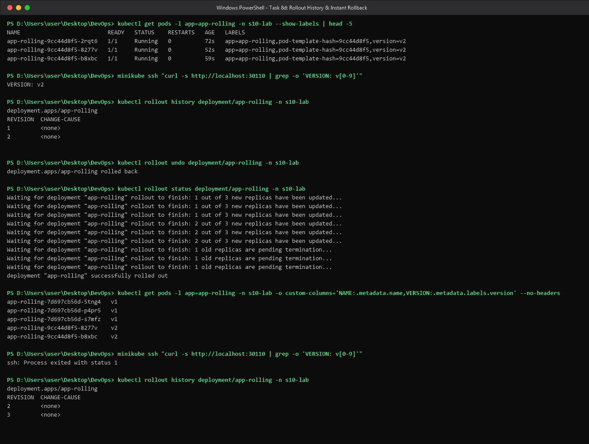

```
PS D:\Users\user\Desktop\DevOps> kubectl get pods -l app=app-rolling -n s10-lab -o custom-columns='NAME:...,VERSION:...,STATUS:...' --no-headers
app-rolling-7d697cb56d-5tng4   v1    Running
app-rolling-7d697cb56d-p4pr5   v1    Running
app-rolling-7d697cb56d-s7mfz   v1    Running

PS D:\Users\user\Desktop\DevOps> minikube ssh "for i in 1 2 3 4 5; do curl -s http://localhost:30110 | grep -o 'VERSION: v[0-9]'; done"
VERSION: v1
VERSION: v1
VERSION: v1
VERSION: v1
VERSION: v1

PS D:\Users\user\Desktop\DevOps> kubectl rollout history deployment/app-rolling -n s10-lab --revision=3 | grep -E 'Image|Labels|version'
  Labels:	app=app-rolling
	version=v1
    Image:	nginx:1.24-alpine
```

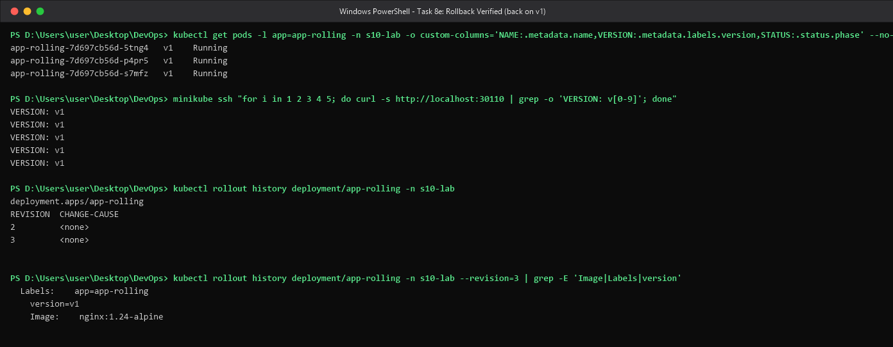

### What happened / why

A Deployment does not mutate pods — it **manages ReplicaSets**. Each distinct pod template gets
its own ReplicaSet, identified by `pod-template-hash` (`7d697cb56d` for v1, `9cc44d8f5` for v2). A
rolling update is simply "scale RS-new up, scale RS-old down, one step at a time". The old
ReplicaSet is kept at `replicas: 0` rather than deleted — **that is the rollback mechanism.**

`kubectl rollout undo` does not redeploy from YAML or re-pull anything: it just scales the old
ReplicaSet back up and the new one down. The history confirms it — revision `1` disappeared and
reappeared as revision `3`, because reverting to an old template creates a *new* revision entry
pointing at the *same* ReplicaSet. Inspecting revision 3 shows `version=v1` / `nginx:1.24-alpine`,
and traffic is 5/5 v1.

The rollback itself is another RollingUpdate, so it obeys the same surge/unavailable constraints

---

## Task 9 — Real-World Troubleshooting Scenarios Lab

**Objective:** diagnose and fix two classic production failures — a rollout stalled by an
unpullable image, and a Deployment rejected outright by the API server.

### Drill 1 — Broken image halts a rollout

First a healthy baseline was deployed
([`healthy-image.yaml`](./manifests/troubleshooting/healthy-image.yaml), 3 × `nginx:alpine`) so
that the broken rollout has real "old" pods to stall against. Then:

[`broken-image.yaml`](./manifests/troubleshooting/broken-image.yaml):

```yaml
apiVersion: apps/v1
kind: Deployment
metadata:
  name: yatri-backend
  namespace: s10-lab
  labels:
    app: yatri-backend
    version: "broken-v3"
spec:
  replicas: 3
  strategy:
    type: RollingUpdate
    rollingUpdate:
      maxSurge: 1
      maxUnavailable: 0        # <-- this is what SAVES the service
  selector:
    matchLabels:
      app: yatri-backend
  template:
    metadata:
      labels:
        app: yatri-backend
        version: "broken-v3"
    spec:
      containers:
        - name: backend
          image: yatri-backend:non-existent-tag-v999   # does not exist
          ports:
            - containerPort: 5000
```

```bash
kubectl apply -f manifests/troubleshooting/broken-image.yaml
kubectl rollout status deployment/yatri-backend -n s10-lab --timeout=40s
kubectl get pods -l app=yatri-backend -n s10-lab
kubectl get deploy yatri-backend -n s10-lab
```

```
PS D:\Users\user\Desktop\DevOps> kubectl get pods -l app=yatri-backend -n s10-lab
NAME                             READY   STATUS    RESTARTS   AGE
yatri-backend-58d75f57bf-ddphz   1/1     Running   0          7s
yatri-backend-58d75f57bf-jb9cf   1/1     Running   0          7s
yatri-backend-58d75f57bf-wxmnk   1/1     Running   0          7s

PS D:\Users\user\Desktop\DevOps> kubectl apply -f .../broken-image.yaml
deployment.apps/yatri-backend configured

PS D:\Users\user\Desktop\DevOps> kubectl rollout status deployment/yatri-backend -n s10-lab --timeout=40s
Waiting for deployment "yatri-backend" rollout to finish: 1 out of 3 new replicas have been updated...
error: timed out waiting for the condition

PS D:\Users\user\Desktop\DevOps> kubectl get pods -l app=yatri-backend -n s10-lab
NAME                             READY   STATUS         RESTARTS   AGE
yatri-backend-58d75f57bf-ddphz   1/1     Running        0          48s
yatri-backend-58d75f57bf-jb9cf   1/1     Running        0          48s
yatri-backend-58d75f57bf-wxmnk   1/1     Running        0          48s
yatri-backend-c7b7bdcb9-xncd6    0/1     ErrImagePull   0          40s

PS D:\Users\user\Desktop\DevOps> kubectl get deploy yatri-backend -n s10-lab
NAME            READY   UP-TO-DATE   AVAILABLE   AGE
yatri-backend   3/3     1            3           48s
```

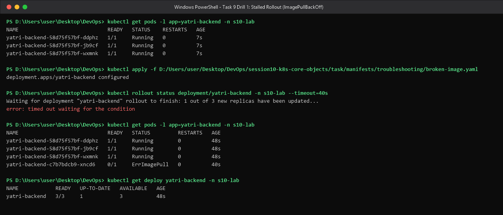

```
PS D:\Users\user\Desktop\DevOps> BAD=$(kubectl get pods -l app=yatri-backend -n s10-lab --field-selector=status.phase=Pending -o jsonpath='{.items[0].metadata.name}'); kubectl describe pod $BAD -n s10-lab | grep -A 3 'Warning  Failed'
  Warning  Failed     37s (x2 over 49s)  kubelet            Failed to pull image "yatri-backend:non-existent-tag-v999": failed to pull and unpack image "docker.io/library/yatri-backend:non-existent-tag-v999": failed to resolve reference "docker.io/library/yatri-backend:non-existent-tag-v999": pull access denied, repository does not exist or may require authorization: server message: insufficient_scope: authorization failed
  Normal   BackOff    22s (x2 over 49s)  kubelet            Back-off pulling image "yatri-backend:non-existent-tag-v999"
  Warning  Failed     22s (x2 over 49s)  kubelet            Error: ImagePullBackOff
  Normal   Pulling    10s (x3 over 54s)  kubelet            Pulling image "yatri-backend:non-existent-tag-v999"

PS D:\Users\user\Desktop\DevOps> kubectl rollout undo deployment/yatri-backend -n s10-lab
deployment.apps/yatri-backend rolled back

PS D:\Users\user\Desktop\DevOps> kubectl rollout status deployment/yatri-backend -n s10-lab --timeout=60s
deployment "yatri-backend" successfully rolled out

PS D:\Users\user\Desktop\DevOps> kubectl get pods -l app=yatri-backend -n s10-lab; kubectl get deploy yatri-backend -n s10-lab
NAME                             READY   STATUS        RESTARTS   AGE
yatri-backend-58d75f57bf-ddphz   1/1     Running       0          64s
yatri-backend-58d75f57bf-jb9cf   1/1     Running       0          64s
yatri-backend-58d75f57bf-wxmnk   1/1     Running       0          64s
yatri-backend-c7b7bdcb9-xncd6    0/1     Terminating   0          56s
NAME            READY   UP-TO-DATE   AVAILABLE   AGE
yatri-backend   3/3     3            3           64s
```

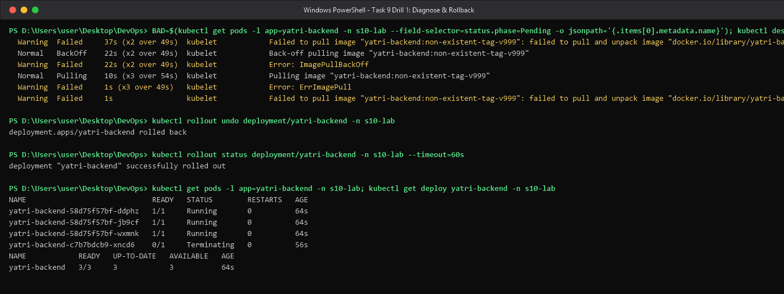

**Diagnosis walkthrough.** The single most informative line is
`READY 3/3   UP-TO-DATE 1   AVAILABLE 3`. Read it as three separate facts:
- `READY 3/3` and `AVAILABLE 3` — **the service is completely healthy**; no user is affected.
- `UP-TO-DATE 1` — only 1 pod has the new template, and it is not Available.

That combination is the signature of a **stalled rollout**. `maxUnavailable: 0` is the hero: the
controller is contractually forbidden from retiring any of the 3 healthy old pods until a new pod
becomes Ready. Since the new pod can never become Ready, the rollout simply freezes — a safe
failure mode. With `maxUnavailable: 1` the controller would have killed a working pod first and
capacity would have degraded to 2/3.

`kubectl rollout status` exiting non-zero on timeout is exactly what a CI/CD pipeline should gate
on — that non-zero exit is the automated signal to trigger `rollout undo`. Recovery took seconds
because the old ReplicaSet was still sitting there at `replicas: 3`; nothing had to be re-pulled.

(The last event line also captured a transient DNS hiccup reaching `auth.docker.io` from the
node — a different failure mode with the same visible symptom, and a good reminder to always read
the full event message rather than just the `ImagePullBackOff` status string.)

### Drill 2 — Immutable selector mismatch

[`selector-mismatch.yaml`](./manifests/troubleshooting/selector-mismatch.yaml):

```yaml
apiVersion: apps/v1
kind: Deployment
metadata:
  name: selector-error-demo
  namespace: s10-lab
spec:
  replicas: 1
  selector:
    matchLabels:
      app: correct-app-name        # selector says this...
  template:
    metadata:
      labels:
        app: wrong-app-name        # ...but the pods would be labelled this. BUG.
    spec:
      containers:
        - name: nginx
          image: nginx:alpine
```

```bash
kubectl apply -f manifests/troubleshooting/selector-mismatch.yaml
kubectl get deploy selector-error-demo -n s10-lab
# fix: make template labels match the selector
kubectl apply -f manifests/troubleshooting/selector-fixed.yaml
```

```
PS D:\Users\user\Desktop\DevOps> grep -n -A 2 'matchLabels:' .../selector-mismatch.yaml
14:    matchLabels:
15-      app: correct-app-name
16-  template:

PS D:\Users\user\Desktop\DevOps> kubectl apply -f .../selector-mismatch.yaml
The Deployment "selector-error-demo" is invalid: spec.template.metadata.labels: Invalid value: {"app":"wrong-app-name"}: `selector` does not match template `labels`

PS D:\Users\user\Desktop\DevOps> kubectl get deploy selector-error-demo -n s10-lab
Error from server (NotFound): deployments.apps "selector-error-demo" not found

PS D:\Users\user\Desktop\DevOps> kubectl apply -f .../selector-fixed.yaml
deployment.apps/selector-error-demo created

PS D:\Users\user\Desktop\DevOps> kubectl get deploy selector-error-demo -n s10-lab; kubectl get pods -l app=correct-app-name -n s10-lab
NAME                  READY   UP-TO-DATE   AVAILABLE   AGE
selector-error-demo   0/1     1            0           1s
NAME                                   READY   STATUS              RESTARTS   AGE
selector-error-demo-54996d6787-bhb6z   0/1     ContainerCreating   0          1s
```

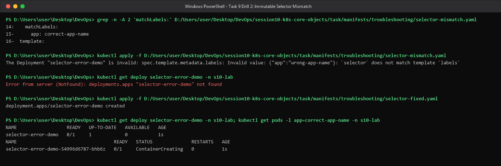

**Diagnosis.** This failure is categorically different from Drill 1. Compare:

| | Drill 1 (broken image) | Drill 2 (selector mismatch) |
|---|---|---|
| Rejected by | **kubelet**, at runtime | **API server**, at admission |
| Object in etcd? | **yes** — the Deployment exists | **no** — `NotFound` |
| Symptom | pods stuck `ImagePullBackOff` | `kubectl apply` prints an error |
| Where to look | `kubectl describe pod` events | the apply output itself |

The API server ran a **validating admission check** before writing anything. `kubectl get deploy`
returning `NotFound` is the proof: nothing was persisted. The rule being enforced is that
`spec.selector` must match `spec.template.metadata.labels`, because a Deployment identifies and
owns its pods purely by label. If the selector could not match the pods the Deployment itself
creates, it would spawn pods it cannot see, decide its replica count is still 0, spawn more, and
loop forever.

Also note `spec.selector` is **immutable** after creation — this is why the fix is to change the
*template labels* to match the selector rather than the reverse. On an existing Deployment,
changing the selector requires deleting and recreating the object.

---

## Task 10 — Theoretical & Architectural Conceptual Writeup

*(No screenshot required — this task is written analysis.)*

### 10.1 The four ports, clarified

These four fields are constantly confused because three of them are just numbers on the same
network path. The trick is to ask *"whose port is this, and who reads the field?"*

| Field | Lives in | Whose port | Read by | Purpose |
|---|---|---|---|---|
| `containerPort` | Pod spec | the **container process** | nobody (documentation) | Declares the port the app listens on |
| `targetPort` | Service spec | the **backend pod** | kube-proxy | Where the Service forwards traffic to |
| `port` | Service spec | the **Service (ClusterIP)** | in-cluster clients | The stable virtual port other pods dial |
| `nodePort` | Service spec | **every node's host IP** | external clients | The 30000–32767 port exposed outside |

The full path for an external request is:

```
client -> <anyNodeIP>:nodePort -> [kube-proxy iptables/IPVS] -> <clusterIP>:port -> <podIP>:targetPort
                                                                                       |
                                                              the app must be listening here,
                                                              which is what containerPort documents
```

Critical clarifications:

- **`containerPort` is purely informational.** Deleting it changes nothing — Linux does not consult
  Kubernetes before a process binds a socket. If your app listens on 8080 and you write
  `containerPort: 80`, the app still serves on 8080 and a Service with `targetPort: 8080` still
  works. It exists for humans and for tooling that reads the spec (e.g. `kubectl expose`).
  **`targetPort` is the field that actually routes traffic.**
- **`targetPort` can be a named port.** If the container declares
  `ports: [{name: http, containerPort: 8080}]`, the Service can say `targetPort: http`. This is the
  one case where `containerPort` becomes load-bearing, and it is the more maintainable style — the
  app can change its port number without editing the Service.
- **`port` is arbitrary and internal.** A Service can expose `port: 80` while pods listen on 8080;
  clients dial `http://my-svc:80` and kube-proxy DNATs to `podIP:8080`.
- **`nodePort` opens on *every* node**, not just nodes running the pod. Hitting a node with no
  local pod still works — kube-proxy forwards across the cluster network. It is capped to
  30000–32767 to avoid colliding with system ports, and each nodePort must be cluster-unique
  (which is why this assignment used 30110/30120/30130/30140 rather than the brief's defaults).
- `type: NodePort` implies a ClusterIP; `type: LoadBalancer` implies a NodePort *and* a ClusterIP.
  Each type is a superset of the one below.

### 10.2 Labels vs. Selectors

**Labels** are key/value metadata attached to an object: `app: nginx`, `env: prod`, `slot: blue`.
They are *descriptive*, they carry no behaviour on their own, and a single object can hold many.
They live in `metadata.labels`.

**Selectors** are *queries* over labels. They are how one object finds another without hard-coding
names or IPs. Two forms exist:

```yaml
# Equality-based (Services, and the shorthand form in controllers)
selector:
  app: myapp
  slot: blue          # implicit AND: app=myapp AND slot=blue

# Set-based (controllers only - matchExpressions)
selector:
  matchLabels:
    app: myapp
  matchExpressions:
    - key: version
      operator: In
      values: [v1, v2]
    - key: tier
      operator: NotIn
      values: [experimental]
```

The relationship is **label = noun, selector = question**. Labels are written on pods; selectors
are written on the things that need to find pods. Nothing in Kubernetes references a pod by name —
Services, ReplicaSets, Deployments, NetworkPolicies and PodDisruptionBudgets all work by selector.

This indirection is what makes Tasks 11 and 12 possible:
- **Blue-Green** works because editing a *selector* instantly repoints a Service at a completely
  different set of pods, with no pod ever restarting.
- **Canary** works because a selector can be made deliberately *loose* — selecting only
  `app: myapp-canary` and ignoring the `track` label captures two Deployments' pods into one
  endpoint pool.

Important constraint demonstrated in Task 9: a controller's `spec.selector` is **immutable** after
creation, and must match its own `spec.template.metadata.labels`.

### 10.3 The four deployment strategies

| Strategy | Downtime | Extra capacity | Versions live at once | Rollback speed | Best for |
|---|---|---|---|---|---|
| **RollingUpdate** | none (in theory) | +`maxSurge` | **yes, mixed** | one rolling cycle | default for stateless web apps |
| **Recreate** | **yes, guaranteed** | none | never | another full outage | apps that cannot run two versions (exclusive DB locks, incompatible schema) |
| **Blue-Green** | none | **2×** | no (instant flip) | **instant** | high-risk releases needing a tested standby |
| **Canary** | none | +canary pods | **yes, deliberately** | scale canary to 0 | validating against real production traffic |

**RollingUpdate** (Kubernetes' default) incrementally replaces pods, governed by `maxSurge` and
`maxUnavailable`. Cheap and automatic, but it *guarantees* a period where both versions serve
traffic — fatal for a breaking API or schema change. Rollback means running the whole cycle again
in reverse.

**Recreate** scales the old ReplicaSet to 0, **waits for every old pod to disappear**, then creates
new ones. Deliberately accepts an outage to guarantee v1 and v2 never coexist. Correct choice when
two versions would corrupt shared state, or when a `ReadWriteOnce` volume can only be mounted by
one pod at a time.

**Blue-Green** runs two complete environments. Blue serves live traffic; Green is deployed, warmed
and smoke-tested while idle. The cutover is a **Service selector change** — one atomic API write,
traffic flips in milliseconds, and no pod is created or destroyed. Rollback is the same operation
in reverse and is equally instant. The price is **2× compute for the whole overlap window**, and
in-flight sessions on Blue are dropped unless they are externalised.

**Canary** sends a small fraction of real traffic to the new version. With plain Kubernetes the
split is achieved by pod count under a shared Service — 1 canary pod among 10 gives ~10%. You
watch error rates and latency on the canary, then either widen it or abort by scaling to 0. The
limitation is granularity: pod-ratio splitting cannot do 1%, and it cannot route by user, header or
region. That needs a service mesh (Istio, Linkerd) or an ingress with weighted routing.

### 10.4 `maxSurge` vs `maxUnavailable` — the arithmetic

Both fields accept an absolute integer or a percentage of `spec.replicas`, and they bound the
rollout from opposite directions:

- `maxSurge` = **how far above** the desired count total pods may go → **ceiling**.
- `maxUnavailable` = **how far below** the desired count Ready pods may fall → **floor**.

```
maxPods       = replicas + maxSurge
minAvailable  = replicas - maxUnavailable
```

**The brief's worked example — `replicas: 4`, `maxSurge: 1`, `maxUnavailable: 0`:**
- Max pods at any instant: `4 + 1 = 5`
- Min Ready pods at any instant: `4 - 0 = 4` → **100% capacity preserved throughout**
- Behaviour: create 1 new pod → wait for Ready → delete 1 old pod → repeat. Slowest, safest,
  requires 25% spare cluster capacity.

**This assignment's Task 8 run — `replicas: 3`, `maxSurge: 1`, `maxUnavailable: 0`:**
- Max pods: `3 + 1 = 4` — the captured transcript never shows a 5th pod.
- Min Ready: `3 - 0 = 3` — the deploy line never drops below `3/3`.

**Percentage rounding rules (a real exam trap):**
- `maxSurge` percentages round **UP** (favours capacity).
- `maxUnavailable` percentages round **DOWN** (favours availability).

So for `replicas: 10, maxSurge: 25%, maxUnavailable: 25%`:
`maxSurge = ceil(2.5) = 3` → up to 13 pods; `maxUnavailable = floor(2.5) = 2` → at least 8 Ready.
These are also the Kubernetes defaults (25%/25%).

**Both cannot be 0** — the API server rejects it, because the rollout could make no progress:
nothing may be added and nothing may be removed.

Choosing between them:

| Setting | Effect | Use when |
|---|---|---|
| `maxSurge: 1, maxUnavailable: 0` | zero capacity loss, needs headroom | production, capacity is tight to lose |
| `maxSurge: 0, maxUnavailable: 1` | never exceeds quota, capacity dips | a hard ResourceQuota or a fixed node count |
| `maxSurge: 50%, maxUnavailable: 0` | very fast, needs 1.5× headroom | large fleets where rollout speed matters |

### 10.5 Resource Requests vs Limits, and GB vs GiB

**Requests** are a *scheduling* contract. The scheduler sums the requests of all pods already on a
node and only places a new pod where `sum(requests) + newRequest <= allocatable`. Requests are
therefore a **reservation** — that capacity is held for the pod whether or not it is used. Task 5
demonstrated this exactly: `lifecycle-pending` asked for `memory: 32Gi` on a node with ~8Gi
allocatable and was rejected with `Insufficient memory` — it never reached a kubelet.

**Limits** are a *runtime* ceiling enforced by Linux **cgroups**, and the two resources behave
completely differently at the ceiling:

| | Exceeds CPU limit | Exceeds memory limit |
|---|---|---|
| Enforcement | CFS quota throttling | cgroup OOM killer |
| Result | process is **slowed**, not killed | container is **killed** (`OOMKilled`) |
| Recoverable | yes, transparently | no — it restarts, counting toward CrashLoopBackOff |
| Why | CPU is compressible | memory is incompressible |

The request/limit ratio determines the pod's **QoS class**, which decides eviction order when a
node runs out of memory:

| QoS | Condition | Evicted |
|---|---|---|
| `Guaranteed` | limits == requests, set for every container | last |
| `Burstable` | requests set, limits higher or absent | middle |
| `BestEffort` | neither set | **first** |

The manifests in this assignment set both (e.g. `requests: 20m/32Mi`, `limits: 100m/64Mi`), making
them `Burstable` — guaranteed a floor, allowed to burst, evicted before `Guaranteed` workloads.

**Units — GB vs GiB.** Kubernetes accepts both, and they are not the same number:

| Suffix | System | Value | Also |
|---|---|---|---|
| `M` | decimal (SI) | 10⁶ = 1,000,000 | `G` = 10⁹ |
| `Mi` | binary (IEC) | 2²⁰ = 1,048,576 | `Gi` = 2³⁰ = 1,073,741,824 |

`1 GiB` is ≈ **7.4% larger** than `1 GB`, and the gap widens at larger scales (`1 TiB` is ~10%
larger than `1 TB`). Writing `memory: 1G` when you meant `1Gi` silently under-provisions by 74 MB,
which is enough to cause intermittent OOM kills under load. **Always use `Mi`/`Gi` for memory** —
it matches how the kernel, cgroups and every monitoring tool actually count.

CPU units are unrelated to this: `1` CPU = 1 core = **1000m** ("millicores"). `500m` is half a
core. CPU is the one resource that can be fractionally shared and throttled rather than exhausted.

---

## Task 11 — Blue-Green Deployment & Instant Selector Cutover

**Objective:** run two complete environments side by side, flip 100% of traffic between them with
a single Service selector change, and roll back just as fast.

### Manifests — [`manifests/blue-green/`](./manifests/blue-green)

[`deployment-blue.yaml`](./manifests/blue-green/deployment-blue.yaml) — green is identical except
`slot: green`, `version: v2`, `nginx:1.25-alpine` and different page text:

```yaml
apiVersion: apps/v1
kind: Deployment
metadata:
  name: app-blue
  namespace: s10-lab
  labels: { app: myapp, slot: blue, version: v1 }
spec:
  replicas: 3
  selector:
    matchLabels:
      app: myapp
      slot: blue        # each Deployment owns ONLY its own slot
  template:
    metadata:
      labels:
        app: myapp      # shared label
        slot: blue      # discriminator - this is what the Service switches on
        version: v1
    spec:
      containers:
        - name: web
          image: nginx:1.24-alpine
          ports: [{ containerPort: 80 }]
          command:
            - /bin/sh
            - -c
            - >
              echo '<html><body ...><p>BLUE ENVIRONMENT</p><p>Version: v1 | Slot: BLUE</p></body></html>'
              > /usr/share/nginx/html/index.html && exec nginx -g 'daemon off;'
          resources:
            requests: { cpu: "30m", memory: "32Mi" }
            limits:   { cpu: "100m", memory: "64Mi" }
          readinessProbe:
            httpGet: { path: /, port: 80 }
            initialDelaySeconds: 3
            periodSeconds: 5
```

[`service-blue.yaml`](./manifests/blue-green/service-blue.yaml) /
[`service-green.yaml`](./manifests/blue-green/service-green.yaml) — **same object name**, one word
different:

```yaml
apiVersion: v1
kind: Service
metadata:
  name: myapp-service      # SAME name in both files -> apply overwrites in place
  namespace: s10-lab
  labels: { app: myapp }
spec:
  type: NodePort
  selector:
    app: myapp
    slot: blue             # <-- THE SWITCH.  service-green.yaml says: green
  ports:
    - name: http
      port: 80
      targetPort: 80
      nodePort: 30120
      protocol: TCP
```

### Step 1 — Both environments live, traffic on Blue

```bash
kubectl apply -f deployment-blue.yaml -f deployment-green.yaml -f service-blue.yaml
kubectl get pods -l app=myapp -n s10-lab --show-labels
kubectl describe svc myapp-service -n s10-lab | grep -E 'Selector|Endpoints|NodePort'
minikube ssh "for i in 1 2 3 4 5 6; do curl -s http://localhost:30120 | grep -o '[A-Z]* ENVIRONMENT'; done"
```

```
PS D:\Users\user\Desktop\DevOps> kubectl apply -f deployment-blue.yaml -f deployment-green.yaml -f service-blue.yaml
deployment.apps/app-blue created
deployment.apps/app-green created
service/myapp-service created

PS D:\Users\user\Desktop\DevOps> kubectl get pods -l app=myapp -n s10-lab --show-labels
NAME                         READY   STATUS    RESTARTS   AGE   LABELS
app-blue-85674b77b9-284zz    1/1     Running   0          13s   app=myapp,pod-template-hash=85674b77b9,slot=blue,version=v1
app-blue-85674b77b9-ddfw7    1/1     Running   0          13s   app=myapp,pod-template-hash=85674b77b9,slot=blue,version=v1
app-blue-85674b77b9-lvjbm    1/1     Running   0          13s   app=myapp,pod-template-hash=85674b77b9,slot=blue,version=v1
app-green-6b6894cd5d-9zsnj   1/1     Running   0          13s   app=myapp,pod-template-hash=6b6894cd5d,slot=green,version=v2
app-green-6b6894cd5d-kl6b6   1/1     Running   0          13s   app=myapp,pod-template-hash=6b6894cd5d,slot=green,version=v2
app-green-6b6894cd5d-wdp54   1/1     Running   0          13s   app=myapp,pod-template-hash=6b6894cd5d,slot=green,version=v2

PS D:\Users\user\Desktop\DevOps> kubectl describe svc myapp-service -n s10-lab | grep -E 'Selector|Endpoints|NodePort'
Selector:                 app=myapp,slot=blue
Type:                     NodePort
NodePort:                 http  30120/TCP
Endpoints:                10.244.0.91:80,10.244.0.93:80,10.244.0.92:80

PS D:\Users\user\Desktop\DevOps> minikube ssh "for i in 1 2 3 4 5 6; do curl -s http://localhost:30120 | grep -o '[A-Z]* ENVIRONMENT'; done"
BLUE ENVIRONMENT
BLUE ENVIRONMENT
BLUE ENVIRONMENT
BLUE ENVIRONMENT
BLUE ENVIRONMENT
BLUE ENVIRONMENT
```

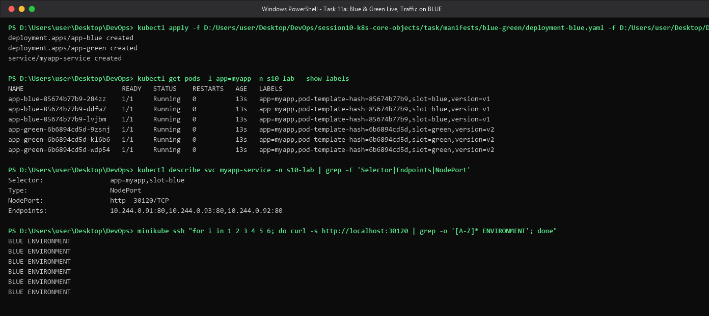

**Six pods are Running, but the Service lists only three Endpoints** — the three blue pod IPs. The
green pods are fully deployed, healthy and passing readiness probes, yet receive zero traffic.
That is the "warm standby" that makes the cutover safe: green has already proven it can start and
serve before a single user reaches it.

### Step 2 — The cutover, and the instant rollback

```bash
kubectl apply -f service-green.yaml
kubectl describe svc myapp-service -n s10-lab | grep -E 'Selector|Endpoints'
minikube ssh "for i in 1..8; do curl -s http://localhost:30120 | grep -o '[A-Z]* ENVIRONMENT'; done"
kubectl apply -f service-blue.yaml      # instant rollback
```

```
PS D:\Users\user\Desktop\DevOps> kubectl apply -f .../service-green.yaml
service/myapp-service configured

PS D:\Users\user\Desktop\DevOps> kubectl describe svc myapp-service -n s10-lab | grep -E 'Selector|Endpoints'
Selector:                 app=myapp,slot=green
Endpoints:                10.244.0.95:80,10.244.0.94:80,10.244.0.96:80

PS D:\Users\user\Desktop\DevOps> minikube ssh "for i in 1 2 3 4 5 6 7 8; do curl -s http://localhost:30120 | grep -o '[A-Z]* ENVIRONMENT'; done"
GREEN ENVIRONMENT
GREEN ENVIRONMENT
GREEN ENVIRONMENT
GREEN ENVIRONMENT
GREEN ENVIRONMENT
GREEN ENVIRONMENT
GREEN ENVIRONMENT
GREEN ENVIRONMENT

PS D:\Users\user\Desktop\DevOps> echo '--- INSTANT ROLLBACK: flip selector back to blue ---'; kubectl apply -f .../service-blue.yaml
--- INSTANT ROLLBACK: flip selector back to blue ---
service/myapp-service configured

PS D:\Users\user\Desktop\DevOps> kubectl describe svc myapp-service -n s10-lab | grep -E 'Selector|Endpoints'
Selector:                 app=myapp,slot=blue
Endpoints:                10.244.0.92:80,10.244.0.93:80,10.244.0.91:80

PS D:\Users\user\Desktop\DevOps> minikube ssh "for i in 1 2 3 4 5 6; do curl -s http://localhost:30120 | grep -o '[A-Z]* ENVIRONMENT'; done"
BLUE ENVIRONMENT
BLUE ENVIRONMENT
BLUE ENVIRONMENT
BLUE ENVIRONMENT
BLUE ENVIRONMENT
BLUE ENVIRONMENT
```

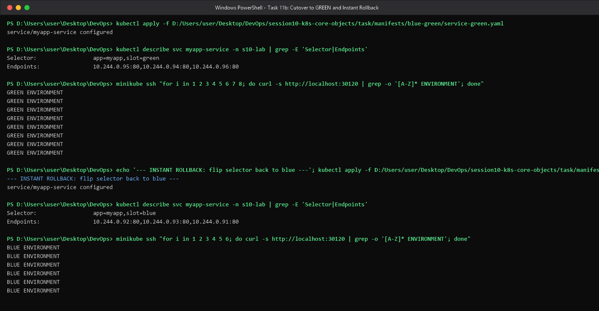

### Step 3 — Promote Green, decommission Blue

```
PS D:\Users\user\Desktop\DevOps> kubectl apply -f service-green.yaml; kubectl delete -f deployment-blue.yaml
service/myapp-service configured
deployment.apps "app-blue" deleted from s10-lab namespace

PS D:\Users\user\Desktop\DevOps> kubectl get pods -l app=myapp -n s10-lab
NAME                         READY   STATUS        RESTARTS   AGE
app-blue-85674b77b9-284zz    1/1     Terminating   0          42s
app-blue-85674b77b9-ddfw7    1/1     Terminating   0          42s
app-blue-85674b77b9-lvjbm    1/1     Terminating   0          42s
app-green-6b6894cd5d-9zsnj   1/1     Running       0          42s
app-green-6b6894cd5d-kl6b6   1/1     Running       0          42s
app-green-6b6894cd5d-wdp54   1/1     Running       0          42s

PS D:\Users\user\Desktop\DevOps> minikube ssh "for i in 1 2 3 4; do curl -s http://localhost:30120 | grep -o '[A-Z]* ENVIRONMENT'; done"
GREEN ENVIRONMENT
GREEN ENVIRONMENT
GREEN ENVIRONMENT
GREEN ENVIRONMENT
```

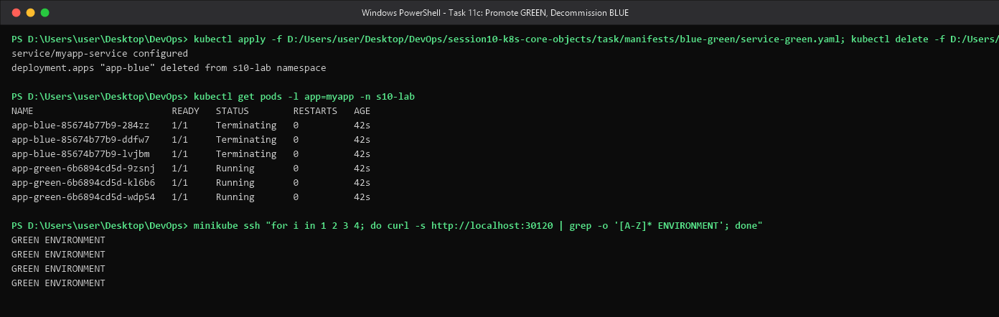

### What happened / why

The `Endpoints` list flipped from the three blue IPs (`.91/.92/.93`) to the three green IPs
(`.94/.95/.96`) **and back**, and traffic followed 8/8 then 6/6 with zero mixed responses.

The mechanism, end to end:

1. `kubectl apply -f service-green.yaml` is a single atomic write to one Service object — the only
   field that changed is `spec.selector.slot`.
2. The **EndpointSlice controller** re-evaluates the selector and rewrites the endpoint list.
3. **kube-proxy** watches EndpointSlices and rewrites the node's iptables/IPVS rules.
4. The next TCP connection to `nodePort 30120` DNATs to a green pod.

Total elapsed time: milliseconds. **No pod was created, deleted, restarted or rescheduled.** That
is why this is the fastest rollback available in plain Kubernetes: reverting means applying the
other file, which is the same millisecond-scale operation. Contrast with Task 8's
`kubectl rollout undo`, which had to run a whole rolling cycle and took tens of seconds.

**The absence of mixed responses is the key differentiator from RollingUpdate.** In Task 8 the
traffic log showed v1 and v2 interleaved for ~8 seconds because both were in the endpoint list at
once. Here the selector is exact — a pod is either `slot=blue` or `slot=green`, never both — so
the endpoint set is replaced wholesale.

The costs, visible in the transcript: **six pods ran to serve three pods' worth of traffic** — 2×
compute for the entire overlap window. And any in-flight request or in-memory session on a blue
pod is simply dropped at the flip, which is why blue-green demands stateless apps or externalised
sessions. The final step shows the discipline that makes it affordable: once green is verified,
blue is deleted and capacity returns to 1×. In practice you keep blue for a soak period — hours or
a day — because it is your rollback, and only then decommission.

---

## Task 12 — Canary Deployment & Pod-Ratio Traffic Splitting

**Objective:** run a 9:1 stable/canary pod ratio behind one Service, measure the resulting ~10%
traffic split with a real curl loop, shift to 30%, then abort the canary.

### Manifests — [`manifests/canary/`](./manifests/canary)

[`deployment-stable.yaml`](./manifests/canary/deployment-stable.yaml) — canary is identical except
`track: canary`, `version: v2`, `replicas: 1`, `nginx:1.25-alpine`:

```yaml
apiVersion: apps/v1
kind: Deployment
metadata:
  name: app-stable
  namespace: s10-lab
  labels: { app: myapp-canary, track: stable, version: v1 }
spec:
  replicas: 9                      # 9 of 10 total pods = 90% of traffic
  selector:
    matchLabels:
      app: myapp-canary
      track: stable                # selector INCLUDES track -> owns only stable pods
  template:
    metadata:
      labels:
        app: myapp-canary          # shared label -> selected by the single Service
        track: stable              # discriminator -> lets each Deployment own its pods
        version: v1
    spec:
      containers:
        - name: web
          image: nginx:1.24-alpine
          ports: [{ containerPort: 80 }]
          command:
            - /bin/sh
            - -c
            - >
              echo '<html><body ...><p>STABLE v1</p><p>Track: stable</p></body></html>'
              > /usr/share/nginx/html/index.html && exec nginx -g 'daemon off;'
          resources:
            requests: { cpu: "10m", memory: "24Mi" }
            limits:   { cpu: "80m", memory: "64Mi" }
          readinessProbe:
            httpGet: { path: /, port: 80 }
            initialDelaySeconds: 2
            periodSeconds: 5
```

[`service.yaml`](./manifests/canary/service.yaml) — the deliberately **loose** selector:

```yaml
apiVersion: v1
kind: Service
metadata:
  name: myapp-canary-service
  namespace: s10-lab
  labels: { app: myapp-canary }
spec:
  type: NodePort
  selector:
    app: myapp-canary       # deliberately does NOT include 'track'
                            # -> matches BOTH Deployments' pods
  ports:
    - name: http
      port: 80
      targetPort: 80
      nodePort: 30130
      protocol: TCP
```

### Step 1 — 9 stable + 1 canary in one endpoint pool

```bash
kubectl apply -f deployment-stable.yaml -f service.yaml
kubectl rollout status deployment/app-stable -n s10-lab
kubectl apply -f deployment-canary.yaml
kubectl rollout status deployment/app-canary -n s10-lab
kubectl get deploy -l app=myapp-canary -n s10-lab
kubectl get endpointslice -l kubernetes.io/service-name=myapp-canary-service -n s10-lab \
  -o jsonpath='{range .items[*].endpoints[*]}{.addresses[0]}{"\n"}{end}' | wc -l
```

```
PS D:\Users\user\Desktop\DevOps> kubectl apply -f .../deployment-canary.yaml
deployment.apps/app-canary created

PS D:\Users\user\Desktop\DevOps> kubectl get deploy -l app=myapp-canary -n s10-lab
NAME         READY   UP-TO-DATE   AVAILABLE   AGE
app-canary   1/1     1            1           9s
app-stable   9/9     9            9           31s

PS D:\Users\user\Desktop\DevOps> kubectl get pods -l app=myapp-canary -n s10-lab --no-headers | wc -l; kubectl get pods -l app=myapp-canary,track=canary -n s10-lab --show-labels --no-headers
10
app-canary-6bb7b4848c-ksstg   1/1   Running   0     10s   app=myapp-canary,pod-template-hash=6bb7b4848c,track=canary,version=v2

PS D:\Users\user\Desktop\DevOps> kubectl get endpointslice ... | wc -l
10
```

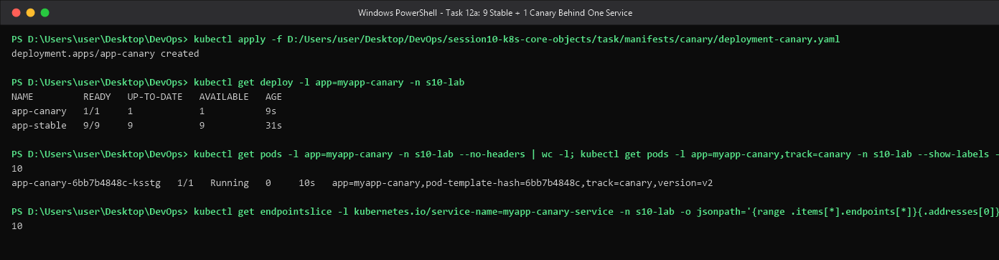

**Two independent Deployments, one Service, ten endpoints.** The `track` label is what makes this
work: each Deployment's `selector.matchLabels` includes `track`, so `app-stable` owns only its 9
pods and `app-canary` only its 1 — they never fight over each other's pods. The Service's selector
omits `track`, so it sweeps up all 10.

### Step 2 — Measure the split

```bash
minikube ssh "for i in 1..20;  do curl -s http://localhost:30130 | grep -oE 'STABLE v1|CANARY v2'; done"
minikube ssh "for i in 1..100; do curl -s http://localhost:30130 | grep -oE 'STABLE v1|CANARY v2'; done" | sort | uniq -c
```

```
PS D:\Users\user\Desktop\DevOps> minikube ssh "for i in 1 2 3 ... 20; do curl -s http://localhost:30130 | grep -oE 'STABLE v1|CANARY v2'; done"
CANARY v2
STABLE v1
STABLE v1
STABLE v1
STABLE v1
STABLE v1
STABLE v1
STABLE v1
STABLE v1
STABLE v1
STABLE v1
STABLE v1
STABLE v1
STABLE v1
CANARY v2
CANARY v2
STABLE v1
STABLE v1
STABLE v1
STABLE v1
```

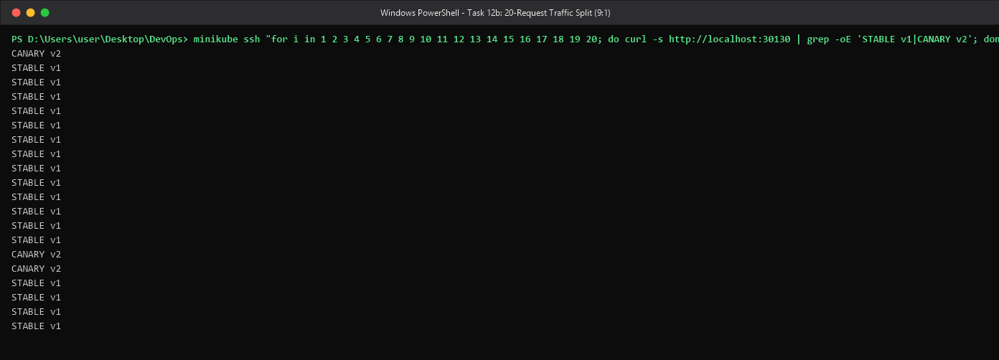

```
PS D:\Users\user\Desktop\DevOps> # 100 requests, counted by version (9 stable : 1 canary pods)
PS D:\Users\user\Desktop\DevOps> minikube ssh "for i in 1..100; do curl -s http://localhost:30130 | grep -oE 'STABLE v1|CANARY v2'; done" | sort | uniq -c
     13 CANARY v2
     87 STABLE v1

PS D:\Users\user\Desktop\DevOps> kubectl scale deployment app-canary --replicas=3 -n s10-lab; kubectl scale deployment app-stable --replicas=7 -n s10-lab
deployment.apps/app-canary scaled
deployment.apps/app-stable scaled

PS D:\Users\user\Desktop\DevOps> kubectl get deploy -l app=myapp-canary -n s10-lab
NAME         READY   UP-TO-DATE   AVAILABLE   AGE
app-canary   3/3     3            3           83s
app-stable   7/7     7            7           105s
```

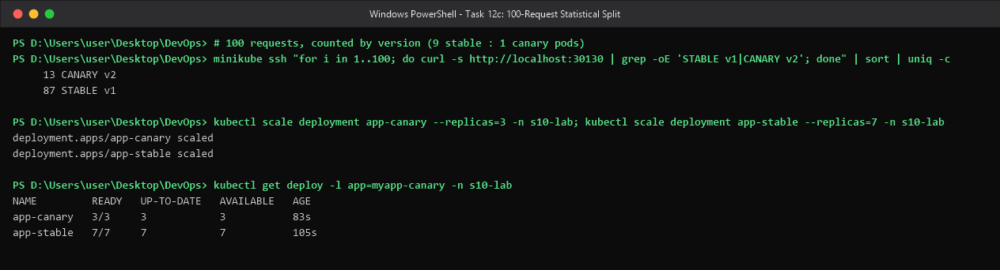

### Step 3 — Shift to 30%, then abort

```
PS D:\Users\user\Desktop\DevOps> # Canary now at 3/10 pods -> expect ~30%
PS D:\Users\user\Desktop\DevOps> minikube ssh "for i in 1..100; do curl -s http://localhost:30130 | grep -oE 'STABLE v1|CANARY v2'; done" | sort | uniq -c
     32 CANARY v2
     68 STABLE v1

PS D:\Users\user\Desktop\DevOps> echo '--- ABORT CANARY: scale canary to 0, stable back to 9 ---'; kubectl scale deployment app-canary --replicas=0 -n s10-lab; kubectl scale deployment app-stable --replicas=9 -n s10-lab
--- ABORT CANARY: scale canary to 0, stable back to 9 ---
deployment.apps/app-canary scaled
deployment.apps/app-stable scaled

PS D:\Users\user\Desktop\DevOps> kubectl get deploy -l app=myapp-canary -n s10-lab
NAME         READY   UP-TO-DATE   AVAILABLE   AGE
app-canary   0/0     0            0           2m6s
app-stable   9/9     9            9           2m28s

PS D:\Users\user\Desktop\DevOps> minikube ssh "for i in 1..40; do curl -s http://localhost:30130 | grep -oE 'STABLE v1|CANARY v2'; done" | sort | uniq -c
     40 STABLE v1
```

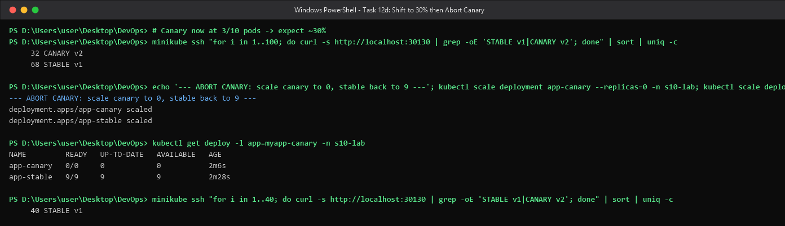

### What happened / why

**The measurements match the pod ratio remarkably closely:**

| Pods (canary:stable) | Expected canary % | **Measured** | Sample |
|---|---|---|---|
| 1 : 9 | 10.0% | 15% (3/20) | 20 requests |
| 1 : 9 | 10.0% | **13%** (13/100) | 100 requests |
| 3 : 7 | 30.0% | **32%** (32/100) | 100 requests |
| 0 : 9 | 0% | **0%** (0/40) | 40 requests |

This is the whole theory of canary-by-pod-count in one table. There is **no traffic-splitting
component anywhere** — no weights, no percentages configured. kube-proxy simply picks a random
endpoint per new TCP connection from a flat list of 10, so each pod receives ~1/10 of connections
and the split *is* the pod ratio. The 20-request sample landing at 15% rather than 10% is ordinary
sampling noise, which is exactly why the 100-request runs were added: 13% and 32% are convincingly
close to 10% and 30%.

**The abort is the most important step operationally.** Scaling the canary to 0 removes its
endpoints, and the very next request goes to stable — 40/40. Rollback is one `kubectl scale`, with
no rebuild, no re-pull, no rolling cycle. That asymmetry (slow, deliberate ramp-up; instant
abort) is what makes canary the right strategy for genuinely risky changes.

**Limitations this lab makes concrete:**
- **Granularity is bounded by pod count.** A 1% canary needs 100 pods. Fine at scale, useless for
  a 3-pod service.
- **The split is random, not sticky.** A single user's consecutive requests can hit stable, then
  canary, then stable — visible in the 20-request transcript. Any version-dependent session state
  breaks. `sessionAffinity: ClientIP` helps, at the cost of even distribution.
- **No routing by attribute.** You cannot send only internal staff, or only one region, to the
  canary. That requires header/weight-based routing from a service mesh (Istio `VirtualService`)
  or an ingress controller with canary annotations.
- **Rebalancing is manual.** Going 10% → 30% required scaling *both* Deployments to keep the total
  at 10. Tools like Flagger or Argo Rollouts automate this ramp, plus the metric analysis that
  decides whether to promote or abort.

---

## Task 13 — Recreate Deployment & Downtime Outage Demonstration

**Objective:** use `strategy.type: Recreate` and *capture the deliberate outage window* with a
continuous curl loop — the window where all v1 pods are gone and no v2 pod exists yet.

### Manifests — [`manifests/recreate/`](./manifests/recreate)

[`deployment-v1.yaml`](./manifests/recreate/deployment-v1.yaml) — v2 differs only in image,
`version: v2` and page text:

```yaml
apiVersion: apps/v1
kind: Deployment
metadata:
  name: app-recreate
  namespace: s10-lab
  labels: { app: app-recreate }
spec:
  replicas: 3
  # Recreate: the controller scales the OLD ReplicaSet to 0 and WAITS for every
  # old pod to disappear before it creates a single new pod. No two versions ever
  # run at once -- and there is a guaranteed outage window with zero endpoints.
  strategy:
    type: Recreate          # note: NO rollingUpdate block is permitted here
  selector:
    matchLabels:
      app: app-recreate
  template:
    metadata:
      labels:
        app: app-recreate
        version: v1
    spec:
      containers:
        - name: web
          image: nginx:1.24-alpine
          ports: [{ containerPort: 80 }]
          command:
            - /bin/sh
            - -c
            - >
              echo '<html><body ...><p>STRATEGY: RECREATE</p><p>VERSION: v1</p></body></html>'
              > /usr/share/nginx/html/index.html && exec nginx -g 'daemon off;'
          resources:
            requests: { cpu: "30m", memory: "32Mi" }
            limits:   { cpu: "100m", memory: "64Mi" }
          readinessProbe:
            httpGet: { path: /, port: 80 }
            initialDelaySeconds: 3
            periodSeconds: 5
```

### Step 1 — Deploy v1, then trigger the Recreate update under live traffic

Exactly the three-terminal setup the brief describes, run as one script so the timings interleave:

```bash
# Terminal 2 equivalent - continuous polling, started first
minikube ssh "for i in 1..60; do date +%T; curl -s -m 2 http://localhost:30140 | grep -oE 'VERSION: v[0-9][^<]*' || echo '[OUTAGE] Connection refused / 0 pods alive'; sleep 0.5; done" > traffic.log &
sleep 4
# Terminal 3 equivalent - trigger the update
kubectl apply -f manifests/recreate/deployment-v2.yaml
# Terminal 1 equivalent - observe pod state
for i in $(seq 1 12); do date +%T; kubectl get pods -l app=app-recreate -n s10-lab --no-headers; sleep 2; done
```

```
PS D:\Users\user\Desktop\DevOps> bash recreate-demo.sh traffic-recreate.log
deployment.apps/app-recreate configured
10:51:24  app-recreate-6dbf86f78b-46xqs(Terminating) app-recreate-6dbf86f78b-bj5f4(Completed) app-recreate-6dbf86f78b-dmnzt(Terminating)
10:51:28  app-recreate-94b5cccc7-fq28g(Running) app-recreate-94b5cccc7-qj8pz(Running) app-recreate-94b5cccc7-vf7ww(Running)
10:51:30  app-recreate-94b5cccc7-fq28g(Running) app-recreate-94b5cccc7-qj8pz(Running) app-recreate-94b5cccc7-vf7ww(Running)
10:51:32  app-recreate-94b5cccc7-fq28g(Running) app-recreate-94b5cccc7-qj8pz(Running) app-recreate-94b5cccc7-vf7ww(Running)
```

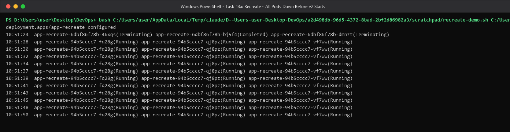

The first frame is the giveaway: **all three pods belong to the OLD ReplicaSet (`6dbf86f78b`) and
all three are `Terminating`/`Completed` — not a single new pod exists yet.** By the next frame all
three pods are from the NEW ReplicaSet (`94b5cccc7`). The two generations never overlap, which is
precisely what Recreate guarantees.

### Step 2 — The outage window, captured

```
PS D:\Users\user\Desktop\DevOps> sed -n '1,30p' traffic-recreate.log
05:21:19  VERSION: v1
05:21:20  VERSION: v1
05:21:20  VERSION: v1
05:21:21  VERSION: v1
05:21:21  VERSION: v1
05:21:22  VERSION: v1
05:21:22  VERSION: v1
05:21:23  VERSION: v1
05:21:23  [OUTAGE] Connection refused / 0 pods alive     <-- OUTAGE BEGINS
05:21:24  [OUTAGE] Connection refused / 0 pods alive
05:21:24  [OUTAGE] Connection refused / 0 pods alive
05:21:25  [OUTAGE] Connection refused / 0 pods alive
05:21:26  [OUTAGE] Connection refused / 0 pods alive
05:21:27  [OUTAGE] Connection refused / 0 pods alive
05:21:28  [OUTAGE] Connection refused / 0 pods alive
05:21:28  [OUTAGE] Connection refused / 0 pods alive
05:21:29  [OUTAGE] Connection refused / 0 pods alive
05:21:29  [OUTAGE] Connection refused / 0 pods alive
05:21:30  [OUTAGE] Connection refused / 0 pods alive
05:21:30  [OUTAGE] Connection refused / 0 pods alive
05:21:31  [OUTAGE] Connection refused / 0 pods alive
05:21:31  [OUTAGE] Connection refused / 0 pods alive
05:21:32  [OUTAGE] Connection refused / 0 pods alive
05:21:32  [OUTAGE] Connection refused / 0 pods alive     <-- OUTAGE ENDS
05:21:33  VERSION: v2 (UPGRADED)
05:21:33  VERSION: v2 (UPGRADED)
05:21:34  VERSION: v2 (UPGRADED)
05:21:34  VERSION: v2 (UPGRADED)
05:21:35  VERSION: v2 (UPGRADED)

PS D:\Users\user\Desktop\DevOps> echo "v1 served : $(grep -c 'VERSION: v1' ...)"; echo "OUTAGE    : $(grep -c OUTAGE ...)"; echo "v2 served : $(grep -c 'VERSION: v2' ...)"
v1 served : 8
OUTAGE    : 16
v2 served : 36
```

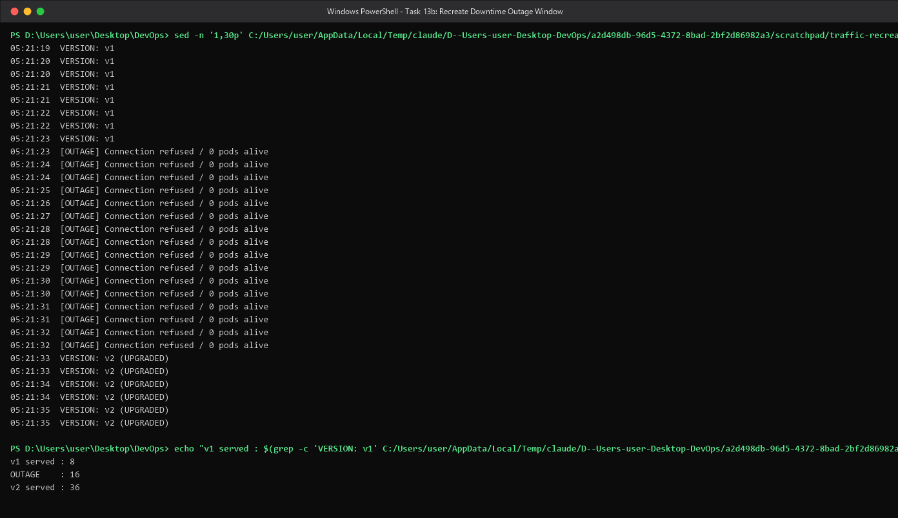

**The measured outage: 16 consecutive failed requests from 05:21:23 to 05:21:32 — a solid ~9.5
second hole with 100% request failure.** The transition is exactly `v1 → [OUTAGE] → v2` with **no
mixed-version responses anywhere** in the log.

### Step 3 — Rollback (also via Recreate) and verification

```
PS D:\Users\user\Desktop\DevOps> kubectl rollout history deployment/app-recreate -n s10-lab
deployment.apps/app-recreate
REVISION  CHANGE-CAUSE
1         <none>
2         <none>

PS D:\Users\user\Desktop\DevOps> bash recreate-undo.sh
deployment.apps/app-recreate rolled back
10:52:27  app-recreate-94b5cccc7-fq28g(Terminating) app-recreate-94b5cccc7-qj8pz(Terminating) app-recreate-94b5cccc7-vf7ww(Terminating)
10:52:28  app-recreate-6dbf86f78b-cmt2g(ContainerCreating) app-recreate-6dbf86f78b-h5f22(ContainerCreating) app-recreate-6dbf86f78b-rnlz7(Pending) app-recreate-94b5cccc7-fq28g(Completed) app-recreate-94b5cccc7-qj8pz(Completed) app-recreate-94b5cccc7-vf7ww(Completed)
10:52:30  app-recreate-6dbf86f78b-cmt2g(Running) app-recreate-6dbf86f78b-h5f22(Running) app-recreate-6dbf86f78b-rnlz7(Running)
```

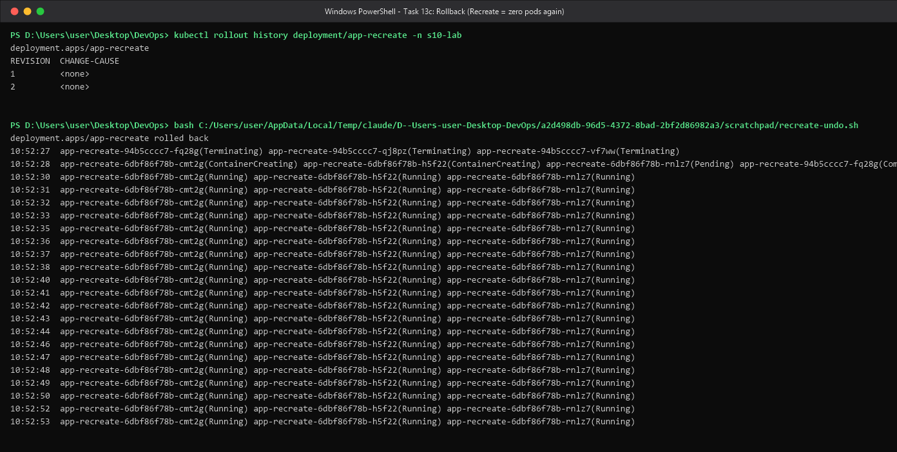

```
PS D:\Users\user\Desktop\DevOps> kubectl get pods -l app=app-recreate -n s10-lab -o custom-columns='NAME:...,VERSION:...,STATUS:...' --no-headers
app-recreate-6dbf86f78b-cmt2g   v1    Running
app-recreate-6dbf86f78b-h5f22   v1    Running
app-recreate-6dbf86f78b-rnlz7   v1    Running

PS D:\Users\user\Desktop\DevOps> minikube ssh "for i in 1 2 3 4; do curl -s http://localhost:30140 | grep -oE 'VERSION: v[0-9][^<]*'; done"
VERSION: v1
VERSION: v1
VERSION: v1
VERSION: v1

PS D:\Users\user\Desktop\DevOps> kubectl rollout history deployment/app-recreate -n s10-lab
deployment.apps/app-recreate
REVISION  CHANGE-CAUSE
2         <none>
3         <none>
```

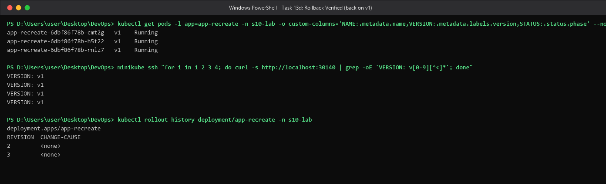

### What happened / why

The Recreate algorithm is strictly sequential, and each step is visible above:

1. Scale the old ReplicaSet to **0**.
2. **Block** until every old pod is fully terminated — not just marked for deletion.
3. Only then scale the new ReplicaSet to 3.
4. Wait for the new pods to become Ready.

Between steps 2 and 3 the Service has **zero endpoints**. kube-proxy has no backend to DNAT to, so
the connection is refused at the node — that is the literal meaning of the 16 `[OUTAGE]` samples.
The ~9.5 seconds breaks down as: graceful termination of 3 nginx pods, then container creation,
then the `initialDelaySeconds: 3` readiness probe on the new pods. On a real app with a 30-second
JVM warm-up and a 60-second grace period, this window would be **minutes**.

**Side-by-side with Task 8, the same 3-replica app, same cluster, same traffic loop:**

| | Task 8 RollingUpdate | Task 13 Recreate |
|---|---|---|
| Requests succeeded | 44 / 45 (97.8%) | 44 / 60 (73.3%) |
| Failed requests | 1 (millisecond race) | **16 consecutive** (structural) |
| Outage duration | <1 s, incidental | **~9.5 s, by design** |
| Mixed versions seen | **yes**, ~8 s of v1+v2 | **never** |
| Peak pods | 4 (3 + surge) | 3 (never exceeds `replicas`) |

That table is the entire trade-off. RollingUpdate buys availability by accepting version overlap.
Recreate buys version exclusivity by accepting an outage. Neither is "better" — you pick based on
whether your app can tolerate two versions sharing a database, a schema, a cache format or a
`ReadWriteOnce` volume. When it cannot, an outage is not a bug, it is the *requirement*, and
Recreate is the honest way to express it.

Note also that Recreate **never exceeds `replicas` pods**, so it needs no spare capacity — the
reason it is sometimes chosen under a tight `ResourceQuota` even when overlap would be tolerable.

Finally, the rollback is itself a Recreate: `rollout undo` incurred a **second outage**. With
blue-green (Task 11) rollback was free and instant. This is the strongest practical argument for
blue-green over Recreate whenever you can afford 2× capacity.

---

## Key Learnings

**1 — Declaration and realisation are separate stages (Tasks 3, 9).**
`kubectl apply` succeeding means only that the API server validated the schema and wrote to etcd.
Whether a container ever runs is decided much later by the scheduler and the kubelet. The two
failure classes have different symptoms and different debugging entry points: an API-server
rejection (Drill 2) leaves nothing in etcd and tells you in the apply output; a kubelet failure
(Drill 1) leaves a perfectly valid object with broken pods, and only `kubectl describe pod` events
reveal why.

**2 — `Running` is not `Ready`, and that gap is load-bearing (Tasks 5, 8).**
The readiness probe held a healthy nginx at `0/1` for 16 seconds. A not-Ready pod is excluded from
every Service endpoint list, and *that* exclusion is the interlock that makes zero-downtime rolling
updates possible: the controller waits for `READY true` on a new pod before retiring an old one.
Remove readiness probes and `maxUnavailable: 0` becomes a meaningless promise.

**3 — Controllers reconcile continuously; there is no "deploy" event.**
The ReplicaSet recreated a deleted pod sub-second; the DaemonSet did the same; the Deployment's
stalled rollout kept retrying for minutes. Everything is a level-triggered loop comparing observed
state to desired state — which is why declaring intent (`replicas: 3`) is more robust than issuing
commands ("start a pod").

**4 — Controllers guarantee a count; StatefulSets guarantee an identity (Task 6).**
The replacement ReplicaSet pod got a new random name and IP. `mysql-1`'s replacement would still be
`mysql-1`, still bound to `mysql-persistent-storage-mysql-1`, still resolvable at
`mysql-1.mysql.s10-lab.svc.cluster.local`. Ordered, sequential startup plus per-pod PVCs plus
stable DNS is what clustered databases need and what a ReplicaSet fundamentally cannot offer.

**5 — Labels and selectors are the only coupling mechanism, and that indirection buys you the
deployment strategies (Tasks 10–12).**
Nothing references a pod by name. Blue-green is *just* changing one word in a selector. Canary is
*just* writing a selector loose enough to match two Deployments. Once you see that a Service is a
live query rather than a fixed list, both strategies become obvious rather than clever.

**6 — A Deployment manages ReplicaSets, and keeping the old one at zero IS the rollback (Task 8).**
Each pod template gets a ReplicaSet tagged by `pod-template-hash`. `rollout undo` re-pulls nothing
and re-reads no YAML — it scales the old ReplicaSet back up. That is why rollback is fast, and why
the revision history showed revision 1 reappearing as revision 3.

**7 — Every deployment strategy trades the same three currencies: downtime, capacity, and version
overlap. Measured on this cluster:**

| Strategy | Downtime measured | Capacity | Versions overlap | Rollback |
|---|---|---|---|---|
| RollingUpdate | 1/45 requests (race) | 1.33× peak | **yes, ~8 s** | rolling cycle (~30 s) |
| Recreate | **16/60 requests, ~9.5 s** | 1× | **never** | another full outage |
| Blue-Green | 0 | **2×** | never | **instant** (selector flip) |
| Canary | 0 | 1.1× | **yes, deliberately** | instant (`scale --replicas=0`) |

You cannot optimise all three. Recreate spends availability to buy exclusivity; blue-green spends
money to buy both; canary spends overlap to buy real-world validation.

**8 — `maxUnavailable: 0` is a safety brake, not a performance setting (Tasks 8, 9).**
In the happy path it delivered a never-below-`3/3` rollout. In the failure path it was the reason a
completely broken image caused **zero** user impact: the controller was forbidden from retiring a
healthy pod until a new one became Ready, and since none ever did, the rollout simply froze at
`READY 3/3, UP-TO-DATE 1, AVAILABLE 3`. Safe failure modes come from constraints you set *before*
the incident.

**9 — Requests schedule; limits throttle or kill (Tasks 5, 10).**
`lifecycle-pending` never left the scheduler because `requests.memory: 32Gi` exceeded node
allocatable — no kubelet was ever involved. At runtime the asymmetry matters: exceeding a CPU limit
throttles the process (compressible), exceeding a memory limit kills the container (incompressible).
And always write `Mi`/`Gi`, never `M`/`G` — `1Gi` is 7.4% larger than `1G`, a gap large enough to
cause intermittent OOM kills.

**10 — Graceful shutdown must be implemented by the application (Task 5).**
`terminationGracePeriodSeconds: 20` only *permits* 20 seconds; it does not create them. The SIGTERM
trap produced an 11-second drain — but an earlier variant of the same manifest exited in 2 seconds
because the shell's signal handling was subtly wrong. Similarly, Task 8's single dropped request
came from the asynchronous gap between endpoint removal and SIGTERM, fixable only with a `preStop`
hook. Kubernetes gives you the hooks; correctness is still yours.

**11 — Read the numeric columns, not the status strings.**
`READY 3/3 | UP-TO-DATE 1 | AVAILABLE 3` identified a stalled rollout instantly. `status.phase` is
`Succeeded`/`Failed` where kubectl prints `Completed`/`Error`. And on this cluster the STATUS column
printed `Error` where older versions print `CrashLoopBackOff`, while the `RESTARTS` counter and the
`Back-off restarting` event told the true story. Cosmetic strings vary by version; the underlying
fields and events do not.

---

## Deviations & Notes

Everything in this submission was executed for real. The following adaptations were made to fit
this specific environment, and are listed here for full transparency:

| # | Item | What was done and why |
|---|---|---|
| 1 | **Namespace `s10-lab`** | The cluster was shared with other work. Every manifest carries `namespace: s10-lab` and every command uses `-n s10-lab`, so nothing collided. The namespace was deleted at the end. |
| 2 | **NodePort access via `minikube ssh`** | With the docker driver on Windows, the node IP `192.168.49.2` is not routable from the host, so `curl http://$(minikube ip):30020` cannot work. All HTTP checks run *inside* the node (`minikube ssh "curl -s http://localhost:<port>"`), which still traverses the real NodePort → kube-proxy → Pod path. |
| 3 | **NodePorts renumbered** | 30110 / 30120 / 30130 / 30140 instead of the brief's 30010–30040, because other services already held ports in that space. NodePorts must be cluster-unique. |
| 4 | **`kubectl get -w` replaced with polling loops** | `-w` blocks a terminal indefinitely and cannot be captured in a transcript. Loops such as `for i in $(seq 1 12); do kubectl get pods …; sleep 1.5; done` were used instead and captured the transient states *better* — see Tasks 3, 4, 5 and 6, where `ContainerCreating`, `ErrImagePull → ImagePullBackOff`, `Running 0/1`, `Init:0/1` and `Terminating` were all recorded with timestamps. |
| 5 | **StatefulSet uses 2 replicas, not 3** | RAM budget on the shared cluster (`mysql:5.7` is a heavyweight image). Ordinal naming, ordered startup, per-pod PVCs and stable DNS are all fully demonstrated with `mysql-0` and `mysql-1`. |
| 6 | **Rolling-update Deployment uses 3 replicas, not 4** | To stay inside the lab's replica budget. `maxSurge: 1` / `maxUnavailable: 0` behaviour is identical and the invariants (`≤4` pods, `≥3` Ready) are clearly visible. The brief's `replicas: 4` arithmetic is worked through in full in [Task 10.4](#104-maxsurge-vs-maxunavailable--the-arithmetic). |
| 7 | **Canary kept the full 9:1 ratio** | A canary at 3:1 would be 25% and would not demonstrate the concept, so the 9 stable + 1 canary pods were run as specified. The pods are `nginx:1.24-alpine` with `20m` CPU / `24Mi` memory requests — ~200m CPU and ~320Mi total, comfortably within the node's free capacity, which was verified before deploying. |
| 8 | **`02-pending.yaml` requests `32Gi`, not `9Gi`** | The node reported ~8Gi allocatable. `32Gi` makes the pod unambiguously unschedulable on any host in this environment. Same lesson, more robust. |
| 9 | **Version pages written via `command:` instead of `postStart`** | The class manifests used a `postStart` lifecycle hook to write `index.html`. `postStart` runs *concurrently* with the container's entrypoint, so a readiness probe can race it and briefly serve the stock nginx welcome page — which would have corrupted the traffic-split measurements in Tasks 8, 11, 12 and 13. Writing the file and then `exec nginx` in the container command is deterministic. |
| 10 | **DaemonSet: single-node cluster** | `DESIRED=1` because the cluster has exactly 1 node, so "one pod per node" is demonstrated but not dramatic. A `tolerations` block for the control-plane taint was added (without it the DaemonSet would compute `desiredNumberScheduled: 0` on this cluster). Auto-rescheduling after deleting the pod was captured as supporting evidence. |
| 11 | **`CrashLoopBackOff` status string** | Server v1.37 printed `Error` in the STATUS column during back-off rather than the literal `CrashLoopBackOff`, and `state.waiting.reason` was empty. Documented honestly in [Task 5.2](#52--crashloopbackoff-05) with the raw API output as evidence; the actual behaviour (restart loop + exponential back-off) is fully demonstrated via the `RESTARTS` counter and the `Back-off restarting failed container` event. |
| 12 | **`kubectl logs --previous` on the crashloop pod** | Returned `unable to retrieve container logs for containerd://…` — the previous container's log had already been reaped by the runtime. The `Back-off` event and restart counter were used as evidence instead. |
| 13 | **Troubleshooting Drill 1 needed a healthy baseline** | `broken-image.yaml` alone would create a Deployment whose pods *all* fail, which cannot demonstrate "old pods remain healthy while the rollout stalls". A working `healthy-image.yaml` was deployed first so the broken update had genuine old pods to stall against — matching the real-world scenario the brief describes. |
| 14 | **Client/server version skew** | kubectl v1.34 against API server v1.37 (a `+3` skew) produced a warning on every invocation and a deprecation notice on `kubectl get endpoints`. No functional impact; `kubectl get endpointslice` was used where the modern API mattered. |

### Repository layout

```
session10-k8s-core-objects/task/
├── README.md                      <- this file
├── screenshots/                   <- 41 PNG screenshots
├── transcripts/                   <- raw .txt transcripts + raw traffic .log files
└── manifests/
    ├── pod.yml                    Task 2
    ├── hello.yml                  Task 4
    ├── pod-lifecycle/             Tasks 3, 5  (01…12)
    ├── replicaset/                Task 6a
    ├── statefulset/               Task 6b
    ├── daemonset/                 Task 7
    ├── deployment/                Task 8   (deployment-v1/v2, service)
    ├── troubleshooting/           Task 9   (healthy-image, broken-image, selector-mismatch, selector-fixed)
    ├── blue-green/                Task 11  (deployment-blue/green, service-blue/green)
    ├── canary/                    Task 12  (deployment-stable/canary, service)
    └── recreate/                  Task 13  (deployment-v1/v2, service)
```

### Cleanup

All resources were deleted after each task, and the namespace was removed at the end:

```bash
kubectl delete namespace s10-lab
```
