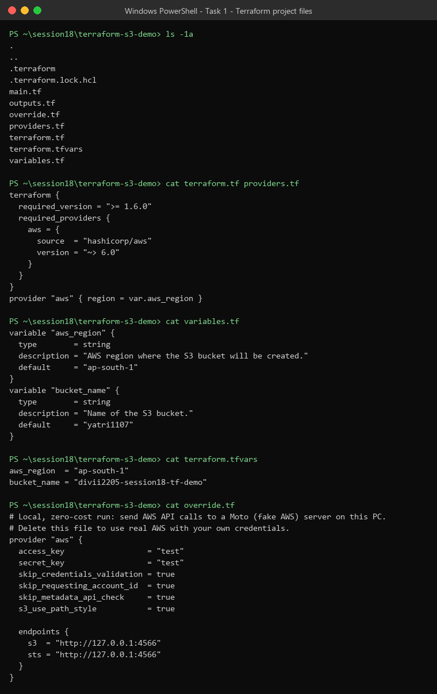
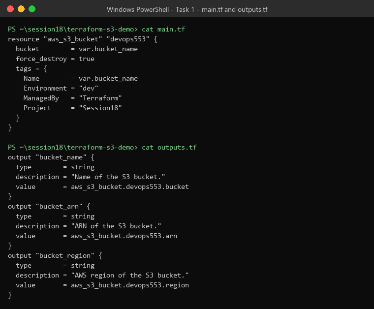
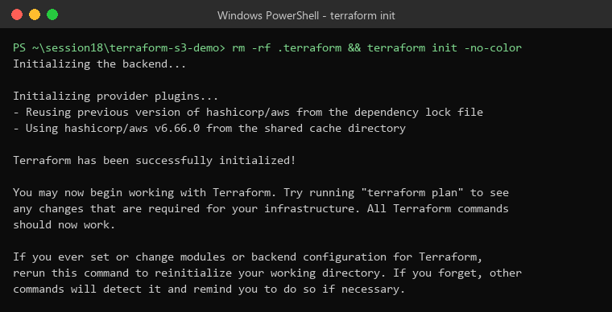
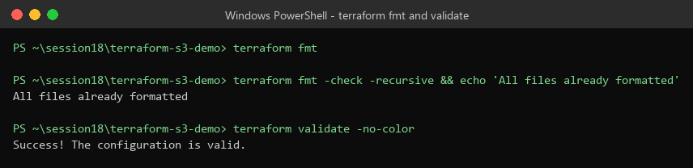
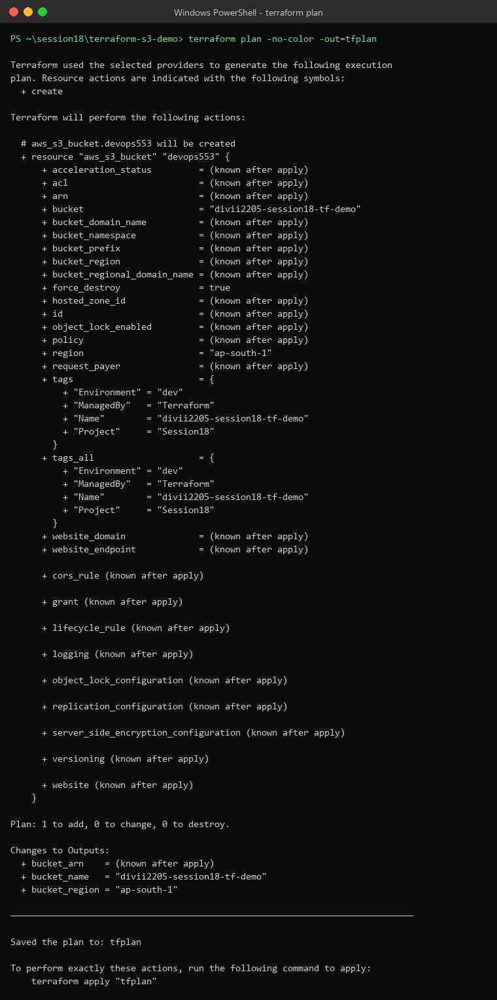
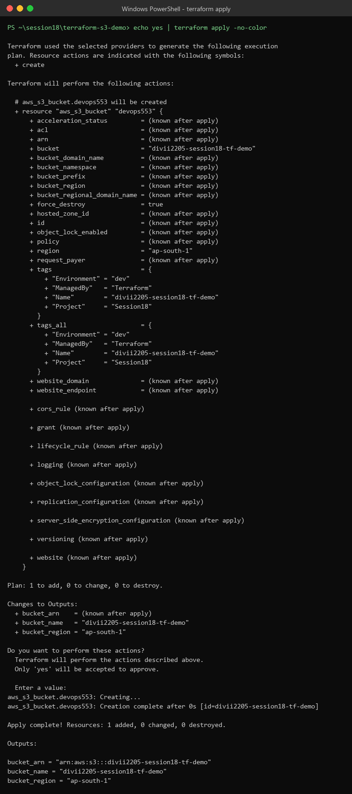
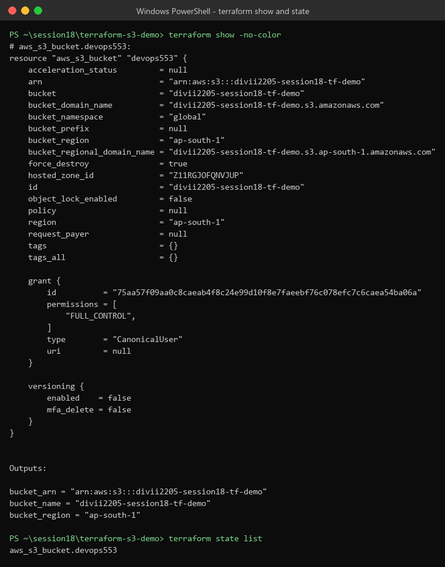
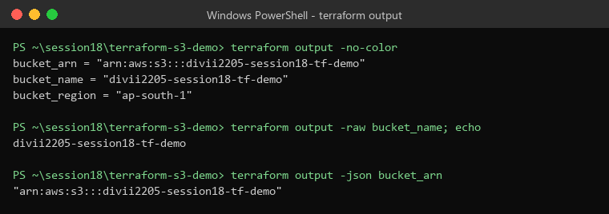
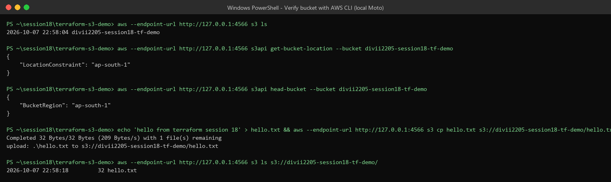
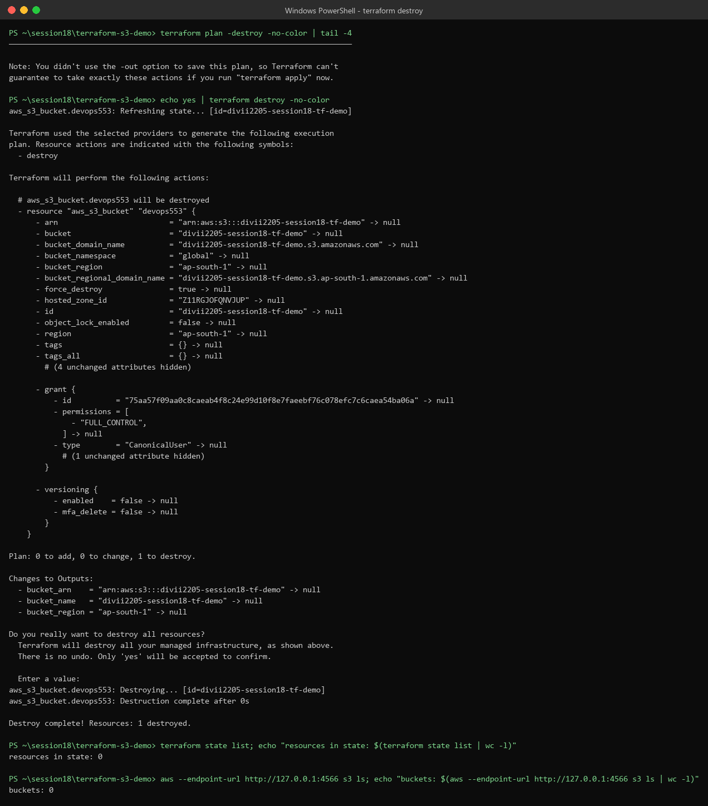

# Session 18 – Terraform & Infrastructure as Code (Submission)

| Task | What | Where |
|---|---|---|
| **Task 1** | Terraform S3 demo: create an S3 bucket and run the full workflow (init → destroy) | This README + `screenshots/` (project: `session18-terraform-iac/terraform-s3-demo/`) |
| **Task 2** | AWS services research: one README per service | `aws-services/01-iam … 05-dynamodb-rds/README.md` |

```text
task/
├── README.md                    ← this file (Task 1 + index)
├── screenshots/                 ← 10 screenshots of the Terraform workflow
└── aws-services/                ← Task 2
    ├── 01-iam/README.md
    ├── 02-ec2/README.md
    ├── 03-s3/README.md
    ├── 04-vpc/README.md
    └── 05-dynamodb-rds/README.md
```

---

# Task 1 – Terraform S3 Demo

## 1. What is Terraform / IaC (short)

- **Infrastructure as Code (IaC)**: describe servers, buckets and networks in **code files** instead of clicking in the console. The code can go in Git, be reviewed, be reused, and always gives the same result.
- **Terraform** (by HashiCorp) is an IaC tool. You write `.tf` files in **HCL**. Terraform uses a **provider** (here `hashicorp/aws`) to call the cloud APIs, and keeps track of what it created in a **state file** (`terraform.tfstate`).
- It is **declarative**: you say *what* you want ("one S3 bucket named X"). Terraform works out *how* (create, change or delete).

```text
 .tf files ──► terraform init ──► fmt ──► validate ──► plan ──► apply ──► show / output ──► destroy
 (code)        (download          (style) (syntax)     (preview) (create)  (inspect)          (clean up)
               provider)                                            │
                                                                    ▼
                                                     terraform.tfstate  ◄──►  AWS S3 bucket
```

## 2. Zero-cost setup (no AWS bill)

To avoid any AWS cost, Terraform was run against **[Moto](https://github.com/getmoto/moto)**, a free open-source **fake AWS server** that runs on the local PC (`http://127.0.0.1:4566`).
- **No AWS account, no real credentials, no cost.** Dummy keys `test` / `test` are used.
- The project's `.tf` files are **unchanged**. One extra file, **`override.tf`**, points the AWS provider to the local server. Terraform merges `override.tf` into `providers.tf` automatically.
- **Delete `override.tf`** (and run `aws configure`) to use the same project on real AWS.

`override.tf`:
```hcl
# Local, zero-cost run: send AWS API calls to a Moto (fake AWS) server on this PC.
# Delete this file to use real AWS with your own credentials.
provider "aws" {
  access_key                  = "test"
  secret_key                  = "test"
  skip_credentials_validation = true
  skip_requesting_account_id  = true
  skip_metadata_api_check     = true
  s3_use_path_style           = true

  endpoints {
    s3  = "http://127.0.0.1:4566"
    sts = "http://127.0.0.1:4566"
  }
}
```

Start the fake AWS server (free):
```bash
python -m venv moto-venv
moto-venv/Scripts/pip install "moto[server,s3]"     # Linux/macOS: moto-venv/bin/pip
moto-venv/Scripts/moto_server -H 127.0.0.1 -p 4566
# (or with Docker:  docker run -d -p 4566:5000 motoserver/moto)
```

> Even on real AWS, this demo costs about **$0**: an empty S3 bucket is free, and it is destroyed at the end. The local server just removes any risk.

## 3. Project structure

```text
terraform-s3-demo/
├── terraform.tf        # terraform block: required Terraform version + AWS provider version
├── providers.tf        # provider "aws" { region = var.aws_region }
├── variables.tf        # input variables: aws_region, bucket_name
├── terraform.tfvars    # values for the variables
├── main.tf             # the resource: aws_s3_bucket
├── outputs.tf          # outputs: bucket_name, bucket_arn, bucket_region
├── override.tf         # (local run only) send AWS calls to the fake AWS server
├── .terraform.lock.hcl # exact provider version lock
└── README.md
```

> The task lists `provider.tf`. The existing session project names this file `providers.tf` and keeps the `terraform {}` block in a separate `terraform.tf`. Terraform reads **every `.tf` file in the folder**, so the file names don't change how it works.



## 4. The code

**`terraform.tf`**
```hcl
terraform {
  required_version = ">= 1.6.0"
  required_providers {
    aws = {
      source  = "hashicorp/aws"
      version = "~> 6.0"
    }
  }
}
```

**`providers.tf`**
```hcl
provider "aws" { region = var.aws_region }
```

**`variables.tf`**
```hcl
variable "aws_region" {
  type        = string
  description = "AWS region where the S3 bucket will be created."
  default     = "ap-south-1"
}
variable "bucket_name" {
  type        = string
  description = "Name of the S3 bucket."
  default     = "yatri1107"
}
```

**`terraform.tfvars`** (overrides the defaults. Bucket names must be globally unique)
```hcl
aws_region  = "ap-south-1"
bucket_name = "divii2205-session18-tf-demo"
```

**`main.tf`**
```hcl
resource "aws_s3_bucket" "devops553" {
  bucket        = var.bucket_name
  force_destroy = true
  tags = {
    Name        = var.bucket_name
    Environment = "dev"
    ManagedBy   = "Terraform"
    Project     = "Session18"
  }
}
```

**`outputs.tf`**
```hcl
output "bucket_name" {
  type        = string
  description = "Name of the S3 bucket."
  value       = aws_s3_bucket.devops553.bucket
}
output "bucket_arn" {
  type        = string
  description = "ARN of the S3 bucket."
  value       = aws_s3_bucket.devops553.arn
}
output "bucket_region" {
  type        = string
  description = "AWS region of the S3 bucket."
  value       = aws_s3_bucket.devops553.region
}
```



## 5. Workflow – step by step

Tools used: Terraform **v1.16.4**, AWS provider **v6.66.0**, AWS CLI v2. Values come from `terraform.tfvars`.

### Step 1 – `terraform init`

Gets the folder ready: sets up the backend (local state) and **downloads the AWS provider** (the version is pinned by `.terraform.lock.hcl`) into `.terraform/`.

```bash
terraform init
```
Result: `Terraform has been successfully initialized!`



### Step 2 – `terraform fmt`

Rewrites `.tf` files into the standard style (indentation, aligned `=`). `-check` only reports, which is useful in CI.

```bash
terraform fmt
terraform fmt -check -recursive
```
Result: no files listed, which means **all files are already formatted**.

### Step 3 – `terraform validate`

Checks syntax and references (variables, resource types and arguments) **without** calling AWS.

```bash
terraform validate
```
Result: `Success! The configuration is valid.`



### Step 4 – `terraform plan`

Compares the **code** with the **state** and the **real infrastructure**, and shows what would change. `+` = create, `~` = update, `-` = destroy. `-out=tfplan` saves the plan to a file.

```bash
terraform plan -out=tfplan
```
Result: `+ resource "aws_s3_bucket" "devops553"` → **`Plan: 1 to add, 0 to change, 0 to destroy.`**



### Step 5 – `terraform apply`

Shows the plan again, asks for confirmation (type **`yes`**), creates the bucket, and writes `terraform.tfstate`.

```bash
terraform apply          # then type: yes
```
Result:
```text
aws_s3_bucket.devops553: Creation complete [id=divii2205-session18-tf-demo]
Apply complete! Resources: 1 added, 0 changed, 0 destroyed.

Outputs:
bucket_arn    = "arn:aws:s3:::divii2205-session18-tf-demo"
bucket_name   = "divii2205-session18-tf-demo"
bucket_region = "ap-south-1"
```



### Step 6 – `terraform show`

Prints the **state** in a readable form: every attribute of the bucket (ARN, domain names, region, versioning …) and the outputs. `terraform state list` lists the resources Terraform manages.

```bash
terraform show
terraform state list      # aws_s3_bucket.devops553
```



> **Local-run note:** `terraform show` lists `tags = {}`. The local fake S3 doesn't keep the bucket tags, so when Terraform re-read the bucket it stored an empty tag set. On real AWS the four tags from `main.tf` (`Name`, `Environment`, `ManagedBy`, `Project`) show here.

### Step 7 – `terraform output`

Prints the values from `outputs.tf`. `-raw` gives a plain value for scripts. `-json` gives machine-readable output.

```bash
terraform output
terraform output -raw bucket_name
terraform output -json bucket_arn
```



### Step 8 – Verify the bucket (AWS CLI)

Check from outside Terraform that the bucket really exists, and that it works by uploading a file. Against real AWS, drop `--endpoint-url`.

```bash
aws --endpoint-url http://127.0.0.1:4566 s3 ls
aws --endpoint-url http://127.0.0.1:4566 s3api get-bucket-location --bucket divii2205-session18-tf-demo
aws --endpoint-url http://127.0.0.1:4566 s3api head-bucket --bucket divii2205-session18-tf-demo
aws --endpoint-url http://127.0.0.1:4566 s3 cp hello.txt s3://divii2205-session18-tf-demo/hello.txt
aws --endpoint-url http://127.0.0.1:4566 s3 ls s3://divii2205-session18-tf-demo/
```
Result: the bucket is listed, location `ap-south-1`, `hello.txt` uploaded (32 bytes).



### Step 9 – `terraform destroy`

Deletes **everything in the state**. `terraform plan -destroy` previews it first. `force_destroy = true` lets Terraform delete the bucket even though `hello.txt` is still inside.

```bash
terraform plan -destroy
terraform destroy        # then type: yes
```
Result:
```text
Plan: 0 to add, 0 to change, 1 to destroy.
aws_s3_bucket.devops553: Destruction complete
Destroy complete! Resources: 1 destroyed.

resources in state: 0
buckets: 0
```



## 6. Command summary

| Command | Purpose | Result in this run |
|---|---|---|
| `terraform init` | Download provider, set up backend | Initialized, `hashicorp/aws v6.66.0` |
| `terraform fmt` | Format code | Already formatted |
| `terraform validate` | Check syntax/config | `Success! The configuration is valid.` |
| `terraform plan` | Preview changes | `1 to add, 0 to change, 0 to destroy` |
| `terraform apply` | Create resources | `Apply complete! Resources: 1 added` |
| `terraform show` | Show state | Bucket attributes + outputs |
| `terraform output` | Show outputs | `bucket_name`, `bucket_arn`, `bucket_region` |
| `terraform destroy` | Delete resources | `Destroy complete! Resources: 1 destroyed` |

## 7. Important files Terraform creates

| File / folder | What | Commit to Git? |
|---|---|---|
| `.terraform/` | Downloaded providers/modules | **No** (in `.gitignore`) |
| `.terraform.lock.hcl` | Exact provider versions + checksums | **Yes** |
| `terraform.tfstate` (+ `.backup`) | Real-world mapping of resources. Can contain secrets | **No**. In teams, use a remote backend (S3 + locking) |
| `tfplan` | Saved plan | No |
| `terraform.tfvars` | Variable values. May hold secrets | Usually **no** (in this repo's `.gitignore`), so its content is shown above |

## 8. Running it on real AWS (optional)

```bash
aws configure                       # access key, secret, region ap-south-1
aws sts get-caller-identity         # check who you are
rm override.tf                      # stop using the local fake server
terraform init
terraform plan
terraform apply                     # yes
terraform destroy                   # yes, so nothing is left running
```

---

# Task 2 – AWS Services Research

Each service has its own README in `aws-services/`, written in simple words with diagrams, tables, CLI and Terraform examples.

| # | Service | Category | File | Topics covered |
|---|---|---|---|---|
| 01 | **IAM** | Governance | [aws-services/01-iam/README.md](aws-services/01-iam/README.md) | What is IAM, users, groups, roles, policies, permissions (evaluation logic), least privilege, best practices, use cases |
| 02 | **EC2** | Compute | [aws-services/02-ec2/README.md](aws-services/02-ec2/README.md) | What is EC2, AMI, instance types (+ pricing), key pairs, security groups, EBS, public vs private IP, instance lifecycle, use cases |
| 03 | **S3** | Storage | [aws-services/03-s3/README.md](aws-services/03-s3/README.md) | What is S3, buckets, objects, storage classes, versioning, lifecycle policies, encryption, bucket policies, use cases |
| 04 | **VPC** | Networking | [aws-services/04-vpc/README.md](aws-services/04-vpc/README.md) | What is VPC, CIDR, subnets, route tables, Internet Gateway, NAT Gateway, security groups, network ACLs, public vs private subnet |
| 05 | **DynamoDB & RDS** | Database | [aws-services/05-dynamodb-rds/README.md](aws-services/05-dynamodb-rds/README.md) | DynamoDB: NoSQL, tables, items, attributes, partition key, sort key, use cases. RDS: relational DB, engines, DB instances, security, backups, Multi-AZ, read replicas, use cases |

### How the services fit together

```text
                         IAM (who can do what — applies to everything)
                                         │
Internet ─► Internet Gateway ─► VPC ─────┼──────────────────────────────────────────
                                 │ Public subnet:  Load balancer, NAT Gateway
                                 │ Private subnet: EC2 app servers ──┬──► RDS (SQL data)
                                 │                                   ├──► DynamoDB (NoSQL data)
                                 │                                   └──► S3 (files, backups, Terraform state)
```

---

## Summary

- **Task 1**: Terraform created, inspected and destroyed an S3 bucket through the full workflow `init → fmt → validate → plan → apply → show → output → destroy`, with screenshots of every step. It ran against a local fake AWS (Moto), so it **cost nothing**. The same code works on real AWS once `override.tf` is removed.
- **Task 2**: Five research READMEs cover IAM, EC2, S3, VPC, and DynamoDB & RDS, with all the topics the task lists.
