# Session 19: Cloud & Terraform in Action - Assignment Submission

An end-to-end AWS infrastructure project built with Terraform: **VPC + public subnet + internet gateway + route table + security group + EC2 + S3**.

All screenshots are real terminal output, saved in [`screenshots/`](screenshots/).

> **Where it ran:** My AWS access key was not working, so I deployed to **Moto**, an open-source **local AWS emulator** (`pip install "moto[server]"`).
> It answers the same AWS API calls (EC2, S3, STS) on `http://127.0.0.1:5055`, so Terraform and the AWS CLI work exactly as they would with real AWS. It costs $0.
> The Terraform code is normal AWS code. The only extra file is `moto_override.tf`, which points the AWS provider at the emulator. **Delete that one file and the same project deploys to real AWS.**
> Because it is an emulator: the account is Moto's test account `123456789012`, and the EC2 instance is a simulated instance (no real VM boots, so the nginx `user_data` does not actually run).

---

## Architecture

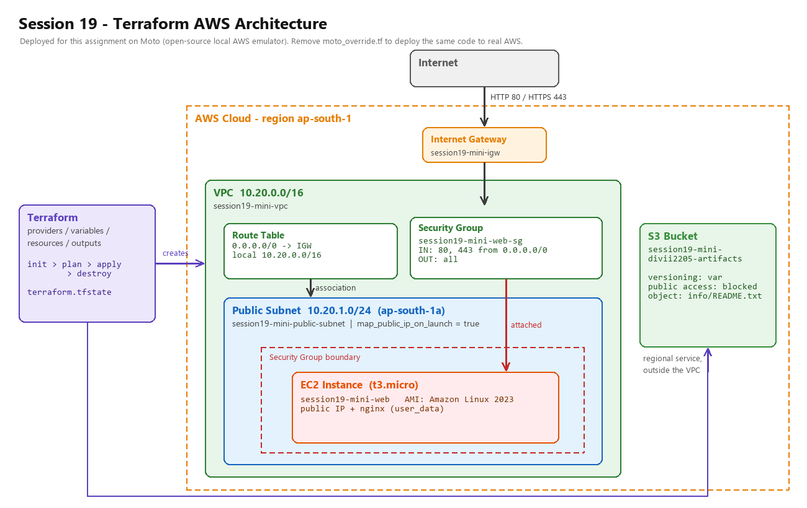

```text
Terraform
    |
    +-- VPC 10.20.0.0/16 ................. aws_vpc.main
    |     +-- Internet Gateway ........... aws_internet_gateway.main
    |     +-- Route Table (0.0.0.0/0->IGW) aws_route_table.public + association
    |     +-- Public Subnet 10.20.1.0/24 . aws_subnet.public  (ap-south-1a)
    |     +-- Security Group (80, 443) ... aws_security_group.web
    |     +-- EC2 t3.micro (AL2023) ...... aws_instance.web
    |
    +-- S3 bucket (outside the VPC) ...... aws_s3_bucket.artifacts
          + public access block, versioning, one object (info/README.txt)
```

---

## Terraform Project

I started from this session's `08-mini-project/` (VPC, subnet, IGW, route table, SG) and added **EC2** and **S3**, as the task's suggested architecture asks.
I worked in a copy, so the files in `08-mini-project/` are not changed.

```text
session19-project/
|-- versions.tf          (from 08-mini-project) provider "aws" ~> 6.0, region = var.aws_region
|-- variables.tf         (from 08-mini-project + 4 new variables)
|-- main.tf              (from 08-mini-project) VPC, subnet, IGW, route table, association, security group
|-- ec2.tf               NEW - AMI lookup + EC2 instance
|-- s3.tf                NEW - S3 bucket, public access block, versioning, object
|-- outputs.tf           (from 08-mini-project + 5 new outputs)
|-- moto_override.tf     NEW - points the provider at the local emulator (delete for real AWS)
`-- terraform.tfvars.example
```

### Providers

`versions.tf` (unchanged):

```hcl
terraform {
  required_version = ">= 1.6.0"
  required_providers {
    aws = {
      source  = "hashicorp/aws"
      version = "~> 6.0"
    }
  }
}

provider "aws" {
  region = var.aws_region
}
```

`moto_override.tf` (Terraform "override" file, merged on top of the provider above):

```hcl
provider "aws" {
  region     = var.aws_region
  access_key = "test"
  secret_key = "test"

  skip_credentials_validation = true
  skip_metadata_api_check     = true
  skip_requesting_account_id  = true
  s3_use_path_style           = true

  endpoints {
    ec2 = "http://127.0.0.1:5055"
    s3  = "http://127.0.0.1:5055"
    sts = "http://127.0.0.1:5055"
  }
}
```

### Variables

`variables.tf` (the first one was already there, I added the other four):

```hcl
variable "aws_region" {
  type    = string
  default = "ap-south-1"
}

variable "project_name" {
  description = "Prefix used in resource names and tags."
  type        = string
  default     = "session19-mini"
}

variable "instance_type" {
  description = "EC2 instance size (t3.micro is free tier)."
  type        = string
  default     = "t3.micro"
}

variable "bucket_name" {
  description = "Globally unique S3 bucket name."
  type        = string
  default     = "session19-mini-divii2205-artifacts"
}

variable "enable_versioning" {
  description = "Turn S3 bucket versioning on or off."
  type        = bool
  default     = false
}
```

### Resources

`main.tf` (from `08-mini-project`): `aws_vpc.main`, `aws_subnet.public`, `aws_internet_gateway.main`, `aws_route_table.public`, `aws_route_table_association.public`, `aws_security_group.web` (HTTP 80 + HTTPS 443 in, all out).

`ec2.tf` (new):

```hcl
# Latest Amazon Linux 2023 image (looked up, not hard-coded)
data "aws_ami" "amazon_linux" {
  most_recent = true
  owners      = ["amazon"]

  filter {
    name   = "name"
    values = ["al2023-ami-2023.*-kernel-6.1-x86_64"]
  }
}

resource "aws_instance" "web" {
  ami                    = data.aws_ami.amazon_linux.id
  instance_type          = var.instance_type
  subnet_id              = aws_subnet.public.id
  vpc_security_group_ids = [aws_security_group.web.id]

  user_data = <<-EOF
    #!/bin/bash
    dnf install -y nginx
    echo "<h1>Session 19 - deployed with Terraform</h1>" > /usr/share/nginx/html/index.html
    systemctl enable --now nginx
  EOF

  # Explicit dependency: the instance needs a working route to the internet
  # (for dnf install) before it boots. Terraform cannot see this from the code.
  depends_on = [aws_route_table_association.public]

  tags = {
    Name      = "${var.project_name}-web"
    Session   = "19"
    ManagedBy = "Terraform"
  }
}
```

`s3.tf` (new):

```hcl
resource "aws_s3_bucket" "artifacts" {
  bucket        = var.bucket_name
  force_destroy = true
  tags = { Name = var.bucket_name, Session = "19", ManagedBy = "Terraform" }
}

resource "aws_s3_bucket_public_access_block" "artifacts" {
  bucket                  = aws_s3_bucket.artifacts.id
  block_public_acls       = true
  block_public_policy     = true
  ignore_public_acls      = true
  restrict_public_buckets = true
}

resource "aws_s3_bucket_versioning" "artifacts" {
  bucket = aws_s3_bucket.artifacts.id
  versioning_configuration {
    status = var.enable_versioning ? "Enabled" : "Suspended"
  }
}

resource "aws_s3_object" "readme" {
  bucket       = aws_s3_bucket.artifacts.id
  key          = "info/README.txt"
  content      = "Session 19 bucket. Web server: ${aws_instance.web.id} in ${aws_subnet.public.id}"
  content_type = "text/plain"
}
```

### Outputs

`outputs.tf`: `vpc_id`, `vpc_cidr`, `subnet_id`, `security_group_id` (already there) plus `instance_id`, `instance_public_ip`, `ami_id`, `bucket_name`, `bucket_arn` (new).

---

## Terraform Commands - Step by Step

### 1. Project files + emulator running

```bash
ls -1
terraform version
python -m pip show moto
aws --endpoint-url http://127.0.0.1:5055 sts get-caller-identity
```

Terraform v1.16.4, Moto 5.2.3, and the emulator answers as account `123456789012`.

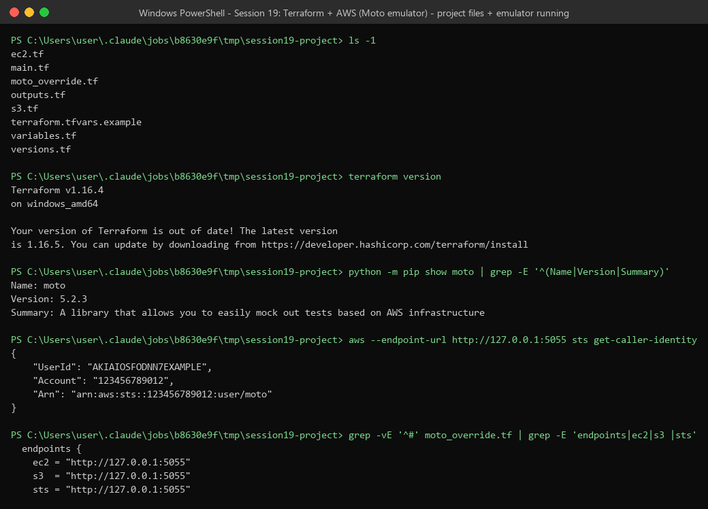

### 2. `terraform init`

Downloads the provider plugin and creates `.terraform.lock.hcl`.

```bash
terraform init
```

**Result:** `Installed hashicorp/aws v6.67.0 (signed by HashiCorp)`, `Terraform has been successfully initialized!`

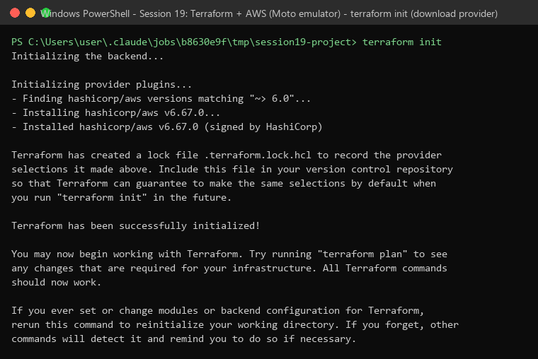

### 3. `terraform fmt` + `terraform validate`

```bash
terraform fmt -check -diff
terraform fmt
terraform validate
terraform providers
```

**Result:** `fmt` found one badly aligned line in `main.tf` (`gateway_id  =` had 2 spaces) and fixed it. `validate` says `Success! The configuration is valid.`

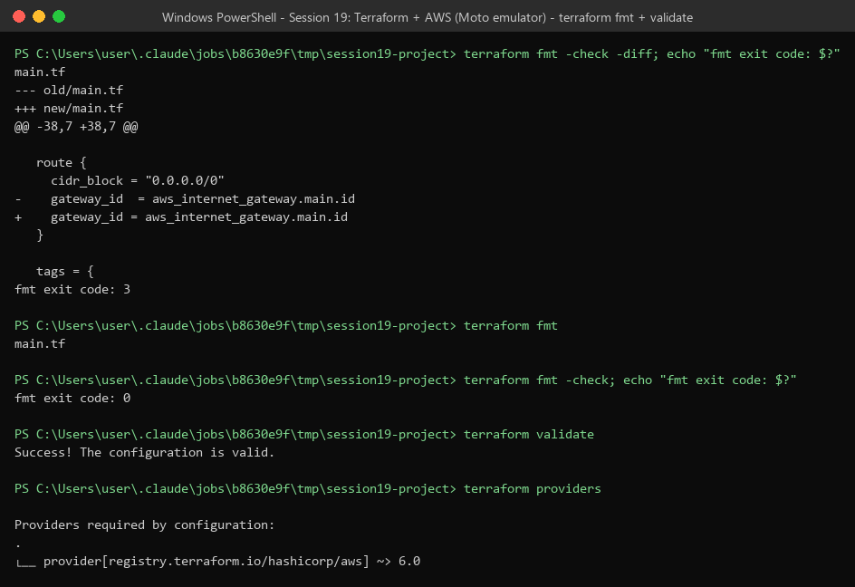

### 4. `terraform plan`

Shows what Terraform **will** do, without changing anything. I saved the plan to a file so `apply` does exactly this.

```bash
terraform plan -out=tfplan
terraform show tfplan
```

**Result:** `Plan: 11 to add, 0 to change, 0 to destroy.` The AMI was looked up (`ami-0884624fc54d115f3`), and values like the instance ID are `(known after apply)`.

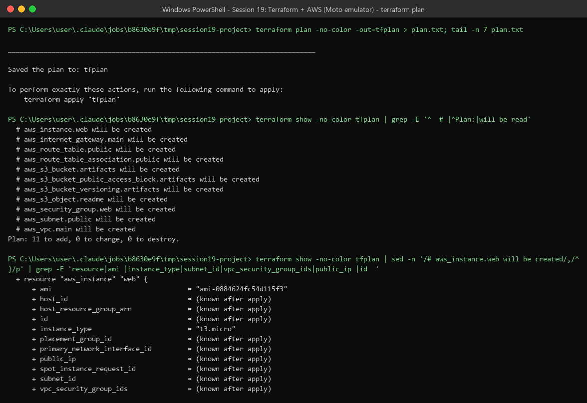

### 5. `terraform apply`

```bash
terraform apply tfplan
```

**Result:** `Apply complete! Resources: 11 added, 0 changed, 0 destroyed.`

Look at the order: VPC first, then IGW / subnet / SG, then the route table association, then the EC2 instance, then the S3 object. That is the **dependency graph** in action (see step 9).

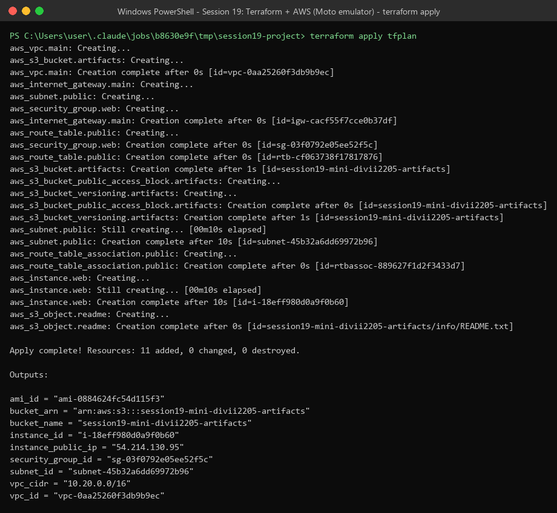

### 6. Outputs + state list

```bash
terraform output
terraform state list
```

| Output | Value |
|--------|-------|
| vpc_id | vpc-0aa25260f3db9b9ec |
| vpc_cidr | 10.20.0.0/16 |
| subnet_id | subnet-45b32a6dd69972b96 |
| security_group_id | sg-03f0792e05ee52f5c |
| instance_id | i-18eff980d0a9f0b60 |
| instance_public_ip | 54.214.130.95 |
| ami_id | ami-0884624fc54d115f3 |
| bucket_name | session19-mini-divii2205-artifacts |
| bucket_arn | arn:aws:s3:::session19-mini-divii2205-artifacts |

`state list` shows the 11 resources + 1 data source.

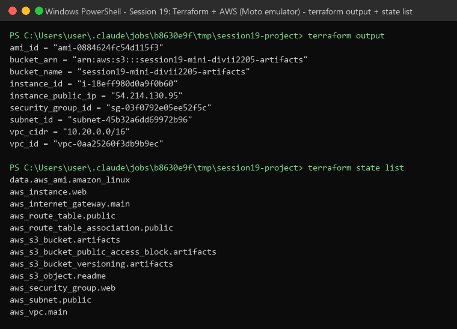

### 7. AWS Resources - verify with the AWS CLI

Check the resources from the AWS side, not only from Terraform.

```bash
aws --endpoint-url http://127.0.0.1:5055 ec2 describe-vpcs --filters Name=tag:Name,Values=session19-mini-vpc
aws --endpoint-url http://127.0.0.1:5055 ec2 describe-subnets --filters Name=tag:Name,Values=session19-mini-public-subnet
aws --endpoint-url http://127.0.0.1:5055 ec2 describe-security-groups --filters Name=group-name,Values=session19-mini-web-sg
aws --endpoint-url http://127.0.0.1:5055 ec2 describe-instances --filters Name=tag:Name,Values=session19-mini-web
aws --endpoint-url http://127.0.0.1:5055 s3 ls
aws --endpoint-url http://127.0.0.1:5055 s3 ls s3://session19-mini-divii2205-artifacts --recursive
```

**Result:** VPC `10.20.0.0/16` is `available`. Subnet `10.20.1.0/24` is in `ap-south-1a` with public IP on launch. The SG allows `80` and `443` from `0.0.0.0/0`. The EC2 instance is `running`, `t3.micro`, in our subnet. The bucket exists and holds `info/README.txt`.

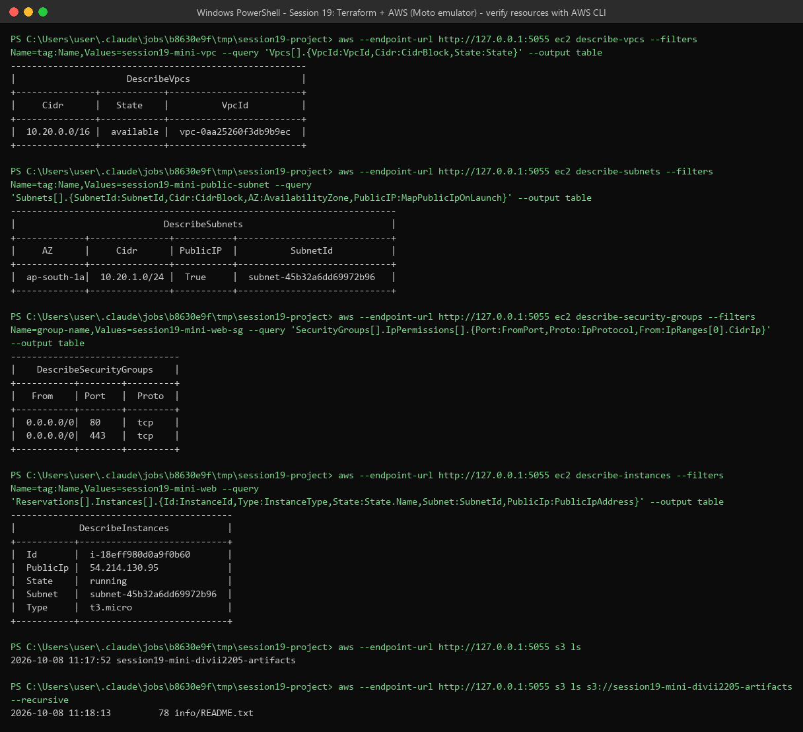

### 8. Terraform State

The state file `terraform.tfstate` is Terraform's memory: it maps each resource in the code to the real ID in AWS.

```bash
ls -l terraform.tfstate
terraform state show aws_vpc.main
```

**Result:** `terraform state show` prints everything Terraform knows about the VPC (ARN, CIDR, DNS settings, main route table, tags). The state has serial 12, 12 entries, and was written by Terraform 1.16.4.

> In a team the state should be stored remotely (for example an S3 backend with locking), not on one laptop. It can also hold secrets, so it must never be committed to Git. The `.gitignore` ignores `*.tfstate`.

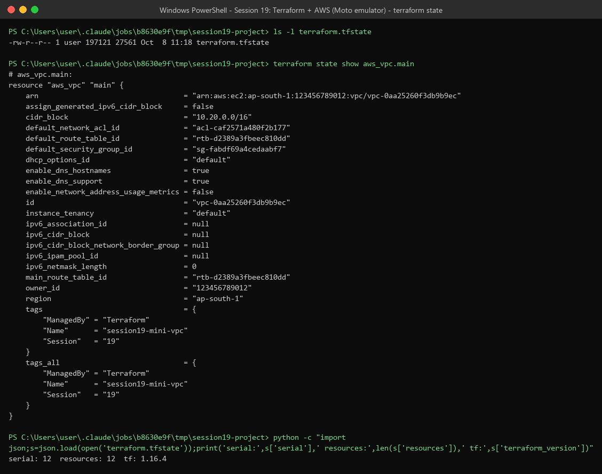

### 9. Dependencies

```bash
grep -n "aws_vpc.main.id|aws_subnet.public.id|...|depends_on" *.tf
terraform graph
```

- **Implicit dependency:** when one resource uses another's attribute, Terraform builds it after that one. Example: `subnet_id = aws_subnet.public.id`. The graph shows `aws_subnet.public -> aws_vpc.main` and `aws_instance.web -> aws_security_group.web`.
- **Explicit dependency:** `depends_on = [aws_route_table_association.public]` in `ec2.tf`. The EC2 instance does not reference the route table, but it needs internet access at boot. The graph shows `aws_instance.web -> aws_route_table_association.public`.
- `aws_s3_object.readme -> aws_instance.web`: the object text uses the instance ID, so S3 waits for EC2.

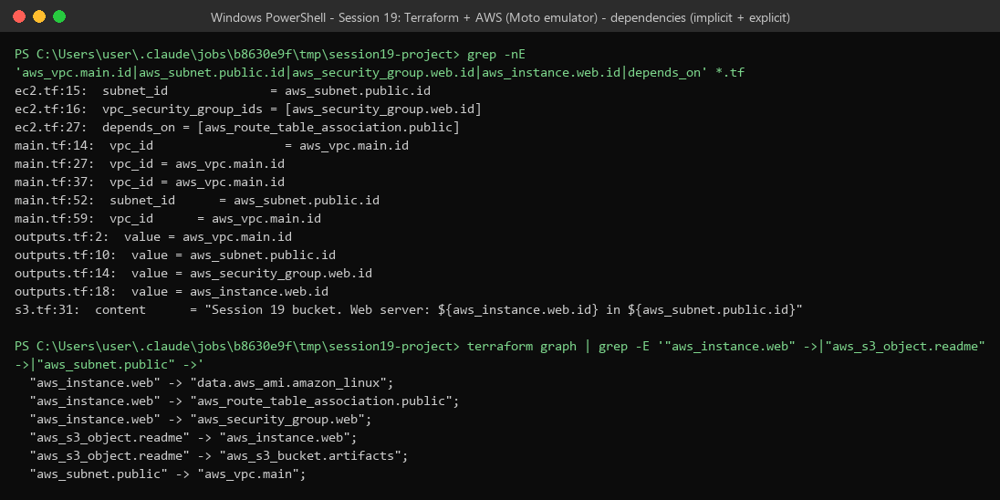

### 10. Change a variable (plan + apply an update)

Change one variable on the command line. Terraform updates the instance **in place** (same ID).

```bash
terraform plan -var instance_type=t3.small -out=tfplan2
terraform apply tfplan2
```

**Result:** `~ instance_type = "t3.micro" -> "t3.small"`, `Apply complete! Resources: 0 added, 2 changed, 0 destroyed.` The AWS CLI now shows `i-18eff980d0a9f0b60` as `t3.small`, still `running`.

> The 2nd "change" is the S3 bucket's tags. That is an emulator quirk: Moto does not return bucket tags when Terraform reads them, so Terraform re-applies them. On real AWS only the instance would change.

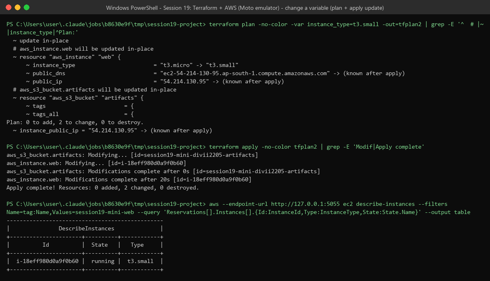

### 11. `terraform destroy`

```bash
terraform plan -destroy -var instance_type=t3.small
terraform destroy -auto-approve -var instance_type=t3.small
```

**Result:** `Plan: 0 to add, 0 to change, 11 to destroy.` then `Destroy complete! Resources: 11 destroyed.` Destroy goes in **reverse** dependency order: S3 object and EC2 first, then SG / subnet / route table, then the IGW, and the VPC last.

(I filtered the destroy output with `grep` so the screenshot shows the important lines.)

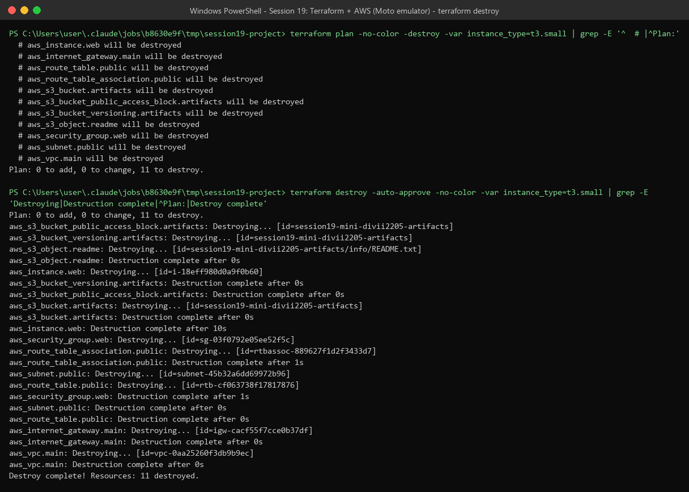

### 12. Verify everything is gone

```bash
terraform state list | wc -l
aws --endpoint-url http://127.0.0.1:5055 ec2 describe-vpcs --filters Name=tag:Name,Values=session19-mini-vpc
aws --endpoint-url http://127.0.0.1:5055 ec2 describe-instances --filters Name=tag:Name,Values=session19-mini-web
aws --endpoint-url http://127.0.0.1:5055 s3 ls
```

**Result:** state is empty (`0`), no VPC (`[]`), the instance is `terminated` (AWS keeps terminated instances visible for a while), and no buckets.

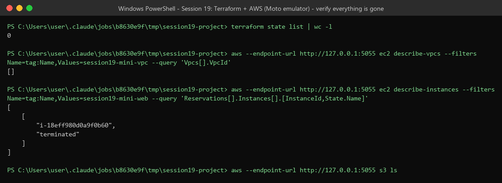

---

## Command Summary

| Command | What it does |
|---------|--------------|
| `terraform init` | Download providers, set up the working folder |
| `terraform fmt` | Fix code formatting |
| `terraform validate` | Check the code is valid |
| `terraform plan` | Show what will change (no changes made) |
| `terraform apply` | Make the changes |
| `terraform output` | Show output values |
| `terraform state list` / `state show` | Read what Terraform is tracking |
| `terraform graph` | Show the dependency graph |
| `terraform plan -destroy` | Preview the destroy |
| `terraform destroy` | Delete everything Terraform created |

## Key Learnings

1. **Providers** connect Terraform to a platform. Here `hashicorp/aws` v6.67.0. Pointing the provider at a different endpoint (Moto) needed no change to the resource code.
2. **Variables** make the code reusable. One `-var instance_type=t3.small` changed the server size without editing any file.
3. **Outputs** print the useful IDs after apply, so I do not have to search for them.
4. **Dependencies** decide the order: implicit from references, explicit with `depends_on`. Destroy uses the reverse order.
5. **State** is how Terraform knows what exists. Keep it safe and remote in real projects.
6. **plan -> apply -> destroy:** always read the plan first. Saving it (`-out=tfplan`) makes sure apply does exactly what was reviewed.

## To Run It on Real AWS

```bash
aws configure                 # working access key
rm moto_override.tf           # use real AWS endpoints
terraform init
terraform plan -out=tfplan
terraform apply tfplan
terraform destroy             # clean up (EC2 t3.micro is free tier; the rest is free)
```

## Deliverables Checklist

| Deliverable | Where |
|-------------|-------|
| Terraform project | "Terraform Project" section (all files and code) |
| AWS resources | VPC, subnet, IGW, route table, SG, EC2, S3: steps 5-7 |
| Architecture diagram | `screenshots/s19-00-architecture.png` + text diagram |
| Screenshots | `screenshots/` (13 images) |
| Terraform commands | steps 1-12 + Command Summary |
| README.md | this file |
