# Session 20 – Monitoring, Observability & GitOps (Submission)

Everything here uses the files already in `session20-monitoring-observability-gitops/` **as they are**:

| Part | Session files used | Where it ran |
|---|---|---|
| Task 1 – Monitoring demo | `04-grafana/docker-compose.yml` + `prometheus.yml` (Prometheus v3.5.0 + Grafana 12.1.1), `02-metrics-logs-traces/k8s-demo/` | Docker Desktop + **kind** cluster `session20` |
| Task 2 – Observability docs | `01-monitoring-vs-observability`, `02-metrics-logs-traces` | – |
| Task 3 – GitOps demo | `08-mini-project/app/` (namespace, deployment, service, Argo CD Application), steps from `07-argocd` / `08-mini-project` | kind `session20` + **Argo CD v3.5.4** |

Everything ran locally, so there are **no cloud costs**:
- **Cluster:** `kind create cluster --name session20`, Kubernetes v1.37.0, exactly as in `07-argocd` and `08-mini-project`.
- **Add-ons:** Argo CD from the official install manifest, and **metrics-server** so `kubectl top` works.
- **Git server:** a small local one (`gitops-server`) plays the role of GitHub, so `git push` works without touching any online repo.

## Table of contents

1. [Task 1 – Monitoring](#task-1--monitoring)
2. [Task 2 – Observability](#task-2--observability)
3. [Task 3 – GitOps](#task-3--gitops)
4. [Summary](#summary)

---

# Task 1 – Monitoring

**Monitoring** answers one question: **"Is the system healthy right now?"**
We collect known signals (metrics and logs), show them on dashboards, and **alert** when a value crosses a limit.

```text
 App / container ──(/metrics)──► Prometheus ──► Grafana dashboards
        │                         (scrape every 5s,     │
        │                          store time-series)   └──► Grafana alert rules ──► Firing / Normal
        └──(stdout)──► logs  (docker logs / kubectl logs)
```

## 1.1 Start the monitoring stack

From `04-grafana/` (the session compose file, unchanged):

```bash
cd 04-grafana
docker compose up -d
docker compose ps
```

| Container | Image | URL |
|---|---|---|
| `session20-prometheus` | `prom/prometheus:v3.5.0` | http://localhost:9090 |
| `session20-grafana` | `grafana/grafana:12.1.1` | http://localhost:3000 (admin / admin, classroom only) |

`prometheus.yml` scrapes `prometheus:9090` every **5 s**, so Prometheus monitors itself. That gives us real CPU, memory, request and health metrics to work with.

## 1.2 Metrics

A **metric** is a **number measured over time** (a time series), e.g. `process_resident_memory_bytes 1.1e+08`.

**Prometheus targets.** The `prometheus` job is **UP**, scraped every 5 s:

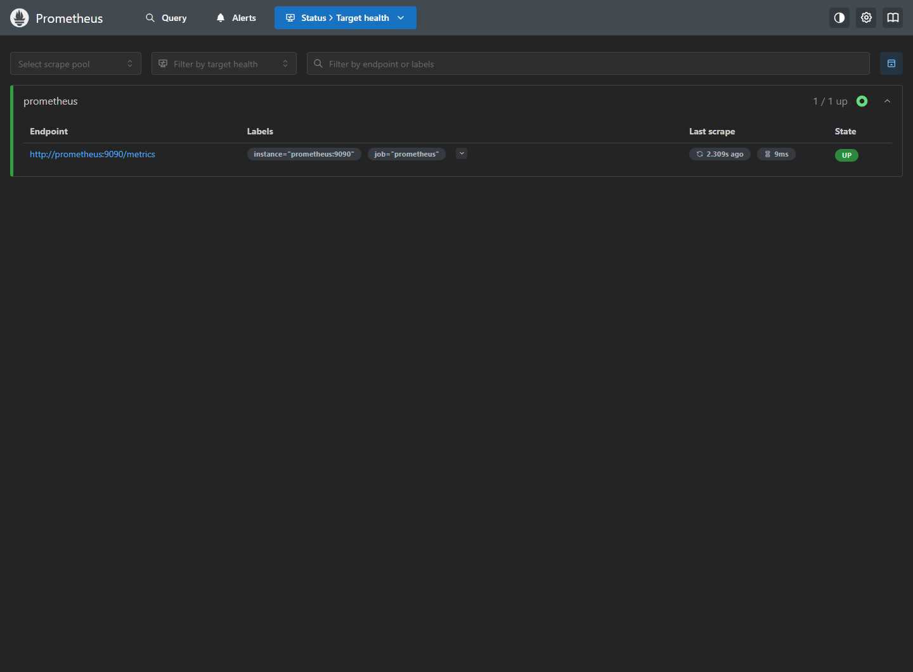

**Query `up`.** `1` means the target is up, `0` means it is down:

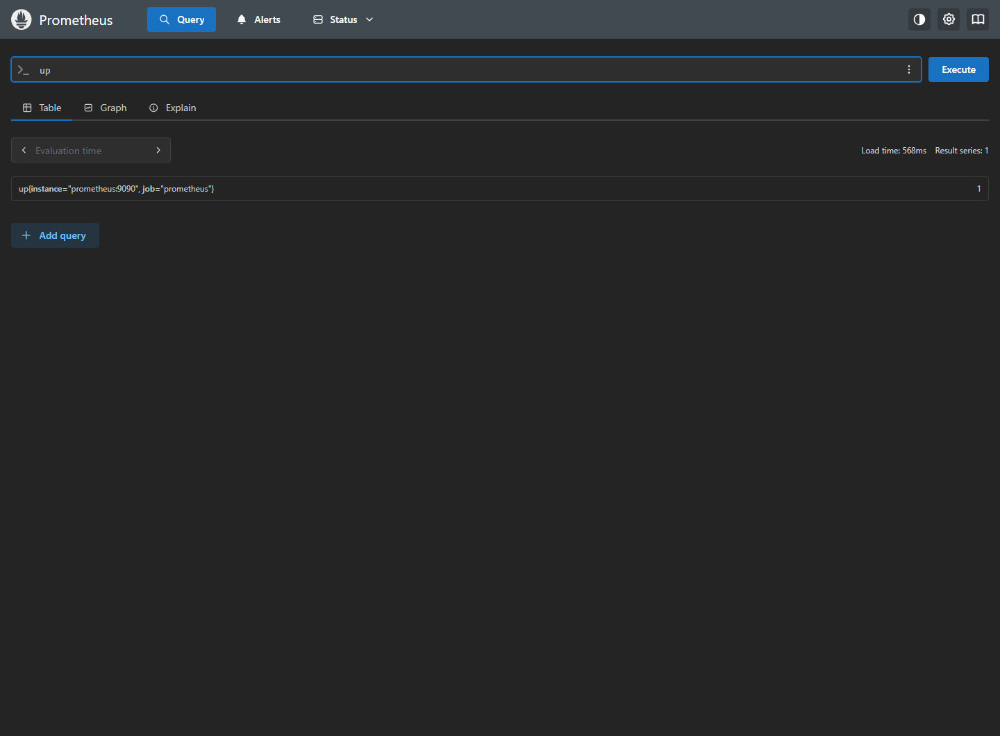

Useful PromQL used in this demo:

| What | PromQL |
|---|---|
| Health | `up` |
| CPU utilization (% of one core) | `rate(process_cpu_seconds_total[1m]) * 100` |
| Memory used (MiB) | `process_resident_memory_bytes / 1024 / 1024` |
| Requests per second | `sum by (handler) (rate(prometheus_http_requests_total[1m]))` |

## 1.3 CPU utilization

`process_cpu_seconds_total` is a **counter** (total CPU seconds used so far). `rate(...[1m])` turns it into "CPU seconds per second", and `* 100` turns that into a percentage of one core:

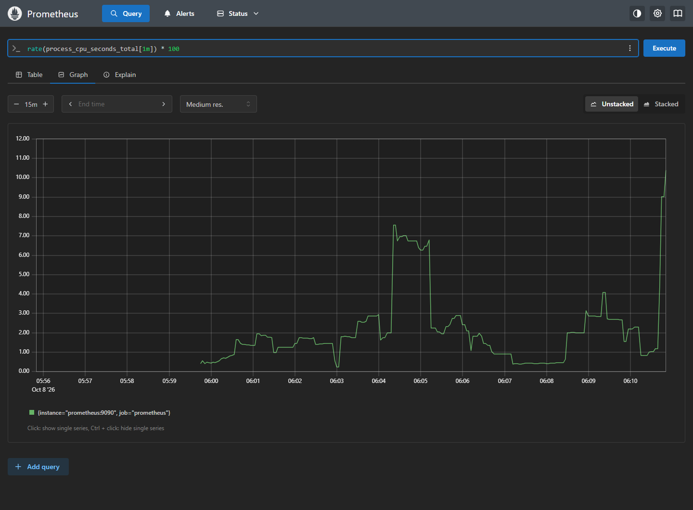

## 1.4 Memory utilization

`process_resident_memory_bytes` is a **gauge** (the current value). Divided by 1024 twice it gives MiB:

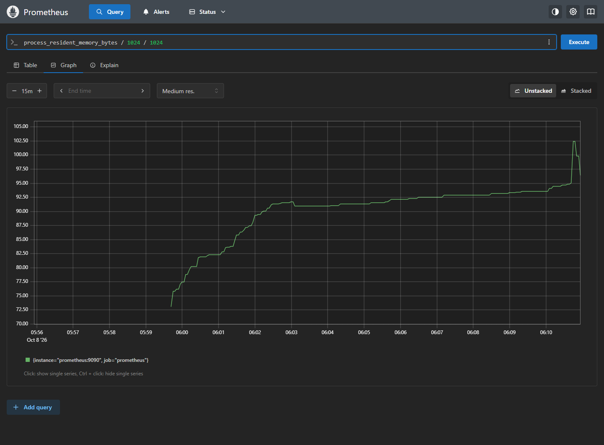

## 1.5 Grafana: data source + dashboard

The Prometheus data source and the dashboard were set up exactly as in `04-grafana/README.md`, through Grafana's HTTP API instead of clicks:
- data source URL **`http://prometheus:9090`** (the compose service name)
- **Save & test** gives `Successfully queried the Prometheus API.`

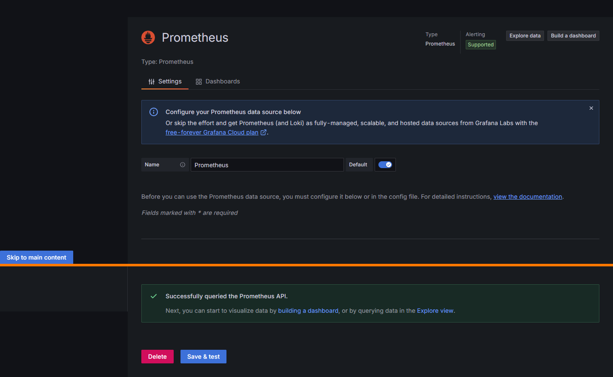

Dashboard **"Session 20 - Monitoring Demo"**: health (`up` = 1), scrape duration, memory, goroutines, CPU % over time, memory over time, and requests per second by handler:

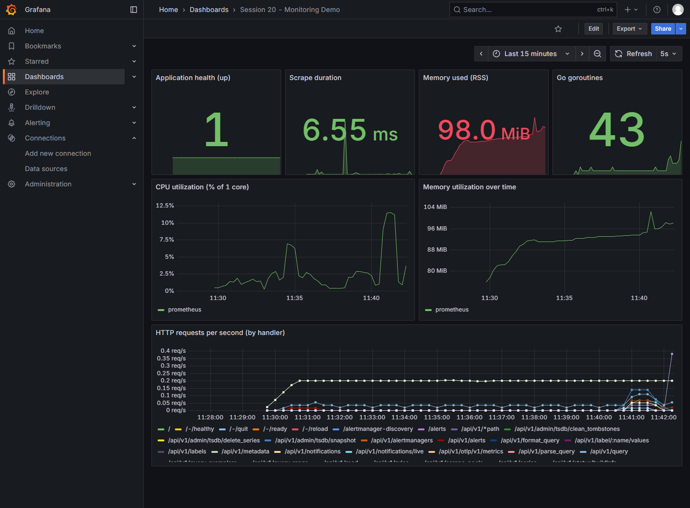

## 1.6 Alerts

Two **Grafana-managed alert rules** in the folder *Session 20 Alerts*. Each one is evaluated every minute and must stay true for **30 s** before it fires:

| Rule | Query | Condition | Severity | Result |
|---|---|---|---|---|
| **Prometheus target down** | `up` | `< 1` | critical | **Normal** (target is up) |
| **High memory (demo threshold 50 MB)** | `process_resident_memory_bytes` | `> 50 MB` | warning | **Firing** (about 105–110 MiB) |

The memory threshold is set **low on purpose**, so we can see a real alert fire in the demo.

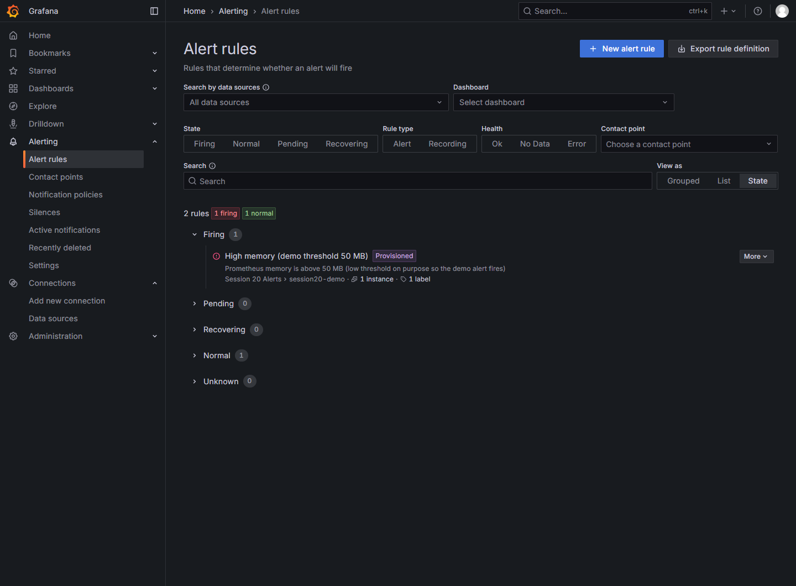

Alert lifecycle: **Normal → Pending** (condition true, waiting for the 30 s `for` period) **→ Firing** (notification sent) **→ Normal** (resolved).

## 1.7 Health, CPU, memory and alerts from the terminal

The same data through the APIs:
- Prometheus `/api/v1/query`
- health endpoints `/-/healthy` and `/api/health`
- Grafana's alert-rule states

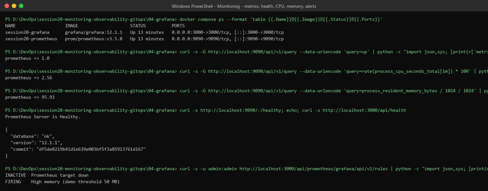

## 1.8 Logs

Logs tell us **what happened**, as text events with timestamps.
- Prometheus logs show it starting up and loading `prometheus.yml`.
- Grafana's logs show the alerting engine **sending the firing alert** every minute (`rule_uid=memory-demo ... Sending alerts to local notifier`).
- The `level=error ... Notify for alerts failed` line is expected here. Grafana routes alerts to its default contact point, **`grafana-default-email`**, and this classroom stack has no mail server set up, so the email can't be sent. The alert itself fires correctly. In a real setup you'd configure a contact point such as Slack, email (SMTP), PagerDuty or a webhook.

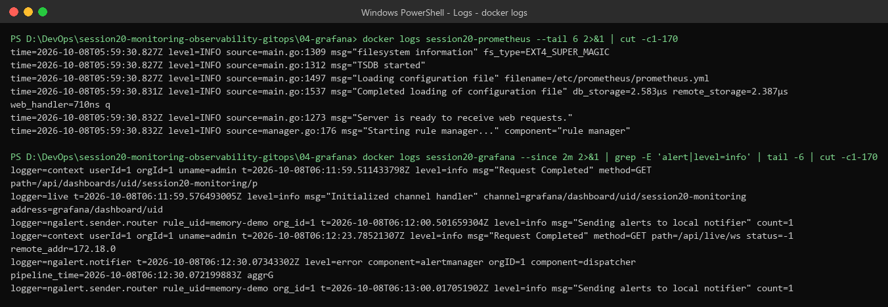

## 1.9 Kubernetes monitoring (kind cluster)

The session demo app `02-metrics-logs-traces/k8s-demo/` is a busybox container that prints "Request received" and "Health check OK" every 10 s. It was deployed to the kind cluster in its own namespace:

```bash
kubectl create namespace session20-monitoring
kubectl apply -n session20-monitoring -f 02-metrics-logs-traces/k8s-demo/
kubectl rollout status deployment/session20-demo -n session20-monitoring
```

**Application health.** The rollout finished, the Deployment is 1/1 and the Pod is Running. All Pod conditions are `True` (`PodReadyToStartContainers`, `Initialized`, `Ready`, `ContainersReady`, `PodScheduled`). Events show the full startup (Scheduled → Pulled → Created → Started):

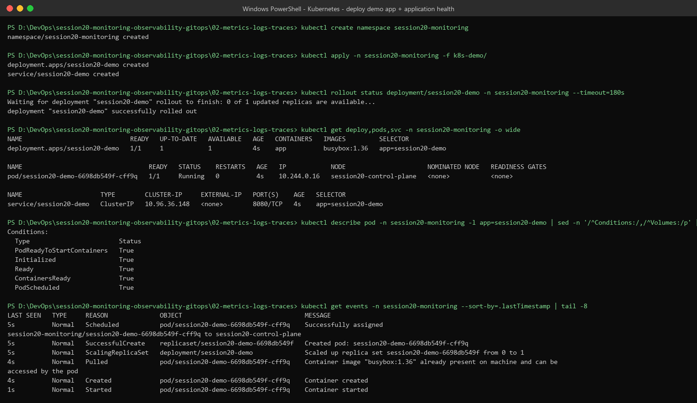

**Logs** with `kubectl logs` (with timestamps, and a count of each message type):

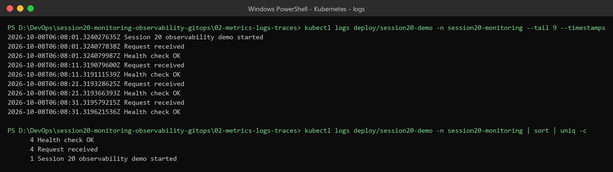

**CPU and memory utilization** with **metrics-server** (`kubectl top`):
- node `session20-control-plane`: about **16 % CPU, 18 % memory**
- demo container: about **1m CPU** (0.001 core), under 1 MiB memory
- the Argo CD pods, and the busiest pods in the cluster (`kube-apiserver` about 55m CPU / 417 MiB)

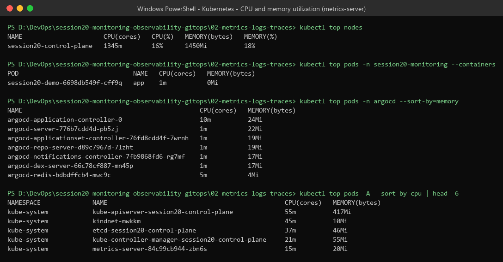

> metrics-server was installed from its official manifest, with `--kubelet-insecure-tls` added, which kind needs because its kubelet uses self-signed certificates.

### Monitoring summary

| Requirement | Shown by |
|---|---|
| Metrics | Prometheus targets, `up` query, PromQL (m01, m02, m08) |
| Logs | `docker logs` (m09), `kubectl logs` (k02) |
| Alerts | Grafana alert rules: 1 firing, 1 normal (m07, m08, m09) |
| CPU utilization | `rate(process_cpu_seconds_total[1m])*100` graph and panel (m03, m06, m08), `kubectl top` (k03) |
| Memory utilization | `process_resident_memory_bytes` graph and panel (m04, m06, m08), `kubectl top` (k03) |
| Application health | `up`, `/-/healthy`, `/api/health` (m02, m06, m08), rollout status, Pod conditions and events (k01) |

---

# Task 2 – Observability

## 2.1 Monitoring vs observability

| | Monitoring | Observability |
|---|---|---|
| Question | "**Is** the system healthy?" | "**Why** is it behaving this way?" |
| Works with | Known problems, set in advance (dashboards, thresholds) | Unknown problems: explore freely, ask new questions |
| Output | Alerts and dashboards | Root cause |
| Example | "Error rate is 5 %, so alert" | "Errors come only from `payment-service` v2 in zone b, when calling the DB, for users with a coupon" |

Monitoring is **part of** observability. You need good monitoring, and you also need the data to dig deeper.

## 2.2 The three pillars

### Metrics: "how much / how many?"

- **Numbers over time** with labels: `http_requests_total{service="cart",status="500"} 42`.
- Cheap to store, fast to query, good for **dashboards, trends and alerts**.
- Types: **counter** (only goes up: requests, errors), **gauge** (up and down: memory, queue size), **histogram/summary** (distributions: latency p95/p99).
- Popular methods: **RED** for services (Rate, Errors, Duration) and **USE** for resources (Utilization, Saturation, Errors). The *four golden signals* are latency, traffic, errors and saturation.
- They tell you **that** something is wrong, but not the details.

### Logs: "what exactly happened?"

- **Timestamped text events** from the app or the system: `2026-10-07T18:47:51Z ERROR payment failed order=123 reason=timeout`.
- Very detailed (error messages, stack traces, user and request IDs).
- Best as **structured logs** (JSON, with fields) so you can search and filter them.
- Cost a lot more at scale. Use log levels, sampling and retention rules.

### Traces: "where did the time go?"

- A **trace** follows **one request** through many services. Each hop is a **span** (name, start, duration, parent), and all spans share one **trace ID**.
- Shows **which service or call is slow or failing** in a microservices system.

```text
Trace abc123  (total 820 ms)
├── api-gateway      20 ms
├── order-service    80 ms
│   └── payment-svc 120 ms
│       └── db query 600 ms   ← the bottleneck
```

- **Context propagation** (e.g. the W3C `traceparent` header) carries the trace ID between services.

### How they work together

```text
ALERT (metric): checkout p99 latency > 2 s
   └─► TRACE of a slow request: 600 ms spent in payment DB query
         └─► LOGS for that trace_id: "connection pool exhausted (max=10)"
               └─► Root cause found → raise pool size / fix slow query
```

Link the three by putting the **trace ID in log lines** and using **exemplars** (a link from a metric data point to a sample trace).

## 2.3 Why observability is required

- **Microservices and Kubernetes are complex**: many services, pods that move and restart, autoscaling. You can't SSH in and "look around".
- **Unknown unknowns**: new failures you never wrote a dashboard for. You need data you can explore.
- **Faster incident response**: lower **MTTD** (time to detect) and **MTTR** (time to recover).
- **SLOs / SLAs**: measure availability and latency against targets, and track error budgets.
- **Performance and cost**: find slow calls, memory leaks and over-provisioned resources.
- **Safe releases**: compare versions during canary or blue-green rollouts, and roll back quickly.
- **Capacity planning** and **security / audit** trails.

## 2.4 Common tools

| Area | Open source | Managed / commercial |
|---|---|---|
| Metrics | **Prometheus**, Thanos, Mimir, VictoriaMetrics | AWS CloudWatch, Datadog, New Relic, Azure Monitor, Google Cloud Monitoring |
| Dashboards | **Grafana** | Grafana Cloud, Datadog, Kibana |
| Logs | **Loki**, ELK/EFK (Elasticsearch + Logstash/**Fluentd**/**Fluent Bit** + Kibana), OpenSearch | CloudWatch Logs, Splunk, Datadog Logs |
| Traces | **Jaeger**, **Grafana Tempo**, Zipkin | AWS X-Ray, Datadog APM, Honeycomb, Dynatrace |
| Instrumentation standard | **OpenTelemetry** (SDKs + Collector) for metrics, logs and traces | supported by almost all vendors |
| Alerting | **Alertmanager**, Grafana Alerting | PagerDuty, Opsgenie |
| Kubernetes extras | **kube-prometheus-stack**, kube-state-metrics, node-exporter, metrics-server | GKE/EKS/AKS built-in monitoring |

A common open-source stack is **"LGTM"**: **L**oki (logs) + **G**rafana (dashboards) + **T**empo (traces) + **M**imir/Prometheus (metrics), with **OpenTelemetry** to collect.

## 2.5 Kubernetes observability

| Layer | What to watch | Tools / commands |
|---|---|---|
| **Cluster / nodes** | Node CPU, memory, disk, network, node conditions | node-exporter + Prometheus, `kubectl top nodes`, `kubectl describe node` |
| **Kubernetes objects** | Desired vs ready replicas, pod phase, restarts, pending pods, HPA, PVCs | **kube-state-metrics**, `kubectl get` |
| **Containers / pods** | Container CPU/memory vs requests/limits, OOMKilled, throttling | **cAdvisor** (in the kubelet), **metrics-server** (`kubectl top`), `crictl stats` |
| **Health** | Liveness, readiness and startup probes; Pod conditions | `kubectl describe pod`, `kubectl get pod -o jsonpath='{.status.conditions}'` |
| **Events** | Scheduling, image pulls, probe failures, kills | `kubectl get events --sort-by=.lastTimestamp` |
| **Logs** | stdout/stderr of each container (lost when the pod is deleted unless you collect them) | `kubectl logs [-f] [--previous]`; collect with Fluent Bit / Promtail → Loki/Elasticsearch |
| **Traces** | Requests across services | OpenTelemetry SDK/Collector → Jaeger/Tempo; service meshes (Istio/Linkerd) add traces and metrics |
| **Control plane** | API server latency/errors, etcd, scheduler | Prometheus scraping control-plane `/metrics` |

Typical install: the **kube-prometheus-stack** Helm chart (Prometheus Operator + Prometheus + Alertmanager + Grafana + node-exporter + kube-state-metrics), plus Loki and Tempo for logs and traces.

This submission uses these Kubernetes signals in section **1.9**: **health** (rollout status, Pod conditions and events), **logs** (`kubectl logs`) and **resource usage** (`kubectl top` from metrics-server). In Task 3, `kubectl top`, `kubectl logs` and Argo CD's health status are used to observe the GitOps app as well.

---

# Task 3 – GitOps

## 3.1 What is GitOps?

**GitOps** is a way to run infrastructure and app deployments where **Git describes the desired state**, and an **automated controller** (here **Argo CD**) keeps the real system matching it.

```text
Traditional (push)                     GitOps (pull)
Developer ──kubectl apply──► Cluster   Developer ──git push──► Git ◄──watches── Argo CD ──syncs──► Cluster
```

| Traditional deployment | GitOps |
|---|---|
| People or CI run `kubectl apply` against the cluster | Nobody touches the cluster. You change Git, and the controller applies it |
| CI needs cluster credentials | Only Argo CD (inside the cluster) has access; it **pulls** from Git |
| Hard to know "what is running and why" | `git log` **is** the deployment history |
| Manual drift goes unnoticed | Drift is detected and fixed automatically |
| Rollback = redo steps by hand | Rollback = `git revert` |

The four GitOps principles (OpenGitOps):
1. **Declarative**: the whole system is described as desired state.
2. **Versioned and immutable**: that state is stored in Git, with full history.
3. **Pulled automatically**: an agent pulls the desired state from Git.
4. **Continuously reconciled**: the agent keeps comparing actual vs desired and fixes any difference.

## 3.2 Git as the source of truth

- **Only Git** decides what should run. If it isn't in Git, it shouldn't be in the cluster.
- Git gives: **history** (who, what, when, why), **review** (pull requests), **diffs**, **rollback points**, **collaboration** and an **audit trail**.
- In this demo the Git repo holds the `08-mini-project/app/` files (`namespace.yaml`, `deployment.yaml` with `replicas: 2`, `service.yaml`). As the guide says, `argocd-application.yaml` is kept **outside** the Git `app/` path.

## 3.3 Declarative configuration

- **Imperative** = commands that say *how*: `kubectl scale deployment session20-mini --replicas=3`.
- **Declarative** = files that say *what*: `spec.replicas: 3` in `deployment.yaml`. Kubernetes and Argo CD work out how to get there.
- Declarative files can be stored in Git, reviewed, diffed and re-applied any number of times with the same result (**idempotent**).

```yaml
# 08-mini-project/app/deployment.yaml (desired state)
spec:
  replicas: 2          # changed to 3 in Git during the demo
  template:
    spec:
      containers:
        - name: app
          image: nginx:1.27-alpine
```

## 3.4 Continuous reconciliation

Argo CD runs a **control loop** all the time:

```text
        ┌──────────────► Git (desired state) ◄─── developer commits
        │                       │
        │                       ▼
   reconcile ◄──── compare ◄── Kubernetes (actual state)
   (sync)          Synced / OutOfSync
        │
        └── make actual == desired  (create / update / prune)
```

- Argo CD **checks Git about every 3 minutes** by default; webhooks can make this instant.
- `syncPolicy.automated` → apply changes from Git automatically.
- `selfHeal: true` → if someone changes the cluster by hand, put it back to what Git says.
- `prune: true` → delete resources that were removed from Git.
- `CreateNamespace=true` → create the target namespace if it's missing.

## 3.5 GitOps workflow

```text
1. Developer edits YAML (replicas 2 → 3)
2. git commit + git push   (in real teams: pull request → review → merge)
3. Argo CD notices the new commit on main
4. Argo CD compares Git (desired) with Kubernetes (actual) → OutOfSync
5. Argo CD syncs: applies the change to the cluster
6. Kubernetes creates the extra pod → Synced + Healthy
7. Anyone changing the cluster by hand → self-heal puts it back to Git's version
8. Rollback = git revert → Argo CD syncs the old version back
```

## 3.6 Kubernetes + GitOps (Argo CD)

- **Argo CD** is a GitOps controller that runs **inside Kubernetes**. Its main parts: `argocd-server` (UI/API), `argocd-repo-server` (clones Git and renders manifests), `argocd-application-controller` (compares and syncs), plus redis, dex and applicationset/notifications controllers.
- An **`Application`** (a CRD) tells Argo CD **which Git repo / revision / path** to watch and **where to deploy** it (cluster + namespace).
- Other GitOps tools: **Flux CD**, Jenkins X, Rancher Fleet. **Helm** charts and **Kustomize** overlays can be the source too.

`08-mini-project/app/argocd-application.yaml` (used as it is; only the placeholder `repoURL` is swapped in at apply time):

```yaml
apiVersion: argoproj.io/v1alpha1
kind: Application
metadata:
  name: session20-mini
  namespace: argocd
spec:
  project: default
  source:
    repoURL: https://github.com/YOUR_USERNAME/YOUR_GITOPS_REPO.git   # → http://gitops-server/session20-gitops.git
    targetRevision: main
    path: app
  destination:
    server: https://kubernetes.default.svc
    namespace: session20
  syncPolicy:
    automated:
      prune: true
      selfHeal: true
    syncOptions:
      - CreateNamespace=true
```

## 3.7 GitOps demo (08-mini-project, step by step)

Demo setup:

```text
 Developer (laptop)                       kind cluster "session20"
 ~/gitops-repo  ──git push──►  gitops-server  ◄──git fetch──  argocd-repo-server
  app/namespace.yaml           (local Git server,            argocd-application-controller ──sync──► namespace session20
  app/deployment.yaml           like GitHub)                                                         ├─ deployment session20-mini
  app/service.yaml                                                                                    ├─ replicaset → pods
                                                                                                      └─ service session20-mini
```

> **Why a local Git server?** Step 3 of the guide says to create a repo on GitHub/GitLab. To keep the session files unchanged and not push anything to an online account, a small Git server runs as a container (`gitops-server`, nginx + `git-http-backend`) on the kind Docker network. It works like GitHub: `git push` to `http://localhost:8088/session20-gitops.git` from the laptop, and Argo CD fetches `http://gitops-server/session20-gitops.git` from inside the cluster. To use GitHub instead, push the same `app/` folder there and put your GitHub URL in `repoURL`.

### Step 1–2: create the kind cluster and install Argo CD

```bash
kind create cluster --name session20
kubectl create namespace argocd
kubectl apply -n argocd --server-side --force-conflicts \
  -f https://raw.githubusercontent.com/argoproj/argo-cd/stable/manifests/install.yaml
```

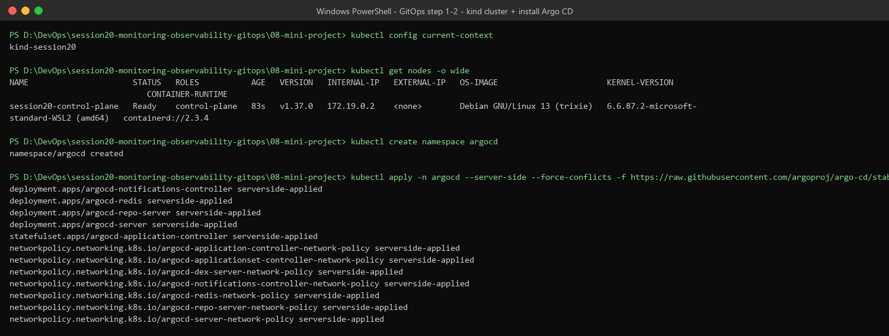

### Step 3: Git repository = source of truth

The repo holds `app/` (the three manifests from `08-mini-project/app`, unchanged) at commit `4a8e846`, with `replicas: 2`. A pod inside the cluster can `git ls-remote` the server, which proves Argo CD can reach Git.

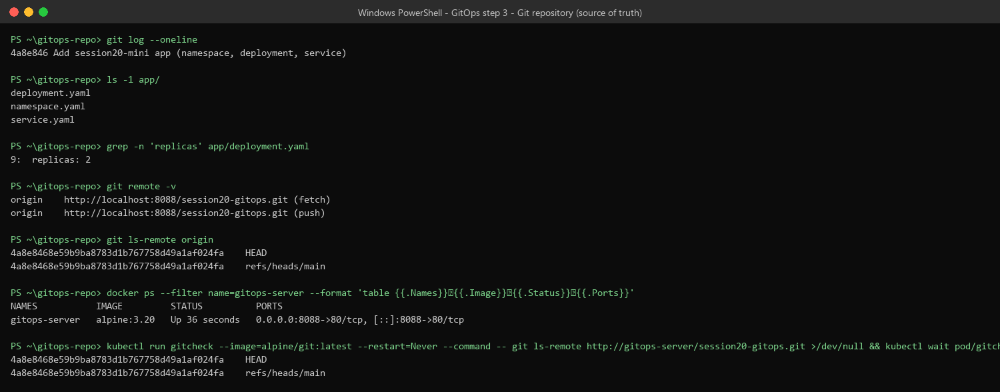

### Step 4–5: create the Argo CD Application → Synced / Healthy

```bash
sed 's#https://github.com/YOUR_USERNAME/YOUR_GITOPS_REPO.git#http://gitops-server/session20-gitops.git#' \
  app/argocd-application.yaml | kubectl apply -f -
kubectl get applications -n argocd
```

Argo CD cloned the repo, rendered `app/`, created the namespace and resources, and reports **`Synced` + `Healthy`** at revision `4a8e846`:

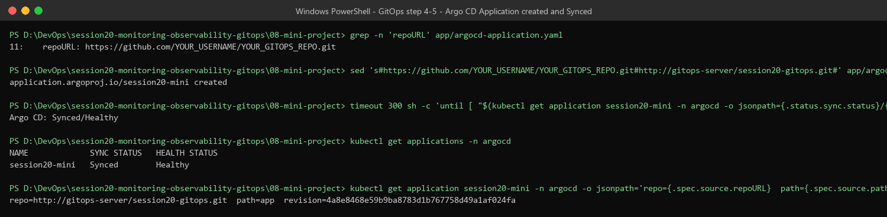

### Step 6: check Kubernetes (actual state = desired state)

`kubectl get all -n session20` shows the Deployment **2/2**, its ReplicaSet, 2 Pods and the Service, all created by Argo CD and not by `kubectl apply`:

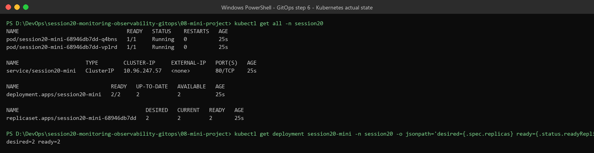

Argo CD UI (`kubectl port-forward svc/argocd-server -n argocd 8080:443`, then log in as `admin` with the password from the `argocd-initial-admin-secret` secret):

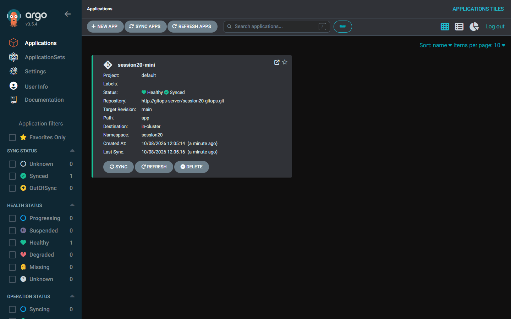

Resource tree: Application → Namespace, Service, Deployment → ReplicaSet → **2 pods**. It shows *Synced to main (4a8e846)* and *Auto sync is enabled*:

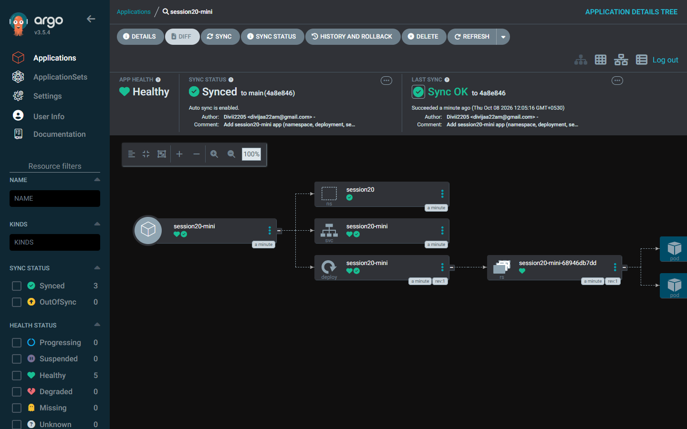

### Step 7: make a Git change (replicas 2 → 3)

Only Git is changed. Nobody runs `kubectl`:

```bash
sed -i 's/replicas: 2/replicas: 3/' app/deployment.yaml
git commit -am "Scale application to three replicas"
git push origin main
```

The watch loop prints each change as it happens:

```text
[+0s]   git-rev=4a8e846 sync=Synced desired=2 ready=2
[+271s] git-rev=1ea7add sync=Synced desired=3 ready=2    ← Argo CD's regular Git check found the new commit and synced
[+275s] git-rev=1ea7add sync=Synced desired=3 ready=3    ← 3/3 pods ready
```

The change travelled **Git → Argo CD → Kubernetes** by itself, after about 4.5 minutes (the normal Git check interval). **That is GitOps.**

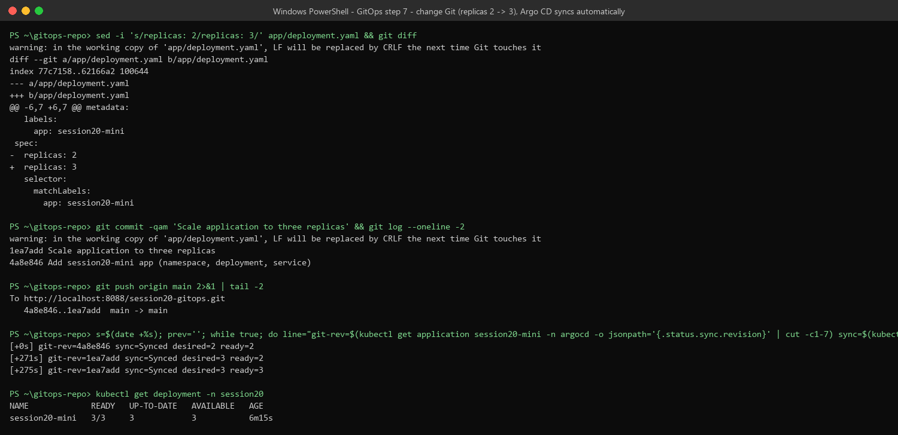

The tree now shows *Synced to main (1ea7add)*, comment *"Scale application to three replicas"*, and **3 pods**:

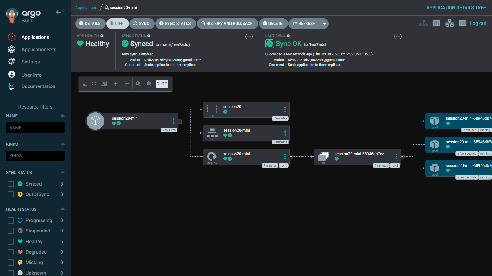

**History and rollback.** Each deployment is tied to a Git commit (`4a8e846` and then `1ea7add`), with author, message and *"Initiated by: automated sync policy"*:

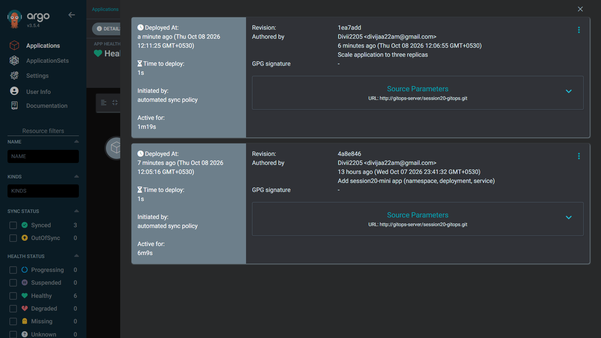

### Step 8: self-healing

Someone changes the cluster by hand:

```bash
kubectl scale deployment session20-mini -n session20 --replicas=1
```

```text
[+0s] desired=1 ready=1 argocd-sync=OutOfSync   ← drift detected (cluster ≠ Git)
[+2s] desired=3 ready=2 argocd-sync=Synced      ← selfHeal re-applied Git's replicas: 3
[+3s] desired=3 ready=3 argocd-sync=Synced      ← back to desired state
```

Within about **3 seconds** Argo CD put it back to **3**, because Git still says `replicas: 3`. The sync history lists only Git revisions, and the last operation was **initiated by: automated**.
**Git = desired state, Kubernetes = actual state, Argo CD = reconciler.**

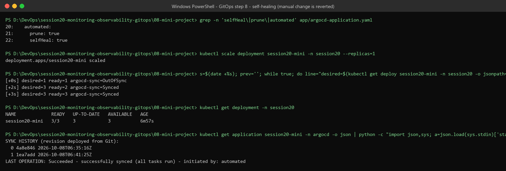

### Step 9: observe the system

`kubectl logs` (nginx), the 3 pods, `kubectl top pods` (CPU/memory of the GitOps app) and the Application status `Synced / Healthy`:

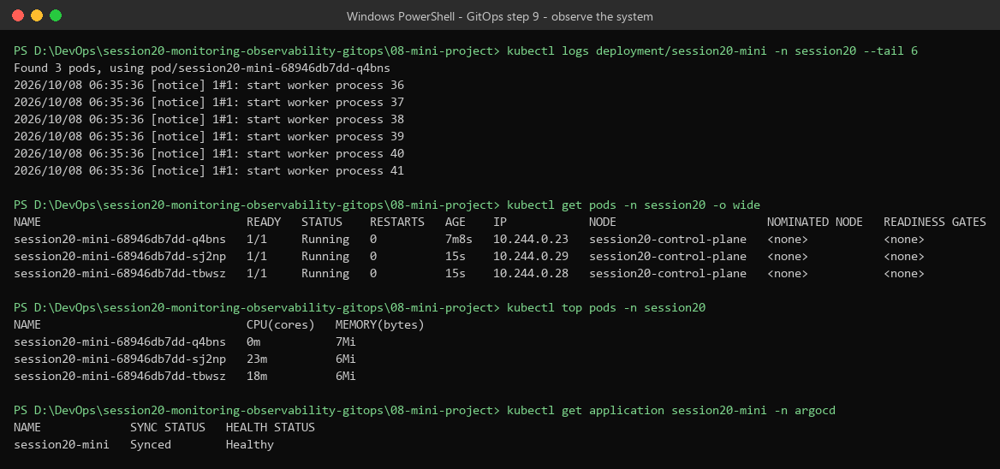

### Cleanup (from the guide)

```bash
kubectl delete application session20-mini -n argocd
kind delete cluster --name session20
docker rm -f gitops-server
cd 04-grafana && docker compose down
```

## 3.8 Final viva questions (from `08-mini-project`)

| # | Question | Answer |
|---|---|---|
| 1 | Monitoring vs Observability | Monitoring = *is it healthy?* (known checks, dashboards, alerts). Observability = *why is it behaving like this?* (explore metrics, logs and traces to find unknown causes). |
| 2 | Metrics vs Logs vs Traces | Metrics = numbers over time. Logs = timestamped events. Traces = one request's journey across services. |
| 3 | What is Prometheus? | A metrics system that **scrapes** `/metrics` from targets, stores time series and answers **PromQL** queries (and evaluates alert rules). |
| 4 | What is Grafana? | A dashboard and alerting tool that **visualizes** data from sources like Prometheus. |
| 5 | What is GitOps? | Managing deployments through Git: Git holds the desired state, and a controller syncs the cluster to it. |
| 6 | Why is Git the source of truth? | Only Git defines what should run. It has history, review, diffs, rollback and an audit trail. |
| 7 | What does Argo CD do? | Watches the Git repo, compares it with the cluster, shows Synced/OutOfSync and Healthy, and syncs (applies, prunes, self-heals). |
| 8 | Desired state? | What Git says should exist (e.g. `replicas: 3`). |
| 9 | Actual state? | What is really running in Kubernetes right now (e.g. 1 pod after a manual scale). |
| 10 | Reconciliation? | The loop that compares desired and actual state and changes the cluster until they match. |
| 11 | Self-healing in Argo CD? | With `selfHeal: true`, manual changes in the cluster are detected (OutOfSync) and reverted to Git's version automatically. In this demo it took about 3 s. |
| 12 | Replicas 2 → 3 in Git? | Commit + push → Argo CD sees the new revision → OutOfSync → sync → Deployment scaled to 3 → Synced/Healthy (seen here after about 4.5 min, with no kubectl). |

---

# Summary

| Deliverable | Where |
|---|---|
| **Monitoring demo** | Task 1: Prometheus + Grafana (`04-grafana`) with metrics, CPU, memory, health, a dashboard and alerts (1 firing / 1 normal), plus logs. Kubernetes app health, logs and `kubectl top` (`02-metrics-logs-traces/k8s-demo`) |
| **Observability documentation** | Task 2: the three pillars (metrics, logs, traces), why observability matters, common tools, Kubernetes observability |
| **GitOps demo** | Task 3: `08-mini-project` on kind + Argo CD. Git → Synced/Healthy (2 pods) → commit "replicas 3" → auto-sync (3 pods) → manual scale to 1 → self-healed back to 3 |
| **Screenshots** | `screenshots/`: 9 monitoring (m01–m09), 3 Kubernetes monitoring (k01–k03), 11 GitOps (g01–g11) |
| **README.md** | This file |

Final mental model (from the session):

```text
METRICS -> numbers          PROMETHEUS -> metrics        GIT        -> desired state
LOGS    -> events           GRAFANA    -> dashboards     ARGO CD    -> reconciliation
TRACES  -> request journey                               KUBERNETES -> actual state
```
