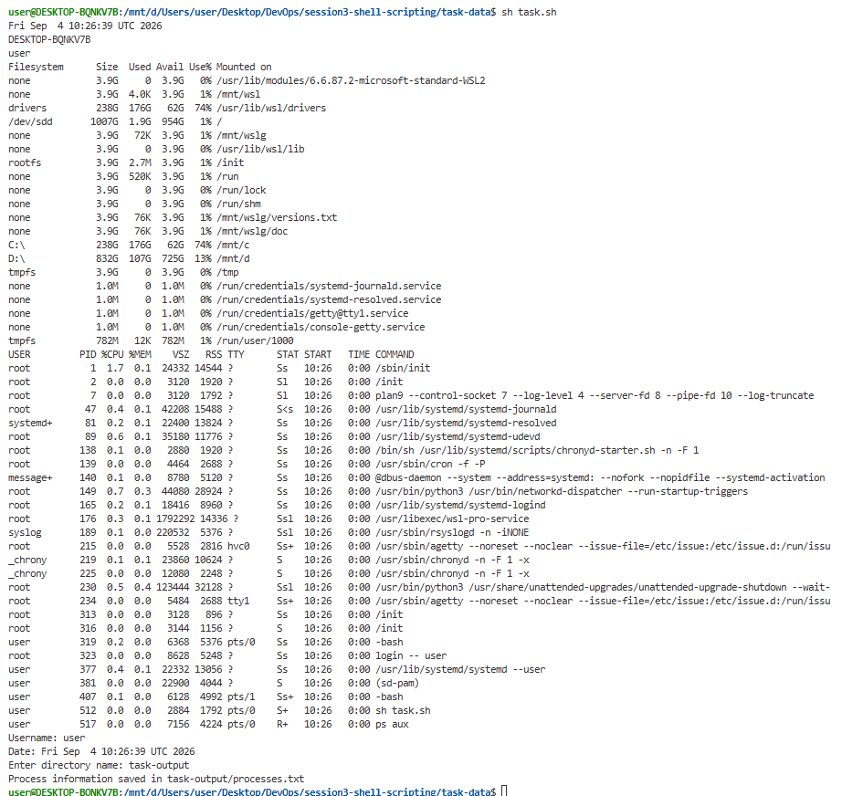

```bash
#!/bin/bash

# Print current date
date

# Print hostname
hostname

# Print username
whoami

# Print disk usage
df -h

# Print running processes
ps aux

# Store data using variables
username=$(whoami)
current_date=$(date)

echo "Username: $username"
echo "Date: $current_date"

# Take user input
read -p "Enter directory name: " directory_name

# Create a directory
mkdir "$directory_name"

# Create a file
touch "$directory_name/processes.txt"

# Store running processes in the file
ps aux > "$directory_name/processes.txt"

echo "Process information saved in $directory_name/processes.txt"

```

