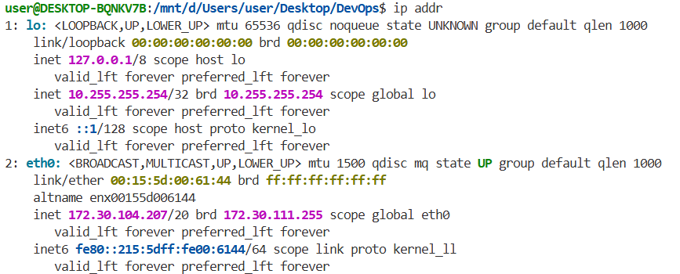
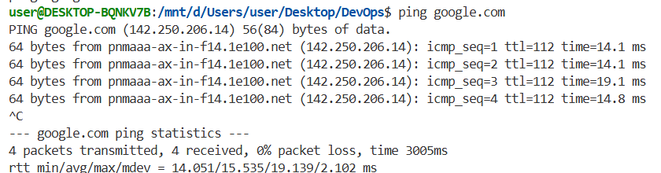
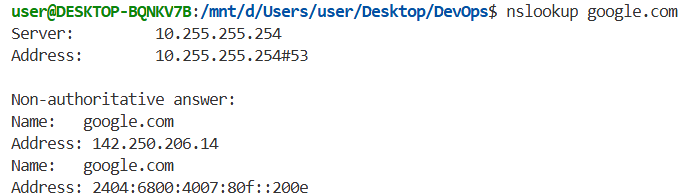
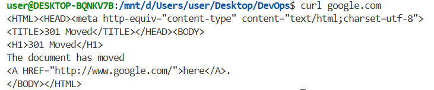
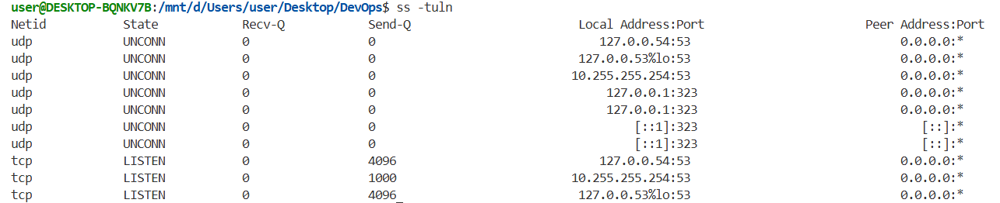
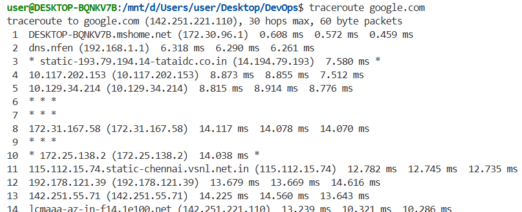

## 1. ip addr

The `ip addr` command shows the network interfaces available on the system. It also shows the IP addresses assigned to those interfaces. This helps us check the IP address of the system and the network interfaces currently available.

### Command

```bash
ip addr
```



---

## 2. ip route

The `ip route` command shows the routing table of the system. It shows how the system decides where to send network traffic and also shows the default route used to reach other networks.

### Command

```bash
ip route
```


---

## 3. ping

The `ping` command checks if another system can be reached over the network. It sends small network packets to the given address and checks if a response is received. This helps us check network connectivity.

### Command

```bash
ping google.com
```

Press `Ctrl + C` to stop the command.



---

## 4. hostname

The `hostname` command shows the name of the current computer. It helps us identify the system on the network.

### Command

```bash
hostname
```


---

## 5. nslookup

The `nslookup` command is used to find the IP address of a domain name. It helps us understand how DNS converts domain names into IP addresses.

### Command

```bash
nslookup google.com
```


---

## 6. curl

The `curl` command is used to send requests to a server. It sends a request to the website and displays the response received from the server. It is commonly used to test websites and APIs.

### Command

```bash
curl google.com
```



---

## 7. ss

The `ss` command is used to check network connections and listening ports. It helps us see which ports are listening for network connections on the system.

### Command

```bash
ss -tuln
```



---

## 8. traceroute

The `traceroute` command shows the path taken by network packets to reach another system. It shows the different network devices that the packet passes through before reaching the destination. It can help us find where a network connection is having problems.

### Command

```bash
traceroute google.com
```

If the command is not available, it can be installed using:

```bash
sudo apt install traceroute
```


