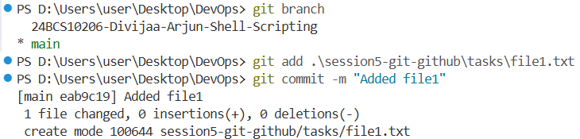
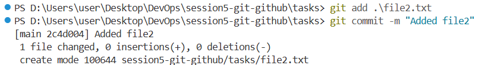
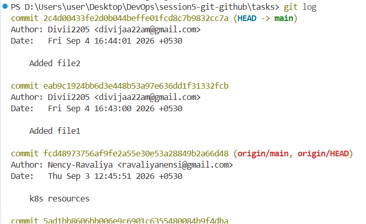
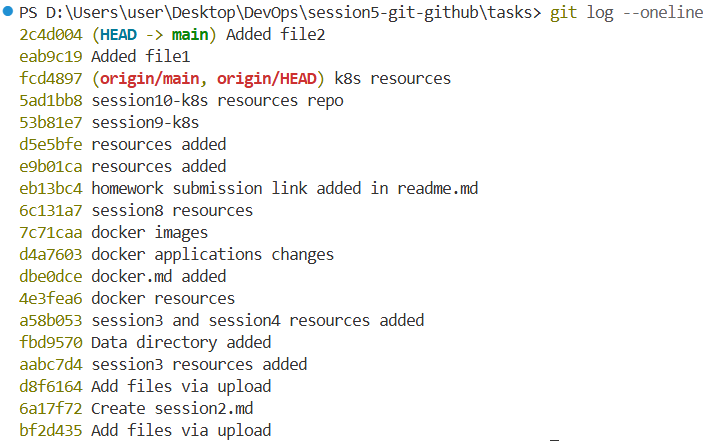
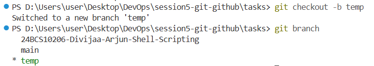
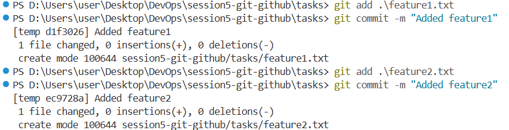
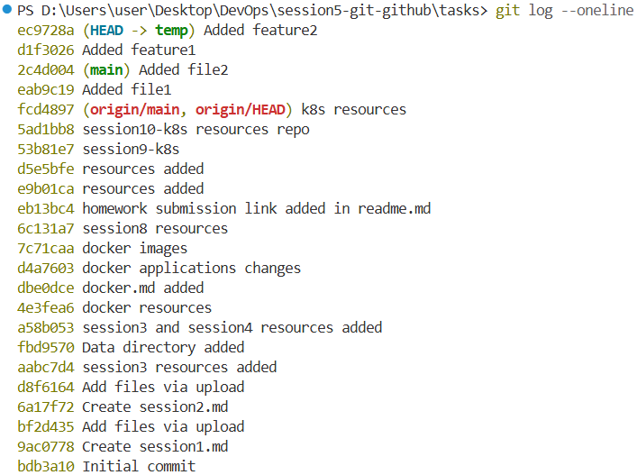
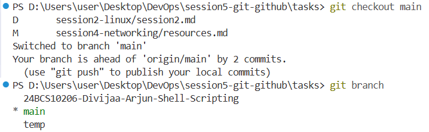
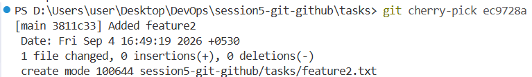
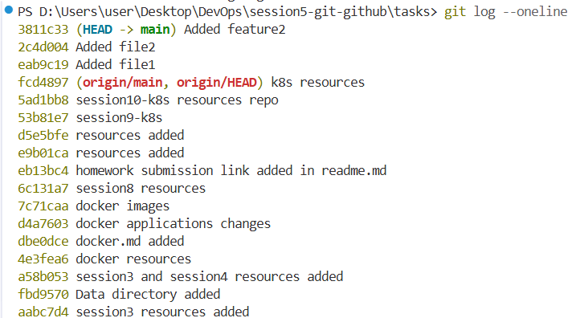

## Task 1: git commit -a -m

The `git commit -a -m` command is used to stage and commit changes to already tracked files in one command.

### Command

```bash
git commit -a -m "message"
```

The `-a` option stages the changes made to already tracked files.

The `-m` option allows us to directly add the commit message.

### Difference between git commit -a -m and git commit -m

`git commit -m` only commits the files that are already in the staging area.

For example:

```bash
git add file.txt
git commit -m "Updated file"
```

`git commit -a -m` stages and commits changes to already tracked files at the same time.

```bash
git commit -a -m "Updated file"
```

However, `git commit -a -m` does not automatically add new untracked files.

### Practice

Create or modify a tracked file and run:

```bash
git commit -a -m "Updated tracked file"
```

Then create a new file:

```bash
touch newfile.txt
```

Try:

```bash
git commit -a -m "Added new file"
```

The new file will not be committed because it is not tracked yet.

We need to first run:

```bash
git add newfile.txt
```

Then:

```bash
git commit -m "Added new file"
```

### Observation

The main difference is that `git commit -a -m` automatically stages changes to tracked files, while `git commit -m` commits only the changes that are already staged.

---

## Task 2: Git Cherry-Pick

`git cherry-pick` is used to take one specific commit from another branch and apply its changes to the current branch.

It is useful when we want only one particular change from another branch instead of merging the complete branch.

### Step 1: Create 2 to 4 commits in the main branch

First check the current branch:

```bash
git branch
```

Switch to the main branch:

```bash
git checkout main
```

Create a file:

```bash
touch file1.txt
```

Add and commit it:

```bash
git add file1.txt
git commit -m "Added file1"
```

Make another change:

```bash
touch file2.txt
```

Add and commit it:

```bash
git add file2.txt
git commit -m "Added file2"
```

We can create more commits in the same way if needed.





### Step 2: View the commits

Use:

```bash
git log
```

This shows the commit history.



We can also use:

```bash
git log --oneline
```

This shows the commits in a shorter format.



Example:

```text
a1b2c3d Added file2
e4f5g6h Added file1
```

The first part is the commit ID.

---

### Step 3: Create a new branch

Create and switch to a new branch:

```bash
git checkout -b feature
```

Check the current branch:

```bash
git branch
```

We should now be on the `feature` branch.


---

### Step 4: Make 2 to 3 commits in the new branch

Create a new file:

```bash
touch feature1.txt
```

Add and commit it:

```bash
git add feature1.txt
git commit -m "Added feature1"
```

Create another file:

```bash
touch feature2.txt
```

Add and commit it:

```bash
git add feature2.txt
git commit -m "Added feature2"
```

We can create one more commit if needed.


---

### Step 5: View the commits

Run:

```bash
git log --oneline
```

We can use the commit ID to identify the specific commit that we want to cherry-pick.

For example:

```text
123abcd Added feature2
456efgh Added feature1
```

Here `123abcd` is the commit ID of the `Added feature2` commit.



---

### Step 6: Switch back to main

```bash
git checkout main
```

Check the current branch:

```bash
git branch
```

We should now be on the `main` branch.



---

### Step 7: Cherry-pick a specific commit

Use the commit ID of the commit we want to copy.

```bash
git cherry-pick 123abcd
```

This takes the changes from that specific commit and applies them to the `main` branch.

Only the selected commit is added to `main`. The other commits from the `feature` branch are not added.



---

### Step 8: Verify the cherry-pick

Check the commit history:

```bash
git log --oneline
```

The cherry-picked commit should now appear in the `main` branch.



We can also check the files:

```bash
ls
```

The changes made by the selected commit should now be available in the `main` branch.

### Cherry-Pick Summary

The basic steps are:

```bash
git checkout main
git checkout -b feature

# Make commits in feature branch

git log --oneline

git checkout main

git cherry-pick <commit-id>

git log --oneline
```

Cherry-pick allows us to select one specific commit from another branch and apply its changes to the current branch.
