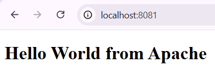
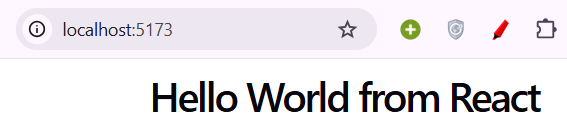
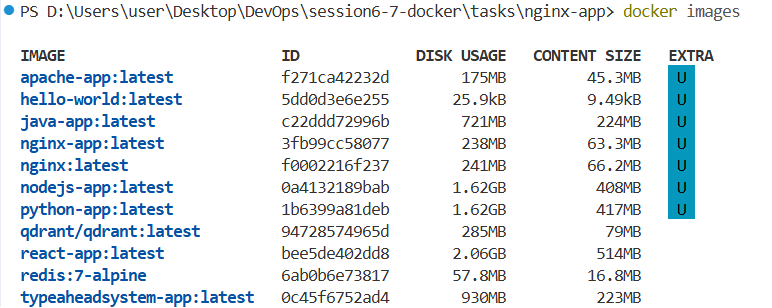
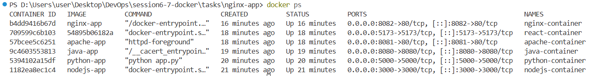
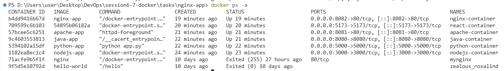

## Task: Hello World Applications

# 1. Node.js Application

The Node.js application uses a simple web server to display Hello World.

### Application Code

Create `app.js`:

```javascript
const http = require("http");

const server = http.createServer((req, res) => {
    res.writeHead(200, {"Content-Type": "text/html"});
    res.end("<h1>Hello World from Node.js</h1>");
});

server.listen(3000, () => {
    console.log("Server running on port 3000");
});
```

### Dockerfile

Create a file named `Dockerfile`:

```dockerfile
FROM node:22

WORKDIR /app

COPY app.js .

EXPOSE 3000

CMD ["node", "app.js"]
```

### Build the Docker Image

Run these commands inside the `nodejs-app` folder:

```bash
docker build -t nodejs-app .
```

### Run the Application

```bash
docker run -d -p 3000:3000 --name nodejs-container nodejs-app
```

Open this in the browser:

```text
http://localhost:3000
```

The webpage should display:

```text
Hello World from Node.js
```


---

# 2. Python Application

The Python application uses Flask to create a simple web server.

### Application Code

Create `app.py`:

```python
from flask import Flask

app = Flask(__name__)

@app.route("/")
def hello():
    return "<h1>Hello World from Python</h1>"

app.run(host="0.0.0.0", port=5000)
```

Create a `requirements.txt` file:

```text
flask
```

### Dockerfile

```dockerfile
FROM python:3.12

WORKDIR /app

COPY requirements.txt .

RUN pip install -r requirements.txt

COPY app.py .

EXPOSE 5000

CMD ["python", "app.py"]
```

### Build the Docker Image

```bash
docker build -t python-app .
```

### Run the Application

```bash
docker run -d -p 5000:5000 --name python-container python-app
```

Open:

```text
http://localhost:5000
```

The webpage should display:

```text
Hello World from Python
```


---

# 3. Java Application

The Java application uses a simple Java web server to display Hello World.

### Application Code

Create `Main.java`:

```java
import com.sun.net.httpserver.HttpServer;
import java.net.InetSocketAddress;

public class Main {
    public static void main(String[] args) throws Exception {

        HttpServer server = HttpServer.create(
            new InetSocketAddress(8080), 0
        );

        server.createContext("/", exchange -> {
            String response = "<h1>Hello World from Java</h1>";

            exchange.getResponseHeaders()
                   .set("Content-Type", "text/html");

            exchange.sendResponseHeaders(
                200, response.getBytes().length
            );

            exchange.getResponseBody()
                   .write(response.getBytes());

            exchange.close();
        });

        server.start();

        System.out.println("Server running on port 8080");
    }
}
```

### Dockerfile

```dockerfile
FROM eclipse-temurin:21

WORKDIR /app

COPY Main.java .

RUN javac Main.java

EXPOSE 8080

CMD ["java", "Main"]
```

### Build the Docker Image

```bash
docker build -t java-app .
```

### Run the Application

```bash
docker run -d -p 8080:8080 --name java-container java-app
```

Open:

```text
http://localhost:8080
```

The webpage should display:

```text
Hello World from Java
```


---

# 4. Apache Web Server

Apache is a web server that can serve HTML files.

### Application Code

Create `index.html`:

```html
<!DOCTYPE html>
<html>
<head>
    <title>Hello World</title>
</head>
<body>
    <h1>Hello World from Apache</h1>
</body>
</html>
```

### Dockerfile

```dockerfile
FROM httpd:2.4

COPY index.html /usr/local/apache2/htdocs/

EXPOSE 80
```

### Build the Docker Image

```bash
docker build -t apache-app .
```

### Run the Application

```bash
docker run -d -p 8081:80 --name apache-container apache-app
```

Open:

```text
http://localhost:8081
```

The webpage should display:

```text
Hello World from Apache
```


---

# 5. React Application

The React application displays Hello World using React.

### Application Code

Create the React application using:

```bash
npm create vite@latest React-app -- --template react
```

Move into the folder:

```bash
cd React-app
```

Install the dependencies:

```bash
npm install
```

Update `src/App.tsx`:

```tsx
function App() {
    return (
        <h1>Hello World from React</h1>
    );
}

export default App;
```

### Dockerfile

Create a `Dockerfile`:

```dockerfile
FROM node:22

WORKDIR /app

COPY package*.json ./

RUN npm install

COPY . .

RUN npm run build

EXPOSE 5173

CMD ["npm", "run", "preview", "--", "--host", "0.0.0.0"]
```

### Build the Docker Image

```bash
docker build -t react-app .
```

### Run the Application

```bash
docker run -d -p 5173:5173 --name react-container react-app
```

Open:

```text
http://localhost:5173
```

The webpage should display:

```text
Hello World from React
```



---

# 6. Nginx Application

Nginx is a web server that can serve HTML files.

### Application Code

Create `index.html`:

```html
<!DOCTYPE html>
<html>
<head>
    <title>Hello World</title>
</head>
<body>
    <h1>Hello World from Nginx</h1>
</body>
</html>
```

### Dockerfile

```dockerfile
FROM nginx:latest

COPY index.html /usr/share/nginx/html/

EXPOSE 80
```

### Build the Docker Image

```bash
docker build -t nginx-app .
```

### Run the Application

```bash
docker run -d -p 8082:80 --name nginx-container nginx-app
```

Open:

```text
http://localhost:8082
```

The webpage should display:

```text
Hello World from Nginx
```


---

# Docker Commands Used

### Check Docker Images

```bash
docker images
```

This shows the Docker images created on the system.



### Check Running Containers

```bash
docker ps
```

This shows the containers that are currently running.



### Check All Containers

```bash
docker ps -a
```

This shows both running and stopped containers.



### Stop a Container

```bash
docker stop container_name
```

### Remove a Container

```bash
docker rm container_name
```

### Remove a Docker Image

```bash
docker rmi image_name
```