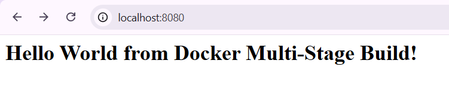
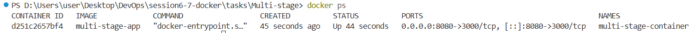

## Task 1: Run Multi-Stage Dockerfile

A multi-stage Dockerfile uses more than one stage to build and run an application. It helps keep the final Docker image smaller by using the required files from the build stage.

### Step 1: Clone the Repository

Clone the repository that contains the multi-stage Dockerfile.

```bash
git clone <repository-url>
```

Move into the repository folder:

```bash
cd <repository-folder>
```

### Step 2: Build the Docker Image

Build the Docker image using the multi-stage Dockerfile.

```bash
docker build -t multi-stage-app .
```

The `-t` option gives a name to the Docker image.

### Step 3: Run the Container

Run a container from the image and map port `8080`.

```bash
docker run -d -p 8080:3000 --name multi-stage-container multi-stage-app
```

The `-p 8080:8080` maps port `8080` of the container to port `8080` of the local system.

### Step 4: Access the Application

Open the following address in the browser:

```text
http://localhost:8080
```

The webpage should display:

```text
Hello World from Docker multi-stage build
```



---

### Step 5: Verify the Running Container

Use `docker ps` to check the running containers.

```bash
docker ps
```

The output should show the `multi-stage-container` as a running container.

It should also show the port mapping similar to:

```text
0.0.0.0:8080->3000/tcp
```



This confirms that the container is running and port `8080` is mapped correctly.

---