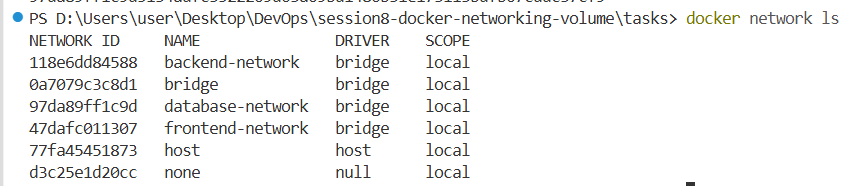
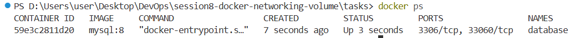
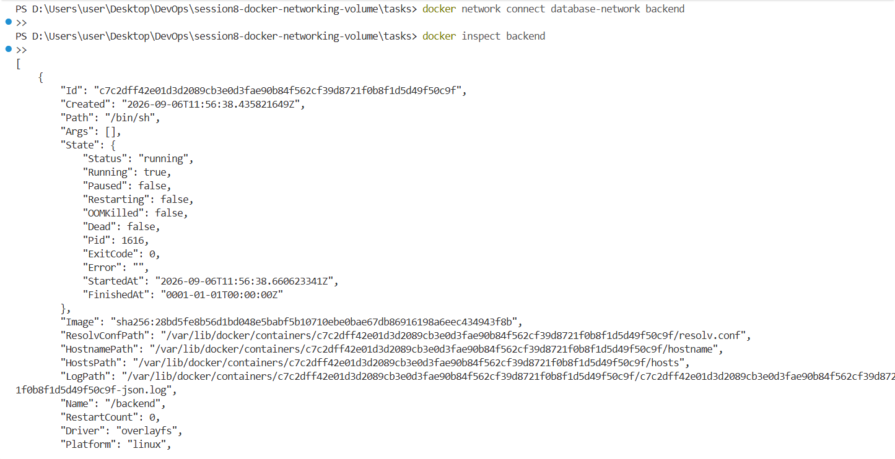
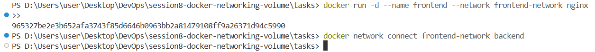
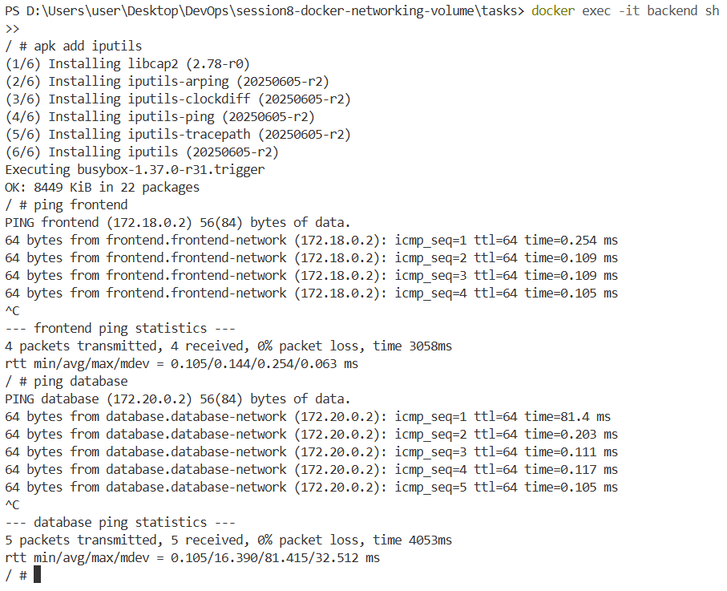
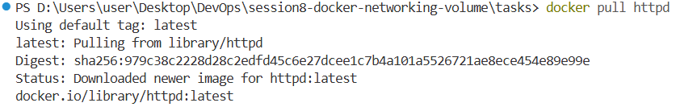
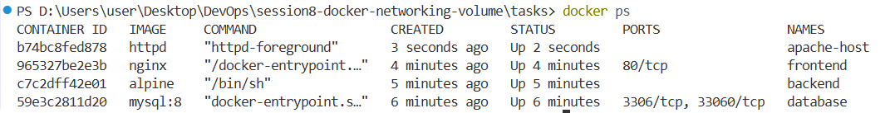
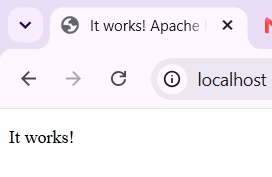

## Task 1: Docker Container Networking

Docker networks allow containers to communicate with each other. In this task, three containers were created for the frontend, backend and database. Three different Docker networks were also created and the backend container was connected to two networks.

### Step 1: Create the Docker Networks

Three Docker networks were created for the containers.

```bash
docker network create frontend-network
docker network create backend-network
docker network create database-network
```

The created networks were checked using:

```bash
docker network ls
```



---

### Step 2: Create the Database Container

A MySQL container was created using the MySQL image and connected to the database network.

```bash
docker run -d --name database --network database-network -e MYSQL_ROOT_PASSWORD=root -e MYSQL_DATABASE=testdb mysql:8
```

The running containers were checked using:

```bash
docker ps
```



---

### Step 3: Create the Backend Container

An Alpine container was created for the backend and connected to the backend network.

```bash
docker run -dit --name backend --network backend-network alpine
```

The backend container was then connected to the database network.

```bash
docker network connect database-network backend
```

This means that the backend container is connected to two networks.

The networks connected to the backend were checked using:

```bash
docker inspect backend
```



---

### Step 4: Create the Frontend Container

An Nginx container was created for the frontend and connected to the frontend network.

```bash
docker run -d --name frontend --network frontend-network nginx
```

The backend container was then connected to the frontend network.

```bash
docker network connect frontend-network backend
```

The backend container can now communicate with both the frontend and database containers.



---

### Step 5: Check Connectivity Between Containers

The backend container was accessed using:

```bash
docker exec -it backend sh
```

The required network tools were installed in the Alpine container using:

```bash
apk add iputils
```

The connection to the frontend was checked using:

```bash
ping frontend
```

The connection to the database was checked using:

```bash
ping database
```

Successful responses from both containers confirm that the containers can communicate with each other.



---

## Task 2: Host Network

The host network allows a Docker container to use the network of the host system directly. In this task, an Apache2 container was created using the host network.

### Step 1: Pull the Apache2 Image

The Apache2 image was pulled from Docker Hub using:

```bash
docker pull httpd
```



---

### Step 2: Create the Apache2 Container

The Apache2 container was created using the host network.

```bash
docker run -d --name apache-host -p 80:80 httpd
```

The running container was checked using:

```bash
docker ps
```



---

### Step 3: Access the Apache Website

The Apache website was accessed directly using port `80`.

```text
http://localhost:80
```

On a Linux host this works straight away, because the container really does share
the host's network stack.

**On Docker Desktop (Windows / macOS) this page does not load.** Docker Desktop
runs the containers inside a small Linux virtual machine, so `--network host`
shares the *virtual machine's* network, not the network of Windows. Apache is
listening on port `80` of the VM (address `192.168.65.3`), and Docker Desktop
only forwards a port to Windows when the port is published with `-p`. Because
`--network host` publishes nothing, there is nothing listening on the Windows
side and the browser shows a connection error.

This can be confirmed from inside the virtual machine, where the same URL answers
normally:

```bash
docker run --rm --network host curlimages/curl -s -o /dev/null -w "%{http_code}" http://localhost:80
# 200
```

---

### Step 4: Publish the Port so Windows Can Reach Apache

To open the website from the browser on Windows, the container is run on the
default bridge network with port `80` published to the host instead.

The host network container was removed first:

```bash
docker rm -f apache-host
```

The container was then recreated with a published port:

```bash
docker run -d --name apache-host -p 80:80 httpd
```

The published port was checked using:

```bash
docker ps
```

The `PORTS` column now shows the port mapping, which is what makes the site
reachable from Windows:

```text
NAMES         STATUS         PORTS
apache-host   Up 3 seconds   0.0.0.0:80->80/tcp, [::]:80->80/tcp
```

The website was then opened using:

```text
http://localhost:80
```

The Apache default page was successfully displayed in the browser.

```text
It works!
```



**Summary:** `--network host` works on a Linux host, but on Docker Desktop the
container joins the network of the Linux VM. Publishing the port with
`-p 80:80` is the way to reach the container from the browser on Windows.

---

## Task 3: Bind Mount

A bind mount allows a folder on the local machine to be connected to a folder inside a Docker container. This allows changes made to the local files to be reflected inside the container without restarting it.

### Step 1: Create a Local Folder

A local folder was created for the Nginx files.

```bash
mkdir nginx-data
cd nginx-data
```

An `index.html` file was created using:

```bash
touch index.html
```

The file was given the following content:

```text
Hello students
```

---

### Step 2: Run the Nginx Container

The local folder was bind mounted to the Nginx web directory.

```bash
docker run -d --name nginx-bind -p 8080:80 -v "${PWD}:/usr/share/nginx/html" nginx
```

The `-v` option is used to create the bind mount.

The local folder is connected to `/usr/share/nginx/html` inside the Nginx container.

Two details matter on Windows:

- The command is written on **one line**. The backslash line continuation used in
  the original command is Bash syntax and is not understood by PowerShell, which
  uses a backtick instead. A single line runs unchanged in PowerShell, Bash and
  CMD.
- `${PWD}` is used instead of `$(pwd)`. In Git Bash, `$(pwd)` returns a path in
  the form `/d/Users/...`, which MSYS rewrites before Docker receives it, and the
  mount then points at the wrong folder. `${PWD}` is expanded by PowerShell to a
  normal Windows path such as `D:\Users\...`, which Docker Desktop accepts.
  If Git Bash has to be used, the conversion is disabled by putting
  `MSYS_NO_PATHCONV=1` in front of the command.

A stricter version of the same command uses `--mount`, which fails with an error
when the source folder does not exist, instead of silently mounting an empty
directory the way `-v` does. `readonly` is also added, because Nginx only needs to
read the files:

```bash
docker run -d --name nginx-bind -p 8080:80 --mount "type=bind,source=${PWD},target=/usr/share/nginx/html,readonly" nginx
```

`readonly` applies only to writes made from inside the container, so the file can
still be edited on the local machine in Step 4.

---

### Step 3: Access the Nginx Website

The Nginx website was opened using:

```text
http://localhost:8080
```

The webpage displayed:

```text
Hello students
```


---

### Step 4: Modify the index.html File

The content of `index.html` was changed to:

```text
Hello students, welcome to Docker
```

After saving the file, the webpage was refreshed.

The updated content was displayed without restarting the Docker container.


This shows that the bind mount allows changes made to the local file to be reflected directly inside the running container.

---