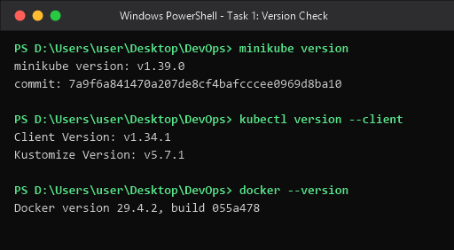
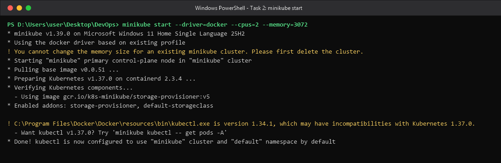
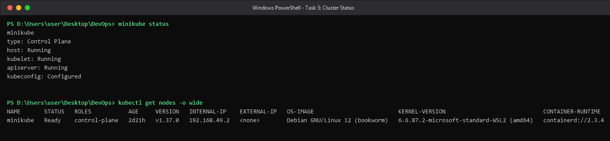
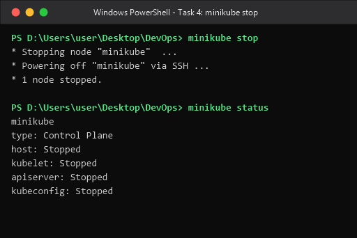
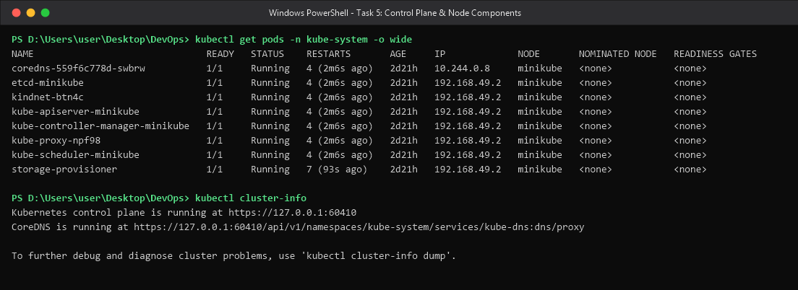

# Session 9 — Kubernetes Fundamentals & Cluster Architecture


## Table of Contents

1. [Task 1 — Minikube & CLI Installation Verification](#task-1--minikube--cli-installation-verification)
2. [Task 2 — Starting the Minikube Kubernetes Cluster](#task-2--starting-the-minikube-kubernetes-cluster)
3. [Task 3 — Verifying Cluster Status & Node Health](#task-3--verifying-cluster-status--node-health)
4. [Task 4 — Stopping the Minikube Cluster](#task-4--stopping-the-minikube-cluster)
5. [Task 5 — Kubernetes Cluster Architecture & Component Analysis](#task-5--kubernetes-cluster-architecture--component-analysis)
6. [Key Learnings](#key-learnings)

---

## Task 1 — Minikube & CLI Installation Verification

**Objective:** Confirm that `minikube`, the Kubernetes CLI (`kubectl`) and the container driver (Docker) are installed and resolvable on `PATH` before any cluster work begins.

**Commands**

```bash
minikube version
kubectl version --client
docker --version
```

**Output (real capture)**

```
minikube version: v1.39.0
commit: 7a9f6a841470a207de8cf4bafcccee0969d8ba10

Client Version: v1.34.1
Kustomize Version: v5.7.1

Docker version 29.4.2, build 055a478
```

**Screenshot**



**What happened / why**

`minikube version` proves the cluster provisioner is installed. `kubectl version --client` is deliberately scoped with `--client` so it reports the CLI version *without* contacting an API server — important here because at this point the cluster was still stopped, and the unscoped command would have failed with a connection error. `docker --version` verifies the driver minikube will use: minikube does not create a VM on this machine, it runs the whole Kubernetes node as a **Docker container**, so a working Docker Desktop is a hard prerequisite.

---

## Task 2 — Starting the Minikube Kubernetes Cluster

**Objective:** Provision (boot) the local single-node Kubernetes cluster using the Docker driver.

**Command**

```bash
minikube start --driver=docker --cpus=2 --memory=3072
```

**Output (real capture)**

```
* minikube v1.39.0 on Microsoft Windows 11 Home Single Language 25H2
* Using the docker driver based on existing profile
! You cannot change the memory size for an existing minikube cluster. Please first delete the cluster.
* Starting "minikube" primary control-plane node in "minikube" cluster
* Pulling base image v0.0.51 ...
* Preparing Kubernetes v1.37.0 on containerd 2.3.4 ...
* Verifying Kubernetes components...
  - Using image gcr.io/k8s-minikube/storage-provisioner:v5
* Enabled addons: storage-provisioner, default-storageclass

! C:\Program Files\Docker\Docker\resources\bin\kubectl.exe is version 1.34.1, which may have incompatibilities with Kubernetes 1.37.0.
  - Want kubectl v1.37.0? Try 'minikube kubectl -- get pods -A'
* Done! kubectl is now configured to use "minikube" cluster and "default" namespace by default
```

**Screenshot**



**What happened / why**

Reading the boot sequence line by line is the whole point of this task:

| Line | Meaning |
|---|---|
| `Using the docker driver based on existing profile` | A `minikube` profile already existed on this machine, so minikube reused it instead of creating a fresh node. |
| `You cannot change the memory size for an existing minikube cluster` | **Honest note:** the `--cpus`/`--memory` flags were *ignored*. Sizing flags only apply at cluster-creation time; on an existing profile they require `minikube delete` first. The cluster kept its original allocation. |
| `Starting "minikube" primary control-plane node` | This is a single-node cluster — the one node is *both* control plane and worker, which is why user Pods can be scheduled on it at all. |
| `Pulling base image v0.0.51` | The `kicbase` image — a Debian 12 container pre-loaded with kubeadm, kubelet and containerd — that becomes the "node". |
| `Preparing Kubernetes v1.37.0 on containerd 2.3.4` | kubeadm bootstraps the control plane inside that container. Note the runtime is **containerd, not Docker** — Kubernetes removed the `dockershim` in v1.24, so Docker here is only the *outer* driver, not the CRI. |
| `Enabled addons: storage-provisioner, default-storageclass` | Default addons giving the cluster a working `StorageClass` for PVCs. |
| `kubectl.exe is version 1.34.1 ... incompatibilities with 1.37.0` | A **version-skew warning**. Kubernetes supports a client within one minor version of the server; 1.34 vs 1.37 is three minors apart, so newer server-side fields may not render. Everything in this session worked, but the supported fix is `minikube kubectl -- <cmd>`, which uses a matching client. |
| `kubectl is now configured to use "minikube" cluster` | minikube wrote a context into `~/.kube/config` and made it current, so plain `kubectl` now targets this cluster. |

---

## Task 3 — Verifying Cluster Status & Node Health

**Objective:** Confirm the control-plane processes are up and that the node has registered and reached `Ready`.

**Commands**

```bash
minikube status
kubectl get nodes -o wide
```

**Output (real capture)**

```
minikube
type: Control Plane
host: Running
kubelet: Running
apiserver: Running
kubeconfig: Configured

NAME       STATUS   ROLES           AGE     VERSION   INTERNAL-IP    EXTERNAL-IP   OS-IMAGE                         KERNEL-VERSION                             CONTAINER-RUNTIME
minikube   Ready    control-plane   2d21h   v1.37.0   192.168.49.2   <none>        Debian GNU/Linux 12 (bookworm)   6.6.87.2-microsoft-standard-WSL2 (amd64)   containerd://2.3.4
```

**Screenshot**



**What happened / why**

`minikube status` reports four independent health signals, and they answer different questions:

- **`host: Running`** — the Docker container acting as the node is alive.
- **`kubelet: Running`** — the node agent inside it is up, so Pods can actually be started.
- **`apiserver: Running`** — the control-plane front door is serving the REST API, so `kubectl` will get answers.
- **`kubeconfig: Configured`** — the local `~/.kube/config` points at this cluster. (In Task 4 this same field flips to `Stopped`.)

`kubectl get nodes -o wide` is the complementary check *from inside Kubernetes* rather than from minikube:

- `STATUS Ready` means the kubelet is posting healthy heartbeats and the CNI is initialised — a node sits in `NotReady` until networking is up.
- `ROLES control-plane` on the only node confirms the single-node topology.
- `INTERNAL-IP 192.168.49.2` is the address on minikube's private Docker bridge network. **On the Docker driver this IP is not routable from Windows**, which is why `minikube service` / `minikube tunnel` / `kubectl port-forward` exist.
- `CONTAINER-RUNTIME containerd://2.3.4` again confirms containerd, not Docker, is the CRI.
- `EXTERNAL-IP <none>` is expected — there is no cloud provider attaching a public address.

---

## Task 4 — Stopping the Minikube Cluster

**Objective:** Gracefully shut the cluster down to release CPU and RAM, and verify the shutdown.

**Commands**

```bash
minikube stop
minikube status
```

**Output (real capture)**

```
* Stopping node "minikube"  ...
* Powering off "minikube" via SSH ...
* 1 node stopped.

minikube
type: Control Plane
host: Stopped
kubelet: Stopped
apiserver: Stopped
kubeconfig: Stopped
```

**Screenshot**



**What happened / why**

`Powering off "minikube" via SSH` shows this is a **graceful** shutdown: minikube SSHes into the node container and halts it from the inside, letting the kubelet terminate Pods and letting **etcd flush its write-ahead log to disk**, rather than killing the container outright. All four status fields then flip to `Stopped`.

The critical distinction to remember:

| Command | Effect | Cluster state preserved? |
|---|---|---|
| `minikube stop` | Powers off the node container | **Yes** — Deployments, Services, PVCs and etcd data all survive; `minikube start` brings them back |
| `minikube delete` | Destroys the container and its disk | **No** — the entire cluster and all objects are gone |

Use `stop` to free RAM between work sessions; only use `delete` when you need a clean rebuild — for example, to actually apply new `--cpus`/`--memory` values, as Task 2 demonstrated.

---

## Task 5 — Kubernetes Cluster Architecture & Component Analysis

**Objective:** Document the Control Plane and Worker Node components per the [official Kubernetes architecture documentation](https://kubernetes.io/docs/concepts/architecture/), and back the theory with the real components running on this cluster.

### 5.1 Evidence from this cluster

**Commands**

```bash
kubectl get pods -n kube-system -o wide
kubectl cluster-info
```

**Output (real capture)**

```
NAME                               READY   STATUS    RESTARTS       AGE     IP             NODE       NOMINATED NODE   READINESS GATES
coredns-559f6c778d-swbrw           1/1     Running   4 (2m6s ago)   2d21h   10.244.0.8     minikube   <none>           <none>
etcd-minikube                      1/1     Running   4 (2m6s ago)   2d21h   192.168.49.2   minikube   <none>           <none>
kindnet-btn4c                      1/1     Running   4 (2m6s ago)   2d21h   192.168.49.2   minikube   <none>           <none>
kube-apiserver-minikube            1/1     Running   4 (2m6s ago)   2d21h   192.168.49.2   minikube   <none>           <none>
kube-controller-manager-minikube   1/1     Running   4 (2m6s ago)   2d21h   192.168.49.2   minikube   <none>           <none>
kube-proxy-npf98                   1/1     Running   4 (2m6s ago)   2d21h   192.168.49.2   minikube   <none>           <none>
kube-scheduler-minikube            1/1     Running   4 (2m6s ago)   2d21h   192.168.49.2   minikube   <none>           <none>
storage-provisioner                1/1     Running   7 (93s ago)    2d21h   192.168.49.2   minikube   <none>           <none>

Kubernetes control plane is running at https://127.0.0.1:60410
CoreDNS is running at https://127.0.0.1:60410/api/v1/namespaces/kube-system/services/kube-dns:dns/proxy
```

**Screenshot**



Every theoretical component described below is visible as a real Pod in that listing — `etcd-minikube`, `kube-apiserver-minikube`, `kube-scheduler-minikube`, `kube-controller-manager-minikube` (control plane) and `kube-proxy-npf98`, `kindnet-btn4c`, `coredns` (node / data plane).

Two details worth noticing:

- The control-plane Pods are **static Pods** — the kubelet reads their manifests straight off disk from `/etc/kubernetes/manifests`, which is how the control plane can start before the API server it would otherwise register with exists. That is also why they are named `<component>-<nodename>`.
- `RESTARTS 4` across the board is not a fault: it is the count of `minikube stop` / `minikube start` cycles this node has been through (including Task 4), since a power-off restarts every container.


### 5.2 Control Plane (Master Node) components

**`kube-apiserver` — the front door**

The single entry point for every administrative and internal operation. It exposes the Kubernetes HTTP/JSON REST API and performs authentication, authorisation (RBAC) and admission control on each request. Crucially, **no other component talks to `etcd` directly** — the API server is the only writer, which is what keeps cluster state consistent. Every `kubectl` command, every controller and every kubelet heartbeat passes through it. In the capture above it is reachable at `https://127.0.0.1:60410` because minikube port-forwards it out of the node container to the Windows host.

**`etcd` — the brain / state store**

A distributed, strongly consistent key-value store holding the *entire* cluster state: every object spec, status, ConfigMap and Secret. Kubernetes is declarative, so what is written in etcd is the **desired state**, and everything else in the cluster exists to make reality match it. etcd is therefore the one component you must back up — lose it and you lose the cluster. It uses the Raft consensus algorithm, which is why production clusters run an odd number of members (3 or 5) to maintain quorum.

**`kube-scheduler` — the placement engine**

Watches for newly created Pods that have no `nodeName` assigned yet and decides which node each should run on. It works in two phases: **filtering** (discard nodes that cannot run the Pod — insufficient CPU/memory, unsatisfied `nodeSelector`, untolerated taints, unavailable volumes) and **scoring** (rank the survivors by spread, affinity/anti-affinity, image locality and resource balance). It then writes the chosen node back onto the Pod object via the API server — the scheduler never starts a container itself.

**`kube-controller-manager` — the reconciliation engine**

Runs the control loops that continuously compare **current state vs. desired state** and act to close the gap. It is a single binary bundling many controllers, including:

- *Node controller* — notices when a node stops heartbeating and evicts its Pods.
- *ReplicaSet controller* — creates or deletes Pods to hold the replica count at the declared number.
- *Deployment controller* — manages ReplicaSets to perform rolling updates and rollbacks.
- *EndpointSlice controller* — keeps the list of healthy Pod IPs behind each Service up to date.
- *Job / CronJob controllers* — drive batch and scheduled workloads to completion.

This reconciliation loop is *the* core idea of Kubernetes: you declare the outcome, and controllers converge on it forever, including after failures.

*(In a cloud cluster there is a fifth component, `cloud-controller-manager`, which talks to the provider's API to provision load balancers, routes and storage. minikube has no cloud provider, which is why a `type: LoadBalancer` Service here stays at `EXTERNAL-IP: <pending>`.)*

### 5.3 Worker Node (Data Plane) components

**`kubelet` — the node agent**

The primary agent on every node. It watches the API server for PodSpecs assigned to its node, then instructs the container runtime to pull images and start containers. It mounts volumes, injects ConfigMaps and Secrets, runs liveness/readiness/startup probes, and continuously reports node and Pod status back to the API server. If the kubelet stops heartbeating, the node controller marks the node `NotReady` and reschedules its workloads elsewhere. Note the kubelet is *not* itself a Pod — it is a systemd service on the node, which is exactly what lets it bootstrap the static control-plane Pods.

**`kube-proxy` — the service network plumber**

Runs on each node and implements the Service abstraction. It watches Services and EndpointSlices and programs the node's `iptables` (or IPVS) rules so that traffic sent to a Service's stable virtual IP is DNAT'd and load-balanced across the healthy backing Pod IPs. This is why a Service IP keeps working even as Pods are destroyed and recreated with new IPs. Visible above as `kube-proxy-npf98`, deployed as a DaemonSet so exactly one copy runs per node.

**Container runtime (CRI)**

The software that actually runs containers, spoken to through the standard **Container Runtime Interface**. Modern clusters use lightweight, Kubernetes-native runtimes — **containerd** (this cluster, v2.3.4) or CRI-O. Early Kubernetes shimmed out to the Docker daemon, but that `dockershim` was removed in Kubernetes v1.24. Docker is still present on this machine purely as minikube's *driver* (it hosts the node container); it is not the thing running the Pods.

**CNI plugin (`kindnet` here)**

Implements the Kubernetes network model: every Pod gets its own IP, and every Pod can reach every other Pod without NAT. Notice `coredns` has IP `10.244.0.8` from the Pod CIDR while the node components sit on the node IP `192.168.49.2` — that gap is exactly the CNI overlay at work. A node stays `NotReady` until its CNI is initialised.

**`CoreDNS` — cluster DNS**

Provides service discovery by name. It resolves `<service>.<namespace>.svc.cluster.local` to a Service's ClusterIP, so applications address each other by stable DNS name rather than by IP. It runs as a normal Deployment in `kube-system` and is injected into every Pod's `/etc/resolv.conf` by the kubelet.

**`Pod` — the smallest deployable unit**

The fundamental unit of scheduling. A Pod wraps one or more tightly coupled containers that **share a network namespace** (one IP and port space, so they reach each other over `localhost`) and can share storage volumes. The standard pattern is a single application container plus optional init containers (run-to-completion setup) and sidecars (logging, proxying). Pods are deliberately **ephemeral and disposable** — you almost never create one directly; a controller such as a Deployment creates and replaces them for you.

### 5.4 How a request flows through the components

Putting it together — what actually happens on `kubectl apply -f deployment.yaml`:

1. `kubectl` sends the object to the **kube-apiserver**, which authenticates, authorises and validates it.
2. The API server persists the Deployment in **etcd**. The declared state now exists; nothing is running yet.
3. The **Deployment controller** (in kube-controller-manager) sees a Deployment with no ReplicaSet and creates one; the **ReplicaSet controller** sees a ReplicaSet with 0/N Pods and creates N Pod objects — all still unscheduled.
4. The **kube-scheduler** sees Pods with no node assigned, filters and scores the nodes, and binds each Pod to one.
5. The **kubelet** on the chosen node sees a Pod bound to it, calls the **CRI (containerd)** to pull images and start containers, and the **CNI plugin** assigns the Pod its IP.
6. The kubelet runs probes and reports `Running` / `Ready` back to the API server, which writes it to etcd.
7. When a Service selects those Pods, the **EndpointSlice controller** records their IPs and **kube-proxy** programs iptables on every node so the Service IP load-balances to them; **CoreDNS** makes the Service reachable by name.

Every arrow in that chain goes *through* the API server — components never call each other directly. That hub-and-spoke design is what makes Kubernetes components independently restartable and the cluster self-healing.

---

## Key Learnings

1. **Kubernetes is declarative, not imperative.** You submit desired state; controllers run endless reconciliation loops to make reality match. This is why deleting a Deployment-managed Pod just gets you a new Pod.
2. **The API server is the only door.** Every component — kubectl, scheduler, controllers, kubelets — reads and writes through it, and only it touches etcd. That single choke point is where authentication, RBAC and admission control live.
3. **Docker ≠ the container runtime.** On this setup Docker is only minikube's *driver*, hosting the node container; the actual CRI inside is containerd 2.3.4. The `dockershim` was removed in Kubernetes v1.24.
4. **A single-node minikube collapses control plane and worker into one box**, which is why workloads schedule onto a node labelled `control-plane`.
5. **Control-plane components are static Pods**, launched by the kubelet from `/etc/kubernetes/manifests` — which is how the control plane bootstraps itself before an API server exists.
6. **`minikube stop` preserves state, `minikube delete` destroys it.** Sizing flags such as `--cpus` / `--memory` only take effect at creation, so changing them requires a delete — observed live in Task 2.
7. **The Docker driver's node IP (`192.168.49.2`) is unreachable from Windows.** Reaching workloads needs `minikube service`, `minikube tunnel` or `kubectl port-forward` — the root cause of many "my NodePort doesn't work" problems in later sessions.
8. **Mind kubectl version skew.** A client more than one minor version away from the server is unsupported; `minikube kubectl -- <cmd>` provides a matching client.

---